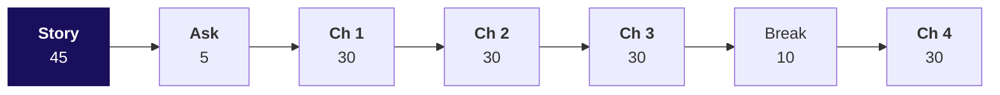
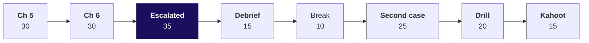

# Day sheet: Week 1, Monday. The question before the budget

**TRAINER ONLY.** Nothing on this page reaches a learner.

Posts to <!-- sync:module:W01/D1 -->Module 1: Foundations of AI and Data<!-- /sync:module:W01/D1 -->, on <!-- sync:day-date:W01/D1 -->Mon 05 Oct 2026<!-- /sync:day-date:W01/D1 -->.

Monday is the first teaching day and the first day of the retail domain, so it opens on the
45-minute retail story. Then Meera Raghavan asks whether acquisition is even the short branch before
she signs Rs 12 crore. The room climbs one case in six chapters on the 30 orders of data v0. Each
chapter has the same six steps: the need, the options sized, the build, the trap, a second route
and Kavya's review. Python is the calculator, and the code is each chapter's last mile.

| | |
|---|---|
| **Start from** | Nothing about retail and no Python on data. The story comes first with no laptop open, and its metric tree stays on the board all day. Week 0 set up the Codespace, so the environment gets the two minutes of the day's one TypeError and nothing more. |
| **Go as far as** | Every learner can say who asks for each metric and what a wrong number costs, can build each branch as a fraction on one definition, counts customers by id, chooses the median on purpose, recomputes lifts through the tree, and writes the four-part sentence with the window's edge in it. |
| **Stop before** | Functions, files, grouping with a helper, any comparison across quarters, and statistics beyond mean and median. Revenue by segment and channel is counted with a dictionary in the second case and nowhere else. |
| **Comes later** | Which branch moved, Tuesday. Whether the numbers can be trusted, Wednesday. Whether the gap is real and what goes to Meera, Thursday. The week rebuilt cold, Friday. Say the arc once. |
| **Cut first** | Each chapter's second route shrinks to its one assertion, then the drill drops to eight questions, then the story's part 4 shrinks to its drawing. Never cut a trap, the story's parts 3 and 5, or chapter 6's caveat. |

---

## The morning, 180 minutes

On a domain's first day the story takes 45 minutes in place of the 20-minute ask. Meera's ask
follows in 5 minutes, then chapters 1 to 3, the break, and chapter 4. Chapter 5 moves to the
afternoon.

Every chapter runs the same six steps, and the chapter's opener carries its minutes: the need (2 to
3), the options sized (4 to 8), the build with each step predicted (4 to 8), the trap (7 to 10), the
second route (3 to 4), and Kavya's review with the interview question (2 to 3).

| Part | Slides | Beside it | What must land | If short of time |
|---|---|---|---|---|
| The retail story, 45 | Morning deck, cover and section 00, S1 to S6 | `trainer/C2_W01_D01_domain_story_TRAINER.md`; board drawings 1 to 6; notebook 00 for self-study | How Rs 100 of GMV becomes Rs 2.50 of profit, who asks for what, and the metric tree with its three denominator traps | Part 4 to its drawing, then part 6 to its question |
| Meera's ask, 5 | S7 and S8 | The metric tree already on the board | Four questions pulled out of one message, each with the chapter that answers it | Nothing |
| Chapter 1: four readings of sales, 30 | Section 01, S9 to S20 | Notebook 01; `unguided/C2_W01_D01_ch1_four_readings_STUDENT.md` | Reliance's two totals; four options sized; the TypeError in two minutes; Rs 5,44,810 against Rs 5,35,760; the bridge; the second route agreeing | The second route to its assertion |
| Chapter 2: the tree as metrics, 30 | Section 02, S21 to S29 | Notebook 02; `unguided/C2_W01_D01_ch2_tree_metrics_STUDENT.md` | Jio's tree; which tree the file fills; AOV Rs 18,160; the mixed AOV of Rs 25,943 caught by multiplying back | The second route |
| Chapter 3: the leaves, counted, 30 | Section 03, S30 to S39 | Notebook 03; `unguided/C2_W01_D01_ch3_leaves_STUDENT.md` | Reliance's 396 million registered customers; 30 rows against 23 customers; 1.30 each; 7 came back | D35, the delivered leaves |
| Break, 10 | | | | |
| Chapter 4: the typical order, 30 | Section 04, S40 to S48 | Notebook 04; `unguided/C2_W01_D01_ch4_typical_STUDENT.md`; the companion's typical-order experiment | Blinkit's reported AOV; four middles sized; 1 of 30 above the mean; each learner sorts in the empty cell and reads what sits at the top; the median of Rs 2,205 | Never cut the sort |

**Checkpoints, one learner each, under thirty seconds.** After chapter 1: which total goes in
Meera's note, and what do you write beside it? After chapter 2: why does Rs 25,943 match nothing?
After chapter 3: why is 30 customers wrong, and which branch would it have funded? After chapter 4:
which typical order goes to marketing, and why not the other?

---

## The afternoon, 180 minutes

Chapter 5 moves here, so the afternoon runs two chapters. The case blocks give up the 30 minutes:
the escalated case drops from 50 to 35 and the second case from 40 to 25. The debrief, the break,
the drill and the Kahoot keep their standard minutes.

| Part | Slides | Beside it | What must land | If short of time |
|---|---|---|---|---|
| Chapter 5: which branch first, 30 | Afternoon deck, section 05, S1 to S8 | Notebook 05; `unguided/C2_W01_D01_ch5_branch_STUDENT.md` | Flipkart Black and Prime buying frequency; the plan needs 3.45 customers or 4.5 orders; frequency first and what would switch it; 20 percent against 21 | The second route |
| Chapter 6: the sentence, 30 | Section 06, S9 to S17 | Notebook 06; `unguided/C2_W01_D01_ch6_sentence_STUDENT.md` | Klarna's first month; four answer formats sized; "70 percent lost" caught by the 45-day gap; the four-part sentence | Never cut the caveat |
| The escalated case, 35 | Section A, S18 and S19 | `unguided/C2_W01_D01_escalated_case_STUDENT.md`; notebook ex1 | The whole answer on delivered orders, alone; the support TA answers environment problems only | Nothing; start on time |
| The debrief, 15 | Section B, S20 and S21, D22 | The room's own wrong numbers, collected while circulating | Six wrong numbers, each with its check; what moved and what held on delivered | D22 |
| Break, 10 | | | | |
| The second case, 25 | Section C, S23 to S27 | `unguided/C2_W01_D01_second_case_STUDENT.md`; notebook ex2 | Store's 91.6 percent traced to one order; the consumer channels split by status; frequency stays first with two leaks | Pairs skip the customer-type table |
| The interview drill, 20 | Section D, S28 to S30 | The twelve questions below | Each learner answers aloud in under a minute; a partner scores it against the one-breath answer | Eight questions |
| Kahoot and Tuesday's ask, 15 | Section E, S31 to S33 | `kahoot/C2_W01_D01_quiz_STUDENT.md` | The six lines; Tuesday's question left open | The Kahoot to five items |

Release the chapter solutions and both case solutions at the close, never before.

**Checkpoints.** After chapter 5: what would move the first branch to acquisition? After chapter 6:
why is 70 percent not a churn rate? After the escalated case: what moved and what held on delivered
orders? After the second case: does one channel change the recommendation?

---

## Every trap, with its exact wrong number

| Chapter | The wrong number | The decision it would mislead | The check that catches it | The fix |
|---|---|---|---|---|
| 1 | Sales of Rs 5,44,810 on 30 orders, cancelled orders included | The growth baseline counts demand that never became a sale, and store's orders are overstated by 4 in 10 | Count orders by channel and status before summing: 21 delivered, 5 returned, 4 cancelled, all 4 in store | Not cancelled, Rs 5,35,760 on 26; delivered, Rs 5,20,790 on 21; the definition written beside the number |
| 2 | An AOV of Rs 25,943, booked rupees over delivered orders | The payback values each new order at a figure no definition supports; multiplied back over the 30 orders it claims Rs 7,78,300 | Orders x AOV must land on that definition's revenue | One definition per fraction: Rs 18,160 booked, Rs 24,800 delivered |
| 3 | 30 customers, so orders per customer reads 1.00 and "nobody comes back" | Frequency looks dead and the Rs 12 crore looks like the only way to grow | `len(ORDERS)` against `len(set(ids))`: 30 against 23 | 23 customers, 1.30 orders each, 7 came back |
| 4 | A typical order of Rs 18,160, the mean | Marketing values a first order at Rs 18,160 and sizes the payback on it | Count orders above the mean: 1 of 30; sort and read the top | Median Rs 2,205, about one eighth, so the payback needs about eight times as many orders |
| 5 | Two 10 percent lifts called 20 percent, Rs 6,53,772 | The plan looks met with room to spare by adding lifts that multiply | Recompute through the tree: 1.10 x 1.10 = 1.21 | 21 percent, Rs 6,59,220; the same rule makes 15 percent off with 10 percent more orders a 6.5 percent fall |
| 6 | 16 of 23 bought once, so "70 percent of customers are lost" | Retention reads as an emergency, and marketing knocks the number down with one question | The 7 who came back took a median of 45 days; 9 of the 16 bought within the last 45 days | 7 came back, 7 had time and did not, 9 too recent to judge |
| Escalated case | "17 of 19 delivered customers lost", and a median of 21 taken as the average of two middles | The same two slips on Anand's definition | The 45-day edge on delivered orders; the odd-count rule | 7 of the 17 too recent; the median is the 11th value, Rs 2,060 |
| Second case | Store brings 91.6 percent of revenue (Rs 4,98,920 of Rs 5,44,810), so the plan goes store-led | Investment follows one order | Count the orders behind each share and split each channel by status | On consumer orders: web Rs 27,290 booked and Rs 12,320 delivered (5 of 10 returned), app Rs 18,600 with all 10 delivered, store Rs 18,920 booked and Rs 9,870 delivered (4 of 9 cancelled); frequency first stands, and the note adds web returns and store cancellations |

**The one runtime error of the day.** Chapter 1's first sum stops with
`TypeError: unsupported operand type(s) for +=: 'int' and 'str'`. Give it two minutes: read the last
line aloud, have every learner print the record the loop stopped on, fix with `int()` for today, and
move on. It never becomes a slide section or an exercise item.

---

## What is planted, and what the room should find

The discovery is the lesson, and naming a plant spends it. No learner file names either.

| Planted | Where it is | What the room should do | If nobody finds it |
|---|---|---|---|
| One Business order of Rs 4,80,000, 88 percent of booked revenue, on the store channel | The last record, KR-01031, index 29, customer C-0140 | In chapter 4, see the mean far above the median, sort in the empty cell, read the top and say what kind of order it must be; in the second case, trace store's share to it | Ask for the five largest amounts printed. Do not name the record. |
| One amount stored as the text "4500" | KR-01008, index 7, customer C-0108, web, Retail-Plus | Meet the TypeError in chapter 1's first sum, print the record the loop stopped on, read its type | They meet it whether they look or not |

Two more things the data does that a learner may raise. Customer C-0107 carries Retail-Core on one
order and Retail-Plus on the other, because the segment is recorded on the order. Order number
KR-01030 does not exist; the extract skips it. The Business customer is one of the 9 one-time buyers
chapter 6 calls too recent to judge; if a learner asks, say that it counts like any other customer.

If a learner asks whether the data is rigged, answer with the question back: "What would you check?"

---

## The numbers, so you are never caught out

| Measure | Booked, all 30 | Not cancelled | Delivered |
|---|---|---|---|
| Orders | 30 | 26 | 21 |
| Revenue | Rs 5,44,810 | Rs 5,35,760 | Rs 5,20,790 |
| Customers | 23, of whom 7 came back | 21, of whom 5 came back | 19, of whom 2 came back |
| Orders per customer | 1.30 | 1.24 | 1.11 |
| AOV, the mean | Rs 18,160 | Rs 20,606 | Rs 24,800 |
| Median order | Rs 2,205, from Rs 2,110 and Rs 2,300 | Rs 2,100 | Rs 2,060, the 11th of 21 |
| One-time buyers, and too recent of them | 16, 9 | | 17, 7 |

| Chapter 5 and 6 sizing | Value |
|---|---|
| The 15 percent plan on booked | Rs 6,26,532, Rs 81,722 more |
| Customers alone | 26.45, 3.45 more |
| Orders alone | 34.5 from the same 23, 4.5 more |
| AOV alone | Rs 20,884, Rs 2,724 more |
| Two 10 percent lifts | Rs 6,59,220 against the added Rs 6,53,772; parts Rs 54,481, Rs 54,481 and Rs 5,448 |
| 15 percent off with 10 percent more orders | Rs 5,09,397 booked, a 6.5 percent fall; break-even lift 17.6 percent |
| Repeat gaps, days | 11, 35, 43, 45, 46, 63, 65; median 45; the window is 88 days |
| Delivered plan | Rs 5,98,909; 24.15 orders, 3.15 more; discount Rs 4,86,939 |

| Channel | Orders | Booked | Delivered | Returned | Cancelled |
|---|---|---|---|---|---|
| App | 10 | Rs 18,600 | 10, Rs 18,600 | 0 | 0 |
| Web | 10 | Rs 27,290 | 5, Rs 12,320 | 5, Rs 14,970 | 0 |
| Store | 10 | Rs 4,98,920 | 6, Rs 4,89,870 | 0 | 4, Rs 9,050 |
| Store without the Business order | 9 | Rs 18,920 | 5, Rs 9,870 | 0 | 4, Rs 9,050 |

| Customer type | Orders | Booked |
|---|---|---|
| Retail-Core | 14 | Rs 32,650 |
| Retail-Plus | 10 | Rs 27,320 |
| Student | 5 | Rs 4,840 |
| Business | 1 | Rs 4,80,000 |

Consumer orders only: 29 orders, Rs 64,810, mean Rs 2,235, median Rs 2,110. Identity:
23 x (30 / 23) x (5,44,810 / 30) = Rs 5,44,810. The invented sizing set in chapter 4: five orders
of Rs 1,900 to Rs 2,600 and one of Rs 90,000; the mean moves Rs 14,623, the median Rs 50 and the
trimmed mean Rs 83.

**The take-home's second sample, for Tuesday's walk-through.** 24 orders, 19 customers, 1.26 orders
each, Rs 5,69,540 booked, mean Rs 23,731, median Rs 2,765; not cancelled, 20 orders and Rs 5,54,410;
delivered, 16 orders, Rs 5,45,930, 14 customers, median Rs 2,450. Its own plants, named only here:
two Business orders of Rs 3,12,000 and Rs 2,05,000 (KR-01525 and KR-01526, store) and one amount
stored as the text "1990" (KR-01513, web). The self-check names none of them.

---

## The real companies, one per chapter

Each fact was checked on 30 September 2026; the URLs are in
`internal/C2_W01_D01_provenance_INTERNAL.md`.

| Chapter | Company | The fact | Source |
|---|---|---|---|
| 1 | Reliance Retail | Gross revenue Rs 90,408 crore and revenue from operations Rs 79,745 crore in the quarter to June 2026 | Reliance Industries media release, 17 July 2026 |
| 2 | Jio | 533 million subscribers, revenue per user Rs 215.6 a month, churn 1.6 percent a month | The same release |
| 3 | Reliance Retail | 396 million registered customers at 30 June 2026 | The same release |
| 4 | Blinkit | A net average order value of Rs 518 in the quarter to June 2026 | MediaNama on Eternal's results, 24 July 2026 |
| 5 | Flipkart and Amazon India | Flipkart Black at Rs 1,499 a year, launched 2025; Prime in India from Rs 399 to Rs 1,499 a year | Flipkart Stories, 12 September 2025; About Amazon India |
| 6 | Klarna | Two-thirds of chats in the assistant's first month; fifteen months later its CEO said the cost focus had lowered quality | Klarna, 27 February 2024; Fortune, 9 May 2025 |

---

## The interview questions, answered in one breath

The first five are the row's anchors; the rest are this pack's case-style and design follow-ups.

| Tag | Question | The answer in one breath |
|---|---|---|
| [S] | How would you increase sales for an online retailer? | Draw the tree, measure each branch on one definition and window, find the short one, then pick the cheapest lever on it and say how you would measure it. |
| [S] | Mean or median for order value, and why? | The median for the typical order, because one large order drags the mean; the mean where totals must reconcile; report both on a first look. |
| [F] | A business says "grow revenue 15 percent"; how do you turn that into questions data can answer? | Fix the base and window, draw the tree, and size what 15 percent asks of each branch alone: here 3.45 customers or 4.5 orders. |
| [SV] | A list against a dictionary: when do you reach for each? | A list to keep order and walk every record, a dictionary to count or look up by a key, and a list of dictionaries for records. |
| [D] | Marketing wants budget for acquisition; what would you check before agreeing it is the right branch, and how would you say no? | Repeat buyers and the median first order on the same window, then the prior quarter; say no for now with a date and offer the cheaper frequency test. |
| [F] | What counts as "sales": booked, net of cancellations, or delivered, and which do you give a CEO? | Each answers a different question; give the one her plan was set on, with its definition and the bridge to the others. |
| [D] | How would you decide between summing the file yourself and asking Finance for the number? | Sum by status for a first look in a second; reconcile to Finance for anything the board sees. |
| [F] | Your extract shows 30 orders and 30 customers; what do you check before saying nobody comes back? | Whether 30 is rows or distinct ids: here 23 customers, 1.30 orders each, and 7 came back. |
| [D] | Which middle would you put in a payback model, and what would make you change it? | The median of first orders; a mean per customer type once types get separate plans. |
| [F] | A 10 percent lift in customers and a 10 percent lift in frequency make 20 percent growth; what is the right number, and when does it matter? | 21 percent, because branches multiply; it matters when lifts are large or many. |
| [D] | You have one quarter of orders and 70 percent of customers bought once; what do you tell the CEO? | That it is a fact about the window and not a churn rate: with a 45-day repeat gap, 9 of the 16 are too recent to judge. |
| [D] | One channel carries nine rupees in ten of revenue; does that change where the growth plan invests? | Only after counting the orders behind the share; here one order carries it, and the consumer channels add two leaks without moving the branch. |

The full answers are in the study notes and in each notebook's interview section.

---

## The practice lab, for the TA

The lab runs after the afternoon block from `exercises/practice/C2_W01_D01_lab_set_STUDENT.md`, with
the solutions in `exercises/solutions/C2_W01_D01_lab_set_solution_STUDENT.md`, released problem by
problem as each learner finishes.

| Problem | Where learners stall | The one hint to give |
|---|---|---|
| 1. The five initiatives placed and priced | Placing a discount on price and stopping there, without seeing it trades margin for quantity | "Write revenue before and after as two products, then divide." |
| 2. Predict the leaves on a small file | Predicting customers as the number of rows | "Read the customer column, not the row count." |
| 3. A tree for a business you know | Writing branches as nouns ("footfall") instead of metrics with a denominator | "Finish the sentence: per what?" |
| 4. The combined file | Doing the arithmetic right on the wrong definition | "Which total did you start from, and does the question want it?" |

Learners who finish early take the stretch task in `extras/C2_W01_D01_tiered_STUDENT.md`; learners who
stalled on chapter 3 take its recovery task.

---

## Which file for which moment

| Moment | File |
|---|---|
| The story | `trainer/C2_W01_D01_domain_story_TRAINER.md`, with the domain card printed for each learner and the dossier for reading after |
| Teaching | `slides/C2_W01_D01_half1_STUDENT.pptx` (the story and chapters 1 to 4) and `slides/C2_W01_D01_half2_STUDENT.pptx` (chapters 5 and 6 and the cases), speaker notes on every slide |
| The board | `whiteboards/C2_W01_D01_board_work_STUDENT.md`, the drawings in the order they go up |
| Live demonstration | `notebooks/C2_W01_D01_00_retail_story_STUDENT.ipynb` for self-study, then `_01_` to `_06_`, one per chapter |
| The projector's moving picture | `demos/C2_W01_D01_branch_simulator_STUDENT.html`, one experiment per trap |
| Early finishers | `demos/C2_W01_D01_decision_tool_STUDENT.xlsx`, one planted formula defect per tab |
| The room's turn in each chapter | `exercises/unguided/`, one scenario set per chapter |
| The afternoon | `exercises/unguided/C2_W01_D01_escalated_case_STUDENT.md` and `_second_case_`, with their notebooks |
| Close | `kahoot/C2_W01_D01_quiz_STUDENT.md` |
| The lab | `exercises/practice/` |
| Tonight | `takehome/`, and `preread/` for Tuesday |

**If the Codespace will not start** for a learner, pair them for chapter 1 and fix it at the break;
the notebooks open read-only on GitHub with every output showing.
