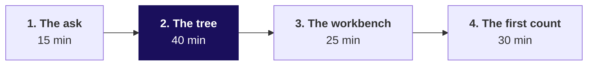
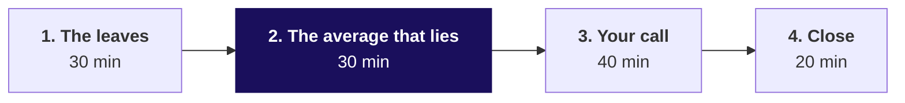

# Day sheet: Week 1, Monday. The question before the budget

**TRAINER ONLY.** Nothing on this page reaches a learner.

Posts to <!-- sync:module:W01/D1 -->Module 1: Foundations of AI and Data<!-- /sync:module:W01/D1 -->, on <!-- sync:day-date:W01/D1 -->Mon 05 Oct 2026<!-- /sync:day-date:W01/D1 -->.

| | |
|---|---|
| **Start from** | No Kalpa, no Python: the business and Meera's words open the day. The tree is the teaching; Python is the calculator. |
| **Go as far as** | Everyone draws the tree unaided, places an initiative on a branch, and computes the leaves including the median order value. |
| **Stop before** | Functions, files, grouping by segment, statistics beyond mean and median. Say once that each arrives later this week. |
| **Comes later** | Which branch moved, Tuesday. Can the numbers be trusted, Wednesday. Is it real and what goes to Meera, Thursday. Say the arc once. |
| **Cut first** | The recovery drill, to five minutes. Never the tree, never the mean-against-median reveal. |

---

## Half one, 110 minutes



| Chapter | Slides | Beside it | What must land | If short of time |
|---|---|---|---|---|
| 1. The ask | S1 to S5 | Notebook 1, section 1 | Meera's message split into four questions; four readings of sales, answer c; the five moves | Read S2's table, do not discuss it |
| 2. The tree | S6 to S14 | Notebook 1, sections 2 and 3; the companion's walk | The tree drawn on the board with the room; every branch a numerator over a denominator; the placement drill, S12 and S13, 15 minutes | Never cut; D10 stays self-study |
| 3. The workbench | S15 to S19 | Notebook 2, section 1 | A NameError produced on purpose; Restart and Run All; the brackets read aloud | The recovery drill to five minutes |
| 4. The first count | S20 to S28 | Notebook 2, sections 2 to 5 | The room meets the TypeError on its own screens and prints the record itself; int() named as a patch with a cost | D27 stays self-study |

**The two staged failures, with their exact text.**

```text
NameError: name 'ORDERS' is not defined
TypeError: unsupported operand type(s) for +=: 'int' and 'str'
```

After the TypeError, have every learner print `order` and `revenue`; the record the loop stopped on
is theirs to find and say. Do not read it out first.

**Checkpoints, one learner each, under thirty seconds.** After chapter 2: name a branch and its
denominator. After chapter 4: what does `revenue += x` do that `revenue + x` does not?

---

## Half two, 120 minutes



| Chapter | Slides | Beside it | What must land | If short of time |
|---|---|---|---|---|
| 1. The leaves | S1 to S11 | Notebook 3 | Customers counted once each; a repeat order is not a duplicate; the rate with its three parts; the predict-three drill, S8 and S9, 12 minutes | S11 to one sentence; D3 stays self-study |
| 2. The average that lies | S12 to S19 | Notebook 4; companion experiment A | The room sorts, reads the top of the list and says what sits there; the median chosen on purpose; option c named as dangerous | Never cut |
| 3. Your call | S20 to S22 | The hands-on notebook and `unguided/C2_W01_D01_your_call_STUDENT.md` | Forty minutes alone; the support TA answers environment problems only | Nothing; start it on time |
| 4. Close | S23 to S27 | The Kahoot pack; the decision workbook for early finishers | Two sentences read aloud and checked for four parts; Tuesday's question read and left open | S26 becomes a pointer to notebook 4 |

**Checkpoints.** After chapter 2: which number goes in Meera's note, and why not the other? After
chapter 3: which branch did you pick, and what would change your mind?

---

## What is planted, and what the room should find

The discovery is the lesson, and naming a plant spends it. Nothing in any learner file names either.

| Planted | Where it is | What the room should do | If nobody finds it |
|---|---|---|---|
| One Business order of Rs 4,80,000, which is 88 percent of booked revenue | The last record, KR-01031, index 29, customer C-0140, store | See the mean at eight times the median, sort, read the top of the list, and say what kind of order it must be | Ask the room to print the five largest amounts. Do not name the record. |
| One amount stored as the text "4500" | KR-01008, index 7, the eighth record | Meet the TypeError while summing, print the record the loop stopped on, read the type | They meet it whether they look or not; it is chapter 4's failure |

If a learner asks whether the data is rigged, answer with the question back: "What would you check?"

---

## The numbers, so you are never caught out

| Measure | All booked orders | Delivered only, the unguided definition |
|---|---|---|
| Orders | 30 | 21 |
| Revenue | Rs 5,44,810 | Rs 5,20,790 |
| Customers | 23, of whom 7 came back | 19, of whom 2 came back |
| Orders per customer | 1.30 | 1.11 |
| Mean order | Rs 18,160 | Rs 24,800 |
| Median order | Rs 2,205, from Rs 2,110 and Rs 2,300 | Rs 2,060, the eleventh of 21 |

Returned: 5 orders, Rs 14,970. Cancelled: 4 orders, Rs 9,050. Without the Business order: 29 orders,
Rs 64,810, mean Rs 2,235. The hands-on answer string is `bacbdc`.

**The take-home's second sample, for tomorrow's walk-through.** 24 orders, Rs 5,69,540 booked, 19
customers, 1.26 orders each, median Rs 2,765, mean about 8.6 times the median. It carries its own
two plants: two Business orders of Rs 3,12,000 and Rs 2,05,000, and one amount stored as the text
"1990". The self-check names neither.

---

## The five interview questions, answered

| Tag | Question | The answer in one breath |
|---|---|---|
| [S] | How would you increase sales for an online retailer? | Draw the tree, find the short branch by comparing two periods, then the cheapest lever on it with its measure. |
| [S] | Mean or median for order value, and why? | The median for the typical order because order values are skewed; the mean for anything that must reconcile; both on a first look. |
| [F] | A business says "grow revenue 15 percent"; how do you turn that into questions data can answer? | Baseline and window, the tree, the data and denominator per driver, the gap sized per driver, the decision each answer changes. |
| [SV] | A list against a dictionary: when do you reach for each? | A list for order and walking everything, a dictionary for lookup by name, records as a list of dictionaries. |
| [D] | Marketing wants budget for acquisition; what would you check, and how would you say no? | Agree the goal, compare customers and frequency across two quarters, and make the no a cheaper first step. |

The full answers are worked in notebooks 1, 2 and 4, and learners practise them aloud tonight.

---

## Which file for which moment

| Moment | File |
|---|---|
| Teaching | `slides/C2_W01_D01_half1_STUDENT.pptx`, `slides/C2_W01_D01_half2_STUDENT.pptx`, speaker notes on every slide |
| Live coding | `notebooks/C2_W01_D01_01` to `_04`, in order |
| The projector's moving picture | `demos/C2_W01_D01_revenue_tree_STUDENT.html`: the walk in chapter 2, experiment A in half two |
| Early finishers | `demos/C2_W01_D01_decision_tool_STUDENT.xlsx`, four tabs with one formula defect each |
| Drills and unguided work | `exercises/`, with solutions opened at the close |
| Close | `kahoot/C2_W01_D01_quiz_STUDENT.md` |
| Tonight | `takehome/`, and `preread/` for Tuesday |

**If the Codespace will not start** for a learner, pair them for the first hour and fix it at the
break; the notebooks open read-only on GitHub with every output showing.
