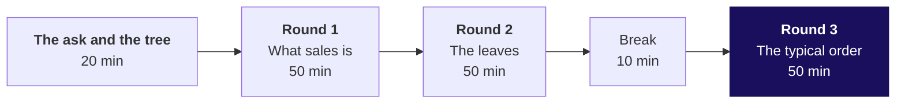
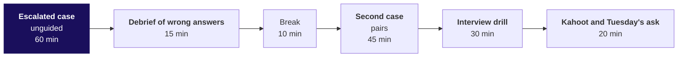

# Day sheet: Week 1, Monday. The question before the budget

**TRAINER ONLY.** Nothing on this page reaches a learner.

Posts to <!-- sync:module:W01/D1 -->Module 1: Foundations of AI and Data<!-- /sync:module:W01/D1 -->, on <!-- sync:day-date:W01/D1 -->Mon 05 Oct 2026<!-- /sync:day-date:W01/D1 -->.

Meera Raghavan wants to know whether acquisition is even the short branch before she signs Rs 12
crore. The room climbs one case in five rungs on the 30 orders of data v0, and every rung has a
wrong number waiting for it. Python is the calculator; the tree is the teaching.

| | |
|---|---|
| **Start from** | No Kalpa, no Python on data: Meera's words open the day, and the tree goes on the board before any notebook opens. Week 0 set up the Codespace, so the environment gets two minutes inside round 1. |
| **Go as far as** | Everyone draws the tree unaided, defines each branch as a numerator over a denominator, computes the leaves on a stated definition including the median order, and says which branch Meera opens first and what one window cannot show. |
| **Stop before** | Functions, files, grouping with a helper, any comparison across quarters, statistics beyond mean and median. Revenue by segment and channel is counted by hand with a dictionary in the second case and nowhere else. |
| **Comes later** | Which branch moved, Tuesday. Can the numbers be trusted, Wednesday. Is the gap real and what goes to Meera, Thursday. The week rebuilt cold, Friday. Say the arc once. |
| **Cut first** | Each round's harder variant shrinks to its first two items, then the interview drill to six questions. Never cut the tree, a trap or the mean-against-median reveal. |

---

## The morning, 180 minutes

Each round runs the same five beats: the question and its picture (5), the demonstration on Kalpa
data (15), the trap and its wrong number (10), the room running the harder variant (15), and
Kavya's review (5).

| Part | Slides | Beside it | What must land | If short of time |
|---|---|---|---|---|
| The ask and the tree | Morning deck, cover and section 1 | `whiteboards/C2_W01_D01_board_work_STUDENT.md`, drawings 1 and 2; the companion's walk, first stop | Meera's message split into its questions; the tree drawn with the room, every branch a metric, marketing's Rs 12 crore placed on acquisition; the five rungs as the day's climb | Never cut the tree |
| Round 1, what sales is | Section 2 | Notebook 1; `unguided/C2_W01_D01_round1_sales_STUDENT.md` | Four readings of sales; the cancelled-orders trap with its Rs 9,050; the identity that multiplies back to Rs 5,44,810 | The initiatives variant to two initiatives |
| Round 2, the leaves | Section 3 | Notebook 2; `unguided/C2_W01_D01_round2_leaves_STUDENT.md` | The TypeError in two minutes; 30 rows against 23 customers; orders per customer 1.30 with 7 repeat customers | The delivered-definition variant to its first item |
| Round 3, the typical order | Section 4 | Notebook 3; `unguided/C2_W01_D01_round3_typical_STUDENT.md`; the companion's typical-order experiment | The room sorts and says what sits at the top; median Rs 2,205 chosen on purpose; the payback consequence | Never cut the reveal |

**Checkpoints, one learner each, under thirty seconds.** After round 1: which total goes in
Meera's note, and what do you write beside it? After round 2: why is 30 customers wrong, and which
branch would it have funded? After round 3: which typical order goes to marketing, and why not the
other?

---

## The afternoon, 180 minutes

| Part | Slides | Beside it | What must land | If short of time |
|---|---|---|---|---|
| The escalated case | Afternoon deck, section 1 | `unguided/C2_W01_D01_escalated_case_STUDENT.md`; `notebooks/C2_W01_D01_ex1_escalated_case_STUDENT.ipynb` | Five parts alone, ending on the sentence to Meera; the support TA answers environment problems only | Nothing; start on time |
| The debrief | Section 2 | The room's own wrong numbers, collected while circulating | Each wrong number the room produced, with the check that catches it; 1.10 x 1.10 = 1.21 on the board | Two wrong answers instead of four |
| The second case | Section 3 | `unguided/C2_W01_D01_second_case_STUDENT.md`; `notebooks/C2_W01_D01_ex2_second_case_STUDENT.ipynb` | Store's 91.6 percent traced to one order; consumer channels split by status; the recommendation stands and the note gains two leaks | Pairs skip the customer-type table and keep the channel split |
| The interview drill | Section 4 | The twelve questions below | Each learner answers one question aloud in under a minute, and a partner scores it against the one-breath answer | Six questions |
| Kahoot and Tuesday's ask | Section 5 | `kahoot/C2_W01_D01_quiz_STUDENT.md` | The sentence to Meera read aloud; the crux lines; Tuesday's question left open | The Kahoot to five items |

Release the unguided solutions and both case solutions at the close, never before.

**Checkpoints.** After the escalated case: which branch did you pick, and what would change your
mind? After the second case: does one channel change the recommendation, and what does it add?

---

## Every trap, with its exact wrong number

| Where | The wrong number | The decision it would mislead | The check that catches it | The fix |
|---|---|---|---|---|
| Round 1 | Sales of Rs 5,44,810 on 30 orders, cancelled orders included | The growth baseline counts demand that never became a sale, and store's order count is overstated by 4 in 10 | Count orders by status before summing: 21 delivered, 5 returned, 4 cancelled, and all 4 cancelled are store orders | Not cancelled, Rs 5,35,760 on 26 orders; delivered, Rs 5,20,790 on 21; the definition written beside the number |
| Round 2 | 30 customers, so orders per customer reads 1.00 and "nobody comes back" | Retention looks dead, acquisition looks like the only branch, and the Rs 12 crore looks justified | `len(ORDERS)` against `len(set(customer ids))`: 30 against 23 | 23 customers, 1.30 orders each, 7 repeat customers; frequency is a live branch |
| Round 3 | A typical order of Rs 18,160, the mean | Marketing values a new customer's first order at Rs 18,160 and sizes the acquisition payback on it | Count orders above the mean: 1 of 30; sort and read the top | Median Rs 2,205, about one eighth of the mean, so the payback needs about eight times as many orders |
| Escalated case | Customers up 10 percent and orders per customer up 10 percent called 20 percent growth | The plan looks met with room to spare by adding lifts that multiply | Recompute through the tree: 1.10 x 1.10 = 1.21 | 21 percent, Rs 6,59,220 against Rs 6,53,772 on Rs 5,44,810; the same arithmetic turns 15 percent off with a 10 percent quantity lift into a 6.5 percent fall |
| Second case | Store brings 91.6 percent of revenue (Rs 4,98,920 of Rs 5,44,810), so the plan goes store-led | Investment follows one order | Count the orders behind each share and split each channel by status | On consumer orders: web Rs 27,290 booked and Rs 12,320 delivered (5 of 10 returned), app Rs 18,600 with all 10 delivered, store Rs 18,920 booked and Rs 9,870 delivered (4 of 9 cancelled); frequency first stands, and the note adds web returns and store cancellations |

**The one runtime error of the day.** Summing the amounts in round 2 stops with
`TypeError: unsupported operand type(s) for +=: 'int' and 'str'`. Give it two minutes: read the last
line aloud, have every learner print the record the loop stopped on, fix with `int()` for today, and
move on. It never becomes a slide section or an exercise item.

---

## What is planted, and what the room should find

The discovery is the lesson, and naming a plant spends it. No learner file names either.

| Planted | Where it is | What the room should do | If nobody finds it |
|---|---|---|---|
| One Business order of Rs 4,80,000, 88 percent of booked revenue, on the store channel | The last record, KR-01031, index 29, customer C-0140 | In round 3, see the mean far above the median, sort, read the top of the list and say what kind of order it must be; in the second case, trace store's share to it | Ask for the five largest amounts printed. Do not name the record. |
| One amount stored as the text "4500" | KR-01008, index 7, customer C-0108, web, Retail-Plus | Meet the TypeError while summing in round 2, print the record the loop stopped on, read its type | They meet it whether they look or not |

Two more things the data does that a learner may raise. Customer C-0107 carries Retail-Core on one
order and Retail-Plus on the other, because the segment is recorded on the order; say so if anyone
counts customers per segment. Order number KR-01030 does not exist; the extract skips it.

If a learner asks whether the data is rigged, answer with the question back: "What would you check?"

---

## The numbers, so you are never caught out

| Measure | Booked, all 30 | Not cancelled | Delivered |
|---|---|---|---|
| Orders | 30 | 26 | 21 |
| Revenue | Rs 5,44,810 | Rs 5,35,760 | Rs 5,20,790 |
| Customers | 23, of whom 7 came back | 21, of whom 5 came back | 19, of whom 2 came back |
| Orders per customer | 1.30 | 1.24 | 1.11 |
| Mean order | Rs 18,160 | Rs 20,606 | Rs 24,800 |
| Median order | Rs 2,205, from Rs 2,110 and Rs 2,300 | Rs 2,100 | Rs 2,060 |

| Channel | Orders | Booked | Delivered | Returned | Cancelled |
|---|---|---|---|---|---|
| App | 10 | Rs 18,600 | 10, Rs 18,600 | 0 | 0 |
| Web | 10 | Rs 27,290 | 5, Rs 12,320 | 5, Rs 14,970 | 0 |
| Store | 10 | Rs 4,98,920 | 6, Rs 4,89,870 | 0 | 4, Rs 9,050 |
| Store without the Business order | 9 | Rs 18,920 | 5, Rs 9,870 | 0 | 4, Rs 9,050 |

| Customer type | Orders | Booked |
|---|---|---|
| Retail-Core | 14 | Rs 32,650 |
| Retail-Plus | 10 | Rs 27,320 |
| Student | 5 | Rs 4,840 |
| Business | 1 | Rs 4,80,000 |

Consumer orders only: 29 orders, Rs 64,810, mean Rs 2,235, median Rs 2,110. Identity:
23 x (30 / 23) x (5,44,810 / 30) = Rs 5,44,810. One window: 16 of 23 customers bought once.

**The take-home's second sample, for Tuesday's walk-through.** 24 orders, 19 customers, 1.26 orders
each, Rs 5,69,540 booked, mean Rs 23,731, median Rs 2,765; not cancelled, 20 orders and Rs 5,54,410;
delivered, 16 orders, Rs 5,45,930, 14 customers, median Rs 2,450. Its own plants, named only here:
two Business orders of Rs 3,12,000 and Rs 2,05,000 (KR-01525 and KR-01526, store) and one amount
stored as the text "1990" (KR-01513, web). The self-check names none of them.

---

## The interview questions, answered in one breath

The first five are the row's anchors; the rest are this pack's case-style follow-ups.

| Tag | Question | The answer in one breath |
|---|---|---|
| [S] | How would you increase sales for an online retailer? | Draw the tree, compare two periods to find the short branch, then pick the cheapest lever on it and say how you would measure it. |
| [S] | Mean or median for order value, and why? | The median for the typical order, because one large order drags the mean; the mean where totals must reconcile; report both on a first look. |
| [F] | A business says "grow revenue 15 percent"; how do you turn that into questions data can answer? | Fix the baseline and window, draw the tree, name each branch's numerator and denominator, size the gap per branch, and say which decision each answer changes. |
| [SV] | A list against a dictionary: when do you reach for each? | A list to keep order and walk every record, a dictionary to look up or count by a key, and a list of dictionaries for records. |
| [D] | Marketing wants budget for acquisition; what would you check before agreeing it is the right branch, and how would you say no? | Check customers and frequency across two windows and the value of a typical first order, then say no by offering the cheaper test on the branch the data points at. |
| [F] | What counts as "sales": booked, net of cancellations, or delivered, and which do you give a CEO? | Each answers a different question; give the one that matches the decision and write its definition beside it. |
| [F] | Your extract shows 30 orders and 30 customers; what do you check before saying nobody comes back? | Whether 30 is rows or distinct ids: here it is 23 customers, 1.30 orders each, and 7 came back. |
| [SV] | How do you count distinct customers in Python, and why does a set give the answer a list does not? | `len(set(ids))`, because a set keeps each id once while a list keeps every order. |
| [S] | The mean order is Rs 18,160 and the median Rs 2,205; what do you tell the business about its orders? | That almost every order is small and one or two very large ones pull the mean up, so the typical order is about Rs 2,205. |
| [F] | A 10 percent lift in customers and a 10 percent lift in frequency make 20 percent growth; what is the right number, and when does it matter? | 21 percent, because branches multiply; it matters when lifts are large or pull in opposite directions. |
| [D] | One channel carries nine rupees in ten of revenue; does that change where the growth plan invests? | Only after counting the orders behind the share; here one order carries it, and the consumer channels tell a different story. |
| [D] | A 15 percent discount lifts quantity 10 percent; did revenue rise or fall, and what would you ask next? | It fell 6.5 percent (0.85 x 1.10 = 0.935); next ask whether new customers came in or existing ones bought earlier. |

The full answers are in the study notes and in each notebook's interview section.

---

## The practice lab, for the TA

The lab runs after the afternoon block from `exercises/practice/C2_W01_D01_lab_set_STUDENT.md`, with
the solutions in `exercises/solutions/C2_W01_D01_lab_set_solution_STUDENT.md`, released problem by
problem as each learner finishes.

| Problem | Where learners stall | The one hint to give |
|---|---|---|
| 1. The five initiatives placed and priced | Placing a discount on price and stopping there, without seeing it trades margin for quantity | "Write revenue before and after as two products, then divide." |
| 2. Predict the leaves on a small file | Predicting customers as the number of rows | "Read the customer column, not the row count." |
| 3. A tree for a business you know | Writing branches as nouns ("footfall") instead of metrics with a denominator | "Finish the sentence: per what?" |
| 4. The combined file | Doing the arithmetic right on the wrong definition | "Which total did you start from, and does the question want it?" |

Learners who finish early take the stretch task in `extras/C2_W01_D01_tiered_STUDENT.md`; learners who
stalled on round 2 take its recovery task.

---

## Which file for which moment

| Moment | File |
|---|---|
| Teaching | `slides/C2_W01_D01_half1_STUDENT.pptx` (morning) and `slides/C2_W01_D01_half2_STUDENT.pptx` (afternoon), speaker notes on every slide |
| The board | `whiteboards/C2_W01_D01_board_work_STUDENT.md`, the drawings in the order they go up |
| Live demonstration | `notebooks/C2_W01_D01_01_what_sales_is_STUDENT.ipynb`, `_02_counting_leaves_`, `_03_typical_order_`, one per round |
| The projector's moving picture | `demos/C2_W01_D01_branch_simulator_STUDENT.html`, one experiment per trap |
| Early finishers | `demos/C2_W01_D01_decision_tool_STUDENT.xlsx`, one planted formula defect per tab |
| The room's variants | `exercises/unguided/`, one scenario set per round |
| The afternoon | `exercises/unguided/C2_W01_D01_escalated_case_STUDENT.md` and `_second_case_`, with their notebooks |
| Close | `kahoot/C2_W01_D01_quiz_STUDENT.md` |
| The lab | `exercises/practice/` |
| Tonight | `takehome/`, and `preread/` for Tuesday |

**If the Codespace will not start** for a learner, pair them for round 1 and fix it at the break;
the notebooks open read-only on GitHub with every output showing.
