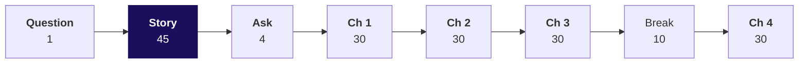
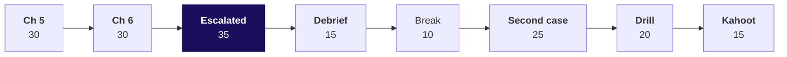

# Day sheet, Week 1 Monday: is acquisition even the branch of sales that is short?

**TRAINER ONLY.** Nothing on this page reaches a learner. It names both planted records, and a
learner who reads it has lost two of the day's discoveries.

Posts to <!-- sync:module:W01/D1 -->Module 1: Foundations of AI and Data<!-- /sync:module:W01/D1 -->, on <!-- sync:day-date:W01/D1 -->Mon 05 Oct 2026<!-- /sync:day-date:W01/D1 -->.

There is no IITGN faculty block on this day. Monday is the first teaching day and the first day of
the retail domain, so it opens on the 45-minute retail story before any case. Then Meera Raghavan,
Kalpa Retail's CEO, asks her question before she signs Rs 12 crore for new customers, and the room
climbs it in six chapters on the 30 orders of data v0, placed from 1 July to 26 September 2026. Every
chapter runs the same six steps: the need, the options sized, the build, the trap, a second route and
Kavya's review. Python is the calculator, and the code is each chapter's last mile.

## Which questions does the room climb on Monday, in the order you ask them?

Ask each question aloud before its answer reaches the screen, take one or two answers from the room,
then show it. A chapter opener prints the short form of its question; the full form is the
notebook's title, the scenario set's title and the chapter heading in the study notes.

The day asks one question in Meera's words, **Is acquisition even the branch that is short?**, which
in full reads: before Meera signs Rs 12 crore for new customers, is acquisition even the branch of
sales that is short?

### 0. How does a retailer like Kalpa make money, who asks the data team for which number, and how is each number worked out?

The story, 45 minutes, with no laptop open. Its opener prints *How does retail earn?* and its promise asks the full question.

**Who needs the answer.** Every learner needs it, because from chapter 1 on each chapter names the metric at
stake, who asks for it and what a wrong number costs, and most of the room has never worked in a
business role. A room that meets Meera's ask without the story hears arithmetic where she is asking
about a business.

**The questions on the way.**

| | Ask the room | Show once the room has answered |
|---|---|---|
| 1 | What happens at a Kalpa store and on its app in one day? | One member's basket, Rs 1,800 at the checkout, goes from a picker to a van and, a week later, partly back to the returns desk, and a person decides at every step; the app keeps far more of the traces than the till. |
| 2 | Which real companies is Kalpa like? | Reliance runs Jio and Reliance Retail in one group as Kalpa runs five units, Kalpa's stores work like DMart's, its app like JioMart's grocery business, and Retail-Plus is a paid tier of the kind Amazon Prime is. Kalpa itself is fictional. |
| 3 | Where does Rs 100 at the checkout go? | On the story's illustrative numbers, Rs 100 of GMV becomes Rs 80 of net revenue, Rs 20 of gross margin, Rs 7.50 of contribution and Rs 2.50 of EBITDA. GMV and net revenue differ, and the Rs 20 between them is the question chapter 1 opens. |
| 4 | Who at Kalpa asks the data team for which number? | Meera asks where growth comes from and where it leaks, Anand asks for numbers that match his books, the marketing lead asks whether Kalpa needs more customers, the Retail-Plus head asks whether the paid tier is slipping, and Kavya checks everything before it leaves the team. |
| 5 | Which tree does every retail number hang off? | Revenue is customers times orders per customer times average order value, with the shelf above it and the leaks beside it, and each number on it is worked out by its own formula, stated with the question it answers and the person who asks it. |
| 6 | How far may a system act with no person checking? | Describing, predicting, recommending and acting sit on one ladder, and the further right a system sits, the more a wrong answer costs; Klarna's assistant took two-thirds of its chats in its first month, and its CEO later said quality had suffered. |

### 1. Which of the file's totals should Meera call sales, and what does each one count?

Chapter 1, 30 minutes, with notebook 01. Its opener prints *Which total is sales?* and its promise asks the full question.

**Who needs the answer.** Meera measures the 15 percent plan from this number, and Anand's books
must match it. A wrong total sets the plan's base on demand that never became a sale.

**The questions on the way.**

| | Ask the room | Show once the room has answered |
|---|---|---|
| 1 | Who needs one number called sales, and what does a wrong one cost? | Meera measures her plan from it and Anand's books must match it, so a wrong total measures growth from orders that were cancelled. |
| 2 | Which way of totalling sales fits a first look at Kalpa's 30 orders? | Summing by status with the bridge fits: one pass over 30 rows gives every reading and names each rupee between them, and Finance's books serve anything the board sees. |
| 3 | Which reading of sales comes out largest? | Booked comes out largest at Rs 5,44,810, then not cancelled at Rs 5,35,760 on 26 orders, then delivered at Rs 5,20,790 on 21. |
| 4 | What goes wrong if all 30 orders are sent as sales? | Rs 5,44,810 goes out with the 4 cancelled store orders, Rs 9,050, inside it. |
| 5 | Do sums by status reach the same totals? | They do: delivered Rs 5,20,790, returned Rs 14,970 and cancelled Rs 9,050 add back to Rs 5,44,810. |
| 6 | Which number goes on the tree's root? | Booked, Rs 5,44,810 on 30 orders, goes on the root, named, since chapters 2 to 6 build on the same 30 orders, with the other two totals and the bridge beside it; the total the plan uses is Meera's call with Finance. |

### 2. How does sales split into customers, orders per customer and order value, each a fraction on one definition?

Chapter 2, 30 minutes, with notebook 02. Its opener prints *What is each branch?* and its promise asks the full question.

**Who needs the answer.** Meera and the marketing lead will price the plan branch by branch. A
fraction built from two definitions values every order at a figure no definition supports.

**The questions on the way.**

| | Ask the room | Show once the room has answered |
|---|---|---|
| 1 | Who needs the branches, and why as fractions? | Meera needs to see which branch is short, and a branch written as a numerator over a denominator on one definition multiplies back to revenue. |
| 2 | Which tree can this file fill? | The file fills customers, orders per customer and average order value, and it holds no items, prices or discounts. |
| 3 | What is the average order value? | Booked, it is Rs 18,160, which is Rs 5,44,810 over 30 orders; delivered, it is Rs 24,800. |
| 4 | What goes wrong when booked rupees are divided by delivered orders? | The AOV reads Rs 25,943, and multiplied back over the 30 orders it claims Rs 7,78,300 that nobody booked. |
| 5 | Does the mean of the 30 amounts give the same Rs 18,160? | It does: the mean of the 30 amounts is Rs 18,160. |
| 6 | Which branches does the file still lack? | Items per order, price per item and discounts are missing, and the answer names them as unknown. |

### 3. How many customers does Kalpa have, and how many came back for a second order?

Chapter 3, 30 minutes, with notebook 03. Its opener prints *Do customers come back?* and its promise asks the full question.

**Who needs the answer.** The marketing lead and Meera need it: if nobody comes back, acquisition looks like
the only branch left and the Rs 12 crore looks justified.

**The questions on the way.**

| | Ask the room | Show once the room has answered |
|---|---|---|
| 1 | Who needs the customer count, and what rides on it? | Marketing's case for Rs 12 crore rests on nobody coming back, so the count decides whether frequency is a branch at all. |
| 2 | How do we count customers when a row is an order? | Count each customer id once, with a set of ids or a dictionary of each id's orders. |
| 3 | How many customers stand behind the 30 orders, and how many came back? | 23 customers placed 1.30 orders each; 7 came back and 16 bought once. |
| 4 | What goes wrong if every row is counted as a customer? | The count reads 30 customers at 1.00 order each, which says nobody comes back. |
| 5 | Does the mean of each customer's order count give the same 1.30? | It does: the dictionary's 23 counts average 1.30. |
| 6 | Which count goes on the tree's customer branch, and on which definition? | 23 customers at 1.30 orders each, written as booked orders from 1 July to 26 September; the delivered recount is the escalated case's first part, so no morning slide or notebook prints it. |

### 4. What does a typical Kalpa order look like, stated so that one large order cannot move it?

Chapter 4, 30 minutes, with notebook 04. Its opener prints *What is a typical order?* and its promise asks the full question.

**Who needs the answer.** The marketing lead values a new customer's first order with it in the
payback case, and Anand has warned that one business customer can move an average.

**The questions on the way.**

| | Ask the room | Show once the room has answered |
|---|---|---|
| 1 | Who needs a typical order, and what does it price? | Marketing needs it to price a new customer's first order in the payback case for the Rs 12 crore. |
| 2 | Which middle value, the mean or the median, survives one large order? | The median does: on the invented set of six orders, one large order moves the mean Rs 14,623 and the median Rs 50. |
| 3 | What is the median order? | It is Rs 2,205, halfway between the 15th and 16th sorted amounts, Rs 2,110 and Rs 2,300. |
| 4 | What goes wrong when the mean is sold as typical? | Rs 18,160 goes to marketing as a typical first order, when only 1 of the 30 orders sits above it. |
| 5 | Does Python's statistics.median give the same Rs 2,205? | It does, at Rs 2,205. |
| 6 | What goes into the payback case? | The median of Rs 2,205 goes in as the typical order, and the payback's total needs a mean over the segments the spend targets, which chapter 5 builds. |

### 5. Which branch should Meera open first to reach the 15 percent plan, and why not the others?

Chapter 5, 30 minutes, the afternoon's first, with notebook 05. Its opener prints *Which branch first?* and its promise asks the full question.

**Who needs the answer.** Meera needs it before she signs Rs 12 crore for one branch, and so does the
marketing lead, whose budget it is. The wrong branch spends the money where the business is not short.

**The questions on the way.**

| | Ask the room | Show once the room has answered |
|---|---|---|
| 1 | Who needs the branch, and which base is the plan sized on? | Meera needs it before she signs, and the plan is sized on the consumer view, the orders in the three consumer segments her plan concerns (Retail-Core, Retail-Plus and Student): Rs 64,810 booked, so 15 percent is Rs 9,722 more, to about Rs 74,532. |
| 2 | What would each branch have to do alone? | Each would have to grow 15 percent alone: 15 percent more customers who buy like today's, 15 percent more orders from the same customers, or Rs 335 more per order, from Rs 2,235 to Rs 2,570. |
| 3 | Which branch has evidence behind it? | Frequency has: 7 of the 23 customers already came back, and about three in ten of the consumer view's one-time buyers returning once would carry the plan. |
| 4 | What goes wrong when two 10 percent lifts are called 20 percent? | The slide says Rs 77,772, when through the tree the lifts make 21 percent, Rs 78,420, which is Rs 648 more. |
| 5 | Do Rs 64,810 and each lift's rupees add up to the same Rs 78,420? | They do: Rs 64,810 plus Rs 6,481, Rs 6,481 and Rs 648 comes to Rs 78,420. |
| 6 | What would switch the call? | A second quarter showing customers falling while frequency held, or a retained order costing more than winning a new customer, would move the call to acquisition. |

### 6. What one sentence can Meera sign, with its evidence, its branch, its caveat and its ask?

Chapter 6, 30 minutes, with notebook 06. Its opener prints *What will Meera sign?* and its promise asks the full question.

**Who needs the answer.** Meera signs the sentence, Kavya reviews it first, and the marketing lead
reads it looking for the weakest number. A sentence that says 70 percent of customers are lost either
panics the room or hands marketing an easy rebuttal.

**The questions on the way.**

| | Ask the room | Show once the room has answered |
|---|---|---|
| 1 | Who reads the sentence, and what will they look for? | Meera reads it for the decision and its limit, and the marketing lead reads it for the weakest number. |
| 2 | Which form of answer carries Meera's decision: a number, a table, a sentence or a dashboard? | One sentence carries it, with the evidence, the branch, the caveat and the ask in about 20 seconds of reading; one number carries no decision, and a table leaves her to choose. |
| 3 | What does the first draft of the sentence to Meera say? | It says 23 customers placed 1.30 orders each at a typical order of Rs 2,205 and 16 bought only once, so open frequency first and hold the Rs 12 crore until Tuesday's two quarters. |
| 4 | How many of the 16 one-time buyers are really lost? | At most 7 are: returning customers took a median of 45 days, and 9 of the 16 bought inside the last 45, so "70 percent lost" counts customers who have not yet had time to return. |
| 5 | Do due dates find the same 9 too-recent buyers? | They do: 9 of the 16 fall due for a second order after 26 September, the same 9 that the days since ordering found. |
| 6 | What does the sentence Meera signs say? | "On the 30 booked orders from 1 July to 26 September, 23 customers placed 1.30 orders each at a typical order of Rs 2,205; 7 came back, 7 are past the usual gap without a second order, and 9 bought too recently to judge, so I would open frequency before acquisition, and since one quarter cannot show which branch moved, hold the Rs 12 crore until Tuesday's two quarters." |

### The escalated case: does frequency first survive on the orders that stayed delivered?

The escalated case, 35 minutes, each learner alone, with notebook ex1. Its opener prints *Does the branch survive?* and its promise asks the full question.

**Who needs the answer.** Anand does, since he counts only what stayed sold and puts numbers in front
of the board. An answer that holds on booked orders alone never reaches his books.

**The questions on the way.**

| | Ask the room | Show once the room has answered |
|---|---|---|
| 1 | How many customers stand behind the delivered orders, and how many orders does each keep? | 19 customers stand behind the 21 delivered orders, 1.11 orders each, and only 2 kept two. |
| 2 | What is the typical delivered order? | It is Rs 2,060, the 11th of the 21 sorted amounts, since an odd count has one middle. |
| 3 | What does the 15 percent plan ask of delivered revenue? | On the consumer view's delivered orders, Rs 40,790 has to reach about Rs 46,909, which is Rs 6,119 more. |
| 4 | Where does 15 percent off with 10 percent more orders leave delivered revenue? | It leaves the Rs 40,790 at Rs 38,139, a fall of 6.5 percent. |
| 5 | How many of the 17 delivered one-time buyers are too recent to judge? | 7 of them bought fewer than 45 days before 26 September. |
| 6 | What moved and what held between booked and delivered? | Orders per customer fell from 1.30 to 1.11; the typical order, the window's edge and the branch held; and 4 of the 7 returning customers lost that second order to a cancellation or a return. |

### The second case: where does revenue come from, by customer type and channel, and does it change the branch?

The second case, 25 minutes, in pairs, with notebook ex2. Its opener prints *Where does revenue come from?* and its promise asks the full question.

**Who needs the answer.** Meera asked where revenue comes from, and anyone who drafts a channel plan
from her answer needs it too. A plan led by one channel's headline share invests where her consumer
segments do not buy.

**The questions on the way.**

| | Ask the room | Show once the room has answered |
|---|---|---|
| 1 | Where does booked revenue come from by channel? | Store brings Rs 4,98,920 of the Rs 5,44,810, which is 91.6 percent, with web at 5.0 percent and app at 3.4. |
| 2 | Should the plan go store-led on that share? | Not yet: first count the orders behind each share, since store's 91.6 percent sits on 10 of the 30 orders. |
| 3 | Where does revenue come from by customer type? | Retail-Core books Rs 32,650, Retail-Plus Rs 27,320 and Student Rs 4,840, which is Rs 64,810 across the three consumer segments, and the pairs' own table shows where the rest of booked revenue sits. |
| 4 | What happens to the channel shares once the view keeps the three consumer segments? | Store falls from 91.6 to 29.2 percent, Rs 18,920 of Rs 64,810, web leads with 42.1 percent, Rs 27,290, and app holds 28.7 percent, Rs 18,600, so store's headline share came from outside those segments. |
| 5 | What does each channel keep once its orders are split by status? | App delivered all its Rs 18,600, web delivered Rs 12,320 after Rs 14,970 of returns, and store delivered Rs 9,870 after Rs 9,050 of cancellations. |
| 6 | Does the channel view change the branch? | It leaves the branch where it was: frequency first stands, and the note names two leaks, web returns and store cancellations. |

### What does Meera hear at the close, in answer to the day's question?

The file does not show acquisition to be the short branch. Frequency has the evidence and the
cheapest test, one quarter cannot show which branch moved, and the Rs 12 crore waits for Tuesday's
two quarters. The afternoon adds that the answer holds on delivered orders, where orders per customer
falls to 1.11, and that the channel view names two leaks, web returns and store cancellations,
without moving the branch. The afternoon deck's S44 says it in chapter 6's sentence.

## What does Monday cover, and where does it stop?

| | |
|---|---|
| **Start from** | The room knows nothing about retail and has run no Python on data. The story comes first with no laptop open, and its metric tree stays on the board all day. Week 0 set up the Codespace, so the environment gets the two minutes of the day's one TypeError and nothing more. |
| **Go as far as** | Every learner can say who asks for each metric and what a wrong number costs, builds each branch as a fraction on one definition, counts customers by id, chooses the median on purpose, recomputes lifts through the tree, and writes the four-part sentence with the window's edge in it. |
| **Stop before** | Functions, files, grouping with a helper, any comparison across quarters, and statistics beyond the mean and the median. Revenue by segment and channel is counted with a dictionary in the second case and nowhere else. No part of the day teaches a trap a later day stages, and the story teaches none at all. |
| **Comes later** | Tuesday asks which branch moved, Wednesday whether the numbers can be trusted, and Thursday whether the gap is real and what goes to Meera; Friday rebuilds the week cold. Say the arc once. |
| **Cut first** | Shrink each chapter's second route to its one assertion, then the drill to eight questions, then the story's part 4 to its drawing. Never cut a trap, the story's parts 3 and 5, or chapter 6's caveat. |

## How do the morning's 180 minutes run, and which slides carry each part?

On a domain's first day the story takes 45 minutes in place of the 20-minute ask. The day's question
opens the morning in 1 minute, the story follows, then Meera's ask in 4 minutes, chapters 1 to 3,
the break and chapter 4. Chapter 5 moves to the afternoon.

The chapter opener's notes carry each step's minutes: the need (3),
the options sized (4 to 8), the build with each step predicted (4 to 8), the trap (7 to 12), the
second route (3 to 5), and Kavya's review with the interview question (2 to 3).

| Part | Slides | Beside it | What must land | If short of time |
|---|---|---|---|---|
| The day's question, 1 | Morning deck, cover and S1 | The nine short questions on screen | Meera's question is read once and the nine short questions in order, and nothing is answered yet. | Cut nothing. |
| The retail story, 45 | Section 00, S2 to S10, with D8 and D9 for self-study | `trainer/C2_W01_D01_domain_story_TRAINER.md`; board drawings 1 to 6; notebook 00 for self-study | Kalpa keeps a thin slice: Rs 100 of GMV is Rs 80 of net revenue and Rs 2.50 of EBITDA, and the Rs 20 between GMV and net revenue waits for chapter 1. Each learner can name who at Kalpa asks for which number and place a metric on the tree as a formula. | Shrink part 4 to its drawing, then part 6 to its question. |
| Meera's ask, 4 | S11 and S12 | The metric tree, already on the board | Meera's one message holds four questions, and the room can say which chapter answers each. | Cut nothing. |
| Chapter 1, Which total is sales? 30 | Section 01, S13 to S26 | Notebook 01; `unguided/C2_W01_D01_ch1_four_readings_STUDENT.md` | Reliance publishes two totals for one quarter, so every total carries its definition. Summing by status is the best fit on 30 rows, and the TypeError gets its two minutes from S18's notes if it happens. Booked Rs 5,44,810 carries the 4 cancelled store orders, not cancelled is Rs 5,35,760, delivered Rs 5,20,790, and the sums by status agree. | Cut the second route to its one assertion. |
| Chapter 2, What is each branch? 30 | Section 02, S27 to S41 | Notebook 02; `unguided/C2_W01_D01_ch2_tree_metrics_STUDENT.md` | Jio reports revenue as a tree. The file fills three branches, and the AOV is Rs 18,160 booked. The mixed AOV of Rs 25,943 is caught by multiplying back, and items, price and discounts stay named as not in the file. | Cut the second route. |
| Chapter 3, Do customers come back? 30 | Section 03, S42 to S55 | Notebook 03; `unguided/C2_W01_D01_ch3_leaves_STUDENT.md` | Reliance counts 396 million registered customers, a count of people. The 30 rows hold 23 customers at 1.30 orders each, 7 of whom came back, and rows counted as customers read 1.00 and "nobody comes back". | Cut S54, the second route, first. |
| Break, 10 | | | | |
| Chapter 4, What is a typical order? 30 | Section 04, S56 to S71, with D65 and D66 for self-study | Notebook 04; `unguided/C2_W01_D01_ch4_typical_STUDENT.md`; the companion's experiment C | Blinkit reports its AOV as a mean because it adds up to totals. Four middles are sized on the invented six-order set, only 1 of the 30 orders sits above the mean of Rs 18,160, each learner sorts in the empty cell on S68 and reads what sits at the top without reading any record aloud, and the median is Rs 2,205. | Never cut the sort on S68. |

**What the story says, and what it never stages.** The story states each metric as a formula, with the
question it answers and who asks it. It names GMV and net revenue and says the two differ, and it leaves the gap between them, Rs 20 on
every Rs 100 of GMV in the illustrative numbers, as the question chapter 1 opens: nobody walks
cancellations, returns or GST off GMV in the story. No slide, drawing or aside in the 45 minutes shows
a wrong way to compute a number, because the week stages each of those cold: Monday's cancelled
orders summed as sales, fractions from two definitions, rows counted as customers, the mean sold as
typical, lifts added, and one-time buyers read as lost; Tuesday's quarters of unequal length and
averages of segment averages; Wednesday's bulk order removed as an outlier; Thursday's rate on a
small base. So the story never divides retention by survivors, puts conversion on the wrong
denominator, sets total growth against like-for-like growth or quotes a rate on a small base. If a
learner raises one of these, say that a chapter this week answers it from the data, and move on; if
the room asks what the Rs 20 is, say that chapter 1 finds it in Kalpa's own file.

**Checkpoints, one learner each, under thirty seconds.** After chapter 1, ask which total goes in
Meera's note and what goes beside it. After chapter 2, ask why Rs 25,943 matches nothing. After
chapter 3, ask why 30 customers is wrong and which branch it would have funded. After chapter 4, ask
which typical order goes to marketing, and why that one.

## How do the afternoon's 180 minutes run, and which slides carry each part?

Chapter 5 moves here, so the afternoon runs two chapters. The case blocks give up the 30 minutes: the
escalated case drops from 50 to 35 and the second case from 40 to 25. The debrief, the break, the
drill and the Kahoot keep their standard minutes.

| Part | Slides | Beside it | What must land | If short of time |
|---|---|---|---|---|
| Chapter 5, Which branch first? 30 | Afternoon deck, S1, then section 05, S2 to S16, with D15 for self-study | Notebook 05; `unguided/C2_W01_D01_ch5_branch_STUDENT.md` | Flipkart Black and Amazon Prime charge a membership to buy frequency. The plan is sized on the consumer view: Rs 64,810 booked and Rs 9,722 more to find, which asks 15 percent more customers who buy like today's, 15 percent more orders from the same customers, or Rs 335 more per order. Frequency goes first, with the fact that would switch it, and two 10 percent lifts make 21 percent, Rs 78,420, where adding them says Rs 77,772. | Cut the second route. |
| Chapter 6, What will Meera sign? 30 | Section 06, S17 to S30, with D29 for self-study | Notebook 06; `unguided/C2_W01_D01_ch6_sentence_STUDENT.md` | Klarna's assistant looked like a success in its first month, and fifteen months later its CEO said the cost focus had lowered quality, so one window's number reads as a verdict too early. Four answer formats are sized in Meera's reading time, "70 percent lost" is caught by the 45-day gap, and the four-part sentence carries the split of 7, 7 and 9. | Never cut the caveat. |
| The escalated case, 35 | Section A, S31 and S32 | `unguided/C2_W01_D01_escalated_case_STUDENT.md`; notebook ex1 | Each learner rebuilds the whole answer alone on delivered orders, and the support TA answers environment problems only. | Cut nothing, and start on time. |
| The debrief, 15 | Section B, S33 and S34 | The room's own wrong numbers, collected while circulating | Each of six wrong numbers meets its own check, and the room reads what moved and what held on delivered orders from the numbers below. | Cut the delivered table. |
| Break, 10 | | | | |
| The second case, 25 | Section C, S35 to S39 | `unguided/C2_W01_D01_second_case_STUDENT.md`; notebook ex2 | Pairs see store's 91.6 percent of booked revenue fall to 29.2 percent once the view keeps the three consumer segments Meera's plan concerns, so store's headline share came from outside them. Split by status, web returns and store cancellations are the two leaks, and frequency stays first; S36 stays off the screen until the pairs have worked. | Let pairs skip the customer-type table. |
| The interview drill, 20 | Section D, S40 to S42 | The twelve questions below, whose one-breath answers also sit in each drill slide's notes | Each learner answers aloud in under a minute, and a partner scores the answer against the one-breath version below. | Cut to eight questions. |
| Kahoot and Tuesday's ask, 15 | Section E, S43 to S46 | `kahoot/C2_W01_D01_quiz_STUDENT.md` | The Kahoot shows which traps the room still falls for, S44 gives Meera the day's answer in chapter 6's sentence, the six lines go up, and Tuesday's question is left open. | Cut the Kahoot to five items. |

**How to speak about the consumer view.** Chapter 5 sizes the plan on the orders whose segment is
Retail-Core, Retail-Plus or Student, because Meera's growth plan concerns those three consumer
segments. Define the view by that rule every time, and let each learner's own cell count how many
orders it keeps. Never describe it as the file less the order chapter 4's sort put at the top, never
call that order an outlier or say it was removed, since removing the genuine bulk order as an
outlier is Wednesday's trap, and never say one order carries store's share. Booked revenue still
counts every order; the consumer view answers the narrower question the plan asks. Size in rupees
and percentages, as the numbers section below gives them.

**Keys, released at the close and never before.** Release the chapter solutions and both case
solutions when the day ends. The escalated case's keys are the brief's letters `cbadba` for items 3,
4, 5, 7, 8 and 9, its numbers 19, 1.11 and 7, and the notebook's nine picks `cbdcaabbc`. The second
case's letters are in its solution file.

**Checkpoints.** After chapter 5, ask what would move the first branch to acquisition. After chapter
6, ask why 70 percent is not a churn rate. After the escalated case, ask what moved and what held on
delivered orders. After the second case, ask whether one channel changes the recommendation.

## Which wrong number does each chapter stage, and which check catches it?

| Chapter | The wrong number | The decision it would mislead | The check that catches it | The fix |
|---|---|---|---|---|
| 1 | Sales go out as Rs 5,44,810, the sum of all 30 orders with the cancelled ones inside. | The growth baseline counts demand that never became a sale, and store's orders are overstated by 4 in 10. | Count orders by channel and status before summing: 21 delivered, 5 returned and 4 cancelled, all 4 in store. | Each total goes out named, with the bridge: Rs 9,050 cancelled and Rs 14,970 returned between booked Rs 5,44,810 and delivered Rs 5,20,790. |
| 2 | The AOV reads Rs 25,943, booked rupees over delivered orders. | The payback values each new order at a figure no definition supports, and multiplied back over the 30 orders it claims Rs 7,78,300. | AOV times the orders the revenue was summed over must give the revenue back, and 30 x (Rs 5,44,810 / 21) gives Rs 7,78,300. | Keep one definition per fraction: Rs 18,160 booked, Rs 24,800 delivered. |
| 3 | The file shows 30 customers, so orders per customer reads 1.00 and "nobody comes back". | Frequency looks dead and the Rs 12 crore looks like the only way to grow. | `len(ORDERS)` against `len(set(ids))` gives 30 against 23. | Report 23 customers at 1.30 orders each, 7 of whom came back. |
| 4 | A typical order of Rs 18,160, the mean, goes to marketing. | Marketing values a first order at Rs 18,160 and sizes the payback on it. | Count the orders above the mean, 1 of 30, and let each learner's sort show which one it is. | Quote the median of Rs 2,205, about one eighth of the mean, as the typical order; the payback's total uses the consumer view's mean of Rs 2,235. |
| 5 | Two 10 percent lifts are called 20 percent, Rs 77,772. | The plan looks met with room to spare by adding lifts that multiply. | Recompute through the tree, where 1.10 x 1.10 = 1.21. | Report 21 percent, Rs 78,420; the same rule makes 15 percent off with 10 percent more orders a 6.5 percent fall. |
| 6 | 16 of 23 bought once, so "70 percent of customers are lost". | Retention reads as an emergency, and marketing knocks the number down with one question. | The 7 who came back took a median of 45 days, and 9 of the 16 bought within the last 45 days. | Split the 16: 7 came back, 7 are past the usual gap, and 9 are too recent to judge. |
| Escalated case | "17 of 19 delivered customers are lost", and a median of Rs 2,040, the even-count rule averaging the 10th and 11th of 21 amounts. | The same two slips land on Anand's definition. | Apply the 45-day edge on delivered orders, and the odd-count rule. | 7 of the 17 are too recent to judge, and the median is the 11th value, Rs 2,060. |
| Second case | Store brings 91.6 percent of revenue, Rs 4,98,920 of Rs 5,44,810, so the plan goes store-led. | The plan invests behind a share that comes from outside the segments it concerns. | Count the orders behind each share, keep the three consumer segments the plan concerns, and split each channel by status. | On the consumer view store holds 29.2 percent, Rs 18,920 booked and Rs 9,870 delivered after Rs 9,050 of cancellations; web leads with 42.1 percent, Rs 27,290 booked and Rs 12,320 delivered after Rs 14,970 of returns; app holds 28.7 percent, Rs 18,600, all delivered. Frequency first stands, and the note adds web returns and store cancellations. |

**The one runtime error of the day.** Chapter 1's first sum stops with
`TypeError: unsupported operand type(s) for +=: 'int' and 'str'`. Give it two minutes: read the last
line aloud, have every learner print the record the loop stopped on, fix it with `int()` for today,
and move on. It never becomes a slide section or an exercise item.

## What is planted in the 30 orders, and what do you do if nobody finds it?

The room is meant to find each plant, and naming one spends the lesson. No learner file names either plant, and
you never name one to the room.

| Planted | Where it is | What the room should do | If nobody finds it |
|---|---|---|---|
| One Business order of Rs 4,80,000 on the store channel, 88 percent of booked revenue | The last record, KR-01031, index 29, customer C-0140 | In chapter 4, see the mean sit far above the median, sort in the empty cell, read what sits at the top and say what kind of order it must be. In chapter 5, build the consumer view from the three consumer segments and count in their own cell how many orders it keeps. In the second case, watch store's share fall from 91.6 to 29.2 percent once the view keeps those segments. | Ask for the five largest amounts printed with their segments. Never say the record's id or amount, and never say that one order carries anything; a learner who says it has found it. |
| One amount stored as the text "4500" | KR-01008, index 7, customer C-0108, web, Retail-Plus | Meet the TypeError in chapter 1's first sum, print the record the loop stopped on, and read its type. | They meet it whether they look or not. |

The data does two more things a learner may raise. Customer C-0107 carries Retail-Core on one order
and Retail-Plus on the other, because the segment is recorded on the order. Order number KR-01030
does not exist, since the extract skips it. The Business customer is one of the 9 one-time buyers
chapter 6 calls too recent to judge; if a learner asks, say that it counts like any other customer.

If a learner asks whether the data is rigged, answer with the question back: "What would you check?"

## Which numbers must you have to hand, on each definition of sales?

| Measure | Booked, all 30 | Not cancelled | Delivered |
|---|---|---|---|
| Orders | 30 | 26 | 21 |
| Revenue | Rs 5,44,810 | Rs 5,35,760 | Rs 5,20,790 |
| Customers | 23, of whom 7 came back | 21, of whom 5 came back | 19, of whom 2 came back |
| Orders per customer | 1.30 | 1.24 | 1.11 |
| AOV, the mean | Rs 18,160 | Rs 20,606 | Rs 24,800 |
| Median order | Rs 2,205, from Rs 2,110 and Rs 2,300 | Rs 2,100 | Rs 2,060, the 11th of 21 |
| One-time buyers, and how many of them are too recent to judge | 16, of whom 9 | | 17, of whom 7 |

The consumer view keeps the orders in the three consumer segments Meera's plan concerns. Say its
sizing in rupees and percentages, as the room's files print it; the repeat gaps cover all 23
customers.

| Chapter 5 and 6 sizing | What to say in the room |
|---|---|
| The base and the plan | The consumer view books Rs 64,810 at a mean order of Rs 2,235 and a median of Rs 2,110, so the plan's target is about Rs 74,532, which is Rs 9,722 more. |
| Customers alone | Customers alone would need 15 percent more who buy like today's. |
| Orders alone | Orders alone would need 15 percent more from the same customers, which is about three in ten of the view's one-time buyers returning once. |
| Order value alone | Order value alone would need Rs 335 more per order, from Rs 2,235 to Rs 2,570. |
| The same plan on booked, for the debrief | On booked revenue each extra order would have to be worth the booked mean of Rs 18,160, which chapter 4 showed no typical order is. |
| Two 10 percent lifts | Through the tree the consumer view reaches Rs 78,420 against the added Rs 77,772, and the parts are Rs 6,481, Rs 6,481 and Rs 648. |
| 15 percent off with 10 percent more orders | The consumer view falls 6.5 percent to Rs 60,597, and standing still needs a lift of about 17.6 percent. |
| Repeat gaps, in days | The 7 returning customers took 11, 35, 43, 45, 46, 63 and 65 days, a median of 45, inside an 88-day window. |
| The delivered plan | The view's delivered revenue of Rs 40,790 has to grow to about Rs 46,909, which is Rs 6,119 more, and the discount takes it to Rs 38,139. |

**The consumer view's counts, for you alone.** A learner's own cell finds these, and no STUDENT file
prints them. The view keeps 29 of the 30 orders and 22 customers, 15 of whom bought once; it keeps
10 app, 10 web and 9 store orders, and 20 of its orders were delivered. A learner who sizes the plan
in counts reaches 3.3 more customers or 4.35 more orders, and 3 more delivered orders; confirm the
count when a learner reads it out, and never say it first.

| Channel | Orders | Booked | Delivered | Returned | Cancelled |
|---|---|---|---|---|---|
| App | 10 | Rs 18,600 | 10, Rs 18,600 | 0 | 0 |
| Web | 10 | Rs 27,290 | 5, Rs 12,320 | 5, Rs 14,970 | 0 |
| Store | 10 | Rs 4,98,920 | 6, Rs 4,89,870 | 0 | 4, Rs 9,050 |
| Store, on the consumer view | 9 | Rs 18,920 | 5, Rs 9,870 | 0 | 4, Rs 9,050 |

| Customer type | Orders | Booked |
|---|---|---|
| Retail-Core | 14 | Rs 32,650 |
| Retail-Plus | 10 | Rs 27,320 |
| Student | 5 | Rs 4,840 |
| Business | 1 | Rs 4,80,000 |

The identity on booked orders reads 23 x (30 / 23) x (5,44,810 / 30) = Rs 5,44,810. The invented
sizing set in chapter 4 has five orders of Rs 1,900 to Rs 2,600 and one of Rs 90,000; adding the large
one moves the mean Rs 14,623, the median Rs 50 and the trimmed mean Rs 83.

**The take-home's second sample, for Tuesday's walk-through.** It has 24 orders and 19 customers,
1.26 orders each, Rs 5,69,540 booked, a mean of Rs 23,731 and a median of Rs 2,765; not cancelled,
20 orders and Rs 5,54,410; delivered, 16 orders, Rs 5,45,930, 14 customers and a median of Rs 2,450.
Its own plants, named only here, are two Business orders of Rs 3,12,000 and Rs 2,05,000 (KR-01525
and KR-01526, store) and one amount stored as the text "1990" (KR-01513, web). The self-check names
none of them.

## Which real company does each chapter name, and which dated source backs it?

Each fact was checked on 30 September 2026, and the URLs are in
`internal/C2_W01_D01_provenance_INTERNAL.md`.

| Chapter | Company | The fact | Source |
|---|---|---|---|
| 1 | Reliance Retail | Gross revenue was Rs 90,408 crore and revenue from operations Rs 79,745 crore in the quarter to June 2026. | Reliance Industries media release, 17 July 2026 |
| 2 | Jio | Jio had 533 million subscribers, revenue per user of Rs 215.6 a month and churn of 1.6 percent a month. | The same release |
| 3 | Reliance Retail | Reliance Retail had 396 million registered customers at 30 June 2026. | The same release |
| 4 | Blinkit | Blinkit reported a net average order value of Rs 518 in the quarter to June 2026. | MediaNama on Eternal's results, 24 July 2026 |
| 5 | Flipkart and Amazon India | Flipkart Black costs Rs 1,499 a year and launched in 2025; Prime in India runs from Rs 399 to Rs 1,499 a year. | Flipkart Stories, 12 September 2025; About Amazon India |
| 6 | Klarna | Klarna's assistant took two-thirds of chats in its first month, and fifteen months later its CEO said the cost focus had lowered quality. | Klarna, 27 February 2024; Fortune, 9 May 2025 |

## How does each interview question sound when answered in one breath?

The first five are the row's anchors, and the rest are this pack's case-style and design follow-ups.
Read the answers out in the drill only after a learner has answered.

| Tag | Question | The answer in one breath |
|---|---|---|
| [S] | How would you increase sales for an online retailer? | Draw the tree, measure each branch on one definition and window, find the short one, then pick the cheapest lever on it and say how you would measure it. |
| [S] | Mean or median for order value, and why? | The median for the typical order, because one large order drags the mean; the mean where totals must reconcile; and both on a first look. |
| [F] | A business says "grow revenue 15 percent"; how do you turn that into questions data can answer? | Fix the base and the window, draw the tree, and size what 15 percent asks of each branch alone: on the consumer view, Rs 9,722 more, which is 15 percent more customers who buy like today's, 15 percent more orders from the same customers, or Rs 335 more per order. |
| [SV] | A list against a dictionary: when do you reach for each? | A list to keep order and walk every record, a dictionary to count or look up by a key, and a list of dictionaries for records. |
| [D] | Marketing wants budget for acquisition; what would you check before agreeing it is the right branch, and how would you say no? | Check repeat buyers on the same window, price a new customer's first order at the consumer view's mean of Rs 2,235, since the booked mean of Rs 18,160 describes no typical order, then ask for the prior quarter; say no for now with a date, and offer the cheaper frequency test. |
| [F] | What counts as "sales": booked, net of cancellations, or delivered, and which do you give a CEO? | Each answers a different question; give the one her plan was set on, with its definition and the bridge to the others. |
| [D] | How would you decide between summing the file yourself and asking Finance for the number? | Sum by status for a first look in a second, and reconcile to Finance for anything the board sees. |
| [F] | Your extract shows 30 orders and 30 customers; what do you check before saying nobody comes back? | Whether 30 counts rows or distinct ids: here there are 23 customers at 1.30 orders each, and 7 came back. |
| [D] | Which middle would you put in a payback model, and what would make you change it? | A mean, since a payback is a total, taken over the segments the spend targets, Rs 2,235 on the consumer view; the median of Rs 2,205 beside it as the typical order; and a new target means a new segment and a new mean. |
| [F] | A 10 percent lift in customers and a 10 percent lift in frequency make 20 percent growth; what is the right number, and when does it matter? | 21 percent, because branches multiply; it matters when the lifts are large or many. |
| [D] | You have one quarter of orders and 70 percent of customers bought once; what do you tell the CEO? | That it describes the window, and a churn rate needs more: with a 45-day repeat gap, 9 of the 16 are too recent to judge. |
| [D] | One channel carries nine rupees in ten of revenue; does that change where the growth plan invests? | Only after counting the orders behind the share and keeping the segments the plan concerns: on the three consumer segments store falls from 91.6 to 29.2 percent, and the channels add two leaks, web returns and store cancellations, without moving the branch. |

The full answers are in the study notes and in each notebook's interview section.

## Where do learners stall in the practice lab, and which hint does the TA give?

The lab runs after the afternoon block from `exercises/practice/C2_W01_D01_lab_set_STUDENT.md`, with
the solutions in `exercises/solutions/C2_W01_D01_lab_set_solution_STUDENT.md`, released problem by
problem as each learner finishes.

| Problem | Where learners stall | The one hint to give |
|---|---|---|
| 1. Place the initiative, price the move | They place a discount on price and stop there, without seeing that it trades margin for quantity. | "Write revenue before and after as two products, then divide." |
| 2. Predict the leaves on a small file | They predict customers as the number of rows. | "Read the customer column, not the row count." |
| 3. A tree for a business you know | They write branches as nouns, such as "footfall", in place of metrics with a denominator. | "Finish the sentence: per what?" |
| 4. Every trap in one file | They do the arithmetic right on the wrong definition. | "Which total did you start from, and does the question want it?" |

Learners who finish early take the stretch task in `extras/C2_W01_D01_tiered_STUDENT.md`, and learners
who stalled on chapter 3 take its recovery task.

## Which file serves which moment of the day?

| Moment | File |
|---|---|
| The story | `trainer/C2_W01_D01_domain_story_TRAINER.md`; the domain card is printed for each learner and handed out at the close, after the traps, and the dossier, `study-notes/C2_W01_D01_domain_retail_STUDENT.md`, is for reading after, from section 3, "How does Kalpa Retail make money, and where does each rupee go?", and section 5, "Which numbers run Kalpa Retail, and how is each one worked out?" |
| Teaching | `slides/C2_W01_D01_half1_STUDENT.pptx` carries the story and chapters 1 to 4, and `slides/C2_W01_D01_half2_STUDENT.pptx` carries chapters 5 and 6 and the cases, with speaker notes on every slide. |
| The board | `whiteboards/C2_W01_D01_board_work_STUDENT.md` lists the drawings in the order they go up. |
| Live demonstration | `notebooks/C2_W01_D01_00_retail_story_STUDENT.ipynb` is for self-study, then `_01_` to `_06_` run one per chapter. |
| The projector's moving picture | `demos/C2_W01_D01_branch_simulator_STUDENT.html` has one experiment per trap. |
| Early finishers | `demos/C2_W01_D01_decision_tool_STUDENT.xlsx` hides one formula defect per tab. |
| The room's turn in each chapter | `exercises/unguided/` holds one scenario set per chapter. |
| The afternoon | `exercises/unguided/C2_W01_D01_escalated_case_STUDENT.md` and `_second_case_` run with their notebooks. |
| Close | `kahoot/C2_W01_D01_quiz_STUDENT.md`, then the revenue-tree sheet, `cheatsheets/C2_W01_D01_revenue_tree_STUDENT.pdf`, handed out with the domain card once the cases are done. |
| The lab | `exercises/practice/` |
| Tonight | `takehome/` for the second sample, and `preread/` for Tuesday. |

**If the Codespace will not start** for a learner, pair them for chapter 1 and fix it at the break;
the notebooks open read-only on GitHub with every output showing.
