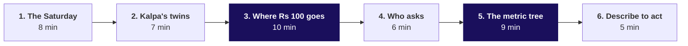
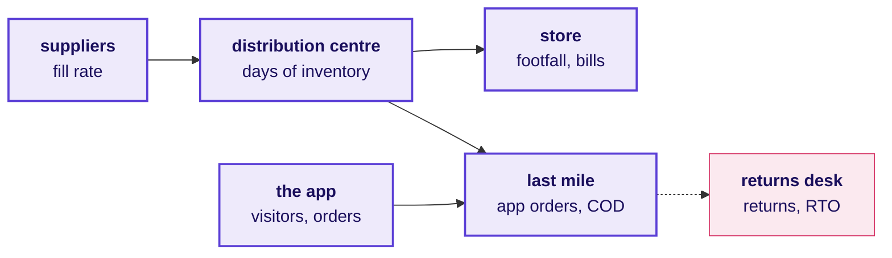
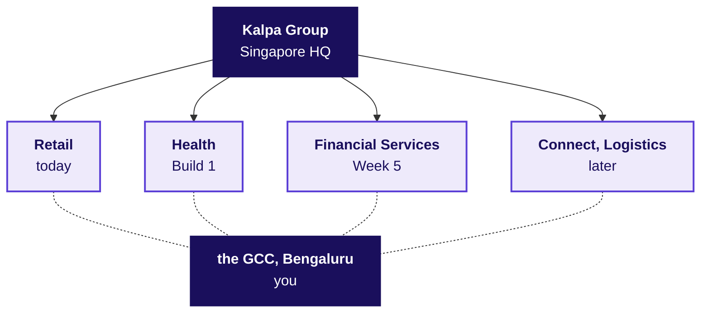
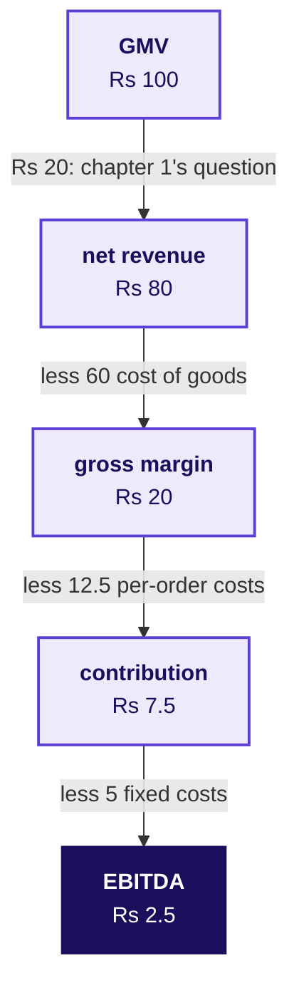
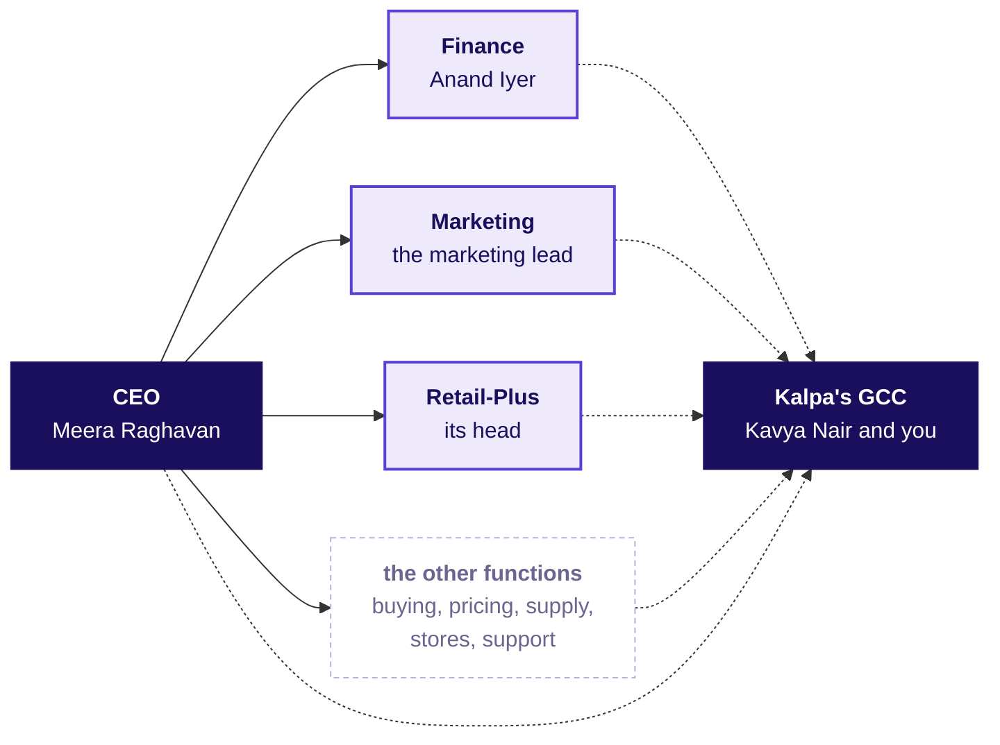
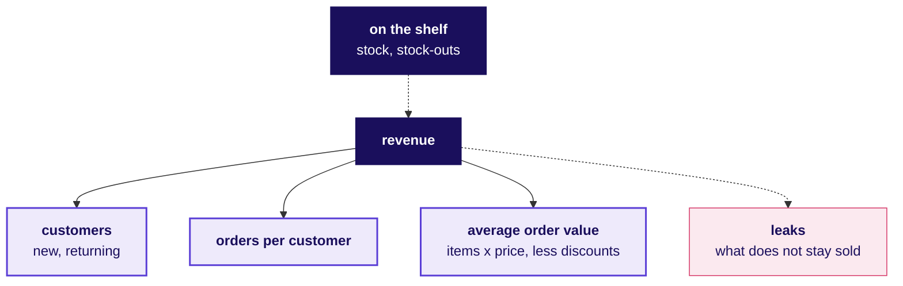
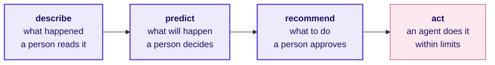

# How does a retailer like Kalpa make money, who asks the data team for which number, and how is each number worked out?

**TRAINER ONLY.** Nothing on this page reaches a learner. It is the talk track for chapter 0 of Monday's morning deck, *How does retail earn?*: the 45-minute story on slides S2 to S10, which hands over to Meera Raghavan's ask on S11 and S12. The learner reads the same business at more depth in the dossier, `study-notes/C2_W01_D01_domain_retail_STUDENT.md`, and keeps its one-page summary, `cheatsheets/C2_W01_D01_retail_domain_card_STUDENT.pdf`, which goes out at the afternoon's close.

**Who needs the answer.** Every trainee in the room, before Meera's ask reaches them. The day's case has them judge whether Rs 12 crore for new customers goes to the branch of sales that is short, in a business most of them have never worked in, and a trainee who cannot say what GMV, net revenue or contribution means, or who at Kalpa asks for which number, sends a figure its reader cannot act on.

**The questions on the way.** Ask each one aloud before its part answers it.

1. What happens at Kalpa Retail on one Saturday, and who makes it happen?
2. Which real companies is Kalpa built like, and whose team has the room joined?
3. How much of Rs 100 ordered does Kalpa keep, and where does the rest go?
4. Who at Kalpa asks the data team for which number, and what does a wrong one cost them?
5. Which tree does every retail number hang off, and how is each number worked out?
6. How far may a system act with no person checking, and which rules bind it?
7. Which question does Meera ask before she signs Rs 12 crore?

---

## What must the 45 minutes leave the room able to say, and what must the story never say?

Most of the room has never worked in a business role, so no laptop opens for these 45 minutes. Each part puts one drawing of four to six boxes on the board, the board version of a fuller drawing in the dossier. Keep all six up if the board allows; the Rs 100 journey and the metric tree stay up all day in any case, since the day's case comes back to both.

| | |
|---|---|
| **Start from** | Nothing about retail. Assume the room has shopped in a store and on an app, and nothing more. |
| **Go as far as** | Every learner can say what GMV, net revenue, gross margin, contribution and EBITDA are and that GMV and net revenue differ, can place a metric on the tree with its formula, and can name who at Kalpa asks for it. |
| **Stop before** | Any Week 1 answer and any Week 1 trap. The story never says which branch moved, whether the numbers reconcile, whether a discount worked, or what the gap between GMV and net revenue is made of, and it shows no wrong way of working out a number, since each day's chapters meet their traps cold. |
| **Where it sits** | It opens Monday in the place of the 20-minute ask, as SECTION 0 of the morning deck on slides S2 to S10, with Meera's ask on S11 and S12; the Weeks 1 and 2 spine sets the rest of the day around it. |
| **Hands over to** | Meera Raghavan's ask, read as the story's last line, which opens the day's case on the drawings already on the board. |
| **Cut first** | Part 4 to its drawing and question, then part 6 to its question. Never cut part 3, the money, or part 5, the metric tree. |

**Before the room arrives.** The board is clean. The trainer has read the dossier's first five sections, from *What happens at Kalpa Retail in one working day, and who makes it happen?* to *Which numbers run Kalpa Retail, and how is each one worked out?*, and the facts table at the end of this page, since a learner will ask about a real company and the answer has to be the checked one. The card is printed, one per learner, and handed out after the day's last case, once the room has met the day's traps.

**What never gets said.** The story does not preview anything the week's data is built for the room to find: the Monday file's largest order, the export's duplicates, which tier or branch moved, or what the monsoon sale did. It stages none of the week's traps under any numbers, invented ones included: no retention divided by the customers still buying, no conversion on another base, no total growth set against like for like, no average across segments, no rate on a small base, and no walk from GMV down through cancellations, returns and GST, since what separates GMV from net revenue is chapter 1's question. The illustrative numbers are never called Kalpa's data. Kalpa is never described as modelled on a real company; say "Kalpa is fictional, and these are real companies that look like parts of it."

---

## Part 1: What happens at Kalpa Retail on one Saturday, and who makes it happen?

Eight minutes: one on slide S2, which reads the six part questions aloud, and seven on slide S3.

**Say.** "Before any data, the business. Picture one Saturday at one Kalpa Retail store and on Kalpa's app in the same city. Before the shutters go up, the store manager checks every shelf against its planogram, the drawing of what goes where, and one check in twenty-five finds a product missing. The truck from the distribution centre brings last night's replenishment, and the cookware supplier has sent 900 of the 1,000 cases ordered. By the end of the day 1,200 people have come through the doors and 480 have paid at a till, with an average bill of Rs 1,250 across five items.

"On the app the same day, 50,000 people open it 80,000 times, fill 8,000 carts and place 2,000 orders at an average of Rs 1,500. One of them is a Retail-Plus member's basket: detergent, shampoo, a pressure cooker and a bedsheet, Rs 2,000 of goods, Rs 200 off in a promotion, Rs 1,800 at the checkout, paid with a card the app holds only as a token. A picker packs it, a van takes it the last mile, and next week the bedsheet comes back because the colour differs from the picture. Another parcel, cash on delivery, is refused at the door and travels back as an RTO. After closing, finance closes the week's books, and on Monday the CEO reads one page. Keep that basket in mind; part 3 follows its money."

**Ask the room.** "Think of the last thing you bought in a shop and the last thing you ordered on an app. Which one knew more about you, and what exactly did it know?"

Listen for: the app knew the search, the cart, the address, the payment token, past orders and the return; the store knew the bill, and the phone number only if it was given. Likely wrong answer: "The shop, because the staff know me by now." Correct it: the staff may, but the shop's system keeps only the bill, and the number only if it was given, while the app keeps every search, cart and return. Land it in one sentence: the data team works where customers leave traces, and a store leaves far fewer than an app.

**Draw: the value chain, six boxes.** Left to right, naming what each box measures as it goes up. The dossier's section 1, *What happens at Kalpa Retail in one working day, and who makes it happen?*, carries the fuller drawing.

**If the room asks** whether these are Kalpa's real numbers: "They are round illustrative numbers chosen so the arithmetic is easy. Three numbers are the story's own: revenue grew 4 percent last year against a plan of 15, marketing wants Rs 12 crore, and support answers two thousand tickets a day."

---

## Part 2: Which real companies is Kalpa built like, and whose team has the room joined?

Seven minutes, on slide S4.

**Ask the room first.** "What does your phone company know about you that a grocer would want?"

Listen for: where you are through the day, which apps you open and when, how you pay and how often you top up, your address, and the number itself, which the app and the store's till both ask for. Likely wrong answer: "If the phone company and the grocer belong to one group, the grocer can simply use it." Correct it: India's data protection law ties each use of personal data to a purpose the person agreed to, or to a use the Act allows, so a number collected to run a phone line does not become a grocery list by default. Land it: Reliance serves the same families through Jio and through Reliance Retail, and even inside one group the purpose rule decides what one business may do with what the other knows.

**Say.** "Kalpa Group is headquartered in Singapore and runs five businesses: Retail, Financial Services, Logistics, Health and Connect. Its largest engineering and data centre is in Bengaluru, and that centre, the Global Capability Centre, is the team you have joined. India has groups built like that. In one quarter Reliance Industries reported Jio with 533 million subscribers and Reliance Retail with 20,169 stores and the JioMart app, beside an oil-to-chemicals business. Tata runs 31 companies across ten verticals, from consumer and retail to financial services.

"The team you joined works the way the Indian centres of global retailers work. Walmart Global Tech has teams in Bengaluru, Chennai and Gurugram, and Target, Tesco and Lowe's each run a Bengaluru centre of several thousand people. Your clients are colleagues who run a business somewhere else.

"Kalpa Retail's stores work like DMart's or Reliance Retail's. Its app sells stock Kalpa owns, like DMart Ready or JioMart's grocery business. Flipkart and Amazon India work another way: they are marketplaces, and their sellers own the goods. Quick commerce, Blinkit, Zepto and Swiggy Instamart, delivers small baskets in minutes from dark stores. Retail-Plus is Kalpa's paid tier, a membership of the kind Amazon Prime is, though the story does not list what its members get."

**Draw: the group, six boxes.** The group at the top, the units below it grouped by when each becomes the room's client, and the GCC under them with a dotted line to each. The dossier's section 2, *Which real companies work the way Kalpa Retail does, and what does each teach?*, names all five units and the real company each is like.

**If the room asks** when the other units appear: Financial Services with Rohan Desai in Week 5 and Build 2, Health with Dr Priya Menon in Build 1, Connect with Ananya Bose in Build 3. Kalpa Health is a US-facing diagnostics and revenue-cycle business, like Quest Diagnostics or Labcorp; say that, and leave its cases to Build 1.

**If a learner offers a group that connects your phone and lends you money:** Tata no longer sells mobile plans to consumers, since its consumer mobile business merged into Bharti Airtel on 1 July 2019, and Reliance demerged its financial services business in 2023 into what became Jio Financial Services, a separately listed company.

---

## Part 3: How much of Rs 100 ordered does Kalpa keep, and where does the rest go?

Ten minutes, on slide S5.

**Ask the room first.** "The member paid Rs 1,800. How much of it do you think Kalpa keeps as EBITDA, the profit before interest, tax, depreciation and amortisation? Under Rs 20, Rs 20 to 100, Rs 100 to 400, or more than Rs 400?" Take a show of hands for each range, and leave the answer open while the drawing goes up.

**Say.** "Start with gross merchandise value, GMV: everything customers ordered, at the prices they were charged. Finance reports a smaller number, net revenue, which is what Kalpa earns from the goods, and the two differ on purpose. On our illustrative numbers, Rs 100 of GMV becomes Rs 80 of net revenue. What the Rs 20 between them is made of is the question this morning's first chapter opens, on Kalpa's own orders, so it stays on the board as a question for now.

"From net revenue, take out what Kalpa paid its suppliers for the goods, the cost of goods sold, and Rs 20 is left: gross margin. Take out what every order costs, the picking, packing and delivery, the payment fee, handling returns and the offers that bring a customer back, and Rs 7.50 is left: contribution. Take out the stores, the warehouses, the technology, head office and the budget that wins new customers, and Rs 2.50 is left: EBITDA, earnings before interest, tax, depreciation and amortisation, which is operating profit before depreciation.

"Real retailers keep a thin slice too. DMart reported profit after tax of 4.8 percent of its revenue last financial year, about Rs 6.4 of every Rs 100 before tax, so a 5 percent price cut that sells nothing extra would take about three quarters of its profit."

Then reveal the guess: on these illustrative numbers the basket keeps about Rs 50 as EBITDA, which is its Rs 150 of contribution less about Rs 100 towards the costs that do not change with one more order. The rooms that guess high are the rooms that most need this part. If a learner asks how the basket reaches Rs 150, say that the first step, from the Rs 1,800 charged to what Kalpa earns, is chapter 1's question, and the steps after it are the ones on the board.

**If the room asks** what the Rs 20 between GMV and net revenue is made of: "Hold the question. It is the first one this morning, and chapter 1 answers it from Kalpa's own orders."

**Draw: Rs 100's journey, five boxes.** Top to bottom, writing each step on its arrow, and write the first arrow as the open question it is. It stays up for the day.

Then one sentence beside the drawing: a marketplace such as Flipkart or Amazon India books only its fees as revenue, because the goods belong to its sellers. A foreign-owned multi-brand e-commerce business selling to Indian consumers must run that way under India's FDI policy, which permits foreign investment in marketplace e-commerce and not in inventory-based e-commerce (DPIIT, Press Note 2 of 2018); a single-brand retailer may sell its own brand online, and food made in India has a government-approval route.

**If the room asks** whether Kalpa, headquartered in Singapore, could legally own its stock and sell it on an app in India: "In the real world that depends on who owns the Indian business, and the story does not settle it. A foreign-owned multi-brand retailer's app would have to run as a marketplace. None of the Week 1 or Week 2 cases turns on it, and naming the rule and the question is the right answer in an interview."

The dossier's section 3, *How does Kalpa Retail make money, and where does each rupee go?*, carries the unit economics of one order and the working capital, for a learner who wants them tonight.

---

## Part 4: Who at Kalpa asks the data team for which number, and what does a wrong one cost them?

Six minutes, on slide S6.

**Say.** "Six people at Kalpa Retail already want something from us. Meera Raghavan, the CEO, wants to know where growth comes from and where it leaks. Anand Iyer, the finance controller, wants our numbers to match his books and his analyst to audit how we got them. The marketing lead wants to know whether we need more customers and whether a campaign worked. The head of Retail-Plus wants to know whether the paid tier is slipping. The data platform lead wants us to query the warehouse and never export it. Kavya Nair, our senior analyst, checks everything before it leaves the team. From Week 8, Farhan Sheikh in customer support has two thousand tickets a day. Category buying, pricing, supply chain and store operations have heads too, and the story has not named them."

**Ask the room.** "If one of our numbers is wrong, whose mistake can we undo next week, and whose can we not?"

Listen for: a dashboard figure corrected before anyone acts on it can be undone; a figure the finance controller has already restated in front of the board, a budget the marketing lead has already spent, and a member who lapsed while the wrong ones were protected cannot. Likely wrong answer: "All of them: we send a corrected number." Correct it: a correction fixes the dashboard, and the decision taken on the wrong number stays taken. Land it: before a number leaves the team, know who asked for it and whether being wrong can be taken back.

**Draw: who asks, six boxes, as slide S6 shows them.** The CEO on the left; finance, marketing and Retail-Plus in solid boxes in the middle, beside a dashed box for the other functions, where customer support sits until Farhan Sheikh arrives in Week 8; the GCC on the right, with a dotted arrow from every box to it, because every one of them asks. Say that the data platform lead sits beside the GCC. The dossier's section 4, *Who decides what at Kalpa Retail, and what does each of them ask the data team?*, shows every function with what it owns and what a wrong number costs it.

**If short of time**, draw the chart, ask the question, take one answer and move on.

---

## Part 5: Which tree does every retail number hang off, and how is each number worked out?

Nine minutes, on slide S7. The ten formulas below are also on the self-study slides D8 and D9.

**Say.** "Every retail number hangs off one tree. Revenue is customers, times orders per customer, times items per order, times price per item, less discounts. Customers are new or returning: new ones are won by acquisition and returning ones are kept by retention. Stock on the shelf decides whether any of it can happen, and some of what is ordered does not stay sold before the margin is counted. Each number on the tree is worked out by one formula, and each has someone at Kalpa who asks for it."

Then read the formulas off the tree, one line each, pointing at the branch as you say it: how the number is worked out, the question it answers, and who at Kalpa asks. If the room wants a number, part 1 fills the first two: 2,000 orders from 80,000 visits to the app is 2.5 percent, and Rs 1,500 an order is the app's average order value.

| The number, and where it sits on the tree | Worked out as | The question it answers | Who at Kalpa asks |
|---|---|---|---|
| Conversion, on customers, the new ones | Orders / visits | Of the people who came, how many bought? | Marketing and the app's product team |
| Average order value, its own branch | Revenue / orders | How much does one order bring in? | Merchandising, marketing and finance |
| Orders per customer, its own branch | Orders / customers who ordered | How often does a customer buy? | The head of Retail-Plus and marketing |
| Repeat rate, on orders per customer | Customers with two or more orders / customers who ordered | How many customers came back for another order? | The head of Retail-Plus and marketing |
| Retention, on customers, the returning ones | A cohort's buyers in month k / the cohort's starting size | How many of one month's new customers still buy k months on? | The head of Retail-Plus and marketing |
| Customer lifetime value, on customers | Contribution per order x orders a year x expected years as a customer | What is one customer worth over all the years they buy? | Marketing and finance, whenever an acquisition budget is argued |
| Acquisition cost and payback, on customers, the new ones | Acquisition spend / new customers it brought; then that cost / monthly contribution per customer | What did each new customer cost, and how many months until they repay it? | The CEO and the finance controller, before signing |
| Gross margin, below revenue | (Net revenue less the cost of goods sold) / net revenue | How much of each rupee earned is left after paying for the goods? | The finance controller and the category buyers |
| Days of inventory, on the shelf | Average stock at cost / cost of goods sold per day | How many days would today's stock last? | Supply chain, the category buyers, and finance |
| Like-for-like growth, on revenue | Sales of stores open throughout both periods / the same stores' sales in the earlier period, less 1 | Did the stores that were already open sell more? | The CEO, store operations and investors |

**Ask the room.** "The marketing lead, the head of Retail-Plus and Anand Iyer each walk up to this board. Which number on the tree does each of them ask about first, and why that one?"

Listen for: the marketing lead asks about customers, the new ones above all, and whether a campaign brought them, since acquisition is marketing's budget; the head of Retail-Plus asks how often members order and how many come back, since renewals are that tier's measure; Anand Iyer asks about gross margin and whether the numbers match his books, since he answers for the books. Likely wrong answer: "All three ask about revenue, since revenue is the number that matters." Correct it: revenue is Meera's number, and each of the three owns a branch of it, is judged on that branch and asks for it first. Land it: every number on the tree has a formula and an owner, and a number sent without knowing its owner reaches a decision it was never built for.

**Draw: the metric tree, six boxes.** Revenue in the middle, the shelf above it, its three branches below and the leaks to its right. It is the board version of the tree in the dossier's section 5, *Which numbers run Kalpa Retail, and how is each one worked out?*, and on the card; it stays up for the day, and the day's case writes its numbers onto it.

**Leave it on the board.** Meera's ask begins on this drawing, so the revenue tree of the day's case is a close-up of this one.

---

## Part 6: How far may a system act with no person checking, and which rules bind it?

Five minutes, on slide S10.

**Say.** "Everything on Saturday was decided by a person. Analytics describes what happened and a person reads it. A forecast predicts and a person decides. A model recommends and a person approves. An agent acts inside limits, and nobody checks before the decision takes effect. The further right, the more a wrong answer costs. Klarna's AI assistant took two-thirds of its customer-service chats in its first month in 2024; fifteen months later its chief executive said the focus on cost had lowered quality and that customers would always be able to reach a human. When Air Canada's chatbot described a refund the airline did not offer, a tribunal held the airline responsible for what its chatbot said.

"Every rung works under rules, and four reach the data team first. A price model never goes above MRP, the price ceiling printed on every pack. Personal data is used for the purpose the customer agreed to, or for a use the law allows. A payments table holds a token and the last four digits, never the card number. And consent is an explicit click, never a pre-ticked box, while a marketplace publishes the main parameters that rank its goods and sellers."

The dossier's section 7, *Which rules bind Kalpa Retail's data, and what do they forbid an analyst or an AI system?*, carries all eight sets of rules and what each asks of an analyst.

**Ask the room.** "Which of these would you let a system do with no person checking: send the Monday numbers, reorder detergent, refund the bedsheet, change a price?"

Listen for the reasons as much as the choices: a detergent reorder inside limits is easy to undo, the bedsheet's refund is small but sets a precedent, the Monday numbers reach the CEO's decisions before anyone could catch a wrong one, and a price change touches MRP, consent and fairness rules at once. Likely wrong answer: "The Monday numbers, since they are only a report." Correct it: they are the riskiest of the four to send unchecked, because the CEO decides on them before anyone could catch a wrong one, and the detergent reorder inside limits is the safest. Land it: an agent is only as safe as its policy and the limits around it.

**Draw: the ladder, four boxes.** Left to right, the last one in rose.

---

## Which question does Meera ask before she signs Rs 12 crore?

Four minutes, on slides S11 and S12, after the 45.

**Hand over.** Say the line that opens the case: "That is the business. On Monday its CEO read one page: revenue grew 4 percent against a plan of 15, marketing wants Rs 12 crore, and she asked us one question before she signs anything." Then read her message from slide S11, which ends on the day's question: "Is acquisition even the branch that is short?" In full, the day asks: "Before Meera signs Rs 12 crore for new customers, is acquisition even the branch of sales that is short?" It lands on the metric tree still on the board, beside the customers branch, and slide S12 splits her message into the questions the day's chapters answer.

---

## Which checked facts may the trainer quote, and where does each come from?

Each was checked on 30 September 2026. The URLs are in `internal/C2_W01_D01_domain_sources_INTERNAL.md`.

| Fact | Source |
|---|---|
| Reliance Retail had 20,169 stores and 396 million registered customers at 30 June 2026; Jio had 533 million customers, revenue per user of Rs 215.6 a month and monthly churn of 1.6 percent | Reliance Industries media release, 17 July 2026 |
| Reliance Retail's EBITDA margin of 7.9 percent in that quarter includes Rs 374 crore of investment income; from operations alone it is 7.4 percent | Reliance Industries media release, 17 July 2026 |
| JioMart's digital orders made 13.4 percent of Reliance Retail's grocery sales to consumers in the quarter to June 2026 | Reliance Industries media release, 17 July 2026 |
| DMart follows an "everyday low cost, everyday low price" strategy and reported FY26 standalone EBITDA of 7.8 percent and profit after tax of 4.8 percent of revenue, which is about Rs 6.4 of every Rs 100 before tax if taxed at the 25.17 percent corporate rate; it had 503 stores at 30 June 2026 | Avenue Supermarts results release, 2 May 2026; Business Standard, 11 July 2026; the arithmetic is in the sources file |
| DMart Ready, DMart's online grocery business, operated in 11 cities at 30 June 2026 after leaving seven in the quarter, and had revenue of Rs 4,093 crore in FY26 | Business Standard, 11 July 2026; Upstox, 8 June 2026 |
| Trent had 301 Westside and 982 Zudio stores at 30 June 2026, 7 of the Zudio stores in the UAE | Business Standard, 7 July 2026 |
| Flipkart has been majority-owned by Walmart since August 2018, and Walmart's stake was about 85 percent at 31 January 2024 | Walmart corporate news, 18 August 2018; Walmart's Form 10-K, filed 13 March 2026 |
| Blinkit had 2,443 dark stores and a net average order value of Rs 518, net of all discounts, in the quarter to June 2026 | MediaNama on Eternal's results, 24 July 2026; Eternal's shareholders' letter for the quarter, Annexure C |
| After a government intervention in January 2026, Blinkit dropped the "10-minute" promise from its branding and the other quick-commerce platforms agreed to follow | All India Radio News, 13 January 2026 |
| Foreign investment is permitted up to 100 percent in marketplace e-commerce and not in the inventory model for domestic sales, since 1 February 2019; an export-only inventory model has been allowed since 3 September 2026 | DPIIT, Press Note 2 of 2018; Press Note 3 of 2026, through EY India, 25 September 2026 |
| A single-brand retailer with foreign investment may sell its own brand online, and food made in India has a government-approval route for retail, e-commerce included | Consolidated FDI Policy 2020, paragraphs 5.2.15.3(2)(g) and 5.2.5.2 |
| Tata's consumer mobile business merged into Bharti Airtel on 1 July 2019 | Bharti Airtel and Tata Teleservices, joint press statement, 1 July 2019 |
| Reliance demerged its financial services business with effect from 1 July 2023, into the company renamed and listed as Jio Financial Services | BusinessToday, 8 July 2023 |
| Target in India's expanded Bengaluru campus will bring together more than 5,700 team members; Tesco Bengaluru dates from 2004 and Lowe's India from 2014 | Analytics India Magazine, 29 September 2026; tescobengaluru.com; lowes.co.in |
| Klarna's assistant handled two-thirds of customer-service chats in its first month, and its CEO later said cost-first support had lowered quality | Klarna, 27 February 2024; Fortune, 9 May 2025 |
| A tribunal held Air Canada responsible for its chatbot's refund answer | Moffatt v. Air Canada, 2024 BCCRT 149 |
