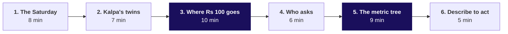
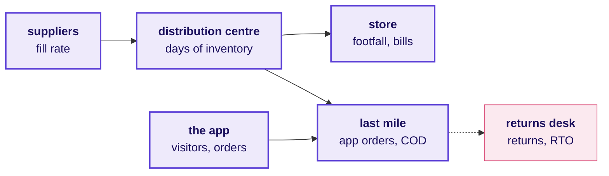
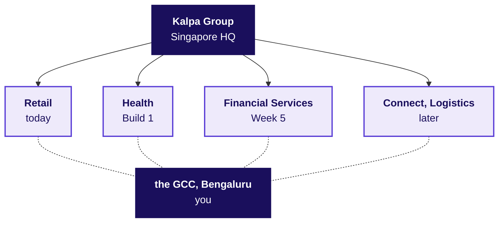
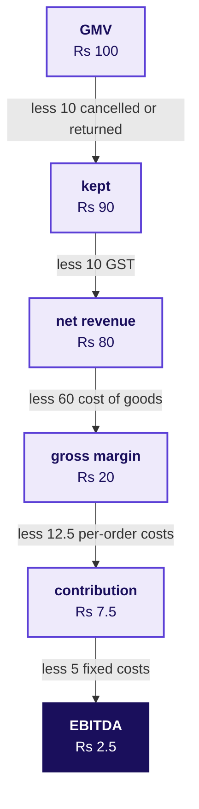
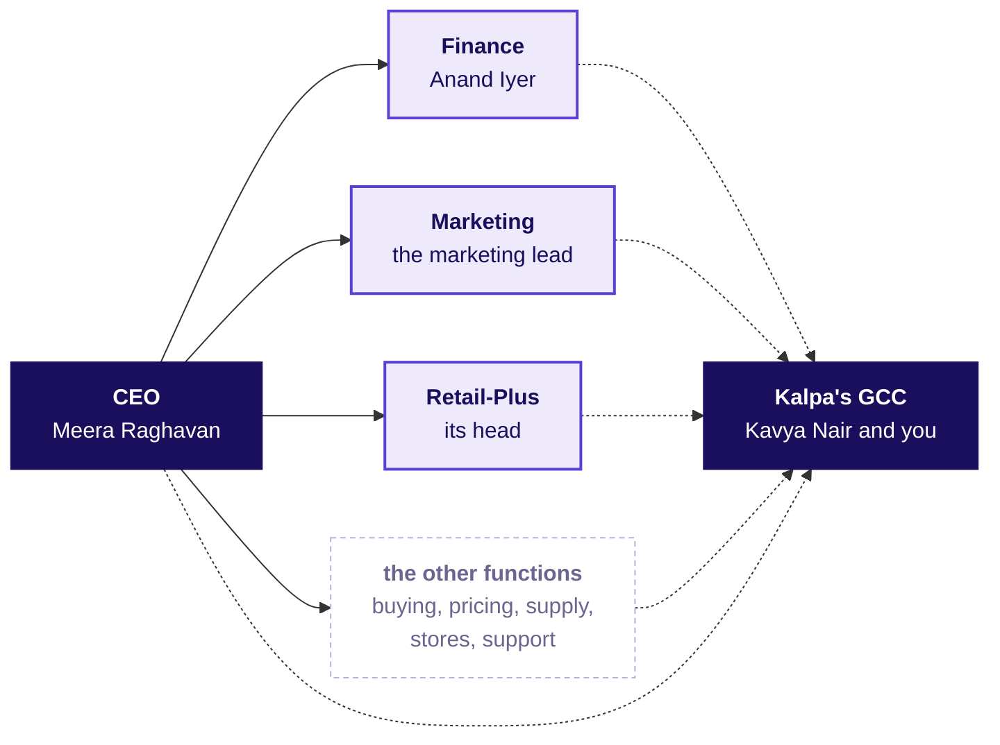
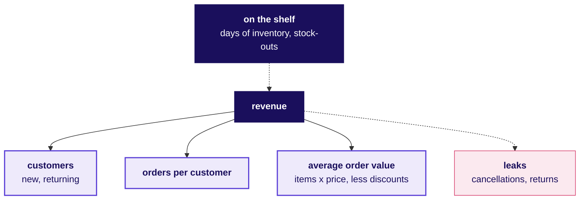
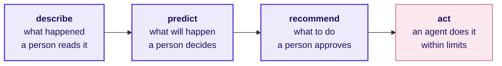

# Talk track: the domain story that opens Monday

**TRAINER ONLY.** Nothing on this page reaches a learner. The learner's version of everything said here is `study-notes/C2_W01_D01_domain_retail_STUDENT.md`, and the one-page summary is `cheatsheets/C2_W01_D01_retail_domain_card_STUDENT.pdf`.

Most of the room has never worked in a business role. For 45 minutes before Meera Raghavan's ask, the trainer tells the story of the business the room will work inside for two weeks: one Saturday at a Kalpa Retail store and on its app, which real companies Kalpa resembles, where Rs 100 at the checkout goes, who asks the data team for what, the metric tree and its traps, and where analytics, machine learning and agents earn their keep. No laptop opens. Each part puts one drawing of four to six boxes on the board, the board version of a fuller drawing in the dossier. The Rs 100 journey and the metric tree stay up for the day, and the others are wiped as the next part begins.

| | |
|---|---|
| **Start from** | Nothing about retail. Assume the room has shopped in a store and on an app, and nothing more. |
| **Go as far as** | Every learner can say what GMV, net revenue, gross margin and contribution are, place a metric on the tree with its denominator, and name who at Kalpa asks for it. |
| **Stop before** | Any Week 1 answer. The story never says which branch moved, whether the numbers reconcile, or whether a discount worked; those are the week's cases. |
| **Where it sits** | It opens Monday in the place of the 20-minute ask, and the morning deck's first chapter carries it; the Weeks 1 and 2 spine sets the rest of the day around it. |
| **Hands over to** | Meera Raghavan's ask, read as the story's last line, which opens the day's case on the drawings already on the board. |
| **Cut first** | Part 4 to its drawing and question, then part 6 to its question. Never cut part 3, the money, or part 5, the metric tree. |

**Before the room arrives.** The board is clean. The trainer has read the dossier's sections 1 to 5 and the facts table at the end of this page, since a learner will ask about a real company and the answer has to be the checked one. The card is printed, one per learner, and handed out after the day's last case, once the room has met the day's traps.

**What never gets said.** The story does not preview anything the week's data is built for the room to find: the Monday file's largest order, the export's duplicates, which tier or branch moved, or what the monsoon sale did. The illustrative numbers are never called Kalpa's data. Kalpa is never described as modelled on a real company; say "Kalpa is fictional, and these are real companies that look like parts of it."

---

## Part 1: The Saturday (8 minutes)

**Say.** "Before any data, the business. Picture one Saturday at one Kalpa Retail store and on Kalpa's app in the same city. Before the shutters go up, the store manager checks every shelf against its planogram, the drawing of what goes where, and one check in twenty-five finds a product missing. The truck from the distribution centre brings last night's replenishment, and the cookware supplier has sent 900 of the 1,000 cases ordered. By the end of the day 1,200 people have come through the doors and 480 have paid at a till, with an average bill of Rs 1,250 across five items.

"On the app the same day, 50,000 people open it 80,000 times, fill 8,000 carts and place 2,000 orders at an average of Rs 1,500. One of them is a Retail-Plus member's basket: detergent, shampoo, a pressure cooker and a bedsheet, Rs 2,000 of goods, Rs 200 off in a promotion, Rs 1,800 at the checkout, paid with a card the app holds only as a token. A picker packs it, a van takes it the last mile, and next week the bedsheet comes back because the colour differs from the picture. Another parcel, cash on delivery, is refused at the door and travels back as an RTO. After closing, finance walks the week's orders down to the revenue it will report, and on Monday the CEO reads one page. Keep that basket in mind; part 3 follows its money."

**Ask the room.** "Think of the last thing you bought in a shop and the last thing you ordered on an app. Which one knew more about you, and what exactly did it know?"

Listen for: the app knew the search, the cart, the address, the payment token, past orders and the return; the store knew the bill, and the phone number only if it was given. Land it in one sentence: the data team works where customers leave traces, and a store leaves far fewer than an app.

**Draw: the value chain, six boxes.** Left to right, naming what each box measures as it goes up. The dossier's section 1 carries the fuller drawing.

**If the room asks** whether these are Kalpa's real numbers: "They are round illustrative numbers chosen so the arithmetic is easy. Three numbers are the story's own: revenue grew 4 percent last year against a plan of 15, marketing wants Rs 12 crore, and support answers two thousand tickets a day."

---

## Part 2: Which real company Kalpa is like (7 minutes)

**Ask the room first.** "What does your phone company know about you that a grocer would want?"

Listen for: where you are through the day, which apps you open and when, how you pay and how often you top up, your address, and the number itself, which the app and the store's till both ask for. Land it: a group whose units share customers can learn a great deal about each one, and each unit still keeps its own books and needs its own purpose before it uses the data.

**Say.** "Kalpa Group is headquartered in Singapore and runs five businesses: Retail, Financial Services, Logistics, Health and Connect. Its largest engineering and data centre is in Bengaluru, and that centre, the Global Capability Centre, is the team you have joined. India has groups built like that. In one quarter Reliance Industries reported Jio with 533 million subscribers and Reliance Retail with 20,169 stores and the JioMart app, beside an oil-to-chemicals business. Tata runs 31 companies across ten verticals, from consumer and retail to financial services.

"The team you joined works the way the Indian centres of global retailers work. Walmart Global Tech has teams in Bengaluru, Chennai and Gurugram, and Target, Tesco and Lowe's each run a Bengaluru centre of several thousand people. Your clients are colleagues who run a business somewhere else.

"Kalpa Retail's stores work like DMart's or Reliance Retail's. Its app sells stock Kalpa owns, like DMart Ready or JioMart's grocery business. Flipkart and Amazon India work another way: they are marketplaces, and their sellers own the goods. Quick commerce, Blinkit, Zepto and Swiggy Instamart, delivers small baskets in minutes from dark stores. Retail-Plus is Kalpa's paid tier, the kind of membership Amazon Prime is."

**Draw: the group, six boxes.** The group at the top, the units below it grouped by when each becomes the room's client, and the GCC under them with a dotted line to each. The dossier's section 2 names all five units.

**If the room asks** when the other units appear: Financial Services with Rohan Desai in Week 5 and Build 2, Health with Dr Priya Menon in Build 1, Connect with Ananya Bose in Build 3. Kalpa Health is a US-facing diagnostics and revenue-cycle business, like Quest Diagnostics or Labcorp; say that, and leave its cases to Build 1.

**If a learner offers a group that connects your phone and lends you money:** Tata no longer sells mobile plans to consumers, since its consumer mobile business merged into Bharti Airtel on 1 July 2019, and Reliance demerged its financial services business in 2023 into what became Jio Financial Services, a separately listed company.

---

## Part 3: Where Rs 100 at the checkout goes (10 minutes)

**Say.** "The member paid Rs 1,800. How much of it does Kalpa keep? Start with gross merchandise value, GMV: everything customers ordered, at the price they were charged. Take out what was cancelled and returned. Take out GST, which Kalpa collects for the government and never keeps. What is left is net revenue. Take out what Kalpa paid its suppliers for the goods, the cost of goods sold, and what is left is gross margin. Take out what every order costs, picking, packing, delivery, the payment fee, handling returns and the offers that bring a customer back, and what is left is contribution. Take out the stores, the warehouses, the technology, head office and the budget that wins new customers, and what is left is EBITDA: earnings before interest, tax, depreciation and amortisation, which is operating profit before depreciation.

"On our illustrative numbers, Rs 100 of GMV leaves Rs 80 of net revenue, Rs 20 of gross margin, Rs 7.50 of contribution and Rs 2.50 of EBITDA. Real retailers keep a thin slice too: DMart reported profit after tax of 4.8 percent of its revenue last financial year, so a 5 percent price cut that sells nothing extra would take about three quarters of its profit."

**Ask the room.** "Of the Rs 1,800, how much do you think Kalpa keeps as EBITDA? Under Rs 20, Rs 20 to 100, Rs 100 to 400, or more than Rs 400?" Take a show of hands for each range, then reveal: on these illustrative numbers, about Rs 50, which is the basket's Rs 150 of contribution less about Rs 100 towards the costs that do not change with one more order. The rooms that guess high are the rooms that most need this part.

**Draw: Rs 100's journey, six boxes.** Top to bottom, writing each deduction on its arrow. It stays up for the day. The dossier's section 3 carries the fuller drawing.

Then one sentence beside the drawing: a marketplace such as Flipkart or Amazon India books only its fees as revenue, because the goods belong to its sellers. A foreign-owned multi-brand e-commerce business selling to Indian consumers must run that way under India's FDI policy, which permits foreign investment in marketplace e-commerce and not in inventory-based e-commerce (DPIIT, Press Note 2 of 2018); a single-brand retailer may sell its own brand online, and food made in India has a government-approval route.

**If the room asks** whether Kalpa, headquartered in Singapore, could legally own its stock and sell it on an app in India: "In the real world that depends on who owns the Indian business, and the story does not settle it. A foreign-owned multi-brand retailer's app would have to run as a marketplace. None of the Week 1 or Week 2 cases turns on it, and naming the rule and the question is the right answer in an interview."

---

## Part 4: Who decides, and who asks (6 minutes)

**Say.** "Six people at Kalpa Retail already want something from us. Meera Raghavan, the CEO, wants to know where growth comes from and where it leaks. Anand Iyer, the finance controller, wants our numbers to match his books and his analyst to audit how we got them. The marketing lead wants to know whether we need more customers and whether a campaign worked. The head of Retail-Plus wants to know whether the paid tier is slipping. The data platform lead wants us to query the warehouse and never export it. Kavya Nair, our senior analyst, checks everything before it leaves the team. From Week 8, Farhan Sheikh in customer support has two thousand tickets a day. Category buying, pricing, supply chain and store operations have heads too, and the story has not named them."

**Ask the room.** "If one of our numbers is wrong, whose mistake can we undo next week, and whose can we not?"

Listen for: a dashboard figure corrected before anyone acts on it can be undone; a figure the finance controller has already restated in front of the board, a budget the marketing lead has already spent, and a member who lapsed while the wrong ones were protected cannot. Land it: before a number leaves the team, know who asked for it and whether being wrong can be taken back.

**Draw: who asks, six boxes.** The CEO on the left, the functions in the middle, the GCC on the right, and a dotted arrow from every box to the GCC, because every one of them asks. The dossier's section 4 shows each function.

**If short of time**, draw the chart, ask the question, take one answer and move on.

---

## Part 5: The metric tree, and three traps (9 minutes)

**Say.** "Every retail number hangs off one tree. Revenue is customers, times orders per customer, times items per order, times price per item, less discounts. Customers are new or returning; new ones cost acquisition, returning ones are retention. Stock on the shelf decides whether any of it can happen, and cancellations and returns leak out before we count the margin. Every metric is a numerator over a denominator in a window, and each of these three traps hides in one of the three."

Then the three traps, each with one illustrative example, spoken rather than drawn.

- A denominator that shifted: "January's cohort had 1,000 new customers, 380 of them ordered in February and 300 in March. March's retention is 30 percent. Someone who divides 300 by 380 reports 79 percent and has divided by the survivors."
- A missed sale leaves no row: "The pressure cookers ran out on Saturday afternoon. Sunday's file shows no sales of them, and no row says anyone asked for one. A forecast trained on that file learns that nobody buys a pressure cooker on a Sunday."
- Growth that is not like for like: "Last year 100 stores sold Rs 500 crore. This year the same 100 sold Rs 510 crore and 20 new stores added Rs 65 crore. Total growth is 15 percent and like-for-like growth is 2 percent. DMart reports its growth on stores two years and older for exactly this reason."

**Ask the room.** "The festive lights have sold 62 percent of their stock in four weeks, with Diwali still ahead. Good news or bad?" Collect three things to check before answering: what the same lights had sold a year ago at the same distance from Diwali, how many selling weeks are left and how fast the festival weeks sell, and whether any of the four weeks had an empty shelf, since a stock-out caps what could sell. Land it: a rate means nothing until you say what it is compared with, and over which window.

**Draw: the metric tree, six boxes.** Revenue in the middle, the shelf above it, its three branches below and the leaks to its right. It is the board version of the tree in the dossier and on the card, it stays up for the day, and the day's case writes its numbers onto it.

**Leave it on the board.** Meera's ask begins on this drawing, so the revenue tree of the day's case is a close-up of this one.

---

## Part 6: From describing to acting, and the rules (5 minutes)

**Say.** "Everything on Saturday was decided by a person. Analytics describes what happened and a person reads it. A forecast predicts and a person decides. A model recommends and a person approves. An agent acts inside limits, and nobody checks before the decision takes effect. The further right, the more a wrong answer costs. Klarna's AI assistant took two-thirds of its customer-service chats in its first month in 2024; fifteen months later its chief executive said the focus on cost had lowered quality and that customers would always be able to reach a human. When Air Canada's chatbot described a refund the airline did not offer, a tribunal held the airline responsible for what its chatbot said.

"And there are rules, from the price ceiling printed on every pack to what a payments table may hold. The card lists them."

**Ask the room.** "Which of these would you let a system do with no person checking: send the Monday numbers, reorder detergent, refund the bedsheet, change a price?"

Listen for the reasons as much as the choices: a detergent reorder inside limits is easy to undo, the bedsheet's refund is small but sets a precedent, the Monday numbers reach the CEO's decisions before anyone could catch a wrong one, and a price change touches MRP, consent and fairness rules at once. Land it: an agent is only as safe as its policy and the limits around it.

**Draw: the ladder, four boxes.** Left to right, the last one in rose.

**Hand over.** Say the line that opens the case: "That is the business. On Monday its CEO read one page: revenue grew 4 percent against a plan of 15, marketing wants Rs 12 crore, and she asked us one question before she signs anything." Meera's ask begins.

---

## Facts you may quote, with their source

Each was checked on 30 September 2026. The URLs are in `internal/C2_W01_D01_domain_sources_INTERNAL.md`.

| Fact | Source |
|---|---|
| Reliance Retail had 20,169 stores and 396 million registered customers at 30 June 2026; Jio had 533 million customers, revenue per user of Rs 215.6 a month and monthly churn of 1.6 percent | Reliance Industries media release, 17 July 2026 |
| Reliance Retail's EBITDA margin of 7.9 percent in that quarter includes Rs 374 crore of investment income; from operations alone it is 7.4 percent | Reliance Industries media release, 17 July 2026 |
| JioMart's digital orders made 13.4 percent of Reliance Retail's grocery sales to consumers in the quarter to June 2026 | Reliance Industries media release, 17 July 2026 |
| DMart follows an "everyday low cost, everyday low price" strategy and reported FY26 standalone EBITDA of 7.8 percent and profit after tax of 4.8 percent of revenue; it had 503 stores at 30 June 2026 | Avenue Supermarts results release, 2 May 2026; Business Standard, 11 July 2026 |
| DMart Ready, DMart's online grocery business, operated in 11 cities at 30 June 2026 after leaving seven in the quarter, and had revenue of Rs 4,093 crore in FY26 | Business Standard, 11 July 2026; Upstox, 8 June 2026 |
| Trent had 301 Westside and 982 Zudio stores at 30 June 2026, 7 of the Zudio stores in the UAE | Business Standard, 7 July 2026 |
| Flipkart has been majority-owned by Walmart since August 2018, and Walmart's stake was about 85 percent at 31 January 2024 | Walmart corporate news, 18 August 2018; Walmart's Form 10-K, filed 13 March 2026 |
| Blinkit had 2,443 dark stores and a net average order value of Rs 518 in the quarter to June 2026 | MediaNama on Eternal's results, 24 July 2026 |
| After a government intervention in January 2026, Blinkit dropped the "10-minute" promise from its branding and the other quick-commerce platforms agreed to follow | All India Radio News, 13 January 2026 |
| Foreign investment is permitted up to 100 percent in marketplace e-commerce and not in the inventory model for domestic sales, since 1 February 2019; an export-only inventory model has been allowed since 3 September 2026 | DPIIT, Press Note 2 of 2018; Press Note 3 of 2026, through EY India, 25 September 2026 |
| A single-brand retailer with foreign investment may sell its own brand online, and food made in India has a government-approval route for retail, e-commerce included | Consolidated FDI Policy 2020, paragraphs 5.2.15.3(2)(g) and 5.2.5.2 |
| Tata's consumer mobile business merged into Bharti Airtel on 1 July 2019 | Bharti Airtel and Tata Teleservices, joint press statement, 1 July 2019 |
| Reliance demerged its financial services business with effect from 1 July 2023, into the company renamed and listed as Jio Financial Services | BusinessToday, 8 July 2023 |
| Target in India's expanded Bengaluru campus will bring together more than 5,700 team members; Tesco Bengaluru dates from 2004 and Lowe's India from 2014 | Analytics India Magazine, 29 September 2026; tescobengaluru.com; lowes.co.in |
| Klarna's assistant handled two-thirds of customer-service chats in its first month, and its CEO later said cost-first support had lowered quality | Klarna, 27 February 2024; Fortune, 9 May 2025 |
| A tribunal held Air Canada responsible for its chatbot's refund answer | Moffatt v. Air Canada, 2024 BCCRT 149 |
