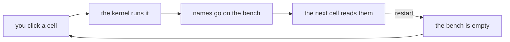
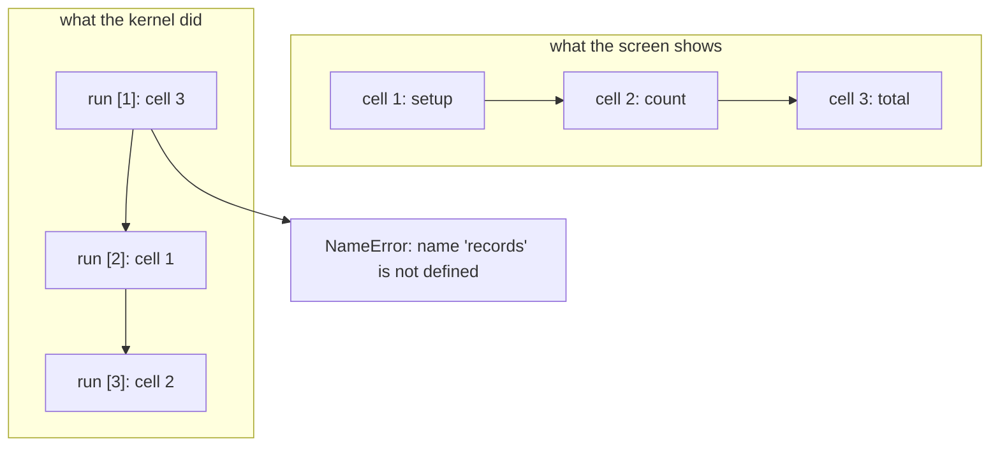
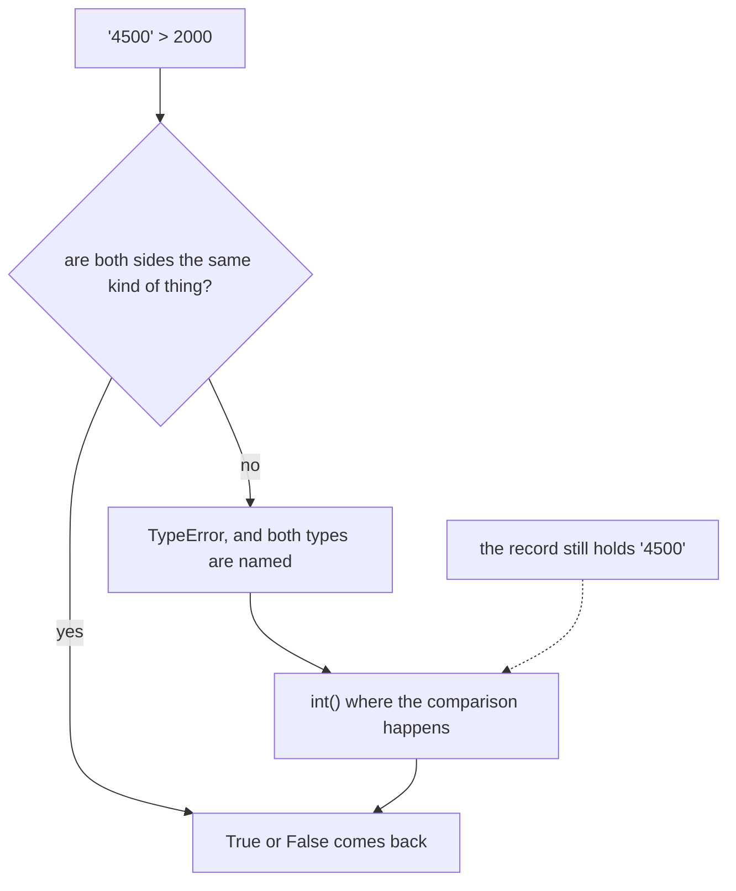
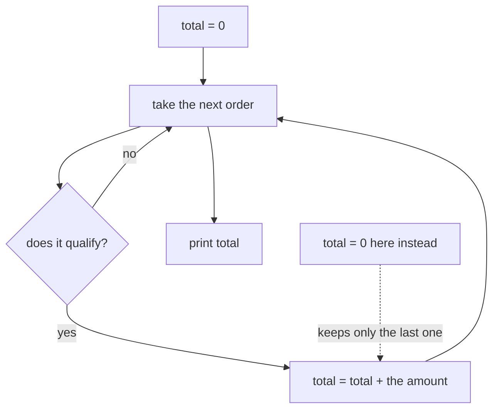
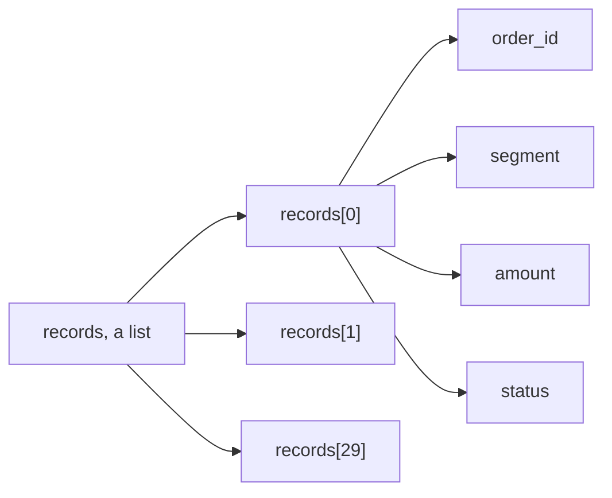
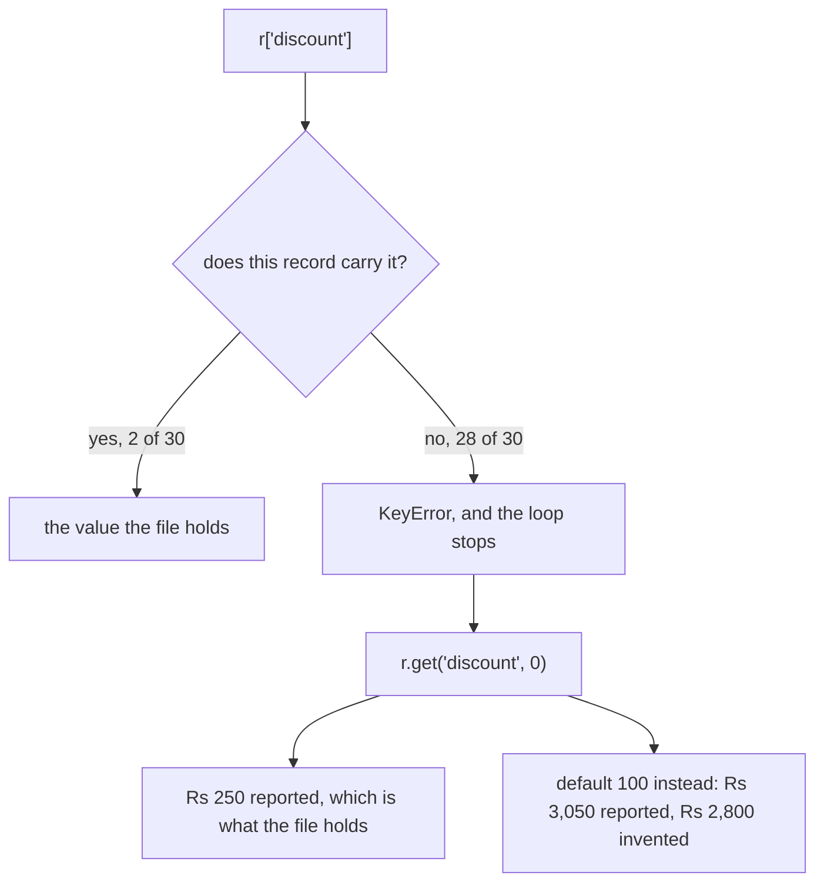
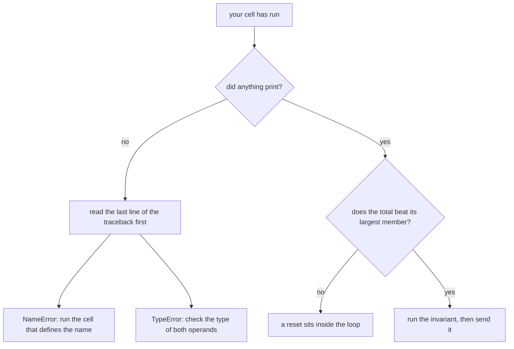
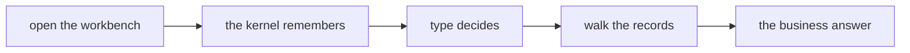

# Board diagrams: Week 1, Day 1

Every diagram the day uses, as a fence a trainer can draw from and a learner can redraw. The same shapes appear on the slides, in the notebooks and on the companion page, so a learner meets one drawing three times rather than three drawings once.

## 1. The bench

Draw this first, before any code runs. The whole day hangs off it.

## 2. The two orders

The order on the screen and the order the kernel saw are two different things, and this is the drawing that separates them.

## 3. Type decides the operator

## 4. The accumulator

## 5. A list of dictionaries

## 6. The absent key

## 7. The diagnosis order

## 8. The day, end to end

The position bar the deck repeats at every section boundary.

