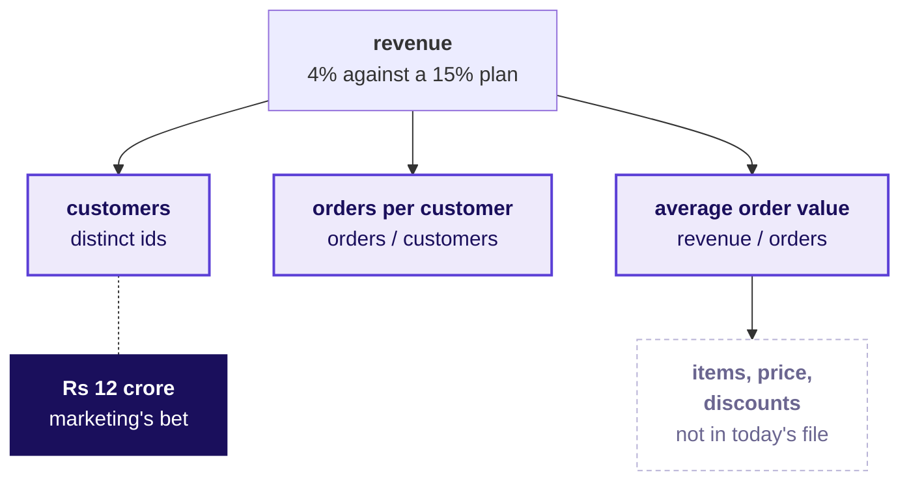
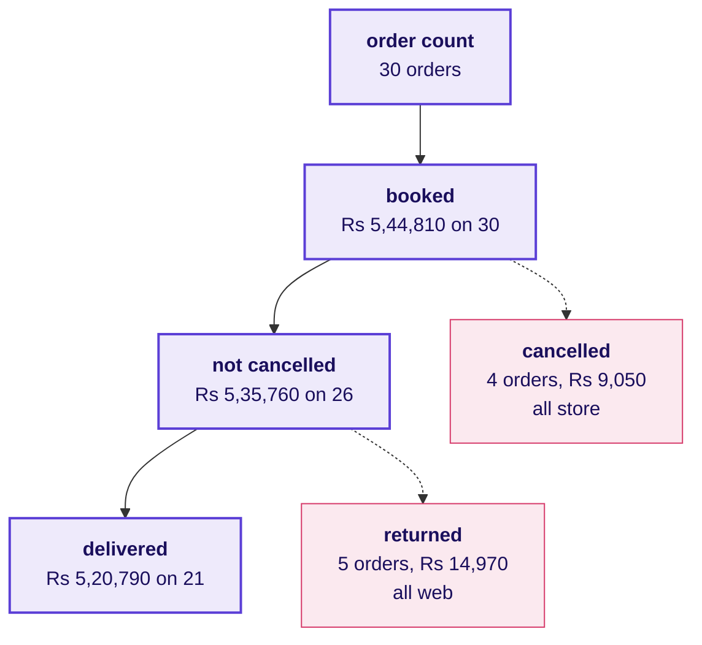
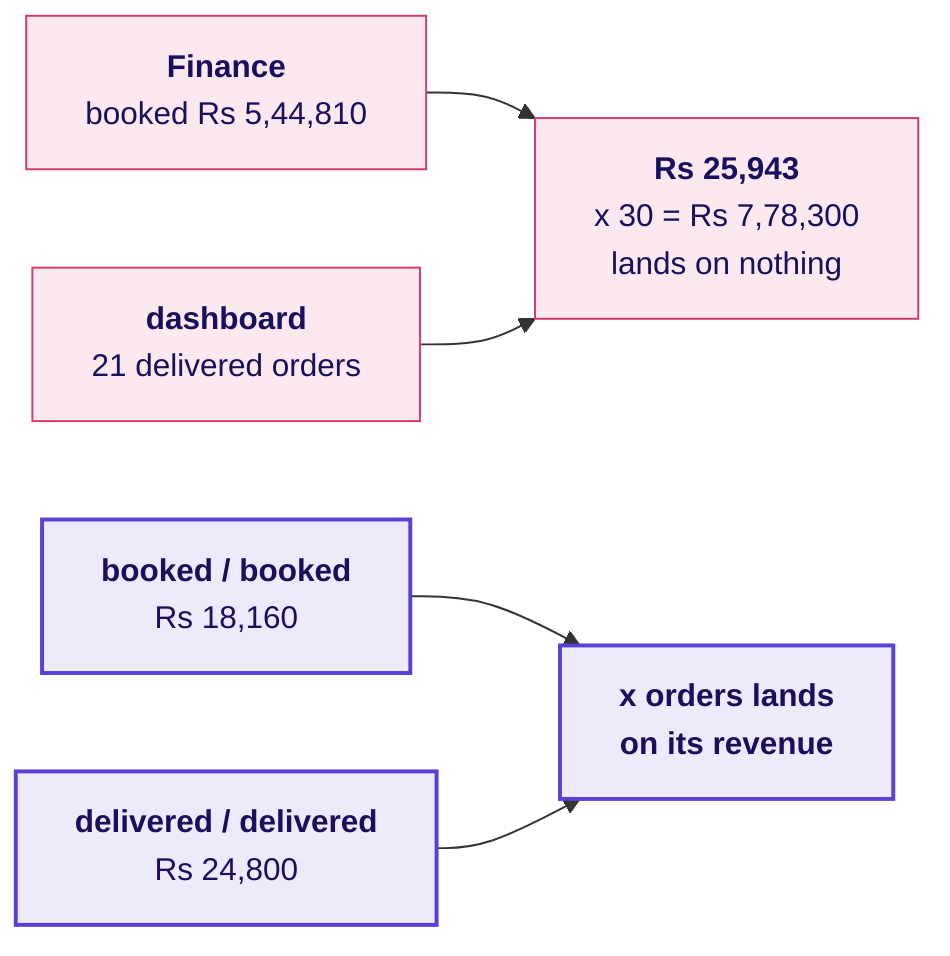
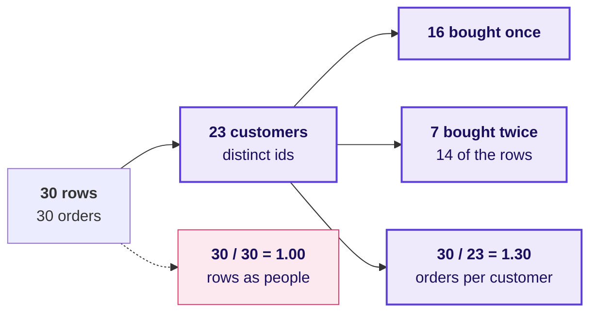
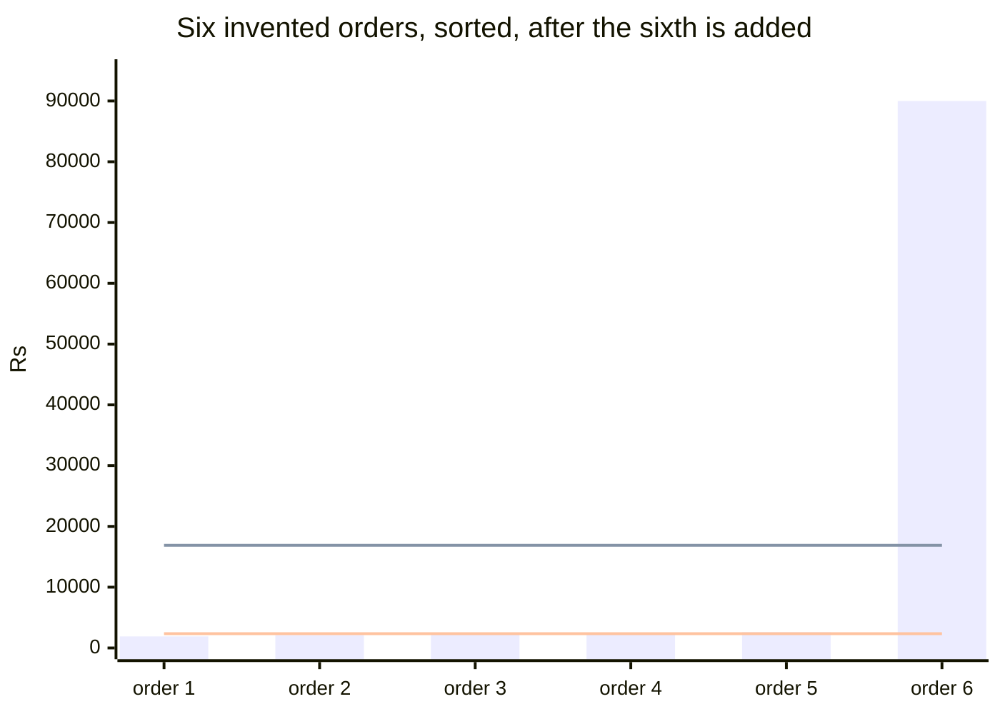
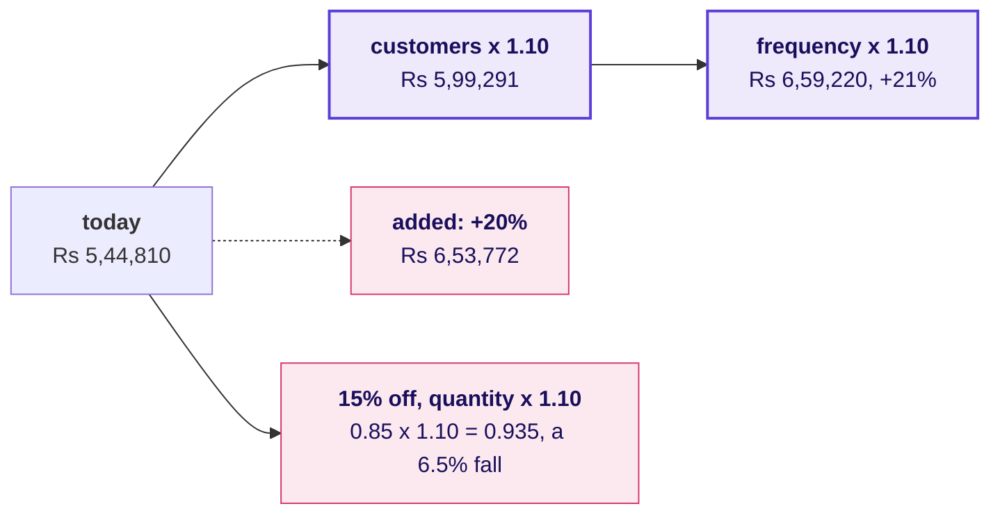
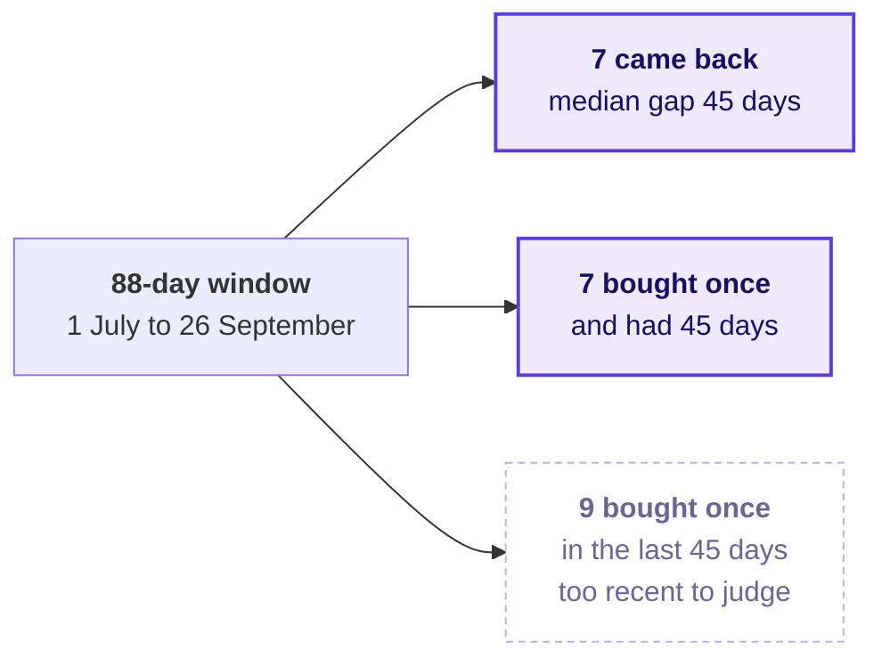
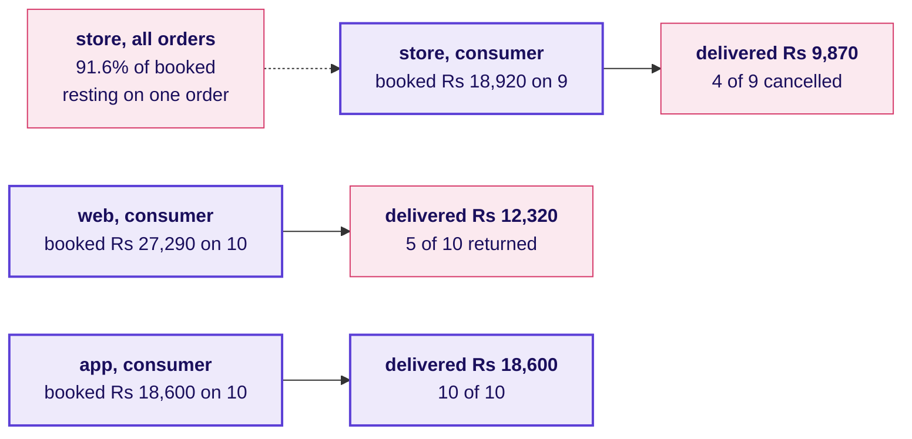
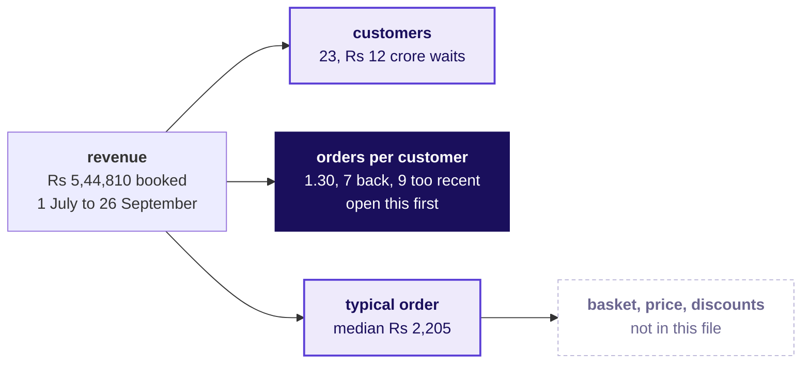

# The board, drawing by drawing

Week 1, Monday, Kalpa Retail. These are the drawings in the order they go up across the day: six
for the retail story, then one or two per chapter and one for the second case. The deck, the
notebooks, the domain card and the cheat sheet carry the same metric tree, so the tree copied from
the board here is the one met everywhere else this week.

---

## Drawings 1 to 6: the retail story

The story's six drawings go up in its six parts, before Meera's ask, and stay up all day. Each is
drawn exactly as the domain dossier draws it,
`study-notes/C2_W01_D01_domain_retail_STUDENT.md`, so the board and the reading match.

| Drawing | Story part | The dossier's section | What it shows |
|---|---|---|---|
| 1 | The Saturday | 1, the value chain | Suppliers to the distribution centre, the store and the app, the last mile, and the returns desk |
| 2 | Kalpa's twins | 2, the group | Kalpa Group, its five units, and the GCC with a dotted line to each |
| 3 | Where Rs 100 goes | 3, the P&L | Rs 100 of GMV walked to Rs 2.50 of operating profit |
| 4 | Who asks | 4, the org chart | The CEO, the functions, and the GCC below with its "asks" line |
| 5 | The metric tree | 5, the metric tree | Revenue, its three branches, the shelf above and the leaks beside |
| 6 | Describe to act | 8, the ladder | Describe, predict, recommend and act, the last in rose |

Drawing 5 is the one the case writes on. Meera's question is read out beside it, marketing's
Rs 12 crore is written against the customers branch, and every chapter adds a number to it:

---

## Drawing 7: the four readings of "sales", as a funnel

It goes up at the start of chapter 1, when the room names what "sales" could mean, and the numbers are written in once the loop has counted them.

The rule written under it is chapter 1's crux: the definition goes beside the number, and delivered, returned and cancelled add back to booked.

---

## Drawing 8: one fraction, one definition

It goes up in chapter 2, when the mixed AOV of Rs 25,943 is on the screen.

The check written under it: orders times AOV lands on that definition's revenue, or the fraction
mixes two reports.

---

## Drawing 9: rows against customers

It goes up in chapter 3, when the trap's 1.00 is on the screen and the room is asked who those 30 rows are.

The check goes beside it in code: the length of the rows against the length of the set of customer ids.

---

## Drawing 10: sorted amounts, with the mean and the median drawn on invented values

It goes up in chapter 4, after the room has seen the mean and the median of the real file and before anyone sorts it. Every amount here is invented, so the mechanism shows on numbers nobody has to trust.

Five invented orders of Rs 1,900, 2,100, 2,300, 2,400 and 2,600 go up first, with a mean of Rs 2,260 and a median of Rs 2,300. An invented Rs 90,000 order is then added as the sixth. The upper line is the new mean, Rs 16,883, and the lower line is the new median, Rs 2,350, the average of the two middle amounts. The mean jumped by more than Rs 14,000 and the median moved by Rs 50, and five of the six bars sit far below the mean line, which is the picture the room then looks for in its own sort of the 30 real amounts.

---

## Drawing 11: the lifts multiplying

It goes up in chapter 5, when marketing's "20 percent" is on the screen.

The line written under it: lifts multiply along the tree, so two 10 percent lifts make 21 percent, and a discount can lift quantity while revenue falls.

---

## Drawing 12: the window's edge

It goes up in chapter 6, when "70 percent of customers are lost" is on the screen and the room is
asked how long customers usually take to come back.

The line written under it: a one-time buyer is not a lost customer until they have had time to come
back.

---

## Drawing 13: the channel split, booked against delivered

It goes up in the second case, when a pair reports that store brings 91.6 percent of booked revenue and the room is asked how many orders stand behind that share.

Consumer orders are the 29 outside the Business segment, Rs 64,810 booked. The two leaks, web returns and store cancellations, are written beside the tree as findings for the note to Meera, and the branch recommendation stays where the tree put it.

---

## What is on the board when the day ends

1. The story's six drawings stay up, and the metric tree carries the day's numbers: 23 customers,
   1.30 orders each, and a typical order of Rs 2,205, with the branch to open first marked.
2. Marketing's Rs 12 crore stays written against the customers branch, marked as waiting for
   Tuesday's two quarters.
3. The funnel of the four readings and the one-definition fraction sit in one corner.
4. The window's edge, 7 back, 7 had time, 9 too recent, sits under the frequency branch.
5. The two leaks from the channel split, web returns and store cancellations, sit beside the tree.
6. The six crux lines run down the side, and the sentence that went to Meera sits under the tree:
   "On the 30 booked orders from 1 July to 26 September, 23 customers placed 1.30 orders each at a
   typical order of Rs 2,205; 7 came back, 7 have had time and not returned, and 9 bought too
   recently to judge, so I would open frequency before acquisition, and since one quarter cannot
   show which branch moved, hold the Rs 12 crore until Tuesday's two quarters."
