# Which drawings go up on Monday's board, and in what order?

Week 1, Monday, Kalpa Retail. Meera Raghavan, Kalpa Retail's CEO, asks whether acquisition is even
the branch of sales that is short before she signs Rs 12 crore for new customers, and the room answers
on 30 orders placed from 1 July to 26 September. Six drawings go up during the retail story, one or
two during each of the six chapters, and one during the second case, and the metric tree drawn in the
story is the same tree the deck, the notebooks and the cheat sheet use all week.

---

## What happens between a supplier and a customer on one Saturday at Kalpa Retail?

Drawing 1 goes up in the story's first part. Each box is a place where the business measures
something, and section 1 of the domain dossier, on what happens at Kalpa Retail in one working day
(`study-notes/C2_W01_D01_domain_retail_STUDENT.md`), has the fuller drawing.

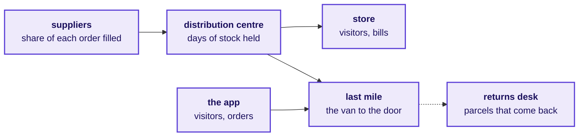

A store's till keeps the bill, while the app keeps every search, cart and order, so the data team
works where customers leave traces, and customers leave far more of them on the app.

---

## Which real companies does Kalpa look like, and which of its units is the room's client today?

Drawing 2 goes up in the story's second part. Kalpa Group is fictional; the real companies are
likenesses, and the dossier's section 2, on which real companies work the way Kalpa Retail does,
names them all.

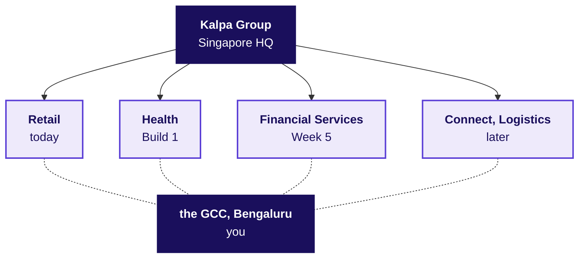

Reliance runs Jio and Reliance Retail in one group, as Kalpa runs its units, and Kalpa Retail's
stores work like DMart's. The GCC is Kalpa's Global Capability Centre, its own data and AI team in
Bengaluru, and Retail is its client for the first two weeks.

---

## How much of Rs 100 at the checkout does Kalpa keep?

Drawing 3 goes up in the story's third part and stays up all day. Gross merchandise value, GMV, is
everything customers ordered at the prices charged, and net revenue is the smaller figure Finance
reports as earned from the goods. The two differ, and the Rs 20 between them stays open on the board
until chapter 1 answers it from the file. The amounts are illustrative.

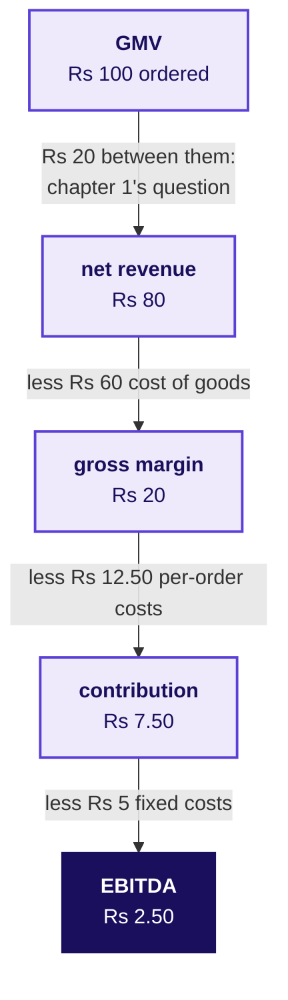

EBITDA is earnings before interest, tax, depreciation and amortisation, what is left after the goods,
the costs every order brings and the fixed costs of stores, warehouses, technology and head office.
Rs 2.50 of every Rs 100 is a thin slice, and real retailers keep one too: DMart's profit after tax
was 4.8 percent of its FY26 revenue (DMart results release, 2 May 2026).

---

## Who at Kalpa asks the data team for a number?

Drawing 4 goes up in the story's fourth part. Solid lines are reporting lines to the CEO, dotted
arrows are asks that reach the data team, and the dashed box holds functions whose heads the story has not named.

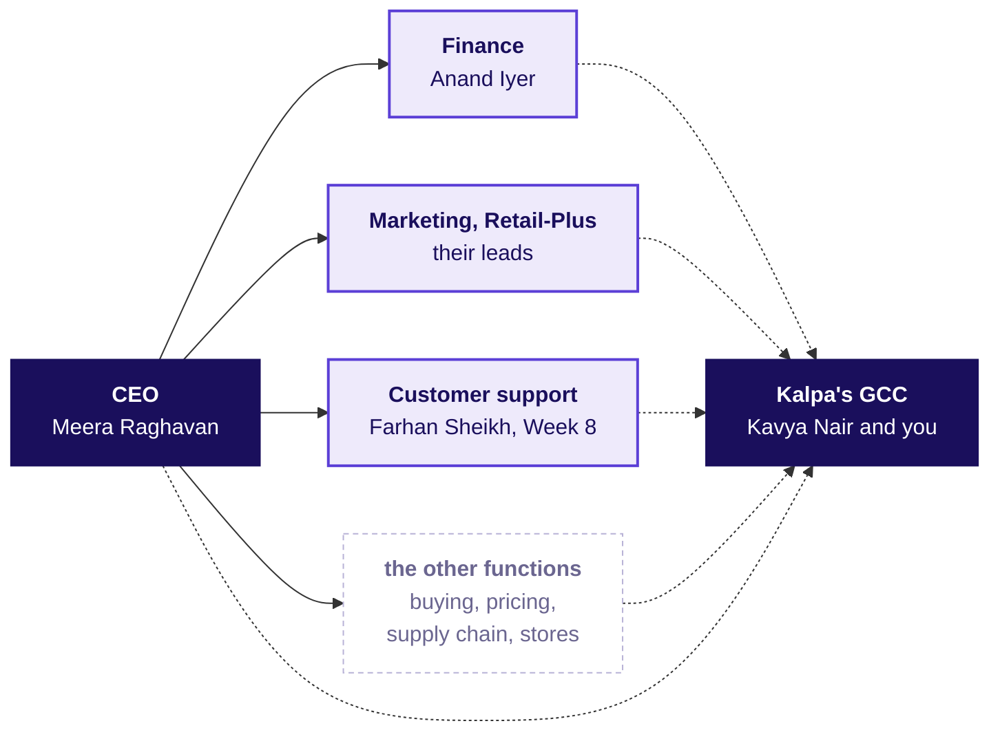

Anand Iyer is the finance controller, Retail-Plus is Kalpa's paid membership tier, and Kavya Nair is
the senior analyst who checks every number before it leaves the team. A wrong dashboard figure can be
corrected before anyone acts on it, and a budget already spent cannot.

---

## What is revenue made of, and what does each branch divide by?

Drawing 5 goes up in the story's fifth part and stays up all day, since the day's case writes its
numbers on it. The dossier's section 5, on which numbers run Kalpa Retail, draws the full tree.

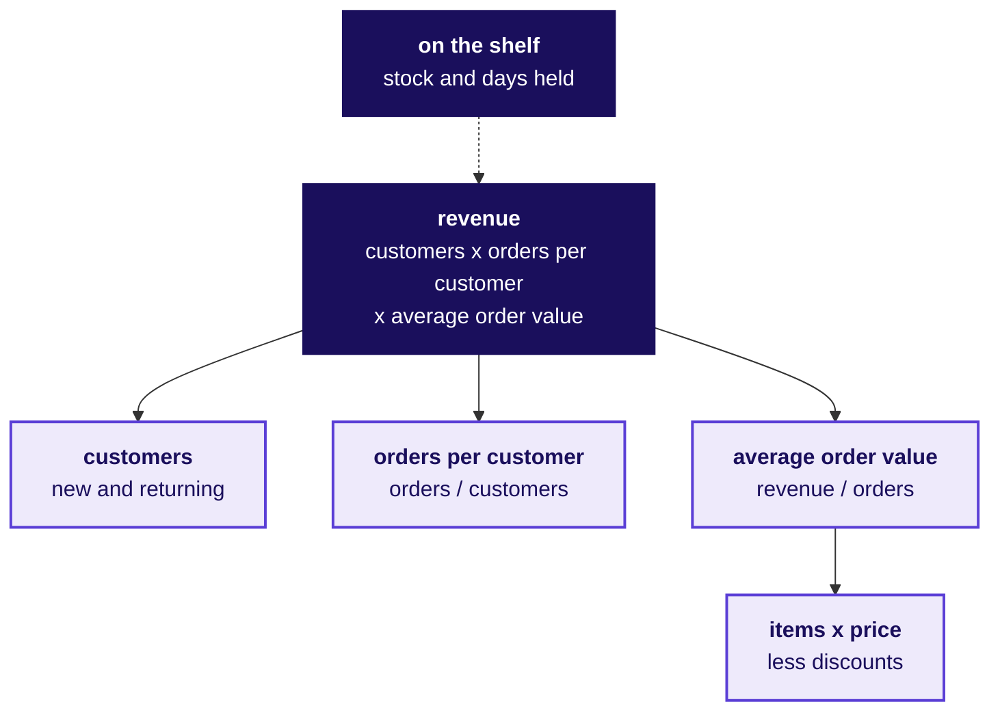

Nothing sells that is not on the shelf, so the shelf sits above revenue. When Meera's ask is read out,
marketing's Rs 12 crore is written against the customers branch, and each chapter adds one number.

---

## How far should a system act before a person checks it?

Drawing 6 goes up in the story's last part, and the dossier's section 8, on where analytics, ML, NLP
and agents pay for themselves, has the fuller ladder.

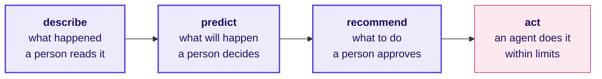

The further right a system sits, the more a wrong answer costs, because fewer people see it before it
takes effect. Meera's page on Monday is the left end of this ladder, and she decides on it.

---

## Which of the file's totals is sales, and what does each one count?

Drawing 7 goes up at the start of chapter 1, when the room names what sales could mean, and the
numbers are written in once the loop has counted them.

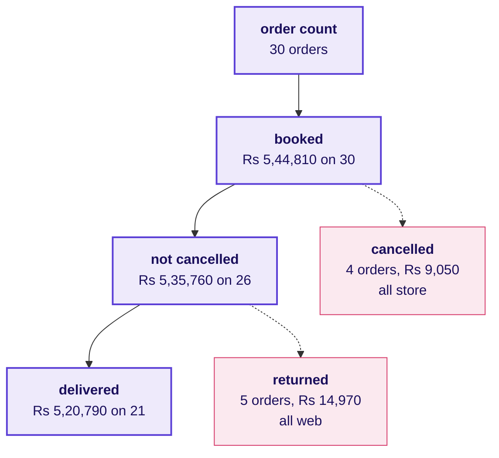

The line written under it is chapter 1's answer: the definition goes beside the number, and
delivered, returned and cancelled add back to booked. The Rs 24,020 between booked and delivered is
the part of drawing 3's gap between GMV and net revenue that this file holds.

---

## Why does booked revenue over delivered orders match nothing?

Drawing 8 goes up in chapter 2, when the mixed average order value of Rs 25,943 is on the screen.

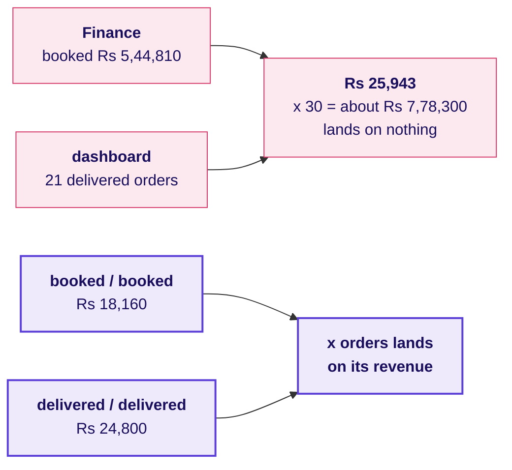

The check written under it: average order value times the orders its revenue was summed over gives
that revenue back, or the fraction mixes two reports.

---

## How many customers stand behind 30 rows?

Drawing 9 goes up in chapter 3, when a colleague's draft of 1.00 orders each is on the screen and the
room is asked who those 30 rows are.

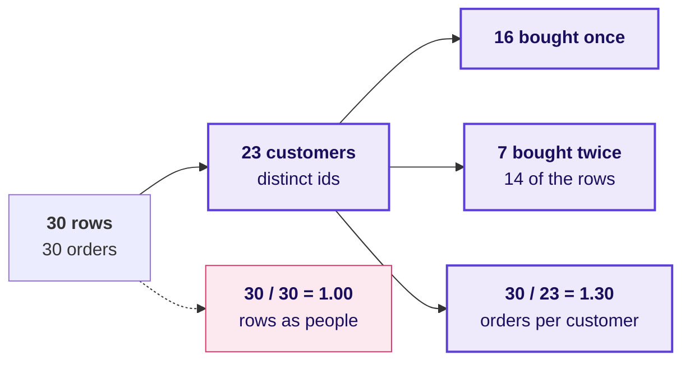

The check goes beside it in code: the length of the rows against the length of the set of customer
ids, 30 against 23.

---

## Why does one large order move the mean so much more than the median?

Drawing 10 goes up in chapter 4, after the build's median of Rs 2,205 and before each learner's own
sort. Every amount here is invented, so the mechanism shows on numbers nobody has to trust.

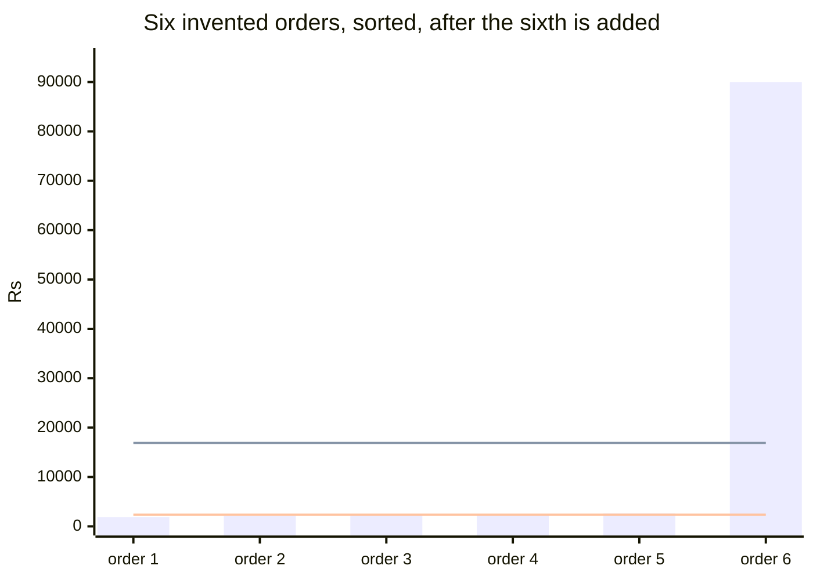

Five invented orders of Rs 1,900, 2,100, 2,300, 2,400 and 2,600 go up first, with a mean of Rs 2,260
and a median of Rs 2,300. An invented Rs 90,000 order is then added as the sixth. The upper line is the
new mean, Rs 16,883, and the lower line the new median, Rs 2,350, the average of the two middle
amounts. The mean jumped by more than Rs 14,000 while the median moved Rs 50, and five of the six bars
sit far below the mean line, which is the picture the room then looks for in its own sort of the 30
real amounts, where only 1 of the 30 sits above the mean of Rs 18,160.

---

## What do two 10 percent lifts make on the consumer segments' Rs 64,810?

Drawing 11 goes up in chapter 5, when marketing's 20 percent is on the screen. The consumer view keeps
the orders whose segment is Retail-Core, Retail-Plus or Student, the three segments Meera's growth
plan concerns, and they booked Rs 64,810, so the 15 percent plan is about Rs 9,722 more.

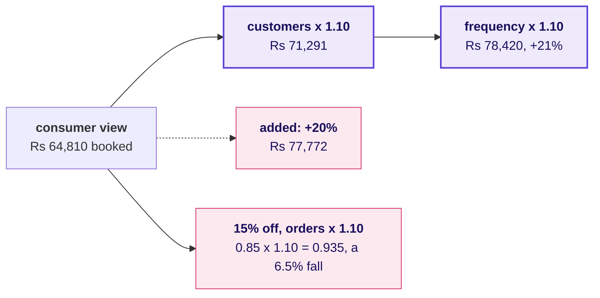

The line written under it: lifts multiply along the tree, so two 10 percent lifts make 21 percent, and
a discount can lift orders while revenue falls.

---

## How many of the 16 one-time buyers are too recent to judge?

Drawing 12 goes up in chapter 6, when "70 percent of customers are lost" is on the screen and the room
is asked how long customers usually take to come back.

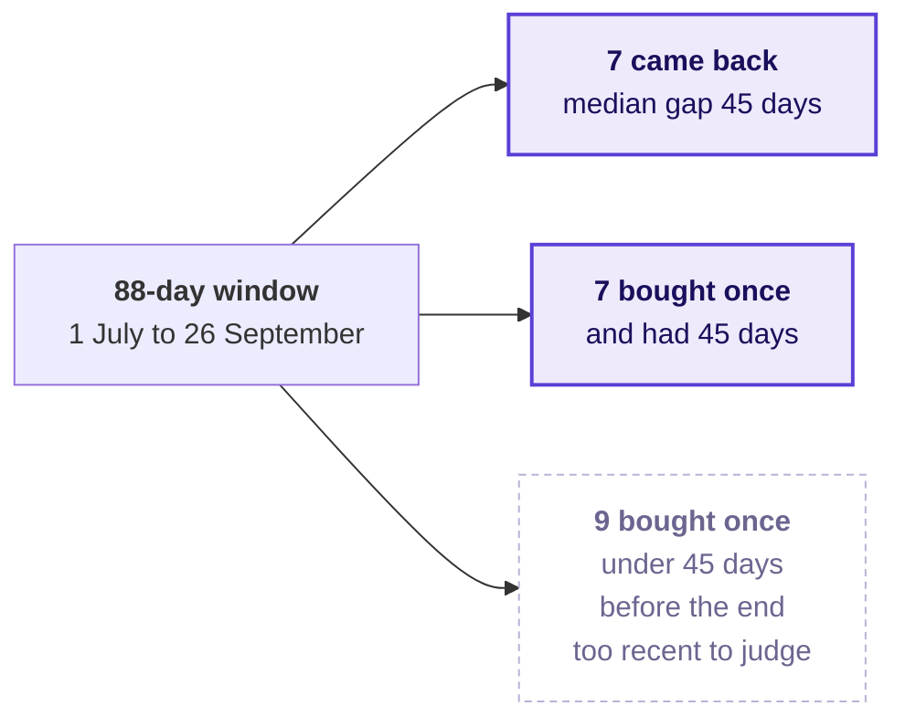

The line written under it: a one-time buyer is not a lost customer until they have had time to come
back.

---

## Where does store's 91.6 percent come from, and what does each channel keep?

Drawing 13 goes up in the second case, when a pair reports that store brings 91.6 percent of booked
revenue and the room is asked whose revenue that share is.

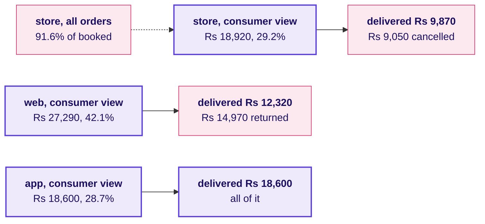

The consumer view keeps the three consumer segments Meera's plan concerns, Rs 64,810 booked. Once the
view keeps them, store's share falls from 91.6 to 29.2 percent, so store's headline share came from
outside those segments. The two leaks, web returns and store cancellations, go beside the tree as
findings for the note to Meera, and the branch stays where the tree put it.

---

## What is on the board when the day ends?

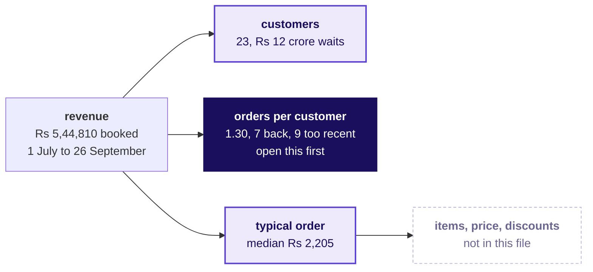

1. The metric tree carries the day's numbers, 23 customers, 1.30 orders each and a typical order of
   Rs 2,205, with frequency marked as the branch to open first, and the Rs 100 journey stays beside it.
2. Marketing's Rs 12 crore stays written against the customers branch, marked as waiting for
   Tuesday's two quarters.
3. The four readings of sales and the one-definition fraction sit in one corner.
4. The window's edge, 7 back, 7 past the usual gap and 9 too recent, sits under the frequency branch.
5. The two leaks from the channel split, web returns and store cancellations, sit beside the tree.
6. The six lines to carry run down the side, and the sentence that went to Meera sits under the tree:
   "On the 30 booked orders from 1 July to 26 September, 23 customers placed 1.30 orders each at a
   typical order of Rs 2,205; 7 came back, 7 are past the usual gap without a second order, and 9
   bought too recently to judge, so I would open frequency before acquisition, and since one quarter
   cannot show which branch moved, hold the Rs 12 crore until Tuesday's two quarters."
