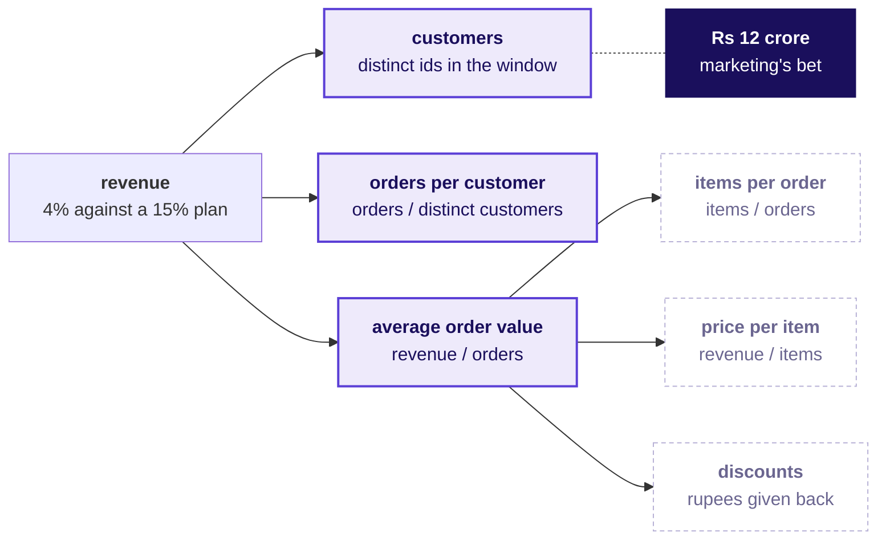
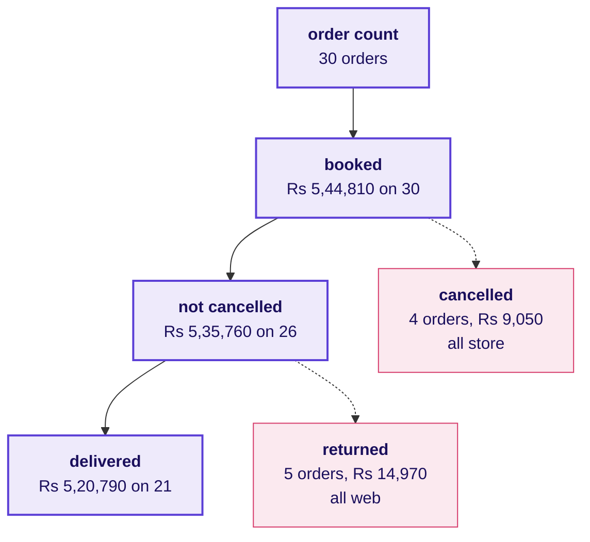
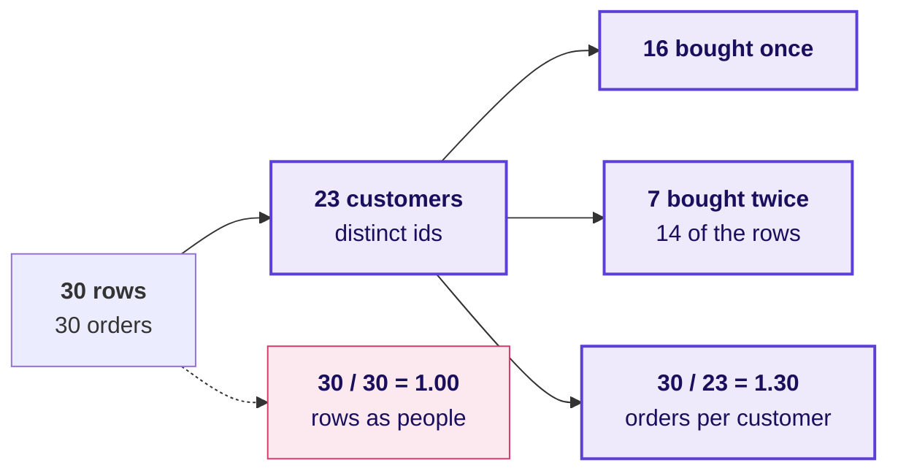
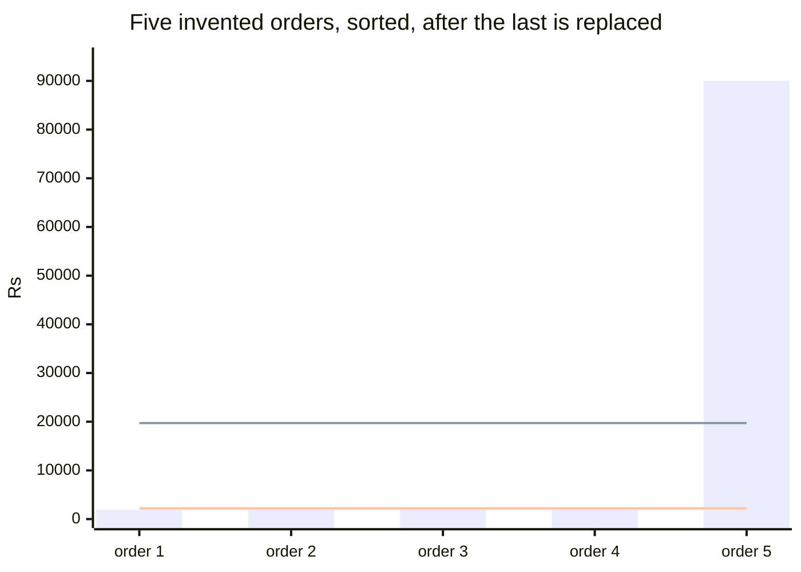
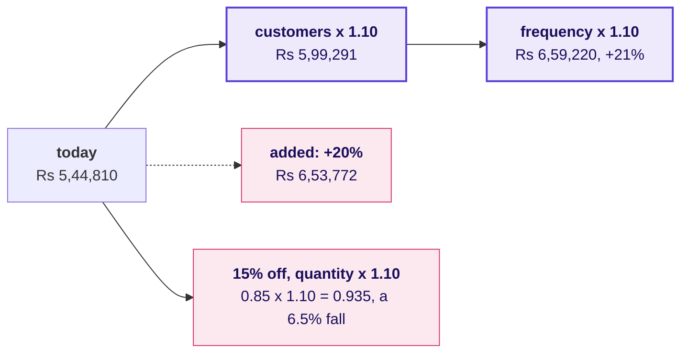
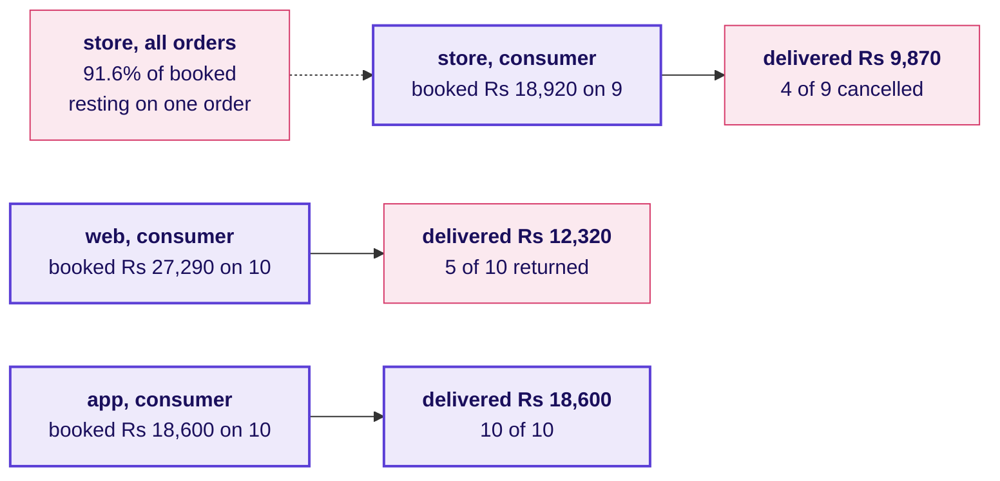
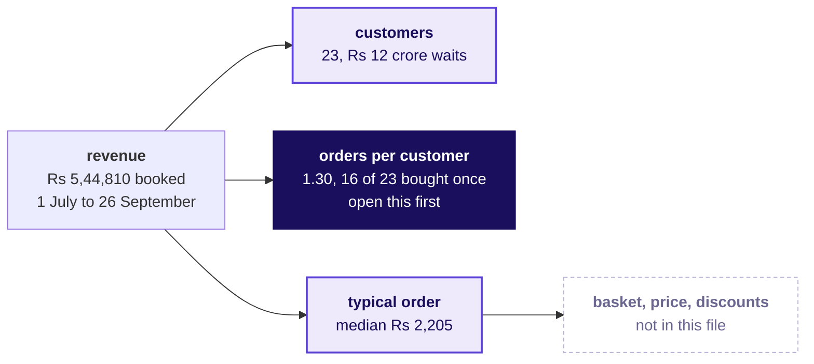

# The board, drawing by drawing

Week 1, Monday, Kalpa Retail. These are the drawings in the order they go up across the day. The deck, the notebooks and the cheat sheet carry the same revenue tree, so the tree copied from the board here is the one met everywhere else this week.

---

## Drawing 1: the revenue tree, with marketing's bet placed

It goes up in the first 20 minutes, straight after Meera's ask is read out and before any notebook opens.

Each branch is written as a numerator over a denominator, and the bill for moving it goes beside it: customers cost marketing, frequency costs retention, basket costs merchandising, price risks volume, and discounts trade margin for quantity. The dashed branches need fields today's file does not carry.

---

## Drawing 2: the four readings of "sales", as a funnel

It goes up at the start of round 1, when the room names what "sales" could mean, and the numbers are written in once the loop has counted them.

The rule written under it is round 1's crux: the definition goes beside the number, and delivered, returned and cancelled add back to booked.

---

## Drawing 3: rows against customers

It goes up in round 2, when the trap's 1.00 is on the screen and the room is asked who those 30 rows are.

The check goes beside it in code: the length of the rows against the length of the set of customer ids.

---

## Drawing 4: sorted amounts, with the mean and the median drawn on invented values

It goes up in round 3, after the room has seen the mean and the median of the real file and before anyone sorts it. The five amounts are invented, so the mechanism shows on numbers nobody has to trust.

The upper line is the mean, Rs 19,720, and the lower line is the median, Rs 2,200. Before the last amount was replaced, the five orders ran from Rs 1,900 to Rs 2,600 with a mean of Rs 2,240 and the same median. Four of the five bars sit far below the mean line, which is the picture the room then looks for in its own sort of the 30 real amounts.

---

## Drawing 5: the lifts multiplying

It goes up in the afternoon debrief, after the escalated case, when the room's "20 percent" answers are read out.

The line written under it: lifts multiply along the tree, so two 10 percent lifts make 21 percent, and a discount can lift quantity while revenue falls.

---

## Drawing 6: the channel split, booked against delivered

It goes up in the second case, when a pair reports that store brings 91.6 percent of booked revenue and the room is asked how many orders stand behind that share.

Consumer orders are the 29 outside the Business segment, Rs 64,810 booked. The two leaks, web returns and store cancellations, are written beside the tree as findings for the note to Meera, and the branch recommendation stays where the tree put it.

---

## What is on the board when the day ends

1. The revenue tree carries the day's numbers: 23 customers, 1.30 orders each, and a typical order of Rs 2,205, with the branch to open first marked.
2. Marketing's Rs 12 crore stays written against the customers branch, marked as waiting for Tuesday's two quarters.
3. The funnel of the four readings stays in one corner with the definition rule under it.
4. The two leaks from the channel split, web returns and store cancellations, sit beside the tree.
5. The five crux lines run down the side, and the sentence that went to Meera sits under the tree: "On the 30 orders from 1 July to 26 September, 23 customers placed 1.30 orders each at a typical order of Rs 2,205, and 16 of them bought only once, so I would open frequency before acquisition; this one window cannot show which branch moved, so hold the Rs 12 crore until Tuesday's two quarters."
