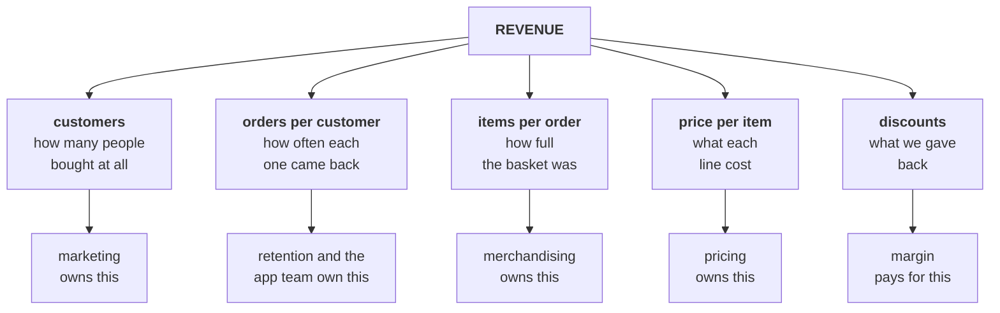
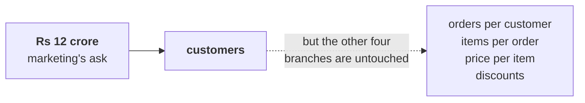
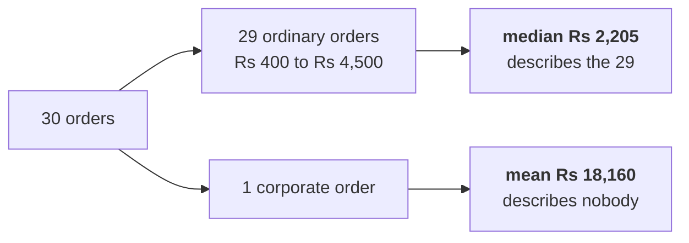

# The revenue tree

The one drawing for Day 1. The deck uses it, the notebook renders it from code, the cheat sheet
prints it, and every day this week comes back to it.

---

## What goes on the board, in the order it goes up

**Step 1. Write the word, then refuse it.**

Write `SALES` in the middle of the board and put a box around it. Underneath, write the question
that has to be answered before the word means anything: **divided how?**

**Step 2. Break it once.**

Revenue is what customers pay. So the first split is: how many of them, and how much each.

```
REVENUE  =  CUSTOMERS  ×  REVENUE PER CUSTOMER
```

**Step 3. Break the right-hand side until every piece is something a team owns.**

```
REVENUE = CUSTOMERS × ORDERS PER CUSTOMER × ITEMS PER ORDER × PRICE PER ITEM − DISCOUNTS
```

That is the tree. It fits on one line and it is the whole first hour.

---

## The tree as a picture



Draw the top row first and stop. Add the owners only once somebody in the room asks who would
have to do something about a branch.

---

## Every branch is a metric, and every metric has a denominator

Write this table on the right-hand third of the board and fill it as the room answers.

| Branch | The metric | Numerator | Denominator | What it costs to move |
|---|---|---|---|---|
| Customers | Distinct buyers in the window | Customers who placed at least one order | The window itself, which is why the window has to match | Marketing spend, and it is the slowest branch |
| Orders per customer | Purchase frequency | Orders | Distinct customers, in the same window | Retention work, a reorder feature, a membership tier |
| Items per order | Basket size | Items | Orders | Merchandising, bundles, recommendations |
| Price per item | Realised price | Revenue | Items | Pricing, and it risks volume |
| Discounts | Discount rate | Discount given | Gross revenue before discount | Margin, directly |

**The sentence to get out of the room:** a rate with no denominator is a rumour.

---

## Where the Rs 12 crore goes

Marketing's ask is a bet on exactly one branch.



Nothing on this board says marketing is wrong. It says marketing has picked a branch, and that
somebody should check whether it is the branch that moved before Rs 12 crore follows it.

---

## The second drawing: what an average hides

Put this up only after the numbers are on the screen.



The reveal is arithmetic, so let the room do it: take the biggest order out and recompute the mean.
It lands at Rs 2,235, next door to the median. That is the whole lesson, and it is why the finance
controller opened with "no averages".

---

## What has to be on the board when the day ends

1. The tree, five branches, each named as a metric with its denominator.
2. Marketing's Rs 12 crore sitting on one branch, with the other four visibly untouched.
3. The four leaves with today's numbers written beside them.
4. The mean and the median, side by side, with the gap circled.

A learner who can redraw those four things from memory has the day.
