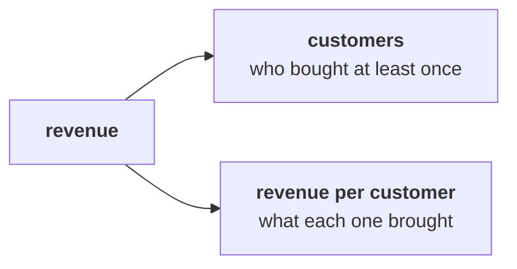
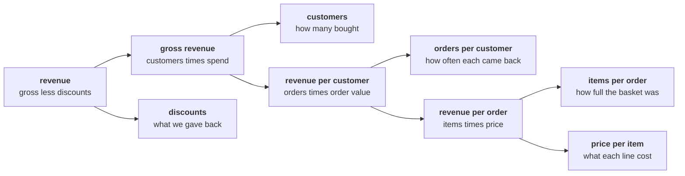
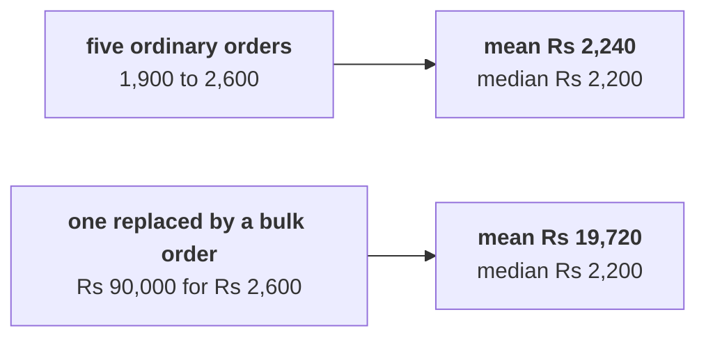

# The revenue tree, as it goes up on the board

The board work for Week 1, Monday, in the order it is drawn. The deck, the notebooks, the companion
page and the cheat sheet all carry the same tree, so the drawing a learner copies here is the one
they meet everywhere else this week.

---

## First drawing: the word, and the question under it

`SALES` goes in the middle of the board with a box around it, and under it the question that has to
be answered before the word means anything: **which orders, over which dates?**

Four readings go up beside it as the room names them: booked, not cancelled, delivered, and after
discounts. Each is a correct total of the same orders; each answers a different question.

---

## Second drawing: revenue broken once, then all the way down

Broken once, revenue is how many customers bought, times what each one brought.

```mermaid
flowchart LR
    R["<b>revenue</b>"] --> C["<b>customers</b><br/>who bought at least once"]
    R --> V["<b>revenue per customer</b><br/>what each one brought"]
```

Broken until every leaf is a count or a price that someone in the business can move:

```mermaid
flowchart LR
    R["<b>revenue</b><br/>gross less discounts"] --> G["<b>gross revenue</b><br/>customers times spend"]
    R --> D["<b>discounts</b><br/>what we gave back"]
    G --> C["<b>customers</b><br/>how many bought"]
    G --> V["<b>revenue per customer</b><br/>orders times order value"]
    V --> F["<b>orders per customer</b><br/>how often each came back"]
    V --> O["<b>revenue per order</b><br/>items times price"]
    O --> B["<b>items per order</b><br/>how full the basket was"]
    O --> P["<b>price per item</b><br/>what each line cost"]
```

The units check goes beside it: customers times orders per customer gives orders; times items per
order gives items; times price per item gives rupees.

---

## Third drawing: every leaf as a metric, with its bill

| Leaf | Numerator over denominator | What moving it costs |
|---|---|---|
| Customers | Distinct customer ids, a count | Marketing spend; new buyers may never return |
| Orders per customer | Orders over distinct customers | Loyalty and service; it may pay people who would return anyway |
| Items per order | Items over orders | Merchandising; baskets fill with low-margin lines |
| Price per item | Revenue before discounts over items | Volume, as the price-sensitive leave |
| Discounts | Rupees given back over revenue before discounts | Margin, traded for quantity |

Marketing's Rs 12 crore is then written against one leaf, customers, with the question beside it:
of the gap between 4 and 15 percent, how much came from fewer customers and how much from each
customer buying less?

---

## Fourth drawing: what a mean does with one bulk order

Drawn after the day's mean and median are on the screen, on five invented orders, so the mechanism
is visible on numbers nobody has to trust.

```mermaid
flowchart LR
    A["<b>five ordinary orders</b><br/>1,900 to 2,600"] --> M1["<b>mean Rs 2,240</b><br/>median Rs 2,200"]
    B["<b>one replaced by a bulk order</b><br/>Rs 90,000 for Rs 2,600"] --> M2["<b>mean Rs 19,720</b><br/>median Rs 2,200"]
```

One value moved by d moves the mean by d over n, here 87,400 over 5, and leaves the median where it
was.

---

## What is on the board when the day ends

1. The tree, five leaves, each written as a numerator over a denominator.
2. Marketing's Rs 12 crore written against one leaf, with the other four visibly untouched.
3. Today's numbers beside the leaves the file can answer: 23 customers and 1.30 orders each.
4. The mean and the median side by side, with the gap circled and the sentence that goes to Meera
   under it.
