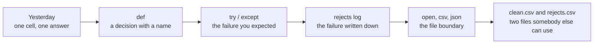
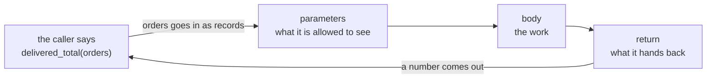
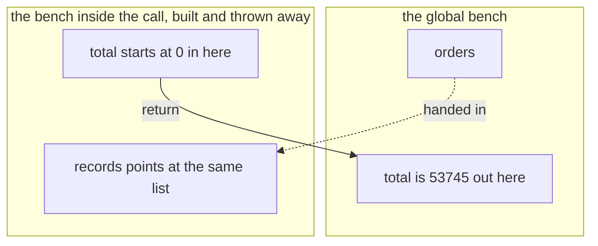
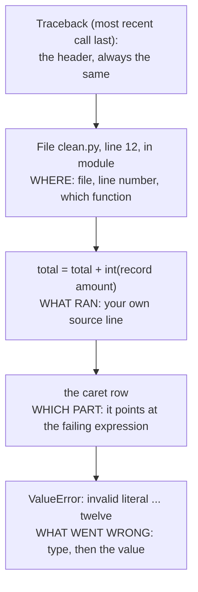
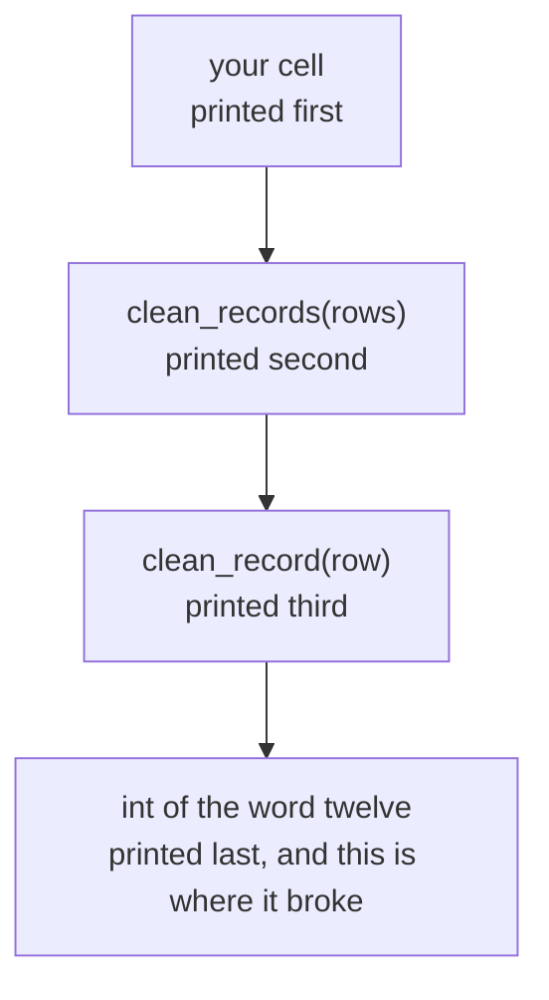
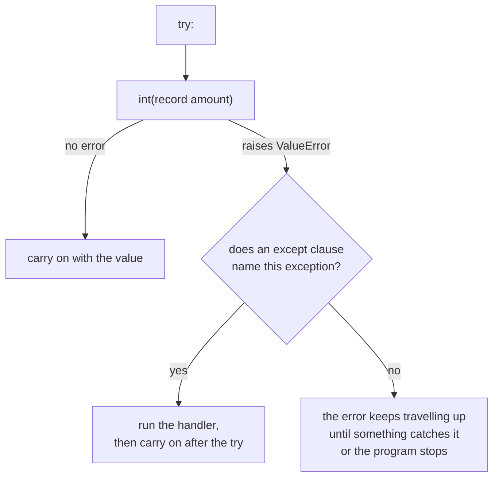
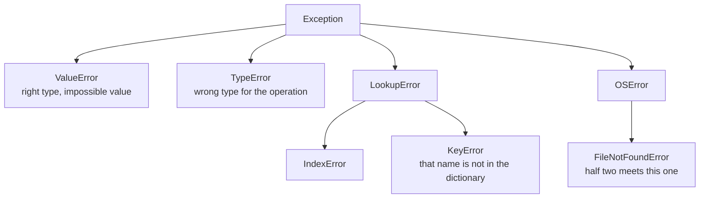
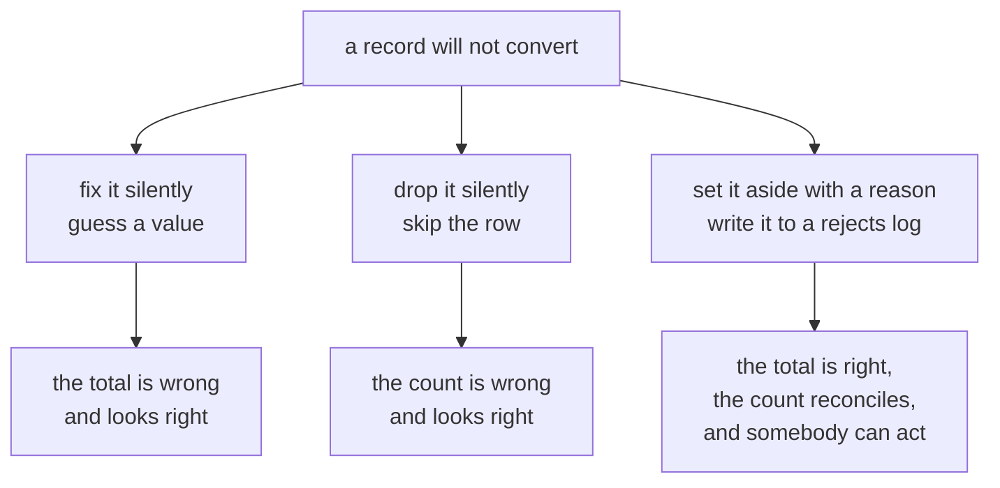
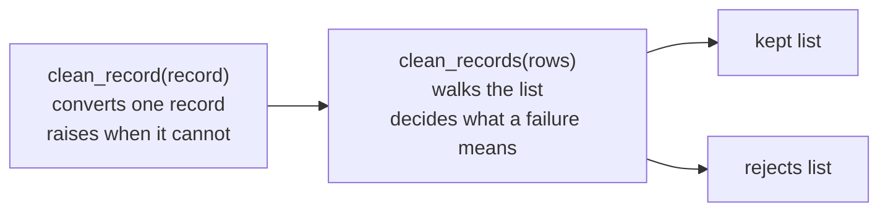
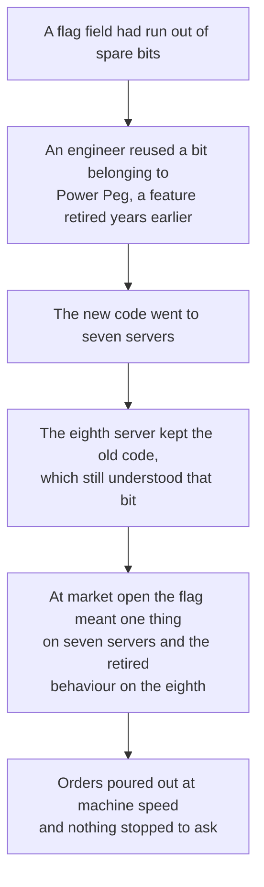

# Half one: package the logic, survive bad data

Week 1, Day 2. Slide source. One idea per slide.

Slides numbered S are the spine and are delivered in order. Slides numbered D go deeper and carry a DEPTH mark. A trainer skips them live when time is short, and you read them afterwards.

Position bar, repeated at every section boundary:
`[inline cell] > [packaged decision] > [read the failure] > [log the rejection] > [cross the boundary]`

---

## S1. Package the logic, survive bad data

The three questions this half answers: what do I call again tomorrow, what do I do when a value is wrong, and who finds out.

---

## S2. Where we are

`[inline cell] > [packaged decision] > [read the failure] > [log the rejection] > [cross the boundary]`

Every order in this file is a Kalpa Retail order, and it will still be Kalpa Retail in Week 15.

Yesterday you answered a question about the orders. Today that answer becomes something you can run again on records you have not seen.

---

## S2b. Where this is going

`clean_record`, on three records from today's file:

```
rejected KR4210 because: invalid literal for int() with base 10: 'twelve'
rejected KR4214 because: invalid literal for int() with base 10: ''
kept     KR4200 4500
```

One function. Three records. Three outcomes, and the rejected ones say why.

You will have written this within the hour.

---

## S2c. The whole day in one picture

Today has five stops and you will pass through all of them before the close.



Half one is the first four boxes. Half two is the last two.

---

## S3. The anchor

You have written this cell three times already.

```
total = 0
for r in records:
    if r["status"] == "delivered":
        total = total + int(r["amount"])
```

Three copies. One of them has a typo. Which one?

---

## S4. The problem with three copies

A rule that lives in three cells is three rules.

When the rule changes, you have to remember where all three are. The one you forget is the one that ships.

---

## D2. What three copies costs, counted

Suppose the rule changes four times over a project, and each change has to be applied by hand in three places.

$$\text{edits} = \text{changes} \times \text{copies} = 4 \times 3 = 12$$

$$\text{chances to forget one} = \text{changes} \times (\text{copies} - 1) = 4 \times 2 = 8$$

With the rule in one function, the same four changes are four edits and there is nothing to forget. The arithmetic is small and it is the whole argument for the next twenty slides.

---

## SECTION 1: THE PACKAGED DECISION

`[inline cell] > **[packaged decision]** > [read the failure] > [log the rejection] > [cross the boundary]`

---

## S5. Same rule, one place

```
def delivered_total(records):
    total = 0
    for r in records:
        if r["status"] == "delivered":
            total = total + int(r["amount"])
    return total
```

The rule now has a name and one home.

---

## S5b. The anatomy of a function

Four parts, and each one has a job you can name.



The parameter is the only door in. The return is the only door out. Everything else is inside and is nobody else's business.

---

## S6. What the name buys you

You can say the name out loud to a colleague.

You can change the rule in one place.

You can run it on a file that arrives next week.

---

## S7. The parameter is the promise

`def delivered_total(records)` says: give me records, I give you a number.

The function cannot see anything you did not hand it. That is the whole of scope for today.

---

## D4. Scope, drawn once

The bench you worked on yesterday is the global bench. A call builds a small second bench, uses it, and throws it away.



Two names spelled `total` can hold two different numbers at the same time. The one inside the call disappears when the call ends, and the one outside never noticed.

---

## D5. Prove it to yourself in four lines

```
total = 99

def delivered_total(records):
    total = 0
    return total

print(delivered_total([]), total)
```

```
0 99
```

The function set `total` to zero and the outer `total` is still 99. If you expected `0 0`, that expectation is the single most common source of confusion in this room, and now you have watched it not happen.

---

## S8. Live demo

Carve `delivered_total` out of the inline cell together.

Then break it: rename the variable outside the function and watch the function keep working.

---

## S9. return against print

```
def fix(record):
    print(record["order_id"])

result = fix(rec)
```

What is inside `result` now?

---

## S10. The break

```
TypeError: 'NoneType' object is not subscriptable
```

`print` shows a human. `return` hands a value back to the code. A function that only prints returns `None`, and `None` cannot be indexed.

---

## D6. The same function, both ways, side by side

```
def with_print(record):
    print(int(record["amount"]))

def with_return(record):
    return int(record["amount"])

a = with_print(orders[0])
b = with_return(orders[0])
print("a is", a, "and b is", b)
```

```
4500
a is None and b is 4500
```

Both put `4500` in front of you. Only one of them put it anywhere your next line can reach.

---

## S11. The rule

Print is for you. Return is for the next line of code.

If the caller needs the answer, the function returns it.

---

## D7. The compact loop, once, as notation

A list comprehension is the same loop written on one line. It is notation, not a new idea.

```
amounts = []
for r in orders:
    amounts.append(r["amount"])

amounts = [r["amount"] for r in orders]
```

Both build the same list. Read the second one right to left: for every `r` in `orders`, take `r["amount"]`.

You will meet it in other people's code today. You are not required to write one.

---

## S12. Step card, section 1

1. Name the rule with `def`.
2. Take what you need as parameters.
3. Hand the answer back with `return`.
4. Use `print` only to show a human.

---

## SECTION 2: READ THE FAILURE

`[inline cell] > [packaged decision] > **[read the failure]** > [log the rejection] > [cross the boundary]`

---

## S13. Yesterday you saw three of these

A traceback is not the computer being angry. It is the computer telling you where it stopped and what it was holding.

---

## S14. Read it bottom-up

```
Traceback (most recent call last):
  File "clean.py", line 12, in <module>
    total = total + int(record["amount"])
                    ^^^^^^^^^^^^^^^^^^^^
ValueError: invalid literal for int() with base 10: 'twelve'
```

Last line: what went wrong. Line above it: where. Everything else: how you got there.

---

## D8. Every part of a traceback, labelled



Read it from the bottom. The value at the end is the part people skip, and it is the part that names the record.

---

## S15. The three questions

1. What is the exception type?
2. Which line is mine?
3. What value was it holding?

The third question is the one people skip.

---

## D9. Why the stack reads bottom-up

When one function calls another, each call is pushed onto a stack. The traceback prints the stack from the outside in, so the last frame printed is the innermost call, which is where the failure actually happened.



In a long traceback, the deepest frame is almost always library code you did not write. Scan upward until you reach the first line that lives in your own file, and start there.

---

## S16. Catching it

```
try:
    value = int(record["amount"])
except ValueError:
    ...
```

You name the exception you expected. Anything else still stops the program, which is what you want.

---

## S16b. What try and except actually do to the flow



An exception you did not name is not ignored. It carries on upward, which is exactly the behaviour you want for a failure you did not anticipate.

---

## D11. The exception family, and why the name you choose matters



Catching `Exception` catches every branch of this tree, including the ones you never thought about. Catching `ValueError` catches the branch you reasoned about and lets the rest travel.

---

## D12. Two defensive stances, and when each wins

| Stance | What it looks like | When it wins |
|---|---|---|
| Look before you leap | You test the value first with something like a digit check before converting it. | The check is cheap and total, and there is one clear condition to test. |
| Ask forgiveness, not permission | You attempt the conversion inside a `try` and catch the failure it raises. | The check would have to duplicate the conversion's own rules, which is exactly the case for `int()`. |

Python leans on the second stance, and `int()` is the reason why. Writing a test that predicts every string `int()` accepts means rewriting `int()`, including the leading sign, the surrounding whitespace and the underscores it allows.

---

## S17. The trap

```
try:
    value = int(record["amount"])
except:
    pass
```

This runs. It produces a number. The number is wrong and nothing on screen says so.

---

## S18. Watch it happen

Bare except, on today's 30 records:

```
Processed 30 records. Total: 53745
```

Narrow except, same 30 records:

```
Clean 28, rejected 2, total 53745
```

Same number. One of these two lines is a lie.

---

## S19. Which one lied

The first line claims 30 records went into that total. Two of them did not.

A crash costs you an hour. A plausible wrong number costs you the quarter, because nobody goes looking for it.

---

## D13. The size of the lie, as a formula

Write $n$ for the records that arrived, $r$ for the records that failed to convert, and $\bar{x}$ for the average of the ones that did.

The honest total comes from the ones that converted. The gap between that and the total somebody assumes covers all $n$ records is

$$\text{understatement} \approx r \times \bar{x}$$

Today $r = 2$ and $\bar{x} = 53745 / 28 \approx 1920$, so the silent gap is about Rs 3,840 on a reported Rs 53,745, which is roughly 7 percent.

Nothing on the screen carries that 7 percent. The only way it reaches anybody is if you write $r$ down.

---

## S20. Step card, section 2

1. Read the traceback from the bottom.
2. Name the exception you expected.
3. Never catch everything.
4. If the count and the claim disagree, the claim is wrong.

---

## SECTION 3: LOG THE REJECTION

`[inline cell] > [packaged decision] > [read the failure] > **[log the rejection]** > [cross the boundary]`

---

## S21. Where does the bad record go

You have three choices when a record will not convert.

Fix it silently. Drop it silently. Set it aside with a reason.

Only the third one survives a question from your manager.

---

## S21b. The three choices, and what each one costs later



The first two are faster today and cost you the conversation you cannot win in three weeks. The third is the job.

---

## S22. The rejects list

```
def clean_record(record):
    keeper = dict(record)
    keeper["amount"] = normalise_amount(record["amount"])
    return keeper
```

`clean_record` handles one record and decides nothing about failure. `clean_records` handles the list and owns that decision.

```
except ValueError as e:
    rejects.append({"order_id": record["order_id"], "reason": str(e)})
```

`str(e)` carries the exact reason the interpreter gave you. You do not have to invent wording.

---

## D15. Who decides what, and why the split matters



One function knows how to convert and nothing about policy. The other knows the policy and nothing about conversion. That split is why the same `clean_record` is called unchanged tomorrow on a dataset four times the size.

---

## S23. What a good reason looks like

```
{"id": "KR4210", "reason": "invalid literal for int() with base 10: 'twelve'"}
{"id": "KR4214", "reason": "invalid literal for int() with base 10: ''"}
```

Someone who was not in the room can act on both of these.

---

## D16. The fields a reject row needs, and why

| Field | Why it is there |
|---|---|
| The identifier | Without it nobody can find the record in the source system, so the row is a complaint rather than a task. |
| The reason, verbatim from the interpreter | It distinguishes a word where a number belongs from an empty cell, and those two go to different people. |
| The field that failed | A record can fail on the amount or on the date, and a fixer needs to know which without opening the file. |
| The raw value | The person who fixes it upstream needs to see exactly what arrived, including the spaces you cannot see. |

Today you ship the first two, which is the minimum that works. Tomorrow's profiler adds the rest.

---

## S24. The reconciliation

30 records in. 28 clean. 2 rejected.

Input equals clean plus rejected. When that sum does not hold, something disappeared and you do not yet know what.

---

## D17. The reconciliation, as an identity you check every time

$$n_{\text{in}} = n_{\text{clean}} + n_{\text{rejected}}$$

Today that reads $30 = 28 + 2$, and it holds.

The identity is worth writing as an assertion in your own code, because the day it fails is the day you learn something you did not know about the data:

```
assert len(rows) == len(kept) + len(rejects), "records went missing"
```

A total with no reconciliation beside it is a number somebody has to take on trust. A total with one is a number they can check in two seconds.

---

## S25. From the field

Knight Capital, 1 August 2012. About USD 440 million lost in 45 minutes.

A deployment reused an old flag. The system did not fail loudly. It kept trading, at speed, on the wrong rule.

The argument for validating early and failing loudly is not a style preference. It is that number.

---

## D18. Knight Capital, the mechanism



The dead code was never deleted, only stopped being called. Reusing its flag called it again.

---

## D19. Knight Capital, what it cost

| Fact | Figure |
|---|---|
| Date | 1 August 2012 |
| Time to the loss | About 45 minutes |
| Executions | More than 4 million, in 154 stocks |
| Shares | More than 397 million |
| Realised pre-tax loss | About USD 440 million |
| What followed | The firm raised about USD 400 million within days to survive, and was acquired within months |

Source: Knight Capital Group, Wikipedia: https://en.wikipedia.org/wiki/Knight_Capital_Group (verified 09 September 2026)

---

## D20. The line from that to your cell today

Knight had no shortage of engineers. It had a deployment that half succeeded and nothing that said so.

Your `clean_records` half succeeds every time you run it, because two records will not convert. The difference between you and that morning is one list and one printed count.

The habit is small and it is the same habit at every scale. When part of the work fails, make the failure a value the program carries, rather than a thing that happens and is gone.

---

## D21. Where a rejects log lives in production

A data pipeline at any size writes the same two outputs you are about to write. The rejects side gets a name and a rule attached to it.

| In production it is called | What it holds | The rule attached |
|---|---|---|
| A dead letter queue | Messages the consumer could not process | Retry a fixed number of times, then park it for a human |
| A quarantine table | Rows that failed validation on load | Nothing downstream reads it, and someone owns clearing it |
| A rejects file beside the clean file | Exactly what you are writing today | The load is not finished until the counts reconcile |

The names change with the tool. The identity in D17 does not.

---

## S26. Interview question

"Why is a bare `except` worse than letting the code crash?"

You can answer this now, with today's two output lines as your evidence.

---

## S27. Step card, section 3

1. Set the bad record aside, never drop it.
2. Carry the interpreter's own reason.
3. Reconcile: input equals clean plus rejected.
4. Ship the rejects list as part of the job.

---

## SECTION 4: THE INTERVIEW BLOCK

`[inline cell] > [packaged decision] > [read the failure] > [log the rejection] > [cross the boundary]`

---

## S28. What this section is

Two of the questions below are on this week's own question set and will be on Saturday's paper. The rest are asked often enough at this level that this programme puts them in front of you now.

Each one gets the same treatment: what the question is really testing, the answer, and the follow-up you should expect.

---

## S29. Question 1: how do you read a Python traceback

This is on the week's question set.

**What it is really testing.** Whether you have debugged anything yourself, or only watched someone else do it.

**The answer, in three beats.** I read it bottom-up. The last line gives me the exception type and the offending value. The line above tells me the file and the line number, and I scan up to the first frame in my own code, because the deepest frame is usually library code. Then I ask what value it was holding, because that names the record.

**The follow-up.** "What if the traceback is fifty lines?" Then the top and the bottom are the only parts that matter at first. The bottom says what broke, and I scan down from the top for the first file path that is mine.

---

## D22. Question 1, the deeper version

An interviewer who wants to separate you from the room asks what a re-raised exception means, or why a traceback sometimes shows two failures joined by the line "During handling of the above exception, another exception occurred".

The honest answer at your stage: that second form means an error happened inside an except block, and Python shows both so the original cause is not lost. Say that, and say you have not used chained exceptions in anger yet. Naming the edge of what you know is worth more than guessing at it.

---

## S30. Question 2: why is a bare except worse than letting the code crash

This is on the week's question set.

**What it is really testing.** Whether you can argue about failure modes rather than recite a style rule.

**The answer, in three beats.** A crash is loud and it stops the wrong number from travelling. A bare `except` catches everything, including errors I never reasoned about, and it usually leaves the program producing a plausible number nobody questions. In today's file a bare except reports thirty records processed when only twenty-eight converted, and the total is understated by roughly seven percent with nothing on screen to say so.

**The follow-up.** "So never catch anything?" No. Catch the exception you expected, by name, and write down what you set aside. That is the difference between surviving a bad record and hiding it.

---

## D23. Question 2, the numbers that make it land

Bring the arithmetic, not the adjective. The claim "it hides errors" is a slogan. The claim below is evidence.

```
bare except:    Processed 30 records. Total: 53745
named except:   Clean 28, rejected 2, total 53745
```

Same total, and one of them is a lie about its own denominator. Say the two numbers, then say the identity: input equals clean plus rejected.

---

## S31. Question 3: what is the difference between return and print

Asked constantly at entry level. This programme puts it here because it is the fastest way to tell whether somebody has written a function or only read about one.

**The answer.** `print` writes to the screen for a human and hands nothing back. `return` gives a value to the line that called the function. A function that only prints hands back `None`, and the caller gets `None`, which is why `result["order_id"]` then raises `TypeError: 'NoneType' object is not subscriptable`.

**The follow-up.** "When would you print inside a function?" When it is genuinely a message for a person, such as a progress line in a long job. Never as the way the answer gets out.

---

## S32. Question 4: what does a function's parameter list guarantee

This programme's own calibration, because it is the shortest way to explain scope without using the word scope.

**The answer.** It is the only door in. The function cannot see a variable I did not hand it, and a name it assigns inside the body does not touch the name outside. That is why the same function runs unchanged on today's thirty records and tomorrow's fifty.

**The follow-up.** "What if I do want to change something outside?" Return the new value and let the caller assign it. Reaching outside a function is possible in Python and it is a decision I would want a reason for.

---

## S33. Question 5: your cleaning run reported zero rejects on a file you know is dirty

This one is on the week's question set for Saturday and it belongs to tomorrow's material, so treat it as a preview.

**The answer, in three beats.** First I check whether anything was actually caught, since a bare `except` with a `pass` reports zero rejects by construction. Second I check that the counts reconcile, because input equals clean plus rejected only tells me something when I compute all three. Third I check that the dirt I expect is the dirt the code tests for, since a row can be present, convertible and still wrong.

You will build the evidence for this answer tomorrow.

---

## S34. Crux, half one

You have `clean_record`. That was the promise on the third slide.

A function is a decision you can call again. A named exception is a failure you chose to survive. A rejects log is the difference between a number and a number you can defend.
