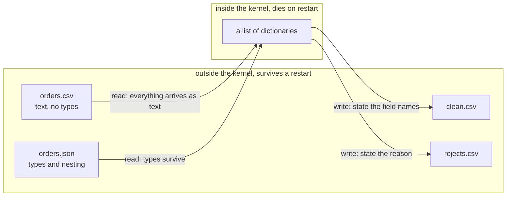
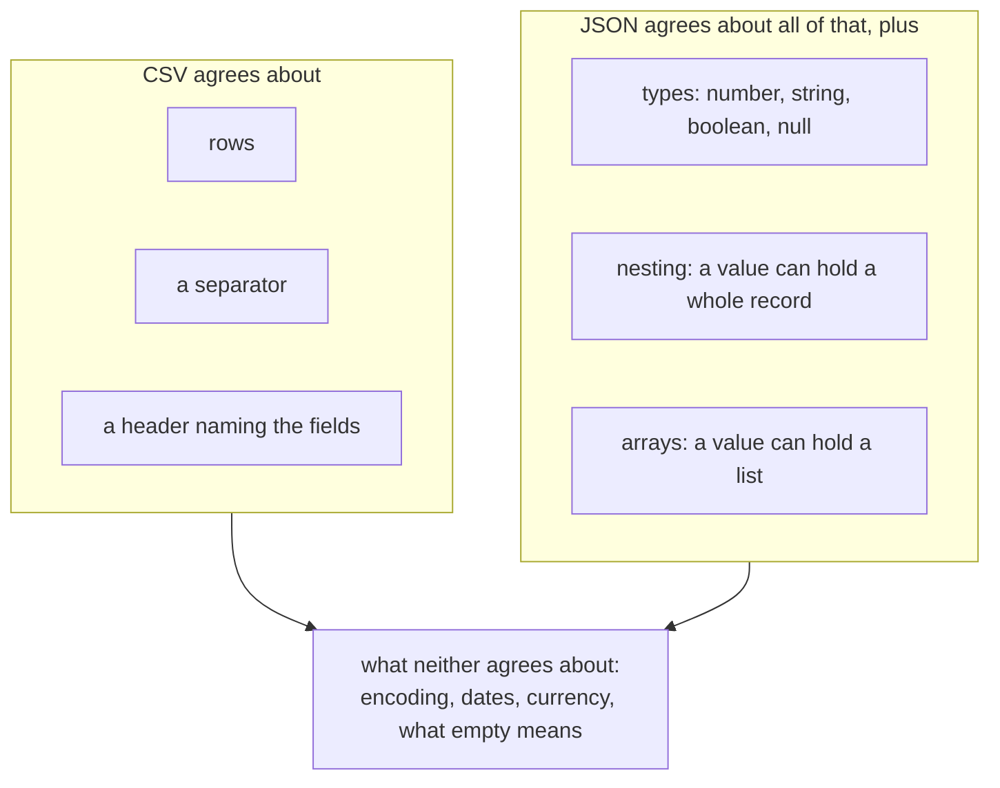
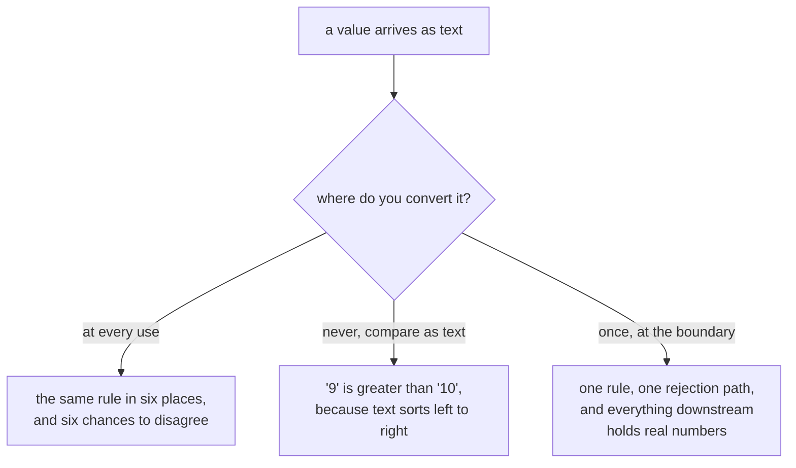
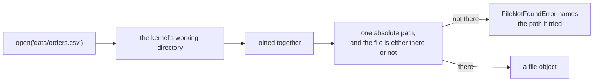
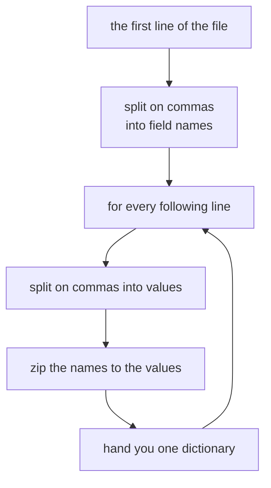
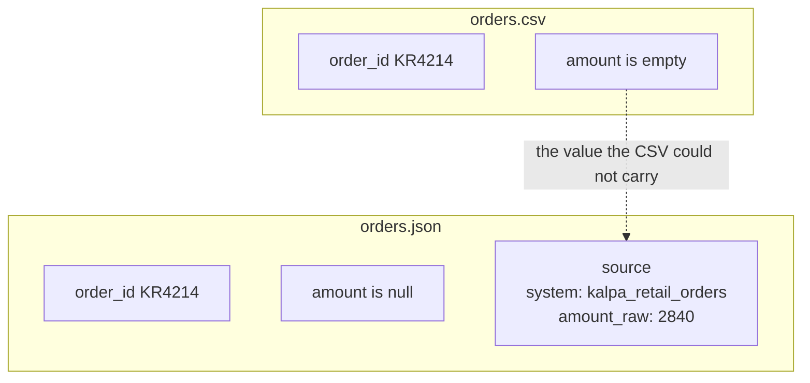
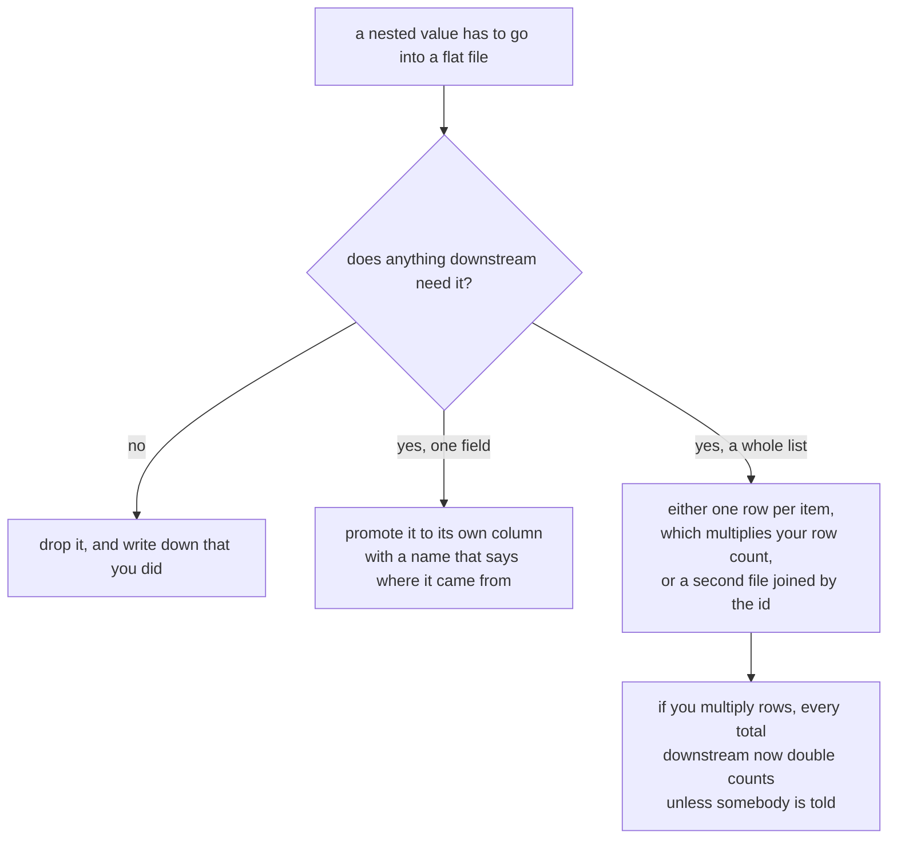
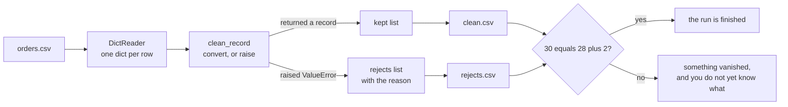
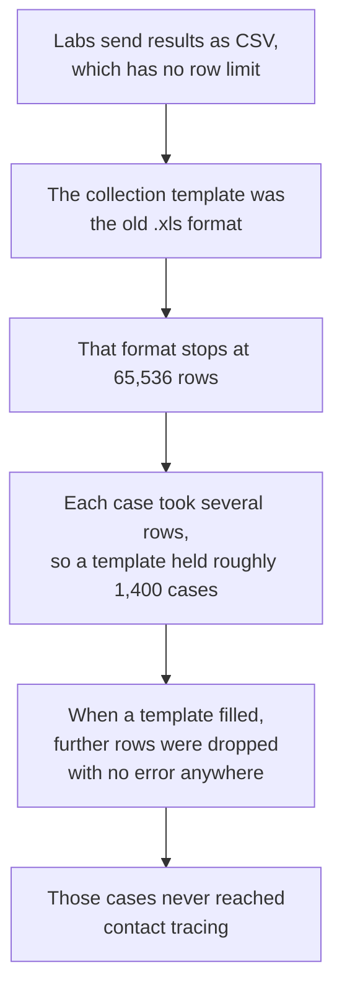

# Half two: cross the file boundary

Week 1, Day 2. Slide source. One idea per slide.

Slides numbered S are the spine and are delivered in order. Slides numbered D go deeper and carry a DEPTH mark. A trainer skips them live when time is short, and you read them afterwards.

Position bar, repeated at every section boundary:
`[inline cell] > [packaged decision] > [read the failure] > [log the rejection] > [cross the boundary]`

---

## S1. Cross the file boundary

Everything so far lived inside the notebook. Close the notebook and it is gone.

---

## S2. Where we are

`[inline cell] > [packaged decision] > [read the failure] > [log the rejection] > **[cross the boundary]**`

Half one made your rule callable. This half makes your data outlive the kernel.

---

## S3. The anchor

Restart the kernel.

Your 30 records are gone. Yesterday you learned that. Today you do something about it.

---

## S4. Where the orders actually come from

Nobody hands you a Python list. Kalpa Retail's order system sends you a file.

The file was written by a system you do not control, exported by a person you have not met, at a time you did not choose.

---

## S4b. The boundary, in one picture

Every arrow that crosses the dashed line loses something or has to be told something.



---

## SECTION 1: A FORMAT IS AN AGREEMENT

`[inline cell] > [packaged decision] > [read the failure] > [log the rejection] > **[cross the boundary]**`

---

## S5. What a file format is

A file format is an agreement about structure.

CSV agrees: one row per record, one comma between fields, the first row names the fields.

That is the entire agreement. Nothing in it mentions types.

---

## S6. The consequence

Everything you read from a CSV is a string.

```
4500      becomes   "4500"
twelve    becomes   "twelve"
(empty)   becomes   ""
```

The file cannot tell you which one is a number. It never could.

---

## S6b. What each format agrees about



The last box is where most real defects live, and no format will save you from it.

---

## D1. The round trip that loses types, watched

```
records = [{"order_id": "KR4201", "amount": 2395}]

with open("round.csv", "w", newline="") as f:
    w = csv.DictWriter(f, fieldnames=["order_id", "amount"])
    w.writeheader(); w.writerows(records)

with open("round.csv") as f:
    back = list(csv.DictReader(f))

print(records[0]["amount"], type(records[0]["amount"]).__name__)
print(back[0]["amount"], type(back[0]["amount"]).__name__)
```

```
2395 int
2395 str
```

The number went out and a string came back. Nothing was corrupted and nothing warned you. The agreement simply never carried the type.

---

## S7. Yesterday's planted bug, revisited

Monday you had one amount stored as text and it broke a comparison.

Write those same records to CSV and that bug vanishes, because now every amount is text. The defect did not get fixed. It got hidden.

---

## S8. So conversion is a decision

You convert on purpose, at a place you chose, with a plan for what happens when it fails.

That plan is the `try` block you wrote in half one. It is already done.

---

## D2. Where to convert, and why the answer is once



Text comparison really does say that. `"9" > "10"` is `True`, because it compares the first character and stops.

---

## S9. Step card, section 1

1. A format is an agreement about structure.
2. CSV agrees about rows and commas, never about types.
3. Everything you read is a string.
4. Convert on purpose, in one place, with a rejection path.

---

## SECTION 2: OPENING A FILE

`[inline cell] > [packaged decision] > [read the failure] > [log the rejection] > **[cross the boundary]**`

---

## S10. The break, first

```
FileNotFoundError: [Errno 2] No such file or directory: 'data/orderz.csv'
```

Before we open a file correctly, watch what a wrong path says. It names the exact path it tried. Read it out loud and you find the typo.

---

## S11. The path is relative to where the kernel is running

Not to where you think you are. Not to where the file browser is pointing.

`FileNotFoundError` is the cheapest error in this course. It tells you exactly what it looked for.

---

## S11b. How a relative path is resolved



When the path in the error is not the path you expected, the working directory is wrong rather than the filename. Print it once and the confusion ends.

---

## S12. with open

```
with open("records.csv") as f:
    ...
```

The `with` block guarantees the file closes when the block ends, including when your code raises inside it.

---

## D3. What the with block is doing for you

These two are equivalent, and the second one is what you would have to write by hand.

```
with open("records.csv") as f:
    rows = list(csv.DictReader(f))
```

```
f = open("records.csv")
try:
    rows = list(csv.DictReader(f))
finally:
    f.close()
```

The `finally` runs whether the body finished or raised. That is the guarantee, and it is the reason a crash in the middle of a loop still leaves the file closed.

---

## S13. Why that guarantee matters

Without it, a crash mid-loop leaves the file open. On your laptop you get away with it. On a server that runs this a thousand times a day, you run out of file handles.

---

## D4. Running out of handles, as arithmetic

An operating system gives a process a fixed budget of open file handles. A common default is 1024.

$$\text{runs before failure} = \frac{\text{handle limit}}{\text{handles leaked per run}}$$

Leak one handle per run against a limit of 1024 and the job survives 1024 runs. A job that runs every minute reaches that in under a day, and the failure arrives as `OSError: [Errno 24] Too many open files`, which names nothing about the loop that caused it.

That is why the fix is a habit rather than a debugging skill. You cannot debug your way to the cause quickly.

---

## D5. The modes you will actually use

| Mode | What it means | The trap |
|---|---|---|
| `"r"` | Read text. This is the default. | None, beyond the path. |
| `"w"` | Write text, truncating the file to empty first. | It destroys the file's contents the moment it opens, before you have written anything. |
| `"a"` | Append text to the end. | Running your cell twice doubles the rows and nothing complains. |
| `newline=""` | Passed to `open` when using the `csv` module for writing. | Leaving it out gives you a blank line between every row on some platforms. |

---

## S14. Step card, section 2

1. Read the path in the error before you edit anything.
2. Paths are relative to the running kernel.
3. Use `with open`.
4. The close is guaranteed even when the code fails.

---

## SECTION 3: CSV WITH NAMES

`[inline cell] > [packaged decision] > [read the failure] > [log the rejection] > **[cross the boundary]**`

---

## S15. Reading by position hurts

```
row[2]
```

What is field 2? You have to go and look. Then someone adds a column and every number shifts.

---

## S16. DictReader

```
import csv

with open("records.csv") as f:
    for record in csv.DictReader(f):
        print(record["amount"])
```

Each row arrives as a dictionary. You already know how to read those.

---

## S16b. What DictReader does, step by step



The header is read once and remembered. Every row after it is matched against that same list of names.

---

## S17. Where the keys come from

`DictReader` takes its keys from the first row of the file.

Change the header spelling in the file and every `record["amount"]` in your code raises `KeyError`. The header row is part of the contract.

---

## D6. What happens when a row is the wrong length

This is the part people assume raises. It does not.

```
header:  order_id,segment,amount
short:   KR4200,Retail-Core
long:    KR4201,Retail-Plus,2395,OOPS
```

```
{'order_id': 'KR4200', 'segment': 'Retail-Core', 'amount': None}
{'order_id': 'KR4201', 'segment': 'Retail-Plus', 'amount': '2395', None: ['OOPS']}
```

A short row fills the missing fields with `None`. A long row puts the surplus under a key that is literally `None`. Neither one raises, and neither one appears in your output unless you go looking.

Read it yourself in the standard library, `Lib/csv.py` at the v3.12.0 tag, lines 112 to 132:
https://raw.githubusercontent.com/python/cpython/v3.12.0/Lib/csv.py (verified 09 September 2026)

---

## D7. So the row count is not enough

If a short row gives you `None` rather than an error, then counting rows tells you the file was read, never that it was read correctly.

The check that catches it is a presence check per field, which is exactly what you build tomorrow morning. Today it is enough to know the gap exists.

You can name the missing value on the way in:

```
csv.DictReader(f, restval="MISSING")
```

Now the absence has a value you can count, rather than a `None` that looks like every other absent thing in Python.

---

## S18. Step card, section 3

1. `csv.DictReader` gives you one dictionary per row.
2. The keys come from the header row.
3. The header row is part of the agreement.
4. Read by name, never by position.

---

## SECTION 4: JSON AND NESTING

`[inline cell] > [packaged decision] > [read the failure] > [log the rejection] > **[cross the boundary]**`

---

## S19. The same agreement, a different shape

```
import json

with open("records.json") as f:
    records = json.load(f)
```

JSON agrees about types and about nesting. CSV agrees about neither.

---

## S20. What nesting looks like

```
{
  "order_id": "KR4214",
  "amount": null,
  "source": {"system": "kalpa_retail_orders", "amount_raw": "2840"}
}
```

Record KR4214 had an empty amount in the CSV. The JSON still carries the original value, one level down.

---

## S20b. The same record in both files



The CSV did not corrupt anything. It had nowhere to put a record inside a record, so that part of the truth stayed behind.

---

## S21. The flattening cost

To put that record in a CSV you have to choose: drop `source`, or invent a column called `source_amount_raw`.

Either way the shape changes, and the person downstream has to be told.

---

## D8. The flattening decision, drawn



The last box is the one that bites. You meet it properly in Week 2, when a join grows one thousand rows into one thousand four hundred and fifty and doubles the revenue.

---

## S22. When JSON goes wrong

A JSON file is either wholly valid or wholly unreadable. There is no half-parsed JSON.

`json.load` fails with a line and a column. Your exercise this half is one of these.

---

## D9. Reading a JSONDecodeError, position by position

The vendor feed in your exercise folder stops mid-record. Loading it gives you exactly this:

```
json.decoder.JSONDecodeError: Expecting ',' delimiter: line 48 column 1 (char 1027)
```

| Part | What it tells you |
|---|---|
| `Expecting ',' delimiter` | The parser was part way through a structure and needed a separator to continue. |
| `line 48 column 1` | Where to put your cursor. Open the file and go there first, before reading any other line. |
| `char 1027` | The same place counted from the start of the file, which is what you use when the file is one long line. |

The message points at where the parser gave up, which is usually one line past where the damage is. Look at line 47 as well as 48.

---

## D10. CSV or JSON, decided rather than defaulted

| Choose CSV when | Choose JSON when |
|---|---|
| Every record has the same flat fields. | Records nest, or fields vary between records. |
| A spreadsheet or a database load is the destination. | Another program is the destination. |
| The file is large and you want to read it a line at a time. | You need the types to survive the trip. |
| The consumer is a person who will open it and look. | The consumer is code that will fail loudly on a shape it did not expect. |

The honest answer in an interview names the consumer first. The format follows from who reads it, never from taste.

---

## S23. Step card, section 4

1. `json.load` reads types and nesting.
2. Nested values need a stated flattening rule.
3. JSON parses completely or not at all.
4. The error names a line and a column. Go there first.

---

## SECTION 5: TWO FILES OUT

`[inline cell] > [packaged decision] > [read the failure] > [log the rejection] > **[cross the boundary]**`

---

## S24. One pass, two deliverables

```
clean.csv     the records that converted
rejects.csv   the records that did not, and why
```

Shipping only the first one is shipping half the job.

---

## S24b. The one pass, end to end



---

## S25. Writing with names

```
writer = csv.DictWriter(f, fieldnames=["order_id","customer_id","segment","amount","status","order_date","discount"])
writer.writeheader()
writer.writerows(clean)
```

You state the field names on the way out. That is you writing the agreement for the next person.

---

## D11. What DictWriter does with a field you did not name

By default, handing `DictWriter` a record containing a key that is not in `fieldnames` raises `ValueError`, which is the behaviour you want, because a silently dropped column is a defect nobody finds.

If you genuinely mean to drop the extras, you have to say so out loud:

```
csv.DictWriter(f, fieldnames=FIELDS, extrasaction="ignore")
```

Writing that argument is a decision with your name on it. Leaving it out and being surprised is not.

---

## S26. Prove it parses

Writing a file is not finishing. Reopening it and counting the rows is finishing.

30 in. 28 in clean. 2 in rejects. Reopen both and check.

---

## D12. The four line ritual that ends every load

```
with open("clean.csv") as f:
    clean_back = list(csv.DictReader(f))
with open("rejects.csv") as f:
    rejects_back = list(csv.DictReader(f))
print(len(rows), len(clean_back), len(rejects_back))
assert len(rows) == len(clean_back) + len(rejects_back)
```

```
30 28 2
```

Four lines, and they catch the header you forgot to write, the file you opened in append mode twice, and the rows the writer silently dropped. Every one of those has happened to somebody in this room's future.

---

## S27. From the field

Public Health England, October 2020. 15,841 COVID cases were dropped from reporting.

A CSV was converted to an old Excel format that has a hard row limit. The rows past the limit were silently discarded. Contact tracing never saw them.

Nobody wrote bad code. Somebody did not know the format's contract.

---

## D13. Public Health England, the mechanism



The CSV was fine. The conversion to a format with a smaller agreement is where the truth was lost.

---

## D14. Public Health England, the arithmetic

The row ceiling of the old format is a fixed number, and the number of cases a file can hold follows directly from it:

$$\text{cases per file} = \frac{\text{row limit}}{\text{rows per case}} = \frac{65{,}536}{\text{about }45} \approx 1{,}400$$

| Fact | Figure |
|---|---|
| Cases left out of the daily figures | 15,841 |
| The window they fell in | 25 September to 2 October 2020 |
| Reported new cases the day before the correction | 12,872 |
| Reported new cases the day after | 22,961 |

Source: The Register, 5 October 2020: https://www.theregister.com/2020/10/05/excel_england_coronavirus_contact_error/ (verified 09 September 2026)

---

## D15. The line from that to your cell today

Nobody at Public Health England wrote a line of bad code. A file crossed a boundary into a format whose agreement was smaller than the data, and nothing at that boundary counted the rows on both sides.

Your four line ritual in D12 is the counting nobody did. It costs four lines and it is the difference between a load that worked and a load you can prove worked.

---

## S28. Interview question

"CSV or JSON for nested records, and what does flattening cost?"

You have both files open in front of you. Answer from those.

---

## S29. Step card, section 5

1. One pass ships clean and rejects.
2. Name the fields on the way out.
3. Reopen both files and count.
4. Input equals clean plus rejected, or something vanished.

---

## SECTION 6: THE INTERVIEW BLOCK

`[inline cell] > [packaged decision] > [read the failure] > [log the rejection] > **[cross the boundary]**`

---

## S30. What this section is

Two of the questions below are on this week's own question set and will be on Saturday's paper. The rest are asked often enough at this level that this programme puts them in front of you now.

---

## S31. Question 1: everything read from a CSV is a string, so what breaks and where do you convert

This is on the week's question set.

**What it is really testing.** Whether you know where a bug enters, rather than only that types exist.

**The answer, in three beats.** A CSV agrees about rows and separators and a header, and about nothing else, so every field arrives as text. What breaks is any comparison or arithmetic done before conversion, and text comparison fails quietly rather than loudly, because `"9" > "10"` is `True`. I convert once, at the boundary, in the function that reads the file, so everything downstream holds real numbers and there is exactly one place that can reject a value.

**The follow-up.** "Why not convert at the point of use?" Because then the rule lives in as many places as I use it, and the rejection path has to be repeated in each of them.

---

## D16. Question 1, the deeper version

A stronger interviewer follows with dates, because dates are the field where this really hurts. A CSV carries `2026-08-03` as nine characters, and the string sorts correctly only because that format happens to sort correctly. Hand the same file a date written as `03/08/2026` and both the sort order and the meaning are gone, since nothing in the file says whether that is August or March.

The answer is the same shape: convert at the boundary, state the format you expect, and reject what does not match rather than guessing.

---

## S32. Question 2: CSV or JSON for nested records, and what does flattening cost

This is on the week's question set.

**What it is really testing.** Whether you can talk about the consumer of the file rather than about your own preference.

**The answer, in three beats.** JSON, when records nest, because it agrees about nesting and about types and CSV agrees about neither. Flattening into CSV costs you a decision per nested field: drop it, promote it to a column with a name that says where it came from, or fan it out into one row per item. The third one is the expensive one, because it multiplies the row count and every total downstream double counts unless somebody is told.

**The follow-up.** "When would you still choose CSV?" When the consumer is a person opening it, or a database load, or when the file is large and I want to stream it a line at a time.

---

## D17. Question 2, with the evidence in front of you

Record KR4214 is the whole answer in one record. In the CSV its amount is empty. In the JSON the same record still carries `source.amount_raw` holding `2840`, one level down.

The CSV did not corrupt the record. It had nowhere to put a record inside a record. Say exactly that, then say what flattening it would have cost: either a new column called `source_amount_raw`, or the value gone.

---

## S33. Question 3: what does the with statement guarantee

**The answer.** It guarantees the file is closed when the block ends, including when the code inside raises. It is equivalent to a `try` and `finally` where the close sits in the `finally`.

**The follow-up.** "Why does that matter if the program is about to exit anyway?" Because most code is not about to exit. A leaked handle per run against a limit of about 1024 fails silently for a long time and then fails everywhere at once, with an error that names nothing about the loop that caused it.

---

## S34. Question 4: how do you know a load finished correctly

This programme's own calibration, and it is the question that separates people who have run a pipeline from people who have written one.

**The answer.** I reconcile. Input equals clean plus rejected, checked as an assertion rather than by eye. Then I reopen both output files and count the rows, because writing is not finishing. A row count on its own is not enough either, since a short row in a CSV becomes a dictionary full of `None` rather than an error, so I also check that the fields I need are present.

**The follow-up.** "What do you do when it does not reconcile?" Stop, and do not publish the number. Something was dropped and I do not yet know what.

---

## S35. Question 5: a file arrives with a renamed header, what happens

**The answer.** Every lookup by that name raises `KeyError`, which is the loud failure and the good case. The bad case is a header that is renamed to something my code also uses, or a column reordered, because reading by position would then read the wrong field and never complain. That is why I read by name and treat the header row as part of the contract.

**The follow-up.** "How would you catch it before it reaches your loop?" Compare the header the file gives me against the fields I expect, once, at the top, and fail with a message that names the difference.

---

## S36. Crux, half two

A file format is an agreement about structure, and everything a CSV agrees to is text. Your job at the boundary is to convert on purpose, reject with a reason, and hand on two files instead of one.

---

## S37. Tomorrow

Today you cleaned one record at a time. Tomorrow you point these same functions at the whole dataset and find out how many usable records you actually have.

The functions you carved today get called tomorrow without one edit.
