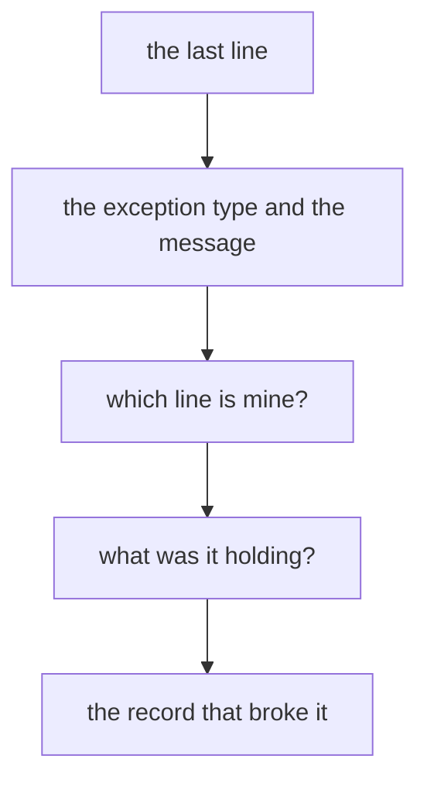

# Cheat sheet: errors and files

Week 1, Day 2. Print landscape. Eight panels, one crux line each.

---

## Panel 1: read a traceback



Read from the bottom up.

| Line | Question it answers |
|---|---|
| Last | What went wrong, and on what value |
| Naming your file | Where you edit |
| Above that | How you got here |

Three questions every time: exception type, my line, the value it held.

**Crux:** the value it was holding is the question people skip, and it is the one that names the record.

---

## Panel 2: return against print

```
def f(r): print(r["order_id"])      # hands back None
def g(r): return r["order_id"]      # hands back the value
```

`print` is for the human at the screen. `return` is for the next line of code.

**Crux:** if the caller needs the answer, the function returns it.

---

## Panel 3: catch narrowly

```
try:
    value = int(raw)
except ValueError as e:
    rejects.append({"id": rid, "reason": str(e)})
```

| Catch | What it survives | What it hides |
|---|---|---|
| `except ValueError` | The failure you predicted | Nothing |
| `except:` | Everything | Every failure you did not predict |

**Crux:** a crash costs an hour, a plausible wrong number costs a quarter.

---

## Panel 4: the reconciliation

```
assert len(clean) + len(rejects) == len(rows)
```

Run it every time, especially when you expect it to pass.

**Crux:** input equals clean plus rejected, or something disappeared and you do not yet know what.

---

## Panel 5: the four errors of Day 2

| Error | It means |
|---|---|
| `TypeError: 'NoneType' object is not subscriptable` | A function printed instead of returning |
| `ValueError: invalid literal for int() with base 10: 'x'` | A word arrived where a number belonged |
| `FileNotFoundError: [Errno 2] ...` | The path does not exist from where the kernel is running |
| `JSONDecodeError: ... line N column M` | The parser ran out of valid input at that position |

**Crux:** every one of these names the thing it choked on. Read it before you edit.

---

## Panel 6: opening files

```
with open(path) as f:
    ...
```

The close is guaranteed, including when your code raises inside the block.

Paths are relative to the running kernel, never to the file browser.

**Crux:** `FileNotFoundError` prints the exact path it tried. Read it out loud and you find your own typo.

---

## Panel 7: CSV and JSON

| | CSV | JSON |
|---|---|---|
| Agrees about | Rows, commas, a header row | Types and nesting |
| Types | Everything is text | Numbers stay numbers |
| Nesting | Cannot express it | Native |
| Partial read | Possible | Never, it parses whole or fails whole |

```
csv.DictReader(f)     # keys come from the header row
csv.DictWriter(f, fieldnames=[...])
json.load(f) / json.dump(obj, f)
```

**Crux:** everything a CSV agrees to is text, so conversion is a decision you make on purpose.

---

## Panel 8: one pass, two files

```
clean.csv     what converted
rejects.csv   what did not, and why
```

Then reopen both and count.

**Crux:** writing a file is not finishing. Reopening it and counting the rows is finishing.
