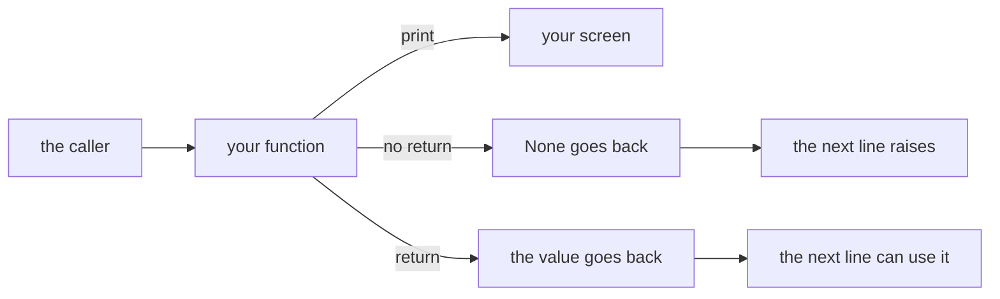
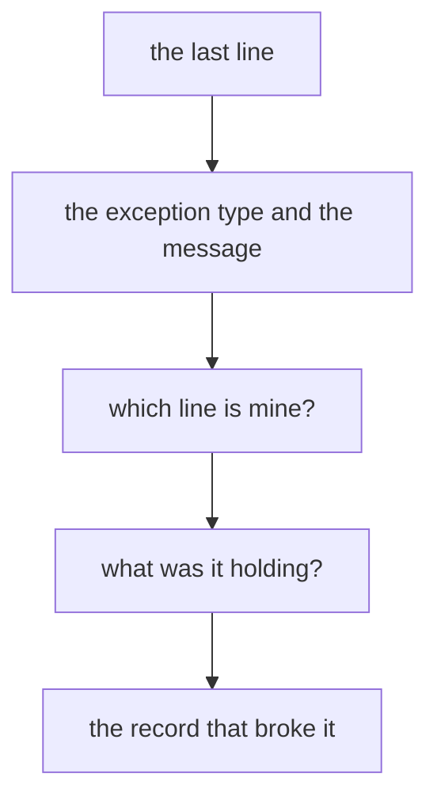
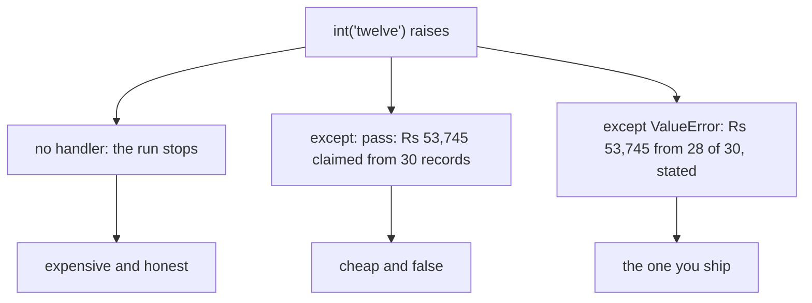
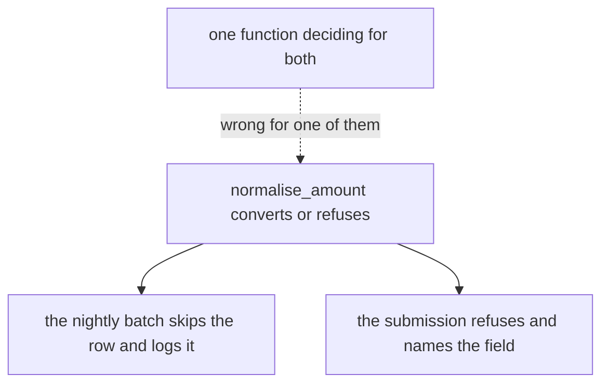
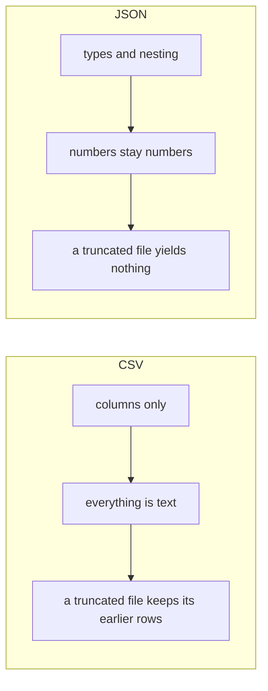
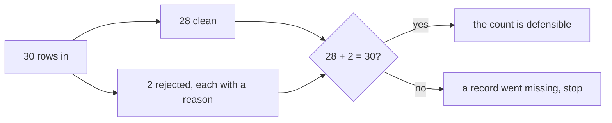

# Visual sheet: functions, failures and the file boundary

Week 1, Day 2. Print landscape. Six panels, pictures only. The text sheet beside this one carries the words.

---

## Panel 1: what a function hands back

**Crux:** if the caller needs the answer, the function returns it.

---

## Panel 2: reading a traceback

**Crux:** read the last line first, every time.

---

## Panel 3: three stances on the same bad row

**Crux:** a bare except turns a failure into a claim you cannot support.

---

## Panel 4: who decides what a failure means

**Crux:** convert or refuse in the function, decide what it means in the caller.

---

## Panel 5: two agreements about structure

**Crux:** everything a CSV agrees to is text, and JSON breaks all at once.

---

## Panel 6: the reconciliation

**Crux:** a record in neither file is a record nobody will ever look for again.

---

The landscape PDF of this sheet is deferred. The rendering toolchain the `fde-cheat-sheets` method uses was not installed in the session that built this file, and the markdown with its six panels is the shipped artifact until it is.
