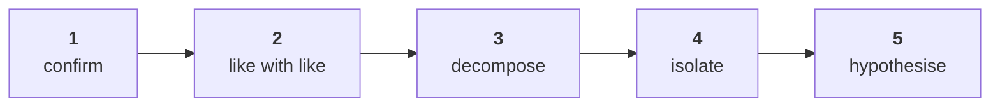

# The sales-drop investigation

Week 1 Day 2, Kalpa Retail. The most-asked analyst case in the market. The order of the rungs is
the skill, and a candidate who climbs them out of order answers the wrong question well.

## Panel 1: The ladder



**Crux:** You never climb past a rung you have not done, and most wrong answers are somebody starting at rung five because they arrived with a theory.

## Panel 2: What each rung needs

| Rung | Needs | Goes wrong when |
|---|---|---|
| Confirm | Both totals, one definition | Delivered meets booked |
| Like with like | Equal windows, same segments | 13 weeks meets 11 |
| Decompose | Customers, orders, revenue | The total is called a finding |
| Isolate | The same split per segment | A blend hides the segment |
| Hypothesise | Something outside the data | A cause is stated as fact |

## Panel 3: Grouping by key

```python
totals = {}
for order in ORDERS:
    k = order["quarter"]
    totals[k] = totals.get(k, 0) + order["amount"]
```

Count adds one. Revenue adds the amount. Distinct customers uses `setdefault(k, set()).add(...)`.

## Panel 4: The decomposition has to close

```
REVENUE = CUSTOMERS x ORDERS PER CUSTOMER x REVENUE PER ORDER
```

| Factor | Q1 | Q2 | Change |
|---|---|---|---|
| Customers | 69 | 69 | flat |
| Orders per customer | 1.65 | 1.25 | down 24.6% |
| Revenue per order | 1.84L | 2.17L | up 18.0% |
| Revenue | 2.10cr | 1.87cr | down 11.0% |

**Crux:** Multiply the three factor changes and they must land on the revenue change, or a factor is missing and nothing built on the decomposition is safe.

## Panel 5: return, never print

| | |
|---|---|
| `return` | Hands the value back, so the next line can use it |
| `print` | Draws on a screen and hands back `None` |

A function that prints cannot be built on. The tell is `TypeError: 'NoneType' object is not subscriptable` one line later.

## Panel 6: Defaults are decisions

`KeyError: 'discount'` means the key is not there. Before reaching for `.get()`, count how many records and check whether the absence is concentrated.

| Choice | What it costs |
|---|---|
| Drop the row | Revenue falls and the count changes |
| Default to zero | The count holds, revenue is understated |
| Keep and flag | Nothing lost, somebody has to look |

**Crux:** There is no free option, so write the reason beside the default, because on Wednesday somebody from Finance asks for it.

## Panel 7: A finding, not an opinion

A cause with a test beside it is a finding. A cause without one is an opinion with numbers attached.

Retail-Plus down 49 percent against Retail-Core's 5 is a finding. "The reorder button broke" is a hypothesis until reorder events per member either side of the window say so.
