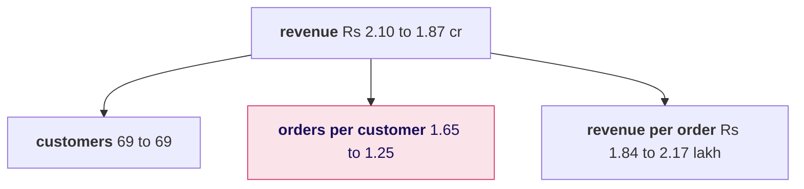

# Which branch moved from Q1 to Q2, and how do you know?

Kalpa Retail, Week 1 Tuesday. A drop is investigated in six chapters, and each answers a question
that has to be settled before the next one is worth asking. The tree beside the ladder carries the
closed quarters, Q1 against Q2, on booked orders as exported.

## Panel 1: Which branch of the tree moved from Q1 to Q2?


```mermaid
flowchart TB
    V["<b>revenue</b> Rs 2.10 to 1.87 cr"] --> C["<b>customers</b> 69 to 69"]
    V --> F["<b>orders per customer</b> 1.65 to 1.25"]
    V --> O["<b>revenue per order</b> Rs 1.84 to 2.17 lakh"]
    classDef moved fill:#FBE3EA,stroke:#D63A6A,color:#1A0F5C
    class F moved
```

The six chapters climb it in order: is the drop real, which branch moved, which segment moved, did
customers pay more, were customers lost, and did the button do it.

Revenue fell 11.0 percent on closed quarters: 1.000 times 0.754 times 1.180 is 0.890. In behaviour
the fall sits in Retail-Plus, where the same 22 members placed 26 orders against 51.

**Crux:** Confirm the drop on matched windows before you explain it.

## Panel 2: Is the drop real once the windows match?

| Window | Result | Verdict |
|---|---|---|
| Q1 against Q2 cut at 15 Sep | Down 25.9 percent | First and last dates show 13 weeks against 11. |
| Closed quarters, 13 weeks each | Down 11.0 percent | It is fair once Q2 has closed. |
| Same 11 weeks, Q2 still open | Down 17.0 percent | Matched weeks while a quarter is open. |
| Per week on the cut window | Down 12.4 percent | A rate, said with its window. |
| Second route, by month | Down 11.0 percent | The dates agree with the quarter field. |

**Crux:** A rate without its denominator is a rumour.

## Panel 3: How many rupees does each branch carry?

| Step | Rupees |
|---|---|
| Q1 revenue | Rs 2,10,00,000 |
| Customers, 69 to 69 | Rs 0 |
| Orders per customer, 28 fewer orders | Minus Rs 51,57,895 |
| Revenue per order, Rs 33,231 more on 86 | Plus Rs 28,57,895 |
| Q2 revenue | Rs 1,87,00,000 |

**Crux:** Decompose along the tree: customers, orders per customer, revenue per order.

## Panel 4: What does a missing discount count as?

```python
order.get("discount", 0)   # silently makes a blank Rs 0
```

Read as zero, a blank counts as "no discount", so 50.0 percent of Q2's orders seem to carry one. Split
the rest into recorded zeros and blanks, report the share where recorded, 71.7 percent, with the range
the blanks allow, and bound the branch: Rs 150 on 86 orders is at most Rs 12,900.

**Crux:** Missing means unknown until someone chooses a default and writes down why.

## Panel 5: How do four segments roll up into one rate?

One function replaces eight copied loops and eight places to edit. A plain average of four segments gives 1.94 and 1.82; total
orders over total customers gives 1.65 and 1.25, the figure a roll-up must reproduce.

**Crux:** Roll a rate up with its weights; never average the averages.

## Panel 6: Did customers pay more, or did the mix move?

Revenue per order rose Rs 33,231 and no segment rose 18 percent: about 69 percent is mix, since small
Retail-Plus orders fell from 44.7 to 30.2 percent of orders.

**Crux:** A blended rate can move while no segment moves; split mix from rate.

## Panel 7: Does every group come back, and was anyone lost?

```python
def tree_for(rows):
    ...
    return {"revenue": revenue, "orders": n, "customers": c}
```

A helper that prints for large changes returns `None`, and the filter drops it: four segments go in
and two come back as `None`. Check with `None in changes.values()`. The id overlap answers Marketing's
churn claim: 69 in both quarters, 0 lost, 0 new.

**Crux:** A function returns its answer; count the groups in and the groups out.

## Panel 8: Did the button do it, and what would settle it?

| Test | What the file shows |
|---|---|
| Timing | Retail-Plus fell from July, before the late-August break the complaint dates. |
| Channel | Web, store and app all fell, so the app did not fall first and alone. |
| Ceiling | On the 55 days before the break the button explains at most about 4 orders; on the 37 days just before it, 7.0. Both sit far below the 25 a hurried memo charges. |
| Evidence to ask for | The app's reorder logs by week, the release date, and the tier's change log. |

**Crux:** Name the cause as a hypothesis, with its ceiling and the evidence that would settle it.
