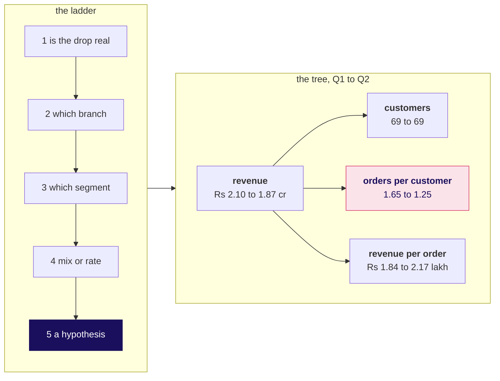

# The investigation ladder

Kalpa Retail, Week 1 Tuesday. A drop is investigated in a fixed order, and each rung is a question
that has to be answered before the next one is worth asking. The tree beside the ladder carries the
closed quarters, Q1 against Q2, on booked orders as exported.

## Panel 1: The ladder beside the tree


```mermaid
flowchart LR
    subgraph LAD["the ladder"]
        direction TB
        R1["1 is the drop real"] --> R2["2 which branch"]
        R2 --> R3["3 which segment"]
        R3 --> R4["4 mix or rate"]
        R4 --> R5["5 a hypothesis"]
    end
    subgraph TREE["the tree, Q1 to Q2"]
        direction LR
        V["<b>revenue</b><br/>Rs 2.10 to 1.87 cr"] --> C["<b>customers</b><br/>69 to 69"]
        V --> F["<b>orders per customer</b><br/>1.65 to 1.25"]
        V --> O["<b>revenue per order</b><br/>Rs 1.84 to 2.17 lakh"]
    end
    LAD --> TREE
    classDef bet fill:#1A0F5C,stroke:#1A0F5C,color:#FFFFFF
    classDef moved fill:#FBE3EA,stroke:#D63A6A,color:#1A0F5C
    class R5 bet
    class F moved
```

Revenue fell 11.0 percent between two closed quarters. Customers held at 69, orders per customer fell
24.6 percent, and revenue per order rose 18.0 percent, so the ratios multiply back: 1.000 times 0.754
times 1.180 is 0.890. In behaviour the fall sits in Retail-Plus, where the same 22 members placed 26
orders against 51.

**Crux:** A rate without its denominator is a rumour.

## Panel 2: Windows, like with like

| Window | Result | Verdict |
|---|---|---|
| Q1 against Q2 cut at 15 Sep | Down 25.9 percent | First and last dates show 13 weeks against 11. |
| Closed quarters, 13 weeks each | Down 11.0 percent | It is fair once Q2 has closed. |
| Per week, Q2 still open | Down 12.4 percent | A rate makes it comparable. |

**Crux:** Confirm the drop on matched windows before you explain it.

## Panel 3: The tree, as a bridge in rupees

| Step | Rupees |
|---|---|
| Q1 revenue | Rs 2,10,00,000 |
| Customers, 69 to 69 | Rs 0 |
| Orders per customer, 28 fewer orders | Minus Rs 51,57,895 |
| Revenue per order, Rs 33,231 more on 86 | Plus Rs 28,57,895 |
| Q2 revenue | Rs 1,87,00,000 |

**Crux:** Decompose along the tree: customers, orders per customer, revenue per order.

## Panel 4: Missing is unknown

```python
order.get("discount", 0)   # a decision that looks like no decision
```

Count the records that carry the field, average only where it is recorded, and bound the branch with
the largest recorded value: Rs 150 on 86 orders is at most Rs 12,900 against a Rs 23,00,000 fall.

**Crux:** Missing means unknown until someone chooses a default and writes down why.

## Panel 5: Roll-up with weights, and mix against rate

A plain average of four segments gives 1.94 and 1.82; total orders over total customers gives 1.65
and 1.25, which is the figure the roll-up must reproduce. Revenue per order rose Rs 33,231, and about
69 percent of it is mix, because small Retail-Plus orders fell from 44.7 to 30.2 percent of orders.

**Crux:** Roll a rate up with its weights; never average the averages.

## Panel 6: Functions return

```python
def tree_for(rows):
    ...
    return {"revenue": revenue, "orders": n, "customers": c}
```

A helper that prints for large changes returns `None`, the filter drops it, and four segments go in
while two rows come out. Check with `None in changes.values()`.

**Crux:** A function returns its answer; count the groups in and the groups out.

## Panel 7: Hypothesis with evidence

| Test | What the file shows |
|---|---|
| Timing | Retail-Plus fell from July, before the late-August break the complaint dates. |
| Channel | Web, store and app all fell, so the app did not fall first and alone. |
| Evidence to ask for | The app's reorder logs by week, the release date, and the tier's change log. |

**Crux:** Name the cause as a hypothesis, with the evidence that would settle it.
