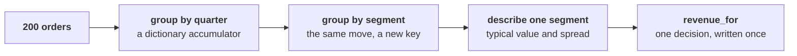

# How do you total any group of Kalpa's orders, describe it, and write the total once for every segment and quarter?

You build this exercise with the trainer across chapters 2 and 3, one step at a time, in your own
Codespace, and nothing here is graded. Every line on your screen is there because you typed it, which is what makes it
yours when the afternoon's case arrives and nobody types it for you.

> "Are we losing customers, or are the ones we have buying less? Is it across all our customers, or
> one kind of customer?"
>
> Meera Raghavan, CEO, Kalpa Retail

The class file holds Kalpa Retail's 200 orders from 1 April to 30 September, which are Q1 and Q2 of
a financial year that opens in April. Each order is a record, a Python dictionary, carrying its
`quarter`, its `amount` in rupees, its `customer_id` and its `segment`, the kind of customer who
placed it. Kalpa's customers sit in four segments, and Retail-Core, shoppers who place many small
orders, is one of them. Revenue here is booked revenue: every order placed, at the price charged,
before any cancellation or return. A dictionary accumulator keeps one running total for each key
and adds every order to its key's total as the loop passes it.

**Who needs the answer.** Anand Iyer, Kalpa's finance controller, wants a table of orders and
revenue for every segment in every quarter, and Meera Raghavan, the CEO, reads the day's answer off
it. A group lost on the way, or a total computed one way for one segment and another way for the
next, puts a wrong number in front of both of them.

**The questions on the way.**

- How do you count and total the orders of each quarter in one pass?
- How do you group the same orders by quarter and segment together?
- How do you describe one segment's orders with a typical value and a spread?
- How do you write the total once so that every segment and quarter can call it?

Five checkpoints sit between the steps. Answer each one before you run the cell, then run it and
see whether you were right.

**What you post.** You post one line at the end, five letters in checkpoint order with no spaces, in
this shape:

```
Post exactly this shape: xxxxx
```



---

## Step 1. How do you count and total the orders of each quarter in one pass?

At work this comes up in every report that gives a number per period, which is most of them.

Open a new cell below the setup cell of chapter 2's notebook,
`notebooks/C2_W01_D02_02_which_branch_STUDENT.ipynb`, the cell that loads the day's helper as `kit`,
and type the accumulator with the room:

```python
ORDERS = kit.load_records("C2_W01_D02_orders_STUDENT.py")

orders_by_quarter = {}
revenue_by_quarter = {}
for order in ORDERS:
    q = order["quarter"]
    if q not in orders_by_quarter:
        orders_by_quarter[q] = 0
        revenue_by_quarter[q] = 0
    orders_by_quarter[q] = orders_by_quarter[q] + 1
    revenue_by_quarter[q] = revenue_by_quarter[q] + order["amount"]
```

### Checkpoint 1. What does `orders_by_quarter` hold after the loop?

Anand asks how many orders each quarter booked. After the loop, what does `orders_by_quarter` hold?

a) `{"Q1": 69, "Q2": 69}`, one count for each distinct customer
b) `{"Q2": 1}`, since the dictionary is reset on every order
c) `{"Q1": 200, "Q2": 200}`, since every order is counted twice
d) `{"Q1": 114, "Q2": 86}`, one count for each order booked

### Checkpoint 2. What does `revenue_by_quarter` hold after the loop?

The same loop added each order's amount into `revenue_by_quarter`. What does it hold, written as
Meera would read it?

a) Rs 1,84,211 in Q1 and Rs 2,17,442 in Q2, the revenue per order
b) Rs 2,10,00,000 in Q1 and Rs 1,87,00,000 in Q2, the booked revenue
c) Rs 3,97,00,000 in Q1 and Rs 3,97,00,000 in Q2, the file's revenue
d) Rs 2,10,00,000 in Q1 and Rs 2,10,00,000 in Q2, the first quarter's

---

## Step 2. How do you group the same orders by quarter and segment together?

At work this comes up whenever a number is asked for per segment, per channel or per month inside a
period.

The move is the same, with a key made of two parts. Change the key line to
`key = (order["quarter"], order["segment"])` and build `orders_by_key` and `customers_by_key`, where
the second holds a set of customer ids for each key. Run it, then print the keys in order with
`for key in sorted(orders_by_key): print(key)`. Read the counts in your own notebook, since the room
reads them together in chapter 3.

### Checkpoint 3. How many keys should `orders_by_key` hold before you read a single count?

Step 2 gives `orders_by_key` one entry for every quarter and segment that appear together in the
file. Before you read a single count, how many keys should it hold, and why check?

a) Eight, four segments in each of two quarters; fewer means a group is lost
b) Four, one per segment; the quarter is a column that the key leaves out
c) Two hundred, one key per order; a dictionary keeps every row it is given
d) Sixty-nine, one per customer; a customer is the unit Meera is asking about

---

## Step 3. How do you describe one segment's orders with a typical value and a spread?

At work this comes up whenever someone asks what a typical customer or a typical order looks like.

Pull the Retail-Core amounts for Q1 into a list, sort it, and describe it with the room:

```python
amounts = []
for order in ORDERS:
    if order["quarter"] == "Q1" and order["segment"] == "Retail-Core":
        amounts.append(order["amount"])
amounts.sort()
print(len(amounts), amounts[:5], amounts[-5:])
```

Then find the median with `statistics.median(amounts)`, the minimum, the maximum and the range. The
median is the middle value of the sorted list, or the average of the middle two when the count is
even, and the range is the largest value less the smallest. Read the sorted list aloud from both
ends before you trust any single number.

### Checkpoint 4. What are the median, minimum, maximum and range of Retail-Core's Q1 orders?

You have sorted Retail-Core's Q1 amounts and read them from both ends. Which description of
Retail-Core in Q1 is right?

a) Median Rs 2,117, min Rs 860, max Rs 3,000, range Rs 2,140
b) Median Rs 2,080, min Rs 890, max Rs 2,950, range Rs 2,060
c) Median Rs 2,325, min Rs 860, max Rs 3,000, range Rs 2,140
d) Median Rs 2,325, min Rs 860, max Rs 3,000, range Rs 3,860

---

## Step 4. How do you write the total once so that every segment and quarter can call it?

At work this comes up whenever the same number is needed for many groups and each group has to get
it the same way.

The same total is needed for every segment in every quarter, so it moves into a function:

```python
def revenue_for(rows):
    total = 0
    for order in rows:
        total = total + order["amount"]
    ____
```

Run `revenue_for(ORDERS)` and then `revenue_for` on the Q1 rows only, and check the second against
Step 1.

### Checkpoint 5. Which last line lets `revenue_for` feed Anand's table?

Anand wants a table of revenue for every segment and quarter, built from `revenue_for`. Which last
line makes the function usable in that table?

a) `print(total)`, so the total shows on screen for each call
b) `return total`, so each call hands its number to the table
c) `return print(total)`, so it shows the total and returns it
d) `total`, as the last line, so the notebook displays the value

---

## What can you do once the four steps are done?

You can point a dictionary accumulator at any key, describe one segment by its typical value and
its spread, and write a function that hands its answer back to whoever called it. The next step,
running the tree on every segment in both quarters, is yours alone at the end of chapter 3.
