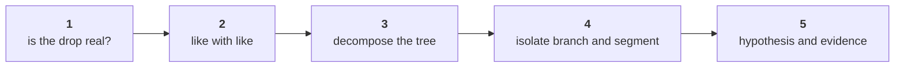

# Practice lab: the ladder, one more time, alone

About an hour, in the TA-led lab after the afternoon. Four problems, each harder than the last. The
first three need a pen and the numbers on the page; the fourth runs on the class file in your own
notebook and ends in the first lines of tonight's memo. Figures marked invented are made up for the
problem; every other figure comes from the class file.

Post one line when you finish, twelve letters in item order, no spaces, then paste your four memo
lines under it:

```
Post exactly this shape: xxxxxxxxxxxx
```



---

## Problem 1. Order the rungs, about ten minutes

Kavya hands a new analyst five cards, shuffled: p) isolate the branch and the segment, q) name a
hypothesis and the evidence that would settle it, r) confirm the drop is real, s) decompose the
change along the tree, t) compare like with like.

### Q1. In which order does the investigation run?

a) s, p, r, t, q
b) r, s, t, p, q
c) t, r, s, q, p
d) r, t, s, p, q

### Q2. Marketing's 25.9 percent reached a slide because one rung was skipped. Which rung, if run, would have stopped it?

a) Decompose the change along the tree, which would have shown frequency falling
b) Compare like with like, which would have shown 11 weeks set against 13
c) Isolate the segment, which would have shown the fall sitting in one place
d) Name a hypothesis, which would have forced someone to ask for evidence

---

## Problem 2. Spot the mismatched window, about ten minutes

Each item is a comparison someone put in a draft, and the same four readings are offered for all
three. Only one fits each comparison.

### Q3. "Retail-Core booked Rs 60,950 from 1 July to 15 September, against Rs 80,460 across Q1." Which reading fits?

a) Fair: the two sides share a window, a definition and a denominator
b) Unfair: the two sides cover windows of different length or position
c) Unfair: the two sides count revenue under different definitions
d) Unfair: the rate on one side divides by a different population of customers than the other

### Q4. "Q2 booked revenue per day was Rs 2,03,261, against Rs 2,30,769 a day in Q1, across 92 and 91 days." Which reading fits?

a) Fair: the two sides share a window, a definition and a denominator
b) Unfair: the two sides cover windows of different length or position
c) Unfair: the two sides count revenue under different definitions
d) Unfair: the rate on one side divides by a different population of customers than the other

### Q5. "Delivered revenue in Q2 was Rs 1,28,64,680, against booked revenue of Rs 2,10,00,000 in Q1." Which reading fits?

a) Fair: the two sides share a window, a definition and a denominator
b) Unfair: the two sides cover windows of different length or position
c) Unfair: the two sides count revenue under different definitions
d) Unfair: the rate on one side divides by a different population of customers than the other

---

## Problem 3. Predict the tree for a new case, about fifteen minutes

An invented case. Kalpa's invented pilot store in Kochi reports two closed quarters:

| Quarter | Customers | Orders | Revenue |
|---|---|---|---|
| Q1 (invented) | 400 | 520 | Rs 7,80,000 |
| Q2 (invented) | 440 | 506 | Rs 7,84,300 |

The store manager writes: "Revenue is flat, so nothing moved. No need for a review."

### Q6. What is orders per customer in each quarter, and how far did it move?

a) 1.30 to 1.15, a fall of 13.0 percent measured against the Q2 figure
b) 0.77 to 0.87, a rise of 13.0 percent in how often each customer buys
c) 1.30 to 1.15, a fall of 11.5 percent measured against the Q1 figure
d) 520 to 506, a fall of 2.7 percent in the orders the store booked

### Q7. What is revenue per order in each quarter, and how far did it move?

a) Rs 1,500 to Rs 1,550, a rise of 3.3 percent against Q1's order value
b) Rs 1,950 to Rs 1,782, a fall of 8.6 percent in spend per customer
c) Rs 1,500 to Rs 1,550, a rise of 0.6 percent, the same as revenue's
d) Rs 1,500 to Rs 1,550, a rise of 3.2 percent against Q2's order value

### Q8. Which reply to the store manager holds?

a) Revenue is flat, so the manager is right and the review can be skipped this quarter
b) Order value rose 3.3 percent, so the store's pricing is working and needs no change
c) Customers rose 10 percent and so did revenue, so the new customers carried the quarter
d) New customers masked existing ones buying less often; check if Q1's buyers came back

---

## Problem 4. The memo's first lines, on the class file, about twenty-five minutes

Open a new notebook beside the day's notebooks, load the class file with
`kit.load_records("C2_W01_D02_orders_STUDENT.py")`, and rebuild the four numbers each line needs
with your own `tree_for`. Pick each line, then write all four in your own words under your letters.

### Q9. Which first line states the drop so that nobody can argue with the window?

a) "Revenue fell 25.9 percent quarter on quarter, from Rs 2.10 crore to Rs 1.56 crore on booked orders."
b) "Revenue fell 11.0 percent between two closed 13-week quarters, Rs 2.10 to Rs 1.87 crore, booked."
c) "Revenue fell about 9.5 percent this quarter, from roughly Rs 2.1 crore to roughly Rs 1.9 crore."
d) "Revenue fell sharply between the two quarters, and the fall is large enough to need action now."

### Q10. Which second line names the branch that moved?

a) "Customers fell, so acquisition is the branch to fund, as the marketing lead has said from the start."
b) "Averaged across the four segments, frequency fell only 6.0 percent, so no single branch moved much."
c) "Order value rose 18.0 percent, so the fall must sit in the number of customers who bought from us."
d) "Customers held at 69, all of them bought in both quarters; orders per customer fell, 1.65 to 1.25."

### Q11. Which third line names the segment, in behaviour and in rupees?

a) "In behaviour, the same 22 Retail-Plus members placed 26 orders against 51; in rupees, 3 Business orders."
b) "In behaviour and in rupees alike, the fall sits in Business, which lost Rs 22,29,720 across three orders."
c) "In rupees, the fall sits in Retail-Plus, whose revenue halved from Rs 1,43,550 to Rs 78,300 in the quarter."
d) "Every segment fell by a similar share, so no segment needs to be named ahead of the others in the memo."

### Q12. Which fourth line states a cause the way Kavya would sign off?

a) "The cause is the broken reorder feature, as the head of Retail-Plus has reported from his members."
b) "The cause cannot be known from an order file, so the memo leaves the question of cause to others."
c) "H1, the broken reorder feature, settled by reorder logs by week; H2, a July change, by the tier's log."
d) "The cause is a market-wide slowdown in July, which explains why every channel fell in the same months."
