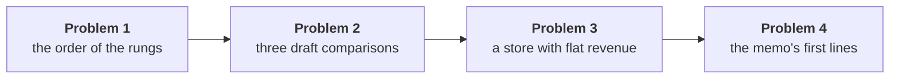

# Can you run the day's investigation alone, from the order of its rungs to the memo's first four lines?

> "Q2 came in below Q1: are we losing customers, or are the ones we have buying less?"
>
> Meera Raghavan, CEO, Kalpa Retail

The day answered Meera's question as an investigation climbed like a ladder, one rung at a time,
each rung a question settled before the next is asked. Revenue in the class file is booked revenue:
every order placed, at the price charged, before any cancellation or return. Delivered revenue counts
only the orders that reached the customer and were not sent back. Monday's revenue tree splits
revenue into three branches that multiply: revenue = customers x orders per customer x revenue per
order. Tonight's memo to Meera starts from the lines you pick in Problem 4, and Anand Iyer, Kalpa's
finance controller, checks every number in it against the file.

**Who needs the answer.** Kavya Nair, the senior analyst on Kalpa Retail's data team, needs to see
you run the investigation without the trainer before tonight's memo goes to Meera Raghavan, the CEO.
A rung taken out of order, or a memo line without its window and its number, reaches Meera as a
claim that nobody can check.

**The questions on the way.**

- In which order does a sales-drop investigation run?
- Which of three draft comparisons set like against like?
- What does the revenue tree say about a store whose revenue stayed flat?
- Which four lines open the memo to Meera, and which numbers do they rest on?

The lab takes about an hour, led by a TA after the afternoon, and each of its four problems is
harder than the last. The first three need a pen and the numbers on the page; the fourth runs on the
class file in your own notebook and ends in the first lines of tonight's memo. Figures marked
invented are made up for the problem, and every other figure comes from the class file.

**What you post.** When you finish, you post one line of twelve letters in item order with no
spaces, and your four memo lines under it, in this shape:

```
Post exactly this shape: xxxxxxxxxxxx
```



---

## Problem 1. In which order does a sales-drop investigation run?

This takes about ten minutes, and at work it comes first in every drop investigation, before anyone
opens a notebook.

Kavya hands a new analyst five cards, shuffled: p) isolate the branch and the segment, q) name a
hypothesis and the evidence that would settle it, r) confirm the drop is real, s) decompose the
change along the tree, t) compare like with like.

### Q1. In which order do Kavya's five cards run?

Which order of the five cards runs the investigation from its first rung to its last?

a) s, p, r, t, q
b) r, s, t, p, q
c) t, r, s, q, p
d) r, t, s, p, q

### Q2. What should the skipped rung have sent Meera on 15 September? (Design)

Marketing's slide set a dashboard tile read on 15 September, while Q2 was still open, against all of
Q1 and reported a fall of 25.9 percent, a figure that reached the slide because one rung was
skipped. What should that rung have sent Meera that day, and what would switch it once Q2 closed?

a) The tile against all of Q1, minus 25.9 percent, switching once Marketing agrees the method is fair
b) The same 11 weeks of each quarter, minus 17.0 percent, switching to closed quarters at the close
c) A rate per week, minus 12.4 percent, switching to last year's Q2 once the export arrives from Finance
d) The tree's leaves, frequency and order value, switching to the segments once they are split

---

## Problem 2. Which of three draft comparisons set like against like?

This takes about ten minutes, and at work it comes up whenever a draft compares two periods, two
definitions or two rates.

Each item is a comparison someone put in a draft, and the same four readings are offered for all
three. Only one fits each comparison. A rate divides a total by a denominator, such as the days in
the window or the customers who bought.

### Q3. Which reading fits the draft line on Retail-Core's revenue?

"Retail-Core booked Rs 60,950 from 1 July to 15 September, against Rs 80,460 across Q1." Which
reading fits?

a) Fair: each side is a rate over its stated window, on one definition and one denominator
b) Unfair: the two sides cover windows of different length or position
c) Unfair: the two sides count revenue under different definitions
d) Unfair: the rate on one side divides by a different population of customers than the other

### Q4. Which reading fits the draft line on revenue per day?

"Q2 booked revenue per day was Rs 2,03,261, against Rs 2,30,769 a day in Q1, across 92 and 91 days."
Which reading fits?

a) Fair: each side is a rate over its stated window, on one definition and one denominator
b) Unfair: the two sides cover windows of different length or position
c) Unfair: the two sides count revenue under different definitions
d) Unfair: the rate on one side divides by a different population of customers than the other

### Q5. Which reading fits the draft line on delivered Q2 revenue?

"Delivered revenue in Q2 was Rs 1,28,64,680, against booked revenue of Rs 2,10,00,000 in Q1." Which
reading fits?

a) Fair: each side is a rate over its stated window, on one definition and one denominator
b) Unfair: the two sides cover windows of different length or position
c) Unfair: the two sides count revenue under different definitions
d) Unfair: the rate on one side divides by a different population of customers than the other

---

## Problem 3. What does the revenue tree say about a store whose revenue stayed flat?

This takes about fifteen minutes, and at work it comes up whenever a manager reads a total and asks
whether a review is needed.

This case is invented. Kalpa's pilot store in Kochi, also invented, reports two closed quarters:

| Quarter | Customers | Orders | Revenue |
|---|---|---|---|
| Q1 (invented) | 400 | 520 | Rs 7,80,000 |
| Q2 (invented) | 440 | 506 | Rs 7,84,300 |

The store manager writes: "Revenue is flat, so nothing moved. No need for a review."

### Q6. How many orders per customer did the Kochi store book in each quarter?

What is the Kochi store's orders per customer in each quarter, and how far did it move?

a) 1.30 to 1.15, a fall of 13.0 percent measured against the Q2 figure
b) 0.77 to 0.87, a rise of 13.0 percent in how often each customer buys
c) 1.30 to 1.15, a fall of 11.5 percent measured against the Q1 figure
d) 520 to 506, a fall of 2.7 percent in the orders the store booked

### Q7. What is the Kochi store's revenue per order in each quarter?

What is the Kochi store's revenue per order in each quarter, and how far did it move?

a) Rs 1,500 to Rs 1,550, a rise of 3.3 percent against Q1's order value
b) Rs 1,950 to Rs 1,782, a fall of 8.6 percent in spend per customer
c) Rs 1,500 to Rs 1,550, a rise of 0.6 percent, the same as revenue's
d) Rs 1,500 to Rs 1,550, a rise of 3.2 percent against Q2's order value

### Q8. Which reply to the Kochi store manager holds?

The manager reads flat revenue as proof that nothing moved and wants to skip the review. Which reply
to the store manager holds?

a) Revenue is flat, so the manager is right and the review can be skipped this quarter
b) Order value rose 3.3 percent, so the store's pricing is working and needs no change
c) Customers rose 10 percent and so did revenue, so the new customers carried the quarter
d) New customers may have masked existing ones buying less often, so check Q1's buyers

---

## Problem 4. Which four lines open the memo to Meera, and which numbers do they rest on?

This takes about twenty-five minutes, and at work it comes up whenever a finding goes to a leader who
reads only the first lines.

Open a new notebook beside the day's notebooks and copy in the setup cell from chapter 3's notebook,
`notebooks/C2_W01_D02_03_which_segment_STUDENT.ipynb`, which imports the day's helper as `kit`, loads
the class file with `kit.load_records("C2_W01_D02_orders_STUDENT.py")` and groups its orders by
quarter and segment. Then rebuild the four numbers each line needs with your own `tree_for`, the
function from chapter 3 that gives any list of orders its revenue, orders, customers and rates. Pick
each line, then write all four in your own words under your letters.

### Q9. Which first line states the drop?

The memo's first line has to state the drop so that nobody can argue with its window. Which first
line does that?

a) "Revenue fell 25.9 percent quarter on quarter, from Rs 2.10 crore to Rs 1.56 crore on booked orders."
b) "Revenue fell 11.0 percent between two closed 13-week quarters, Rs 2.10 to Rs 1.87 crore, booked."
c) "Revenue fell about 9.5 percent this quarter, from roughly Rs 2.1 crore to roughly Rs 1.9 crore."
d) "Revenue fell sharply between the two quarters, and the fall is large enough to need action now."

### Q10. Which second line names the branch of the tree that moved?

The memo's second line names the branch that moved, with its numbers. Which second line does that?

a) "Customers fell, so acquisition is the branch to fund, as the marketing lead has said from the start."
b) "Averaged across the four segments, frequency fell only 6.0 percent, so no single branch moved much."
c) "Order value rose 18.0 percent, so the fall must sit in the number of customers who bought from us."
d) "Customers held at 69, every one buying in both quarters, and orders per customer fell 1.65 to 1.25."

### Q11. Which third line names the segment in behaviour and in rupees?

The memo's third line names the segment behind the fall, both in how its customers behaved and in
rupees. Which third line does that?

a) "In behaviour, 22 Retail-Plus members placed 26 orders against 51, and in rupees it is 3 Business orders."
b) "In behaviour and in rupees alike, the fall sits in Business, which lost Rs 22,29,720 across three orders."
c) "In rupees, the fall sits in Retail-Plus, whose revenue halved from Rs 1,43,550 to Rs 78,300 in the quarter."
d) "Every segment fell by a similar share, so no segment needs to be named ahead of the others in the memo."

### Q12. Which fourth line states a cause Kavya would sign off?

The memo's fourth line states the cause the way Kavya, the team's senior analyst, would sign it off.
Which fourth line does that?

a) "The cause is the broken reorder feature, as the head of Retail-Plus has reported from his members."
b) "The cause cannot be known from an order file, so the memo leaves the question of cause to others."
c) "Two causes stay open, the reorder feature, settled by its logs, and a July change, by the tier's log."
d) "The cause is a market-wide slowdown in July, which explains why every channel fell in the same months."
