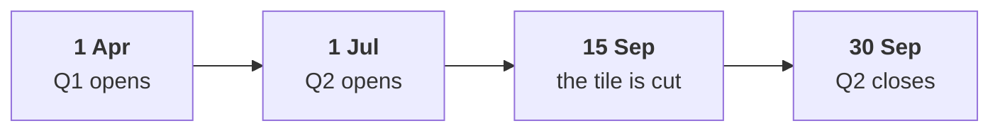

# Did revenue really fall from Q1 to Q2, and by how much, once both sides cover the same weeks?

The chapter 1 set has six items. Take about ten minutes alone after chapter 1, then compare your letters with the person beside you before Kavya's review. Kavya Nair is the senior analyst on Kalpa Retail's data team, and her review is the check that closes every chapter. Kalpa Retail's financial year opens in April, so Q1 runs from April to June and Q2 from July to September.

> "Q2 was Rs 1.9 crore, Q1 was 2.1. Marketing says more customers. Prove it or disprove it."
>
> Meera Raghavan, CEO, Kalpa Retail

Revenue in every item is booked revenue: every order placed, at the price charged, before any cancellation or return. Delivered revenue would count only the orders that reached the customer and were not sent back. A quarter is closed once its last day has passed and no order can still land in it. Marketing has asked for Rs 12 crore to win new customers, on a slide whose Q2 figure is a tile on Marketing's dashboard, read on 15 September. Chapter 1 weighed four ways to size the fall: the closed quarters as totals; matched weeks, the same weeks of each quarter set side by side; a rate per day or per week, each side's revenue divided by the days or weeks its dates cover; and the same quarter last year. A second route reaches the same number by an independent method, one that could have disagreed with the first. Each order record carries its `order_date`, the day it was placed, and a `quarter` field that the export fills in.

**Who needs the answer.** Meera Raghavan, the CEO, decides whether Marketing's Rs 12 crore acquisition request is urgent, and the request rests on a slide saying revenue fell 25.9 percent. Overstate the fall and crores move in a hurry on a lever nobody has checked; understate it and a real leak runs another quarter.

**The questions on the way.**

- How far did revenue fall between the two closed quarters?
- Why does Marketing's slide say revenue fell 25.9 percent?
- What does revenue per week give on 15 September, and what does it miss?
- Which comparison answers Meera's question about the monsoon?
- In which order do the four moves that test the drop run?
- What does adding revenue by month prove when it matches the closed quarters?

Every item refers to these numbers, in booked revenue on the export as it stands:

| Window | Dates | Orders | Revenue |
|---|---|---|---|
| Q1, closed | 1 Apr to 30 Jun | 114 | Rs 2,10,00,000 |
| Q2, closed | 1 Jul to 30 Sep | 86 | Rs 1,87,00,000 |
| Q2 dashboard tile, cut on 15 September | 1 Jul to 15 Sep | 70 | Rs 1,55,59,950 |



Every item has one right answer. Decide first, then record the letter. An item marked Design asks for the best-fit approach, a sizing, the fact that would switch it, or the second route.

**What you post.** You post one line of six letters in item order, with no spaces, in this shape:

```
Post exactly this shape: xxxxxx
```

---

### Q1. How far did revenue fall between the two closed quarters?

Meera asks how far revenue fell between the two closed quarters. Which figure goes in the reply?

a) 12.3 percent, the Rs 23,00,000 gap measured against Q2's total
b) 9.5 percent, from the rounded Rs 1.9 crore against Rs 2.1 crore
c) 11.0 percent, the Rs 23,00,000 gap measured against Q1's total
d) 25.9 percent, the figure on the dashboard tile Marketing quotes

### Q2. Why does Marketing's slide say revenue fell 25.9 percent?

Marketing's slide reads "Q2 Rs 1,55,59,950 against Q1 Rs 2,10,00,000: revenue fell 25.9 percent." What makes the slide unfit to act on?

a) The percentage is computed on Q2's total, which overstates the fall
b) It sets about 11 weeks of Q2 against all 13 weeks of the closed Q1
c) It counts booked orders, where Finance would count delivered ones
d) It rounds both totals to the nearest lakh before dividing them

### Q3. What does revenue per week give on 15 September, and what does it miss? (Design)

On 15 September, with Q2 still open, a colleague turns both sides of Marketing's slide into revenue per week, each side divided by the weeks its dates cover. What does the rate give, and what does it still miss?

a) Minus 12.4 percent, and it still compares Q2's early weeks with the whole of Q1
b) Minus 25.9 percent, since dividing both sides by weeks leaves their ratio alone
c) Minus 11.0 percent, since a rate per week removes every difference in the windows
d) Minus 17.0 percent, the answer that matched weeks of each quarter would give

### Q4. Which comparison answers Meera's question about the monsoon? (Design)

Both quarters have closed. Meera now asks: "Is Q2 always weaker than Q1, because of the monsoon?" Which option answers her, and what does it need?

a) Closed quarters again, since both are complete and compare like with like
b) A rate per day, since it removes the one-day gap between 91 and 92 days
c) The same 11 weeks of each quarter, since it also matches position
d) The same quarter last year, which needs last year's export to run

### Q5. In which order do the four moves that test the drop run?

Four moves answer "is the drop real": p) compute the change, q) find the first and last order date of each window, r) state the definition and the window in the sentence to Meera, s) choose closed quarters or matched weeks. Which order is right?

a) s, q, p, r
b) q, s, p, r
c) q, p, s, r
d) q, s, r, p

### Q6. What does adding revenue by month prove when it matches the closed quarters? (Design)

The second route added revenue by the month in `order_date` and reached the same fall as the closed quarters. What does agreement between the two routes prove?

a) That monthly totals are a better headline for Meera than the quarters
b) That no order in the file carries a wrong amount or a missing field
c) That the quarter field and the dates give each quarter the same total
d) That the fall is real and needs no comparison with last year
