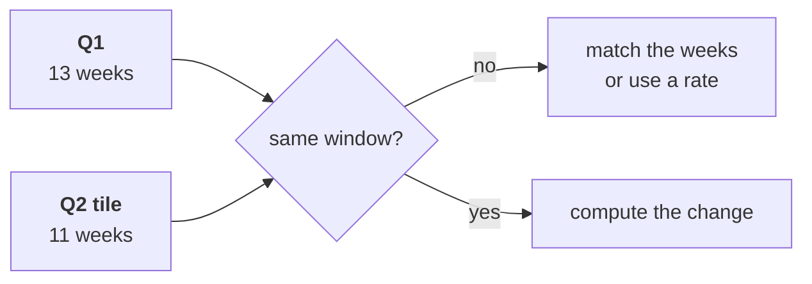

# Chapter 1 scenario set: is the drop real

Ten minutes, alone, then compare with the person beside you before Kavya's review. Every item has
one right answer. Decide first, then record the letter. Items marked design ask for the best-fit
approach, a sizing, the fact that would switch it, or the second route.

Post one line, 6 letters in item order, no spaces:

```
Post exactly this shape: xxxxxx
```

The ask behind every item:

> "Q2 was Rs 1.9 crore, Q1 was 2.1. Marketing says more customers. Prove it or disprove it." (Meera Raghavan)

The numbers every item refers to, booked orders, the export as it stands:

| Window | Dates | Weeks | Orders | Revenue |
|---|---|---|---|---|
| Q1, closed | 1 Apr to 30 Jun | 13 | 114 | Rs 2,10,00,000 |
| Q2, closed | 1 Jul to 30 Sep | 13 | 86 | Rs 1,87,00,000 |
| Q2 dashboard tile, cut on 15 September | 1 Jul to 15 Sep | 11 | 70 | Rs 1,55,59,950 |



---

### Q1. Meera asks how far revenue fell between the two closed quarters. Which figure goes in the reply?

a) 12.3 percent, the Rs 23,00,000 gap measured against Q2's total
b) 9.5 percent, from the rounded Rs 1.9 crore against Rs 2.1 crore
c) 11.0 percent, the Rs 23,00,000 gap against Q1's total
d) 25.9 percent, the figure on the dashboard tile Marketing quotes

### Q2. Marketing's slide reads "Q2 Rs 1,55,59,950 against Q1 Rs 2,10,00,000: revenue fell 25.9 percent." What makes the slide unfit to act on?

a) The percentage is computed on Q2's total, which overstates the fall
b) It compares 11 weeks of Q2 against all 13 weeks of Q1
c) It counts booked orders, where Finance would count delivered ones
d) It rounds both totals to the nearest lakh before dividing them

### Q3. (design) Q2 is still open on 15 September and Meera wants a number today. Which comparison is the best fit, and what would switch it?

a) The same 11 weeks of each quarter, switching to closed quarters at the close
b) The tile against all of Q1, switching only once Marketing agrees the method is fair
c) Q2 to date projected to 13 weeks, switching if the projection misses
d) Per month, April against July only, switching when August closes

### Q4. (design) Four options were sized on this file: closed quarters (200 rows, minus 11.0), the same 11 weeks (167 rows, minus 17.0), per day (200 rows, minus 11.9) and last year's Q2 (0 rows, cannot run). Why is speed no reason to choose between them here?

a) Because the fastest option is always the least accurate one
b) Because only last year's Q2 needs any computation at all
c) Because the option that reads the most rows is always the most accurate one on any file
d) Because each option that can run takes milliseconds, what each controls for decides

### Q5. Four moves answer "is the drop real": p) find the first and last order date of each window, q) choose closed quarters or matched weeks, r) compute the change, s) state the definition and the window in the sentence. Which order is right?

a) r, p, q, s
b) p, q, r, s
c) q, r, p, s
d) p, r, q, s

### Q6. (design) The second route added revenue by the month in `order_date` and reached the same minus 11.0 percent. What does agreement between the two routes prove?

a) That monthly totals are the better headline for Meera than quarters
b) That no order in the file carries a wrong amount or a missing discount field
c) That the quarter field and the dates give each quarter the same total
d) That the fall is real and needs no comparison with last year
