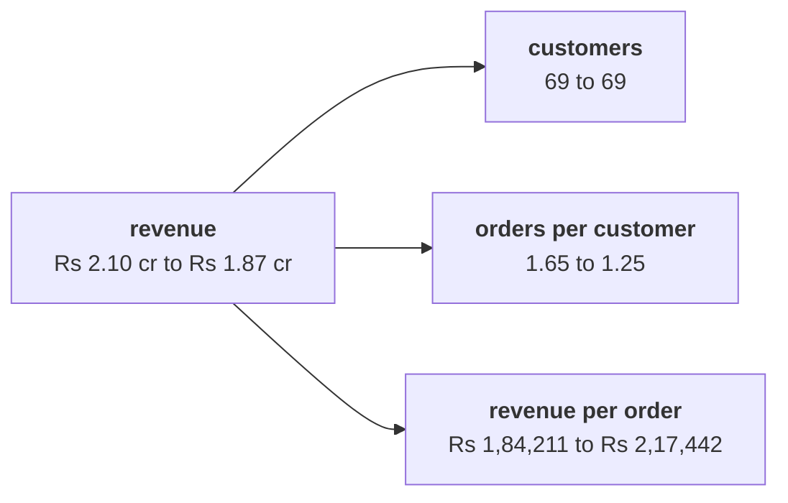

# Chapter 2 scenario set: which branch moved

Ten minutes, alone, then compare with the person beside you before Kavya's review. Every item has
one right answer. Decide first, then record the letter. Items marked design ask for the best-fit
approach, a sizing, the fact that would switch it, or the second route.

Post one line, 6 letters in item order, no spaces:

```
Post exactly this shape: xxxxxx
```

The ask behind every item:

> "Are we losing customers, or are the ones we have buying less? Marketing says more customers." (Meera Raghavan)

The numbers every item refers to, booked orders, the export as it stands:

| Branch | Q1 | Q2 | Ratio |
|---|---|---|---|
| Customers | 69 | 69 | 1.000 |
| Orders per customer | 1.65 | 1.25 | 0.754 |
| Revenue per order | Rs 1,84,211 | Rs 2,17,442 | 1.180 |
| Revenue | Rs 2,10,00,000 | Rs 1,87,00,000 | 0.890 |



---

### Q1. Marketing says the fall needs more customers. Which reading of the tree answers them?

a) Customers fell with orders, 114 to 86, so acquisition is the branch to fund
b) Customers held at 69, so the fall sits in how often they buy
c) Revenue per order rose 18.0 percent, so the fall must sit with customers
d) The tree cannot answer until the four segments are split

### Q2. A colleague adds the leaf changes, minus 24.6 percent and plus 18.0 percent, and reports revenue down 6.6 percent. What is wrong?

a) Nothing: the customer leaf adds zero, so minus 24.6 and plus 18.0 net to minus 6.6
b) The customer leaf was left out of the sum, and it carries the missing 4.4 points
c) The two leaves should be averaged, which puts the fall at 3.3 percent
d) The leaves multiply: 0.754 times 1.180 is 0.890, a fall of 11.0 percent

### Q3. (design) Meera wants rupees per branch on one slide she can follow, and Finance will rebuild the same split every month while two branches keep moving together. Which split fits which reader?

a) The symmetric split for both, since any order of steps is a bias someone will argue
b) Leaf percentages for Meera, since she reads percentages, and the bridge for Finance
c) The bridge in tree order for Meera, order stated; the symmetric split for Finance
d) Customer by customer for both, since it names who moved before anyone adds them up

### Q4. (design) Customers held at 69, orders per customer fell from 1.652 to 1.246, and Q1's revenue per order was Rs 1,84,211. In the tree's order, what does the bridge's frequency step come to?

a) Minus Rs 51,57,895: 69 customers times 0.406 fewer orders at Rs 1,84,211
b) Minus Rs 60,88,372: the same fall in frequency priced at Q2's Rs 2,17,442
c) Minus Rs 23,00,000, since frequency is the only branch of the three that fell
d) Minus Rs 28,57,895, since the order value step takes away the rest of it

### Q5. A hurried count reads every missing discount as zero and finds 43 of Q2's 86 orders "without a discount". Marketing wants the discount extended to them. Why is the premise unsafe?

a) Q1 had 32 blanks as well, so the offer has to reach both quarters' blank orders
b) The 43 hold, but they should be counted by revenue, since orders differ in size
c) Blank and Rs 0 both mean no discount, so the 43 hold and only the offer's size is open
d) Only 17 of the 43 record Rs 0, and the other 26 never recorded the field

### Q6. (design) The second route split the fall symmetrically, choosing no order at all, and charged frequency minus Rs 55,88,480. Set beside the bridge, what does it show?

a) The bridge understated frequency, so its figure has to be corrected upwards
b) Frequency carries the fall either way; the rupees per branch depend on the method
c) The two agree to the rupee once the customers step is added back into the bridge
d) The gap between them is the customers branch, which only the symmetric split sees
