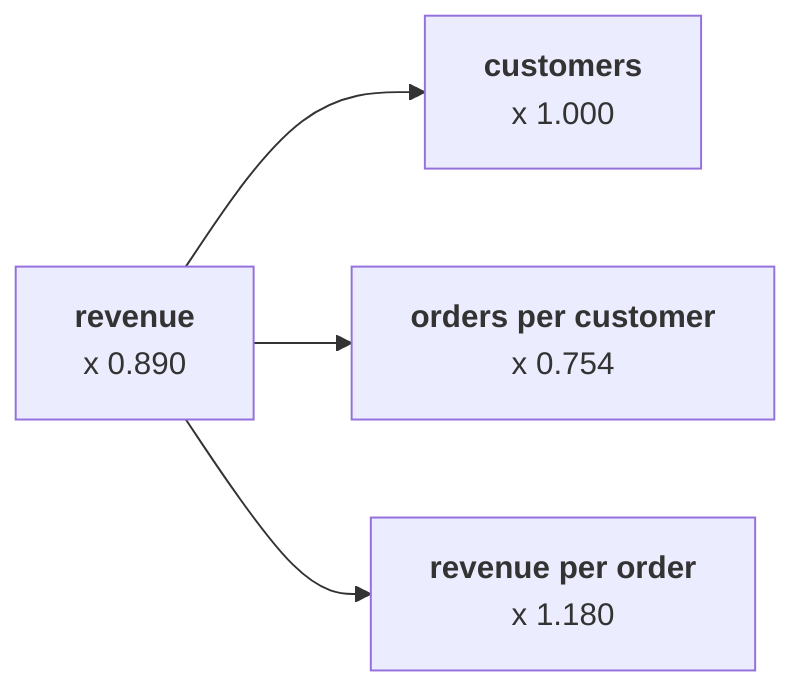

# Chapter 2 scenario set: which branch moved

Ten minutes, alone, then compare with the person beside you before Kavya's review. Every item has
one right answer. Decide first, then record the letter. Items marked design ask for the best-fit
approach, a sizing, the fact that would switch it, or the second route.

Post one line, 6 letters in item order, no spaces:

```
Post exactly this shape: xxxxxx
```

The ask behind every item:

> "Are we losing customers, or are the ones we have buying less? Marketing says more customers." (Meera Raghavan)

The numbers every item refers to, booked orders, the export as it stands:

| Branch | Q1 | Q2 | Ratio |
|---|---|---|---|
| Customers | 69 | 69 | 1.000 |
| Orders per customer | 1.65 | 1.25 | 0.754 |
| Revenue per order | Rs 1,84,211 | Rs 2,17,442 | 1.180 |
| Revenue | Rs 2,10,00,000 | Rs 1,87,00,000 | 0.890 |



---

### Q1. Marketing says the fall needs more customers. Which reading of the tree answers them?

a) Customers fell with orders, 114 to 86, so acquisition is the branch to fund
b) Customers held at 69, so the fall sits in how often they buy
c) Revenue per order rose 18.0 percent, so the fall must be in customers
d) The tree cannot answer until the 4 segments are split

### Q2. A colleague adds the leaf changes, minus 24.6 percent and plus 18.0 percent, and reports revenue down 6.6 percent. What is wrong?

a) Nothing, since percentages on leaves always add to the total change
b) The customer leaf was left out of the sum, and it carries the missing 4.4 points
c) Revenue per order should have been subtracted, not added
d) The leaves multiply, and 0.754 times 1.180 is 0.890, a fall of 11.0 percent

### Q3. (design) Meera wants rupees per branch she can follow. Which split is the best fit, and what would switch it?

a) A bridge in the tree's order with the order stated, and symmetric if rebuilt monthly
b) Leaf percentages alone, with a bridge added only if Meera asks for rupees a second time
c) A symmetric split always, since any order is a bias, and a bridge never
d) Customer by customer for all 69, with a bridge once the list is read

### Q4. (design) Moving frequency first charges it Rs 51,57,895; moving it second charges Rs 60,88,372; the symmetric split says Rs 55,88,480. What does the spread of about Rs 9.3 lakh measure?

a) An error in one of the three computations
b) The discount branch, which the bridge leaves out
c) The part where frequency and order value moved together
d) The rupees Marketing's customer branch should really carry

### Q5. A hurried count reads every missing discount as zero and finds 43 of Q2's 86 orders "without a discount". Marketing wants the discount extended to them. Why is the premise unsafe?

a) The count should have used Q1, which has more orders
b) Discounts belong to Finance, so Marketing cannot extend them without sign-off
c) Only orders above Rs 150 can carry a discount
d) Only 17 of the 43 record Rs 0, and the other 26 never recorded the field

### Q6. (design) The second route priced the 28 lost orders at Q1's Rs 1,84,211 and matched the bridge's frequency step to the rupee. When would this route stop matching?

a) When customers move as well, since lost orders then mix both branches
b) When revenue per order changes, since the price of each order then moves as well
c) When a discount field is missing on some orders
d) When the quarters have different numbers of days
