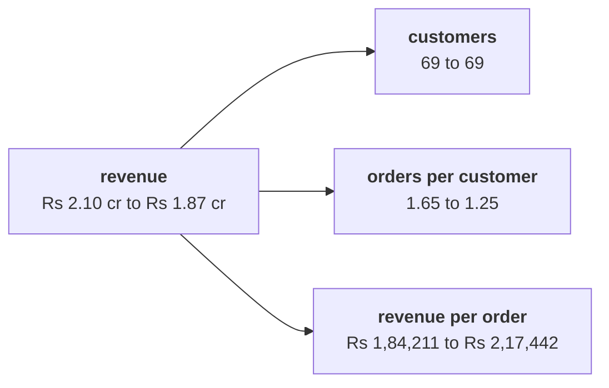

# Which branch of the revenue tree carries the Rs 23,00,000 fall: customers, how often they buy, or what each order is worth?

Chapter 2 set, 6 items, about ten minutes alone after chapter 2, then compare your letters with the person beside you before Kavya's review. Kavya Nair is the senior analyst on Kalpa Retail's data team, and her review is the check that closes every chapter. Monday's revenue tree splits revenue into three leaves, or branches, that multiply: revenue = customers x orders per customer x revenue per order. Customers are the distinct customer ids with an order in the quarter, orders per customer is orders over customers, and revenue per order is revenue over orders. Each leaf is read as a ratio, Q2's value over Q1's.

> "Are we losing customers, or are the ones we have buying less? Marketing says more customers."
>
> Meera Raghavan, CEO, Kalpa Retail

Chapter 1 confirmed the drop on two closed quarters of 13 weeks each: booked revenue, every order placed at the price charged before any cancellation or return, fell from Rs 2,10,00,000 to Rs 1,87,00,000, which is Rs 23,00,000 less and minus 11.0 percent. Frequency is another name for orders per customer. A bridge walks from Q1's revenue to Q2's one leaf at a time, in a stated order, and charges each leaf the rupees its own change moved; in the tree's order customers move first, then orders per customer, then revenue per order. A symmetric split shares the change among the leaves in proportion to each leaf's logarithmic change, so no order is chosen. An order may also record a `discount`, the rupees taken off its price.

**Who needs the answer.** Meera Raghavan, the CEO, decides which owner gets the problem. Marketing owns customers; the owners of the paid membership tier and of the products own how often customers buy; merchandising, the team that chooses the range and the pack sizes, owns what each order is worth; and Finance with Marketing owns price. A wrong split sends crores to the wrong owner for a quarter, and Marketing's Rs 12 crore to a branch that may not have moved.

**The questions on the way.**

- Which reading of the tree answers Marketing's call for more customers?
- What is wrong with a 6.6 percent fall built from the leaves?
- Which split of the fall fits Meera, and which fits Finance?
- What does the bridge's frequency step come to in the tree's order?
- Why is the count of 43 orders without a discount unsafe?
- What does the symmetric split show beside the bridge?

The numbers every item refers to, in booked revenue on the export as it stands:

| Branch | Q1 | Q2 | Ratio |
|---|---|---|---|
| Customers | 69 | 69 | 1.000 |
| Orders per customer | 1.65 | 1.25 | 0.754 |
| Revenue per order | Rs 1,84,211 | Rs 2,17,442 | 1.180 |
| Revenue | Rs 2,10,00,000 | Rs 1,87,00,000 | 0.890 |



Every item has one right answer. Decide first, then record the letter. An item marked Design asks for the best-fit approach, a sizing, the fact that would switch it, or the second route.

**What you post.** One line of 6 letters in item order, no spaces, in this shape:

```
Post exactly this shape: xxxxxx
```

---

### Q1. Which reading of the tree answers Marketing's call for more customers?

Marketing says the fall needs more customers. Which reading of the tree answers them?

a) Customers fell with orders, 114 to 86, so acquisition is the branch to fund
b) Customers held at 69, so the fall sits in how often they buy
c) Revenue per order rose 18.0 percent, so the fall must sit with customers
d) The tree cannot answer until the four segments are split

### Q2. What is wrong with a 6.6 percent fall built from the leaves?

A colleague adds the leaf changes, minus 24.6 percent and plus 18.0 percent, and reports revenue down 6.6 percent. What is wrong?

a) Nothing: the customer leaf adds zero, so minus 24.6 and plus 18.0 net to minus 6.6
b) The customer leaf was left out of the sum, and it carries the missing 4.4 points
c) The two leaves should be averaged, which puts the fall at 3.3 percent
d) The leaves multiply: 0.754 times 1.180 is 0.890, a fall of 11.0 percent

### Q3. Which split of the fall fits Meera, and which fits Finance? (Design)

Meera wants rupees per branch on one slide she can follow, and Finance will rebuild the same split every month while two branches keep moving together. Which split fits which reader?

a) The symmetric split for both, since any order of steps is a bias someone will argue
b) Leaf percentages for Meera, since she reads percentages, and the bridge for Finance
c) The bridge in tree order for Meera, order stated; the symmetric split for Finance
d) Customer by customer for both, since it names who moved before anyone adds them up

### Q4. What does the bridge's frequency step come to in the tree's order? (Design)

Customers stood at 69 in each quarter, orders per customer went from 1.652 to 1.246, and Q1's revenue per order was Rs 1,84,211. In the tree's order, what does the bridge's frequency step come to?

a) Minus Rs 51,57,895: 69 customers times 0.406 fewer orders at Rs 1,84,211
b) Minus Rs 60,88,372: the same fall in frequency priced at Q2's Rs 2,17,442
c) Minus Rs 23,00,000, since frequency is the only branch of the three that fell
d) Minus Rs 28,57,895, since the order value step takes away the rest of it

### Q5. Why is the count of 43 orders without a discount unsafe?

A hurried count reads every missing discount as zero and finds 43 of Q2's 86 orders "without a discount". Marketing wants the discount extended to them. Why is the premise unsafe?

a) Q1 had 32 blanks as well, so the offer has to reach both quarters' blank orders
b) The 43 hold, but they should be counted by revenue, since orders differ in size
c) Blank and Rs 0 both mean no discount, so the 43 hold and only the offer's size is open
d) Only 17 of the 43 record Rs 0, and the other 26 never recorded the field

### Q6. What does the symmetric split show beside the bridge? (Design)

The second route, a symmetric split that chooses no order at all, charged frequency minus Rs 55,88,480. Set beside the bridge, what does it show?

a) The bridge understated frequency, so its figure has to be corrected upwards
b) Frequency carries the fall either way; the rupees per branch depend on the method
c) The two agree to the rupee once the customers step is added back into the bridge
d) The gap between them is the customers branch, which only the symmetric split sees
