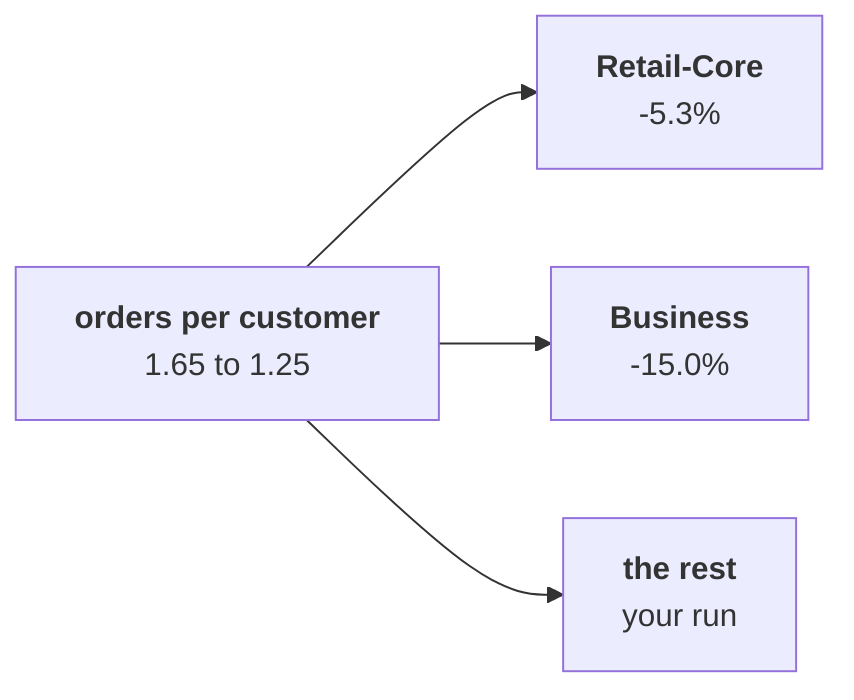

# Chapter 3 scenario set: which segment

Ten minutes, alone, then compare with the person beside you before Kavya's review. Every item has
one right answer. Decide first, then record the letter. Items marked design ask for the best-fit
approach, a sizing, the fact that would switch it, or the second route.

Post one line, 6 letters in item order, no spaces:

```
Post exactly this shape: xxxxxx
```

The ask behind every item:

> "One of my members says the app's reorder button has been broken for six weeks. Is my tier the one slipping?" (the head of Retail-Plus)

The numbers every item refers to, booked orders, the export as it stands:

| Shown on the projector | Customers | Orders Q1, Q2 | Orders per customer Q1, Q2 |
|---|---|---|---|
| Retail-Core | 34 | 38, 36 | 1.12, 1.06 |
| Business | 11 | 20, 17 | 1.82, 1.55 |
| All customers | 69 | 114, 86 | 1.65, 1.25 |



---

### Q1. (design) Copying the loop takes 72 lines and 8 places to edit, a function 21 lines and 1 place, and one pass by key 14 lines and 1 place, shaped for these eight groups. A channel, a month and delivered orders are asked for later today. Which is the best fit?

a) Copy the loop per group, since each copy can be checked on its own
b) One pass by key, since it is the shortest code and reads the rows once
c) A spreadsheet, since eight groups are few enough to total by hand
d) A function, tree_for(rows), since each later subset is one more call

### Q2. (design) Next quarter's export holds 40 lakh orders, and Anand wants all 40 segment-and-month groups every Monday. Filtering the export once per group and totalling each group reads how many rows, against one pass by key?

a) 16 crore rows against 40 lakh, so one pass by key takes over
b) 40 lakh either way, since each group's total reads only its own rows
c) 16 crore against 40 lakh, and filtering stays, since each group is easy to check
d) 1,600 rows against 200, the same gap as on today's file

### Q3. Anand's summary table shows a blank for Q1 orders per customer, although calling the helper on its own in a cell shows 1.65 under it. What went wrong?

a) The table was filled before the helper ran, so it still holds an old blank
b) The helper rounds 1.652 to 1.65, and the table will not take a rounded value
c) The helper printed its answer and returned nothing, so the table got None
d) The helper returned from inside its loop, before the last order was counted

### Q4. Averaged over the four segments, orders per customer reads 1.94 then 1.82, a fall of 6.0 percent. The four segments hold 69 customers, who placed 114 orders in Q1 and 86 in Q2. What does the roll-up with weights give?

a) 1.94 to 1.82, since the weights cancel out once all four segments are counted
b) 1.65 to 1.25, a fall of 24.6 percent, so frequency is the branch after all
c) 1.65 to 1.25, a fall of 32.0 percent, measured against the Q2 figure
d) 0.61 to 0.80, total customers over total orders in each quarter

### Q5. Business revenue fell Rs 22,29,720 on three fewer orders. `describe` shows the median Business order barely moved while the range rose about 73 percent. What do you say about the typical Business order?

a) It held: one very large order stretched the range; the fall is three fewer orders
b) It grew, since a range up 73 percent means the middle of the orders moved up too
c) It shrank, since revenue fell by Rs 22 lakh while the count moved by only three
d) It is the mean here, since a median ignores the lakh-sized orders that matter most

### Q6. Anand asks for the company's orders per customer rolled up from the four segments. Order the steps: p) divide total orders by total customers, q) compute each segment's orders and customers in each quarter, r) check the result against chapter 2's 1.65 and 1.25, s) add the segments' orders and their customers. Which order is right?

a) q, p, s, r
b) s, q, p, r
c) q, s, r, p
d) q, s, p, r
