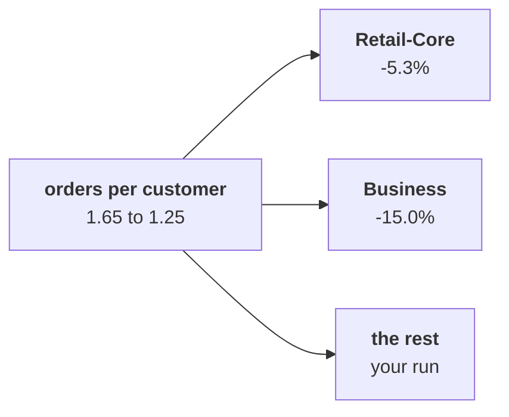

# Chapter 3 scenario set: which segment

Ten minutes, alone, then compare with the person beside you before Kavya's review. Every item has
one right answer. Decide first, then record the letter. Items marked design ask for the best-fit
approach, a sizing, the fact that would switch it, or the second route.

Post one line, 6 letters in item order, no spaces:

```
Post exactly this shape: xxxxxx
```

The ask behind every item:

> "One of my members says the app's reorder button has been broken for six weeks. Is my tier the one slipping?" (the head of Retail-Plus)

The numbers every item refers to, booked orders, the export as it stands:

| Shown on the projector | Customers | Orders Q1, Q2 | Orders per customer Q1, Q2 |
|---|---|---|---|
| Retail-Core | 34 | 38, 36 | 1.12, 1.06 |
| Business | 11 | 20, 17 | 1.82, 1.55 |
| All customers | 69 | 114, 86 | 1.65, 1.25 |



---

### Q1. (design) The same five numbers are needed for four segments in two quarters, then for a channel and for delivered orders later today. Which is the best fit?

a) Paste the loop once per group, since eight copies are quick to type
b) One pass grouped by (quarter, segment), since it reads fewest rows
c) A spreadsheet, since the groups are few enough to read by eye
d) A function `tree_for(rows)`, since any later subset is one call

### Q2. (design) Which fact would switch the call from a function to one pass grouped by key?

a) Millions of rows with every group needed at once
b) A definition that changes once a quarter
c) A stakeholder who asks for one segment at a time
d) A file of 200 orders with four segments

### Q3. Anand's summary table shows a blank for Q1 orders per customer, though the helper printed 1.65 on screen. What went wrong?

a) The rows list was empty, so the division failed silently
b) The function computed the wrong rate for that quarter
c) The function printed its answer and returned nothing
d) Python rounds a float to None when it prints it

### Q4. Averaged over the four segments, orders per customer reads 1.94 then 1.82, a fall of 6.0 percent. A colleague says frequency is not the branch after all. What is the check?

a) The averages must be recomputed to three decimals, 1.939 and 1.822
b) The roll-up must reproduce the company figures, 1.65 and 1.25
c) The smallest segment, 2 customers, must be dropped and the rest averaged
d) The medians of the 4 segments' rates must be compared in its place

### Q5. Business revenue fell Rs 22,29,720. `describe` shows the median order barely moved while the range rose about 73 percent. What do you say about the typical Business order?

a) The typical order held, while one large order stretched the range
b) Every Business order got smaller, which is why Business revenue fell
c) The typical order grew sharply, so Business customers spend more
d) Nothing can be said until the mean is computed

### Q6. Anand asks for the company's orders per customer rolled up from the four segments. Order the steps: p) add each segment's orders, q) add each segment's customers, r) divide total orders by total customers, s) check the result is 1.65 and 1.25. Which order is right?

a) s, p, q, r
b) r, p, q, s
c) p, r, q, s
d) p, q, r, s
