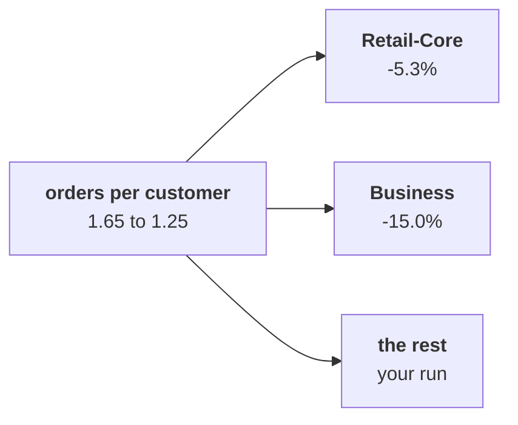

# Which of the four customer segments carries the fall in orders per customer, measured the same way for every segment and quarter?

The chapter 3 set has six items. Take about ten minutes alone after chapter 3, then compare your letters with the person beside you before Kavya's review. Kavya Nair is the senior analyst on Kalpa Retail's data team, and her review is the check that closes every chapter. Orders per customer is orders over customers, one of the three branches of Monday's revenue tree, revenue = customers x orders per customer x revenue per order. Kalpa's customers sit in four segments. Two appear in the exhibit below: Retail-Core, shoppers who place many small orders, and Business, Kalpa's sales to companies, a few very large accounts whose every order runs to lakhs. The other two, the paid membership tier and Student, a segment of small discounted baskets, are left to your own run.

> "One of my members says the app's reorder button has been broken for six weeks. Is my tier the one slipping?"
>
> The head of the paid membership tier, Kalpa Retail

Chapter 2 found where the fall sits: the same 69 customers placed 114 orders in Q1 and 86 in Q2, so orders per customer went from 1.65 to 1.25. Chapter 3 weighed three ways to compute the same numbers for eight groups, four segments in two quarters: copying the loop once per group, writing it once as a function, or one pass by key, a single loop that adds every order into a total kept for its quarter and segment. It wrote the tree once as `tree_for(rows)`, a function that takes any list of orders and gives its revenue, orders, customers and the two rates, and a second helper, `describe`, which gives a group's median order, the middle one once the orders are sorted, its smallest and largest order, and its range, the largest less the smallest. A roll-up turns the four segments' figures into one company figure. Anand Iyer, Kalpa's finance controller, keeps a summary table of these numbers.

**Who needs the answer.** The head of the paid membership tier decides whether his tier needs rescuing. Renewals, the members who pay for another year, are the metric of his job, so orders per member is his number. A wrong answer costs a tier nobody protects, or a quarter spent fixing one that was fine.

**The questions on the way.**

- Which way should compute the same numbers for eight groups and for the asks due later today?
- How many rows does filtering once per group read on 40 lakh orders?
- Why does Anand's summary table show a blank where the helper shows 1.65?
- What does a weighted roll-up of the four segments give?
- What happened to the typical Business order in Q2?
- In which order does the roll-up of the four segments run?

Every item refers to these numbers, as the projector showed them, in booked orders on the export as it stands:

| Shown on the projector | Customers | Orders Q1, Q2 | Orders per customer Q1, Q2 |
|---|---|---|---|
| Retail-Core | 34 | 38, 36 | 1.12, 1.06 |
| Business | 11 | 20, 17 | 1.82, 1.55 |
| All customers | 69 | 114, 86 | 1.65, 1.25 |



Every item has one right answer. Decide first, then record the letter. An item marked Design asks for the best-fit approach, a sizing, the fact that would switch it, or the second route.

**What you post.** You post one line of six letters in item order, with no spaces, in this shape:

```
Post exactly this shape: xxxxxx
```

---

### Q1. Which way should compute the same numbers for eight groups and for the asks due later today? (Design)

Copying the loop takes 72 lines and 8 places to edit, a function 21 lines and 1 place, and one pass by key 14 lines and 1 place, shaped for these eight groups. A channel, a month and delivered orders are asked for later today. Which is the best fit?

a) Copy the loop per group, since each copy can be checked on its own
b) One pass by key, since it is the shortest code and reads the rows once
c) A spreadsheet, since eight groups are few enough to total by hand
d) A function, tree_for(rows), since each later subset is one more call

### Q2. How many rows does filtering once per group read on 40 lakh orders? (Design)

Suppose next quarter's export holds 40 lakh orders, and Anand wants all 40 segment-and-month groups every Monday. Filtering the export once per group and totalling each group reads how many rows, against one pass by key?

a) 16 crore rows against 40 lakh, so one pass by key takes over
b) 40 lakh either way, since each group's total reads only its own rows
c) 16 crore against 40 lakh, and filtering stays, since each group is easy to check
d) 1,600 rows against 200, the same gap as on today's file

### Q3. Why does Anand's summary table show a blank where the helper shows 1.65?

Anand's summary table shows a blank for Q1 orders per customer, although calling the helper that computes it on its own in a cell shows 1.65 under it. What went wrong?

a) The table was filled before the helper ran, so it still holds an old blank
b) The helper rounds 1.652 to 1.65, and the table will not take a rounded value
c) The helper printed its answer and returned nothing, so the table got None
d) The helper returned from inside its loop, before the last order was counted

### Q4. What does a weighted roll-up of the four segments give?

Averaged over the four segments, orders per customer reads 1.94 then 1.82, a fall of 6.0 percent. The four segments hold 69 customers, who placed 114 orders in Q1 and 86 in Q2. What does the roll-up with weights give?

a) 1.94 to 1.82, since the weights cancel out once all four segments are counted
b) 1.65 to 1.25, a fall of 24.6 percent, so frequency is the branch after all
c) 1.65 to 1.25, a fall of 32.0 percent, measured against the Q2 figure
d) 0.61 to 0.80, total customers over total orders in each quarter

### Q5. What happened to the typical Business order in Q2?

Business revenue fell Rs 22,29,720 on three fewer orders. `describe` shows the median Business order barely moved while the range rose about 73 percent. What do you say about the typical Business order?

a) It held: one very large order stretched the range; the fall is three fewer orders
b) It grew, since a range up 73 percent means the middle of the orders moved up too
c) It shrank, since revenue fell by Rs 22 lakh while the count moved by only three
d) It is the mean here, since a median ignores the lakh-sized orders that matter most

### Q6. In which order does the roll-up of the four segments run?

Anand asks for the company's orders per customer rolled up from the four segments. Order the steps: p) divide total orders by total customers, q) compute each segment's orders and customers in each quarter, r) check the result against the company figure from chapter 2, s) add the segments' orders and their customers. Which order is right?

a) q, p, s, r
b) s, q, p, r
c) q, s, r, p
d) q, s, p, r
