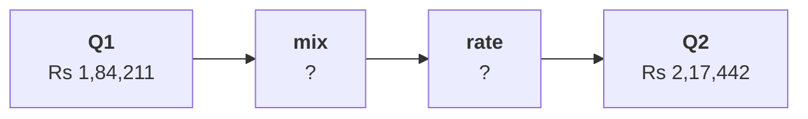

# Chapter 4 scenario set: mix or rate

Ten minutes, alone, then compare with the person beside you before Kavya's review. Every item has
one right answer. Decide first, then record the letter. Items marked design ask for the best-fit
approach, a sizing, the fact that would switch it, or the second route.

Post one line, 6 letters in item order, no spaces:

```
Post exactly this shape: xxxxxx
```

The ask behind every item:

> "Revenue per order is up 18 percent. Our customers are happy to pay more. Put a price rise into the plan." (the marketing lead)

The numbers every item refers to, booked orders, the export as it stands:

| Segment | Share of orders Q1, Q2 | Revenue per order Q1 | Revenue per order Q2 |
|---|---|---|---|
| Retail-Core | 33.3%, 41.9% | Rs 2,117 | Rs 2,014 |
| Retail-Plus | 44.7%, 30.2% | Rs 2,815 | Rs 3,012 |
| Business | 17.5%, 19.8% | Rs 10,38,559 | Rs 10,90,674 |
| Student | 4.4%, 8.1% | Rs 962 | Rs 1,104 |
| All orders | 114, 86 orders | Rs 1,84,211 | Rs 2,17,442 |



---

### Q1. Which reading of the table answers Marketing's price claim?

a) No segment rose 18%; small member orders left the blend
b) Business rose 5.0 percent, so prices across the range can safely rise 5 percent
c) Student rose 14.8 percent, so the young pay more
d) Retail-Core fell, so its prices should be cut

### Q2. (design) Four readings of the rise were on the table: the blended change, each segment's rate, a mix-and-rate split, and medians. Which is the best fit?

a) The blended change, since it is the number Marketing quoted to Meera
b) Medians per segment, since one large order cannot move them
c) The mix-and-rate split, since it puts rupees on each cause
d) Each segment's rate alone, since it answers everything asked

### Q3. (design) Which fact would make the per-segment table enough without a mix split?

a) A rise in revenue per order larger than 18 percent
b) A segment whose rate fell while the blend rose
c) Four segments instead of two
d) Similar order sizes, or shares that held

### Q4. At Q2's mix and Q1's segment rates, revenue per order would be Rs 2,07,112. How much of the Rs 33,231 rise is mix?

a) Rs 10,330, the part inside segments
b) Rs 22,902, about 69 percent
c) Rs 33,231, all of it
d) Rs 2,07,112, the counterfactual itself

### Q5. The rate part, Rs 10,330, splits by segment. Which segment carries most of it, and why does that matter for the price rise?

a) Retail-Plus, so members did pay noticeably more for each order they placed
b) Retail-Core, so everyday shoppers carry the rise
c) Business, whose lakh-sized orders dominate
d) Student, whose rate rose most in percentage terms

### Q6. (design) Moving the rate first gives mix Rs 24,028 instead of Rs 22,902. What does the second route confirm?

a) Both add to Rs 33,231; mix stays over two thirds
b) The first split had an arithmetic error of Rs 1,126 in its mix part
c) The rate-first order is the correct one to report
d) Mix and rate cannot be separated on this file
