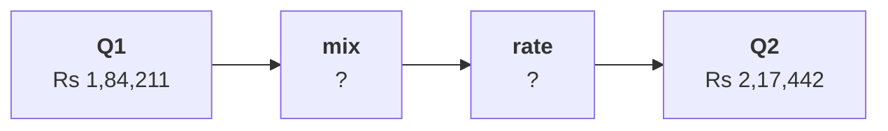

# Chapter 4 scenario set: mix or rate

Ten minutes, alone, then compare with the person beside you before Kavya's review. Every item has
one right answer. Decide first, then record the letter. Items marked design ask for the best-fit
approach, a sizing, the fact that would switch it, or the second route.

Post one line, 6 letters in item order, no spaces:

```
Post exactly this shape: xxxxxx
```

The ask behind every item:

> "Revenue per order is up 18 percent. Our customers are happy to pay more. Put a price rise into the plan." (the marketing lead)

The numbers every item refers to, booked orders, the export as it stands:

| Segment | Share of orders Q1, Q2 | Revenue per order Q1 | Revenue per order Q2 |
|---|---|---|---|
| Retail-Core | 33.3%, 41.9% | Rs 2,117 | Rs 2,014 |
| Retail-Plus | 44.7%, 30.2% | Rs 2,815 | Rs 3,012 |
| Business | 17.5%, 19.8% | Rs 10,38,559 | Rs 10,90,674 |
| Student | 4.4%, 8.1% | Rs 962 | Rs 1,104 |
| All orders | 114, 86 orders | Rs 1,84,211 | Rs 2,17,442 |



---

### Q1. Which reading of the table answers Marketing's price claim?

a) Business rose 5.0 percent, so prices across the range can safely rise 5 percent
b) No segment rose 18 percent, so small member orders leaving the blend explain it
c) Student rose 14.8 percent, so the students' higher prices explain the blended rise
d) Retail-Core fell 4.9 percent, so its prices should be cut to win the orders back

### Q2. (design) Match each question to the reading that answers it: 1 how big is the rise, 2 did any segment pay more, 3 how much of the rise is mix, 4 what is a typical order; P the per-segment rates, Q the medians, R the blended change, S the mix-and-rate split. Which pairing holds?

a) 1R 2S 3P 4Q
b) 1S 2P 3R 4Q
c) 1R 2P 3S 4Q
d) 1R 2P 3Q 4S

### Q3. (design) Which fact would make the per-segment table enough without a mix split?

a) A rise in revenue per order larger than the 18 percent seen this quarter
b) Segments whose own rates all moved by less than the blend did
c) Four segments instead of two
d) Segments with similar order sizes, or shares that held still

### Q4. (design) Price Q2's order mix at each segment's Q1 revenue per order, using the table. What does revenue per order come to, and how much of the Rs 33,231 rise is mix?

a) Rs 2,07,112, so the mix is Rs 22,902 of the rise, about 69 percent
b) Rs 2,07,112, so the mix is Rs 10,330 of the rise, about 31 percent
c) Rs 1,93,414, so the mix is Rs 9,203 of the rise, about 28 percent
d) Rs 2,17,442, so the mix is all Rs 33,231 of the rise, every rupee

### Q5. The rate part of the rise, what is left once the mix is priced, splits by segment. Which segment carries most of it, and why does that matter for the price rise?

a) Retail-Plus, so members did pay noticeably more for each order they placed
b) Business, since its lakh-sized orders dominate the rate part
c) Retail-Core, so everyday shoppers carry the rise
d) Student, whose rate rose most in percentage terms

### Q6. (design) The envelope route treats Kalpa as two groups: Business's share of orders rose from 17.5 to 19.8 percent, and a Q1 Business order was worth Rs 10,36,125 more than a consumer order. What does it put on the mix, and what does that show?

a) About Rs 23,000, within 1 percent of the split, so the call holds however it is cut
b) About Rs 23,000, so the four-segment split was out by Rs 137 and needs correcting
c) About Rs 2,300, since a 2.2-point move in share moves the blend 2.2 percent at most
d) All Rs 33,231, since only Business's share moved while the consumer prices held
