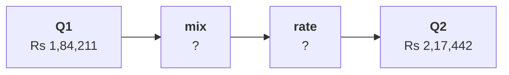

# Revenue per order rose 18 percent while revenue fell: did customers pay more, or did the mix of orders change?

The chapter 4 set has six items. Take about ten minutes alone after chapter 4, then compare your letters with the person beside you before Kavya's review. Kavya Nair is the senior analyst on Kalpa Retail's data team, and her review is the check that closes every chapter. Revenue per order is revenue over orders, one branch of Monday's revenue tree, and the blended figure is taken over every order of every segment together. Kalpa has four segments: Retail-Core, shoppers who place many small orders; Retail-Plus, the paid membership tier; Student, small discounted baskets; and Business, Kalpa's sales to companies, every order in lakhs. The first three are the consumer segments.

> "Revenue per order is up 18 percent. Our customers are happy to pay more. Put a price rise into the plan."
>
> The marketing lead, Kalpa Retail

Chapter 2 found the same 69 customers in both quarters, orders per customer down from 1.65 to 1.25, and revenue per order up 18.0 percent, from Rs 1,84,211 to Rs 2,17,442, a rise of Rs 33,231, while booked revenue, every order placed at the price charged before any cancellation or return, fell 11.0 percent, from Rs 2,10,00,000 to Rs 1,87,00,000. Chapter 3's run of all four segments found orders per customer fell furthest in Retail-Plus, where the same 22 members placed 26 orders in Q2 against 51 in Q1. The mix is each segment's share of the quarter's orders, and a segment's rate is its own revenue per order. Splitting a change into mix and rate prices Q2's mix at each segment's Q1 rate: what that moves is the mix part, and the rest, the change inside the segments, is the rate part. A segment's median is its middle order once the orders are sorted, the typical order.

**Who needs the answer.** Meera Raghavan, the CEO, and Finance decide whether a price rise goes into the plan, on Marketing's reading of the 18 percent. A wrong reading raises prices on customers who never paid more, and costs volume in the tier whose orders already halved.

**The questions on the way.**

- Which reading of the table answers Marketing's price claim?
- Which reading answers each of four questions about the rise?
- When would the per-segment table be enough without a mix split?
- How much of the Rs 33,231 rise is mix?
- Which segment carries most of the rate part?
- What does a split into Business and everyone else put on the mix?

Every item refers to these numbers, in booked orders on the export as it stands:

| Segment | Share of orders Q1, Q2 | Revenue per order Q1 | Revenue per order Q2 |
|---|---|---|---|
| Retail-Core | 33.3%, 41.9% | Rs 2,117 | Rs 2,014 |
| Retail-Plus | 44.7%, 30.2% | Rs 2,815 | Rs 3,012 |
| Business | 17.5%, 19.8% | Rs 10,38,559 | Rs 10,90,674 |
| Student | 4.4%, 8.1% | Rs 962 | Rs 1,104 |
| All orders | 114, 86 orders | Rs 1,84,211 | Rs 2,17,442 |



Every item has one right answer. Decide first, then record the letter. An item marked Design asks for the best-fit approach, a sizing, the fact that would switch it, or the second route.

**What you post.** You post one line of six letters in item order, with no spaces, in this shape:

```
Post exactly this shape: xxxxxx
```

---

### Q1. Which reading of the table answers Marketing's price claim?

Marketing reads the blended rise of 18.0 percent as customers paying more. Which reading of the table answers Marketing's price claim?

a) Business rose 5.0 percent, so prices across the range can safely rise 5 percent
b) No segment rose 18 percent, so small member orders leaving the blend explain it
c) Student rose 14.8 percent, so the students' higher prices explain the blended rise
d) Retail-Core fell 4.9 percent, so its prices should be cut to win the orders back

### Q2. Which reading answers each of four questions about the rise? (Design)

Match each question to the reading that answers it: 1 how big is the rise, 2 did any segment pay more, 3 how much of the rise is mix, 4 what is a typical order; P the per-segment rates, Q the medians, R the blended change, S the mix-and-rate split. Which pairing holds?

a) 1R 2S 3P 4Q
b) 1S 2P 3R 4Q
c) 1R 2P 3S 4Q
d) 1R 2P 3Q 4S

### Q3. When would the per-segment table be enough without a mix split? (Design)

Which fact would make the per-segment table enough without a mix split?

a) A rise in revenue per order larger than the 18 percent seen this quarter
b) Segments whose own rates all moved by less than the blend did
c) Four segments instead of two
d) Segments with similar order sizes, or shares that held still

### Q4. How much of the Rs 33,231 rise is mix? (Design)

Price Q2's order mix at each segment's Q1 revenue per order, using the table. What does revenue per order come to, and how much of the Rs 33,231 rise is mix?

a) Rs 2,07,112, so the mix is Rs 22,902 of the rise, about 69 percent
b) Rs 2,07,112, so the mix is Rs 10,330 of the rise, about 31 percent
c) Rs 1,93,414, so the mix is Rs 9,203 of the rise, about 28 percent
d) Rs 2,17,442, so the mix is all Rs 33,231 of the rise, every rupee

### Q5. Which segment carries most of the rate part?

The rate part of the rise, what is left once the mix is priced, splits by segment. Which segment carries most of it, and why does that matter for the price rise?

a) Retail-Plus, so members did pay noticeably more for each order they placed
b) Business, since its lakh-sized orders dominate the rate part
c) Retail-Core, so everyday shoppers carry the rise
d) Student, whose rate rose most in percentage terms

### Q6. What does a split into Business and everyone else put on the mix? (Design)

The envelope route, a sum small enough for the back of an envelope, treats Kalpa as two groups: Business's share of orders rose from 17.5 to 19.8 percent, and a Q1 Business order was worth Rs 10,36,125 more than a consumer order. What does it put on the mix, and what does that show?

a) About Rs 23,000, within 1 percent of the split, so the call holds however it is cut
b) About Rs 23,000, so the four-segment split was out by Rs 137 and needs correcting
c) About Rs 2,300, since a 2.2-point move in share moves the blend 2.2 percent at most
d) All Rs 33,231, since only Business's share moved while the consumer prices held
