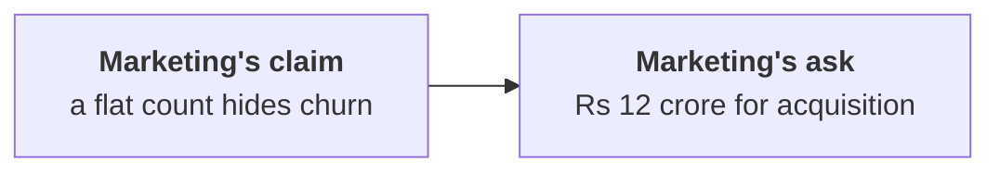

# Marketing says the flat count hides customers lost and replaced: were any lost, who slowed instead, and which segment fell most?

Chapter 5 set, 6 items, about ten minutes alone after chapter 5, then compare your letters with the person beside you before Kavya's review. Kavya Nair is the senior analyst on Kalpa Retail's data team, and her review is the check that closes every chapter. A customer is a distinct customer id with an order in the quarter, and churn is a customer who stops buying. Kalpa's consumer business is its three consumer segments together: Retail-Core, shoppers who place many small orders; Retail-Plus, the paid membership tier; and Student, small discounted baskets. Business, Kalpa's sales to companies, runs to lakhs an order.

> "A flat count can hide churn replaced by new customers. And Retail-Plus is Rs 65,250 out of a Rs 23 lakh fall."
>
> The marketing lead, Kalpa Retail

Chapter 2 counted 69 customers in each quarter while orders fell from 114 to 86, so orders per customer went from 1.65 to 1.25, and booked revenue, every order placed at the price charged before any cancellation or return, fell Rs 23 lakh, from Rs 2,10,00,000 to Rs 1,87,00,000. Chapter 3's run of the four segments found the steepest fall in orders per customer in Retail-Plus, where the same 22 members placed 26 orders in Q2 against 51 in Q1, and chapter 4 found that 25 of the 28 lost orders were Retail-Plus orders of about three thousand rupees each. Chapter 5 weighed four ways to test the churn claim: comparing the counts; comparing the two quarters' customer ids as sets, the id overlap; reading the customers one by one; and asking Marketing's CRM, its customer database, for sign-ups.

**Who needs the answer.** Meera Raghavan, the CEO, decides whether to release the Rs 12 crore acquisition budget, which Marketing now rests on churn hiding in a flat count. A wrong answer spends crores replacing customers who never left, while the ones who slowed keep slowing.

**The questions on the way.**

- Which test can see churn behind a flat count, and when would it mislead?
- When does a table of all 69 customers become the better fit?
- Which reply answers Marketing on the 23 customers who ordered less?
- Which fix keeps every segment in Meera's summary?
- Does the tier's Rs 65,250 matter in a Rs 23 lakh fall?
- What does each customer's first and last order date add, and where does it stop?

The numbers every item refers to, in booked orders on the export as it stands:

| Measure | Value |
|---|---|
| Customer ids in Q1, in Q2 | 69, 69 |
| Customers who placed fewer orders in Q2 | 23 |
| Consumer revenue, Q1 to Q2 | Rs 2,28,820 to Rs 1,58,540 |
| Business revenue fall | Rs 22,29,720 on 3 fewer orders |



Every item has one right answer. Decide first, then record the letter. An item marked Design asks for the best-fit approach, a sizing, the fact that would switch it, or the second route.

**What you post.** One line of 6 letters in item order, no spaces, in this shape:

```
Post exactly this shape: xxxxxx
```

---

### Q1. Which test can see churn behind a flat count, and when would it mislead? (Design)

Which test answers "a flat count hides churn replaced by new customers" most directly, and what would make you distrust it?

a) Count each quarter's customers by segment; a segment whose definition changed
b) Ask Marketing's CRM for sign-ups by month; a campaign that ran in both quarters
c) Compare the ids in both quarters, only in Q1 and only in Q2; one person with two ids
d) Compare the counts under a new definition of customer; a customer who changed segment

### Q2. When does a table of all 69 customers become the better fit? (Design)

Marketing's churn claim already has its answer in a few counts. When does a table of all 69 customers, one row each, become the better fit?

a) When the next question is who slowed, which three counts cannot name
b) When the export holds more than a few hundred customers in a quarter
c) When Marketing wants the result in rupees rather than in customers
d) When the ids come from two systems that each number customers apart

### Q3. Which reply answers Marketing on the 23 customers who ordered less?

Marketing concedes that nobody left, then adds: "23 customers ordered less, and that is churn in all but name." Which reply holds?

a) They are right: a customer who orders less is halfway gone, so acquisition gets funded
b) Buying less is frequency: all 23 bought in Q2, so the lever is keeping them buying
c) Split the 23 by segment first, since churn hides inside segments until they are split
d) Leave the 23 out of the customer count, since customers who slow down distort it

### Q4. Which fix keeps every segment in Meera's summary?

Last quarter's summary script prints `summary: {'Retail-Core': -5.3, 'Business': -15.0}` because its helper, `pct_change`, returns a value only when the change is 30 percent or less. Which fix to the logic keeps every segment in Meera's summary?

a) Raise the threshold to 50 percent, so that fewer of the changes print
b) Print the change as well as returning it, so both appear on the screen
c) Filter with `if ch < 0`, so that a None is compared with zero as well
d) Always hand back a number, and mark large changes in a separate column

### Q5. Does the tier's Rs 65,250 matter in a Rs 23 lakh fall?

Marketing says Retail-Plus is Rs 65,250 out of a Rs 23 lakh fall, so it does not matter. Using the table, which reply holds?

a) They are right in rupees, so the memo leads with Business and footnotes the tier
b) Retail-Plus is 93 percent of the consumer business's Rs 70,280 fall
c) The tier is 49 percent of the fall, since its orders per member fell 49 percent
d) The tier is 3 percent of the fall, so the reorder complaint can wait a quarter

### Q6. What does each customer's first and last order date add, and where does it stop? (Design)

The second route took each customer's first and last order date in the export and counted who first ordered in Q2 or last ordered in Q1: 0 and 0. What does it add, and where does it stop?

a) Nothing new, since it reads the same 69 ids the first route already compared
b) It proves that no customer has left Kalpa since the business opened
c) It shows which customers slowed, which the overlap cannot see
d) The same 0 and 0 from dates alone; new still means new since 1 April
