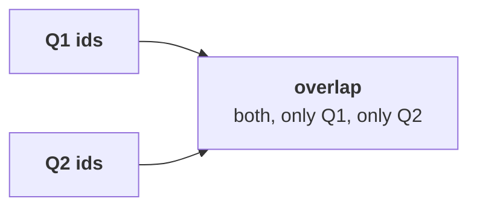

# Chapter 5 scenario set: Marketing's hypothesis

Ten minutes, alone, then compare with the person beside you before Kavya's review. Every item has
one right answer. Decide first, then record the letter. Items marked design ask for the best-fit
approach, a sizing, the fact that would switch it, or the second route.

Post one line, 6 letters in item order, no spaces:

```
Post exactly this shape: xxxxxx
```

The ask behind every item:

> "A flat count can hide churn replaced by new customers. And Retail-Plus is Rs 65,250 out of a Rs 23 lakh fall." (the marketing lead)

The numbers every item refers to, booked orders, the export as it stands:

| Measure | Value |
|---|---|
| Customer ids in Q1, in Q2 | 69, 69 |
| Customers who placed fewer orders in Q2 | 23 |
| Consumer revenue, Q1 to Q2 | Rs 2,28,820 to Rs 1,58,540 |
| Business revenue fall | Rs 22,29,720 on 3 fewer orders |



---

### Q1. (design) Which test answers "a flat count hides churn replaced by new customers" most directly?

a) Compare the counts again with a different definition of customer
b) Ask Marketing's CRM for new sign-ups by month
c) The id overlap: both, only Q1, only Q2
d) Average the orders per customer across segments

### Q2. (design) What would make you distrust the id overlap?

a) One person holding a store id and an app id
b) A quarter holding many more orders than the other quarter does
c) A segment with only two customers
d) An export with 200 rows instead of 2,000

### Q3. The overlap comes out 69 in both quarters, 0 only in Q1, 0 only in Q2. What goes back to Marketing?

a) Churn is hidden in the segments, so split them first and run the overlap per segment
b) None lost, none new: acquisition has nothing to replace
c) The flat count proves customers are loyal, so no action is needed
d) The overlap is inconclusive until Thursday's test

### Q4. Last quarter's script prints `summary: {'Retail-Core': -5.3, 'Business': -15.0}`. Which check exposes the problem fastest?

a) Recompute Business's change by hand
b) Check that every change in the summary is negative, as a fall should be
c) Sort the summary by the size of the change
d) Count groups in and out: 4 in, 2 back

### Q5. Marketing says Retail-Plus is Rs 65,250 out of a Rs 23 lakh fall, so it does not matter. Which reply holds?

a) They are right: 3 percent of the fall is noise and can be left out of the note
b) Retail-Plus is 93% of the consumer fall, 25 of 28 lost orders
c) Business should be dropped from the file as an outlier
d) Rupees never matter; only orders count

### Q6. (design) The second route found the consumer fall by subtracting Business from the company fall. When is the bridge by segment the better route?

a) When the question is who moved
b) When the numbers are large
c) When Business is the largest segment in rupees
d) When the quarters are of unequal length
