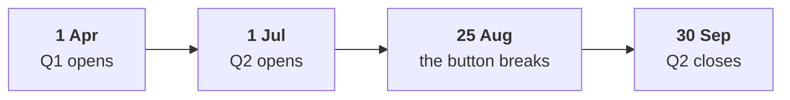

# Chapter 6 scenario set: the memo and its evidence

Ten minutes, alone, then compare with the person beside you before Kavya's review. Every item has
one right answer. Decide first, then record the letter. Items marked design ask for the best-fit
approach, a sizing, the fact that would switch it, or the second route.

Post one line, 6 letters in item order, no spaces:

```
Post exactly this shape: xxxxxx
```

The ask behind every item:

> "It is the broken reorder button. One of my members says it has been broken for six weeks." (the head of Retail-Plus)

The numbers every item refers to, booked orders, the export as it stands:

| Retail-Plus window | Days | Orders | Orders per week |
|---|---|---|---|
| Q1, 1 Apr to 30 Jun | 91 | 51 | 3.92 |
| Q2, 1 Jul to 24 Aug | 55 | 18 | 2.29 |
| Q2, 25 Aug to 30 Sep | 37 | 8 | 1.51 |



---

### Q1. (design) The memo is due tonight. Four tests are on the table: A, before and after the break (the tier's 77 orders, minutes); B, Retail-Core as a comparison (151 orders, minutes); C, the tier by channel (77 orders, minutes); D, the app's reorder logs (a request, days away). Which plan fits?

a) D first, since it settles the question, then A to C if the logs run late
b) A alone, since timing already shows the fall began before the break
c) A, B and C tonight in that order, and the request for D sent today
d) B, C and D, since the complaint already dates the break for us

### Q2. The hurried memo says the button cost 25 orders and Rs 65,250. What is wrong with the figure?

a) It uses booked orders instead of the delivered orders the board pack counts
b) It should be measured in members, 22 in both quarters, and not in orders
c) It counts only the 13 and 8 app orders, leaving out the web and the store
d) It charges the button with about eight weeks of losses from before it broke

### Q3. (design) The tier placed 18 orders in the 55 days before the break and 8 in the 37 days after it. At most how many orders can the button explain?

a) About 10, since 18 orders came before the break and 8 came after it
b) About 4: the pre-break pace gives about 12.1 in 37 days, and 8 came
c) About 25, the tier's whole fall from Q1's 51 orders to Q2's 26
d) About 12, the 12.1 orders the pre-break pace predicts after the break

### Q4. Retail-Core kept 95 percent of its Q1 orders and Retail-Plus 51 percent. Which cause does this rule out?

a) A season that hit every customer alike
b) Any change in the tier's benefits in July
c) The reorder button
d) A monsoon dip that hit members harder

### Q5. (design) The memo names two hypotheses. Which pairing of hypothesis and evidence is right?

a) The button with the tier's change log, and a July change with the app's reorder logs
b) The button with Retail-Core's orders by week, and a July change with the tier's channels
c) The button with the tier's renewals, and a July change with the app's release date
d) The button with the reorder logs, and a July change with the tier's change log

### Q6. (design) The second route scales the tier's pre-break pace by Retail-Core's own change in pace across the break, 0.946, before comparing with what the tier placed after it. What does it show?

a) About 3.5 orders, inside the ceiling, as part of the dip hit Retail-Core too
b) About 11.5 orders, the button's full cost once the season is taken out
c) The ceiling was wrong, since the two routes differ by about 0.6 orders
d) The button explains nothing at all, since Retail-Core also slowed after 25 August
