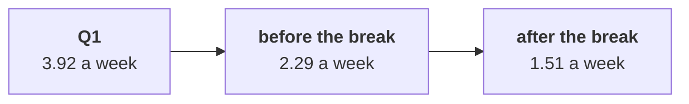

# Chapter 6 scenario set: the memo and its evidence

Ten minutes, alone, then compare with the person beside you before Kavya's review. Every item has
one right answer. Decide first, then record the letter. Items marked design ask for the best-fit
approach, a sizing, the fact that would switch it, or the second route.

Post one line, 5 letters in item order, no spaces:

```
Post exactly this shape: xxxxx
```

The ask behind every item:

> "It is the broken reorder button. One of my members says it has been broken for six weeks." (the head of Retail-Plus)

The numbers every item refers to, booked orders, the export as it stands:

| Retail-Plus window | Days | Orders | Orders per week |
|---|---|---|---|
| Q1, 1 Apr to 30 Jun | 91 | 51 | 3.92 |
| Q2, 1 Jul to 24 Aug | 55 | 18 | 2.29 |
| Q2, 25 Aug to 30 Sep | 37 | 8 | 1.51 |



---

### Q1. (design) Four tests of the button were on the table. In which order do you run them?

a) The app's logs first, since they settle it and the rest can wait for them
b) Timing, comparison, channel; request logs now
c) The channel first, since the cause is an app feature
d) All four at once, since order does not matter

### Q2. The hurried memo says the button cost 25 orders and Rs 65,250. What is wrong with the figure?

a) It uses booked orders instead of the delivered orders the board pack reports
b) It should be measured in customers, not orders
c) It counts only app orders
d) It charges the button with losses before it broke

### Q3. At the pre-break pace, the 37 days after the break would have carried about 12.1 orders, and the tier placed 8. What goes in the memo?

a) The button caused the whole fall, now proven
b) The button had no effect at all, since most of the fall came before it broke
c) At most about 4 orders; the rest needs another cause
d) The fall is too small to report

### Q4. Retail-Core kept 95 percent of its Q1 orders and Retail-Plus 51 percent. Which cause does this rule out?

a) A season that hit every customer alike
b) Any change in the tier's benefits in July
c) The reorder button
d) A monsoon dip that hit members harder

### Q5. (design) The memo names two hypotheses. Which pairing of hypothesis and evidence is right?

a) The button with the tier's change log; a July change with the app's reorder logs
b) Both with this export, cut another way
c) The button with Marketing's campaign reach; a July change with the export
d) Button: reorder logs; July change: tier change log
