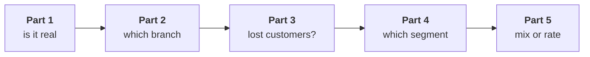

# Does the story survive when revenue counts only the orders that reached customers and stayed?

> "The board pack reports revenue on orders that reached the customer and stayed there. Monday you
> taught me that cancelled orders are not sales. Does your story survive on delivered orders? Which
> branch, which segment, and what would you bet on?"
>
> Meera Raghavan, CEO, Kalpa Retail

The board pack is the set of numbers Kalpa's board reads every quarter. Every order in the class file
carries a `status` that says what became of it: `delivered`, `cancelled` or `returned`. The morning
measured booked revenue, every order placed at the price charged before any cancellation or return.
Delivered revenue counts only the orders whose status is `delivered`, the ones that reached the
customer and were not sent back.

On booked orders the morning found revenue down 11.0 percent between two closed quarters of 13 weeks
each, from Rs 2,10,00,000 to Rs 1,87,00,000. Monday's revenue tree, revenue = customers x orders per
customer x revenue per order, put the fall on how often customers buy: the same 69 customers bought
in both quarters, and orders per customer fell from 1.65 to 1.25. Orders per customer fell furthest
in Retail-Plus, Kalpa's paid membership tier, from 2.32 to 1.18 per member, minus 49.0 percent.
Revenue per order rose 18.0 percent, and about 69 percent of that rise was mix, the change in each
segment's share of orders, with the rest the rate part, the change in each segment's own revenue per
order. A bridge charges each branch of the tree its rupees one branch at a time, customers first.
Churn is a customer who stops buying, Marketing's CRM is its customer database, and the consumer
business is Kalpa's three consumer segments, Retail-Core, Retail-Plus and Student, without Business,
its sales to companies.

**Who needs the answer.** Meera Raghavan, the CEO, repeats to the board whatever story survives on
the board's own definition, so she needs to know which of the morning's findings hold on delivered
orders before she speaks. A finding that moves on the new definition and reaches the board unchecked
puts a wrong cause in front of the people who decide where the money goes.

**The questions on the way.**

- Is the delivered drop real?
- Which branch moves on delivered orders?
- Are those lost customers?
- Which segment moves on delivered orders?
- Is the delivered rise mix or rate?
- How do you report two definitions next month?

You work alone and unguided for fifty minutes, and the solution opens after the debrief. Work in
`notebooks/C2_W01_D02_ex1_escalated_case_STUDENT.ipynb`. It opens on the class file, carries
`tree_for`, the function that gives any list of orders its revenue, orders, customers and rates, and
`pct_change`, the summary helper fixed in the morning to return every change, and it has a lettered
`TODO` in each part with a check that tells you whether your pick holds. Run it from the top; it
stops at the first placeholder until you fill it, which is intended. Each part ends in one item
below, and the stretch adds a sixth.

**What you post.** You post one line at the end, six letters in item order with no spaces, in this
shape:

```
Post exactly this shape: xxxxxx
```



---

## Part 1. Is the delivered drop real?

At work this comes up whenever a stakeholder moves to another definition of revenue and asks whether
the fall still holds.

### Q1. Which figure answers Meera on delivered revenue?

Your notebook keeps the orders whose status is delivered and compares the two closed quarters of 13
weeks each. Which figure answers Meera on delivered orders?

a) Down 25.9 percent, since the Q2 tile holds 11 weeks of delivered orders against 13
b) Down 11.3 percent, since closed delivered quarters differ by Rs 16,40,290
c) Down 11.0 percent, since the definition changes no total that matters to Meera
d) No fall at all, since returns for Q2 are still arriving and will lift its total

---

## Part 2. Which branch moves on delivered orders?

At work this comes up whenever a decomposition is rerun on a new definition before anyone repeats
its verdict.

Build the bridge in the tree's order: customers, then orders per customer, then revenue per order.

### Q2. Which check runs before anyone names the customers branch? (Design)

Customers with a delivered order fell from 54 to 50, and the bridge charges that branch Rs 10,74,442.
Which check do you run before anyone names the branch, and what result would make it churn?

a) The CRM's sign-ups by month; a Q2 campaign would make it acquisition
b) The bridge in the other order; a smaller customers step would make it an artefact
c) The delivered ids against the booked ids; a leaver who never booked in Q2 is churn
d) The tree per segment; a fall inside one segment would make it that segment's churn

---

## Part 3. Are those lost customers?

At work this comes up whenever a customer count moves and someone has to say who those customers
are.

### Q3. What happened to the customers who dropped out of the delivered count in Q2?

Some of the customers delivered to in Q1 have no delivered order in Q2. What are they?

a) Customers who ordered in Q2 and had those orders cancelled or returned
b) Customers Kalpa lost, replaced by fifteen new ones who joined in Q2
c) Business accounts whose large orders are still waiting to be delivered
d) Customers whose Q1 orders were delivered late and counted in Q2 instead

---

## Part 4. Which segment moves on delivered orders?

At work this comes up whenever a rate is compared across segments or rolled up to the company.

Run `tree_for` per segment on delivered orders, roll the rate up to the company, and count the groups
that come back.

### Q4. How did orders per customer move on delivered orders?

Your notebook has the delivered tree for each segment and the rate rolled up to the company. Which
statement about delivered orders per customer holds?

a) Averaged over the four segments it fell 9.2 percent, so frequency matters less here
b) Business fell furthest, 11.6 percent, since its orders are the largest
c) Every segment fell by about the same share, so no segment stands out
d) Weighted it fell from 1.50 to 1.14, and Retail-Plus fell furthest at 42.6 percent

---

## Part 5. Is the delivered rise mix or rate?

At work this comes up whenever an average across groups moves and a price decision rides on the
reason.

Split the rise in delivered revenue per order, Rs 1,79,074 to Rs 2,25,696, into mix and rate by
pricing Q2's mix of orders at each segment's Q1 rate.

### Q5. What does a mix share of 44 percent mean for the consumer business?

The mix explains 44 percent of the delivered rise against 69 percent on booked orders. What does that
mean for the consumer business?

a) Little, since the rate part is Business's larger orders, not consumer prices
b) Consumer prices rose, since the rate part now carries most of the rise
c) The split failed, since mix and rate should not change with the definition used
d) Delivered orders are unreliable, so the booked split should be used on its own

---

## Stretch. How do you report two definitions next month?

At work this comes up every month that two teams report the same number two ways.

### Q6. What goes in next month's report, and what would change it? (Design)

Meera will see both definitions again next month, booked and delivered. Which way do you report them,
and what would change it?

a) Delivered alone, since it is the board's number, whatever the booked figure says
b) Booked alone, since it closes first and never moves after the quarter
c) Both side by side and labelled, moving to delivered alone once returns settle
d) Delivered alone, with last quarter's booked figures restated as delivered
