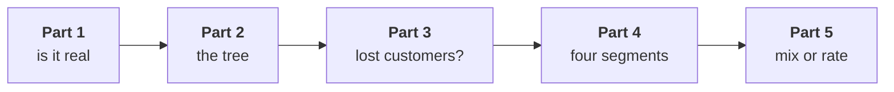

# The escalated case: the ladder again, on delivered orders

Fifty minutes, alone, unguided. The solution opens after the debrief.

> "The board pack reports revenue on orders that reached the customer and stayed there. Monday you
> taught me that cancelled orders are not sales. Does your story survive on delivered orders? Which
> branch, which segment, and what would you bet on?" (Meera Raghavan)

Work in `notebooks/C2_W01_D02_ex1_escalated_case_STUDENT.ipynb`. It opens on the class file, carries
`tree_for` and the fixed `pct_change` from the morning, and has a lettered `TODO` in each part with a
check that tells you whether your pick holds. Run it from the top; it stops at the first placeholder
until you fill it, which is intended.

Each part ends in one item, and the stretch adds a sixth. Post one line at the end, six letters in
order, no spaces:

```
Post exactly this shape: xxxxxx
```



---

## Part 1. Is the delivered drop real?

Keep the orders whose status is delivered and compare the two closed quarters of 13 weeks.

### Q1. Which figure answers Meera on delivered orders?

a) Down 25.9 percent, since the Q2 tile holds 11 weeks of delivered orders against 13
b) Down 11.3 percent, since closed delivered quarters differ by Rs 16,40,290
c) Down 11.0 percent, since the definition changes no total that matters to Meera
d) No fall at all, since returns for Q2 are still arriving and will lift its total

---

## Part 2. The tree on delivered orders

Build the bridge in the tree's order: customers, then orders per customer, then revenue per order.

### Q2. (design) Customers with a delivered order fell from 54 to 50, and the bridge charges that branch Rs 10,74,442. What do you conclude before Part 3?

a) Marketing was right after all, so the acquisition budget should be released now
b) The bridge is wrong, since the morning proved customers held at 69
c) A branch that held on booked orders moved, so find what it is made of first
d) Frequency no longer matters, since customers now carry most of the fall

---

## Part 3. Are those lost customers?

Compare the delivered overlap with the booked overlap from chapter 5.

### Q3. Nineteen of Q1's delivered customers have no delivered order in Q2. What are they?

a) Customers who ordered in Q2 and had those orders cancelled or returned
b) Customers Kalpa lost, replaced by fifteen new ones who joined in Q2
c) Business accounts whose large orders are still waiting to be delivered
d) Duplicate ids from the store and the app for the same fifteen people

---

## Part 4. Four segments, rolled up with their weights

Run `tree_for` per segment on delivered orders, roll the rate up, and count the groups.

### Q4. Which statement about delivered orders per customer holds?

a) Averaged over the four segments it fell 9.2 percent, so frequency matters less here
b) Business fell furthest, 11.6 percent, since its orders are the largest
c) Every segment fell by about the same share, so no segment stands out
d) Weighted it fell from 1.50 to 1.14, and Retail-Plus fell furthest at 42.6 percent

---

## Part 5. Mix or rate, on delivered orders

Split the rise in delivered revenue per order, Rs 1,79,074 to Rs 2,25,696, into mix and rate.

### Q5. The mix explains 44 percent of the delivered rise against 69 percent on booked orders. What does that mean for the consumer business?

a) Little, since the rate part is Business's larger orders, not consumer prices
b) Consumer prices rose, since the rate part now carries most of the rise
c) The split failed, since mix and rate should not change with the definition used
d) Delivered orders are unreliable, so the booked split should be used on its own

---

## Stretch. The design question

### Q6. (design) Meera will see both definitions again next month. Which way do you report them, and what would change it?

a) Delivered alone, since it is the board's number, whatever the booked figure says
b) Booked alone, since it closes first and never moves after the quarter
c) Both side by side and labelled, moving to delivered alone once returns settle
d) Whichever shows the smaller fall, to keep the board calm this month
