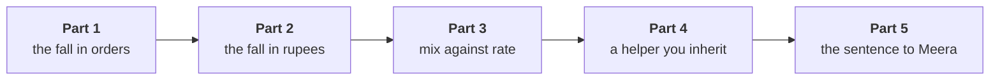

# The escalated case: mix against rate

Sixty minutes, alone, unguided. The solution opens after the debrief.

The morning ended with a segment named in your own notebook. The afternoon puts it in front of the
people who have to act on it, and they push back.

> "You told me frequency fell and you told me which segment. Now my finance controller says most of
> the rupees went somewhere else, and my marketing lead says order value is up so prices are fine.
> Which of you is right? I want the fall split two ways, in orders and in rupees, and I want to know
> why revenue per order rose while we sold less." (Meera Raghavan)

Work in `notebooks/C2_W01_D02_04_escalated_case_STUDENT.ipynb`. It opens on the class file, carries
`tree_for` and `describe` from the morning, and has a lettered `TODO` for each part with a check
that tells you whether your pick was right. Run it from the top; it stops at the first placeholder
until you fill it, which is intended.

Each part ends in one item, and the stretch adds a sixth. Post one line at the end, six letters in order, no spaces:

```
Post exactly this shape: xxxxxx
```



---

## Part 1. Where did the orders go?

Run `tree_for` on each of the four segments in each closed quarter and build the orders bridge from
114 to 86: the change in orders, segment by segment.

### Q1. Of the 28 orders lost between the quarters, where did they go?

a) Business lost 3 of the 28, and as the largest segment in rupees it carries the fall
b) The 28 are spread across the four segments in line with each one's share of orders
c) Retail-Plus lost 25 of the 28, about 89 percent, from the same 22 members
d) Retail-Core lost 2 of the 28, and with the most customers it sets the company's trend

---

## Part 2. Where did the rupees go?

Build the rupee bridge from Rs 2,10,00,000 to Rs 1,87,00,000, segment by segment, and then the same
bridge for the three consumer segments alone.

### Q2. Anand Iyer says most of the rupees went somewhere else. Which reading of the two bridges holds?

a) In rupees, Business is 97 percent of the fall, from three fewer orders; in behaviour, Retail-Plus
b) In rupees and in behaviour alike the fall is Business, so Retail-Plus can leave the note entirely
c) In rupees the fall is Retail-Plus, since its orders halved and every order carries revenue with it
d) The two bridges disagree, so one of them is wrong and the orders bridge should be rebuilt first

---

## Part 3. Why did revenue per order rise?

Revenue per order rose from Rs 1,84,211 to Rs 2,17,442. Compute each segment's revenue per order in
Q1, then what revenue per order would have been with Q2's order mix and Q1's per-segment values.

### Q3. The marketing lead says the 18 percent rise in revenue per order shows customers paid more. What does the split say?

a) Prices rose in every segment, since each segment's revenue per order went up between the two quarters
b) The rise is all rate: segments paid more per order, and the change in mix added almost nothing
c) The rise cannot be split, because the mix and the rate change together in the same two quarters
d) About 69 percent is mix: small consumer orders fell away, so the average rose without a price rise

---

## Part 4. A helper you inherit

A colleague's helper from last quarter builds the summary Meera reads:

```python
def pct_change(before, after):
    change = 100 * (after - before) / before
    if abs(change) > 30:
        print(f"  check by hand: {change:+.1f}%")
    else:
        return round(change, 1)
```

Run on each segment's orders per customer, it prints two lines reading `check by hand: -49.0%` and
`check by hand: +40.0%`, and the summary it builds, keeping the segments whose change is below zero,
reads `{"Retail-Core": -5.3, "Business": -15.0}`. The colleague's note says "orders per customer fell
in every segment, most in Business, 15.0 percent."

### Q4. What went wrong, and which check would have caught it?

a) The helper rounds to one decimal, and the rounding hid two segments; check the unrounded values
b) Two segments returned None and dropped out; count the segments in (4) against the rows out (2)
c) The two printed lines are warnings about the data, so the summary is right to leave them out
d) The threshold of 30 is too low; raise it to 50 and every segment returns a value to the summary

---

## Part 5. The sentence to Meera

### Q5. Which sentence answers Meera, with the numbers, and without claiming more than the data shows?

a) "Revenue fell 11.0 percent because Business customers are leaving, and the rupee bridge proves it, so Business accounts come first in the plan."
b) "Revenue fell 11.0 percent; order value rose 18 percent, so prices are healthy and the Rs 12 crore should go to acquiring new customers."
c) "Revenue fell 11.0 percent; customers held at 69; 22 Retail-Plus members placed 26 orders against 51; most rupees are 3 Business orders."
d) "Revenue fell 11.0 percent across every segment evenly, so the fall is a market-wide slowdown and no one segment needs attention."

## Stretch. Would the answer survive the other order?

### Q6. Moved mix first, the mix explains Rs 22,902 of the Rs 33,231 rise in revenue per order; moved rate first, Rs 24,028. The marketing lead picks the smaller one to argue customers paid more. What is the reply?

a) The smaller figure is right, since the mix should always be moved first
b) The larger figure is right, since the rate should always be moved first
c) Neither holds, since two figures for one split mean the method is broken
d) Either order leaves about seven tenths to mix, so nobody had to pay more
