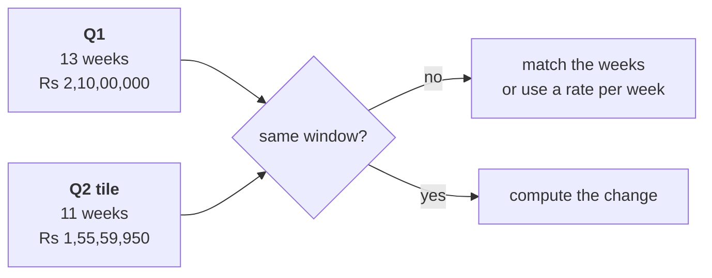

# Round 1 scenario set: is the drop real?

Ten minutes, alone, then compare with the person beside you before Kavya's review. Every item has
one right answer. Decide first, then record the letter.

Post one line, ten letters in item order, no spaces:

```
Post exactly this shape: xxxxxxxxxx
```

Meera's reply to Monday's numbers is the ask behind every item:

> "Q2 was Rs 1.9 crore, Q1 was 2.1. Are we losing customers, or are the ones we have buying less?
> Marketing says more customers. Prove it or disprove it."

The two windows every item refers to, on booked orders, the export as it stands:

| Window | Dates | Weeks | Orders | Revenue |
|---|---|---|---|---|
| Q1, closed | 1 Apr to 30 Jun | 13 | 114 | Rs 2,10,00,000 |
| Q2, closed | 1 Jul to 30 Sep | 13 | 86 | Rs 1,87,00,000 |
| Q2 dashboard tile, cut on 15 September | 1 Jul to 15 Sep | 11 | 70 | Rs 1,55,59,950 |



---

### Q1. Meera asks how far revenue fell between the two closed quarters. Which figure goes in the reply?

a) 12.3 percent, the Rs 23,00,000 gap measured against Q2's total
b) 9.5 percent, from the rounded Rs 1.9 crore against Rs 2.1 crore
c) 11.0 percent, the Rs 23,00,000 gap measured against Q1's total
d) 25.9 percent, the figure on the dashboard tile Marketing quotes

### Q2. The marketing lead's slide reads "Q2 Rs 1,55,59,950 against Q1 Rs 2,10,00,000: revenue fell 25.9 percent." What makes the slide unfit to act on?

a) The percentage is computed on Q2's total, which overstates the fall
b) It compares 11 weeks of Q2 against all 13 weeks of Q1
c) It counts booked orders, where Finance would count delivered orders
d) It rounds both totals to the nearest lakh before dividing them

### Q3. Before anyone reads a quarter comparison, which single check catches the slide's problem fastest?

a) The first and last order date in each window, and the weeks each covers
b) The median order in each window, to see whether a few large orders moved
c) The customer count in each window, to see whether buyers fell away
d) A recount of both totals by hand, to rule out an error in the sum

### Q4. On the cut window, Q1 ran at Rs 16,15,385 a week and Q2 to date at Rs 14,14,541 a week. What is the change per week?

a) Down 14.2 percent, the gap measured against Q2's weekly rate
b) Down 25.9 percent, the same fall the tile shows on its totals
c) Down 11.0 percent, the fall between the two closed quarters
d) Down 12.4 percent, the gap measured against Q1's weekly rate

### Q5. Four moves answer "is the drop real": p) find the first and last order date of each window, q) choose closed quarters or matched weeks, r) compute the change, s) state the definition and the window in the sentence. Which order is right?

a) r, p, q, s
b) p, r, q, s
c) p, q, r, s
d) q, r, p, s

### Q6. Per day, the closed quarters run at Rs 2,30,769 and Rs 2,03,261, a fall of 11.9 percent. Why does this differ from the 11.0 percent on the totals?

a) Q2 has 92 days and Q1 has 91, so Q2's total is spread over one more day
b) A rate per day always runs higher than a rate on totals, for any two windows
c) The per-day rate counts only the days on which at least one order was placed
d) One of the two figures has a rounding slip, and the totals are the safer one

### Q7. A colleague compares the same 11 weeks of each quarter and gets a fall of 17.0 percent, against 12.4 percent per week on the cut window. They say one of the two must be a bug. Which reply holds?

a) The 17.0 is the bug, because matched weeks should always agree with a weekly rate
b) Both are honest, since large orders land unevenly; the closed quarters settle it
c) The 12.4 is the bug, because a weekly rate hides the orders placed on weekends
d) Average the two to 14.7 percent, which balances out the error that each method carries

### Q8. Two weeks into October, the marketing lead asks whether Q3 is running behind. Which comparison is fair?

a) Q3 to date against the whole of Q2, since Q2 is the latest closed quarter
b) Q3 to date against the last two weeks of Q2, since those are the most recent
c) Q3 to date multiplied by six and a half, against the whole of Q2
d) The first two weeks of Q3 against the first two weeks of Q2

### Q9. The marketing lead now compares closed Q2 with closed Q1, 13 weeks each. Which effect can that comparison still not rule out?

a) The monsoon season, which only last year's Q2 would take out of the comparison
b) Two missing weeks of orders, since the tile stopped short of the end of Q2 again
c) A slip in the sums, since both totals were added up by hand from the order rows
d) A change of definition, since one side counts booked orders and the other delivered

### Q10. A dashboard tile shows Q2 at Rs 1,55,59,950 with no date beside it. Which question finds the problem where it was made?

a) Which customers stopped ordering during September, and in which city they live
b) When the tile's query last refreshed, and which window of orders it could see
c) Which channel lost the most orders between the two quarters, and by how many
d) Whether Finance has signed off the Q2 total in its books, and on which date
