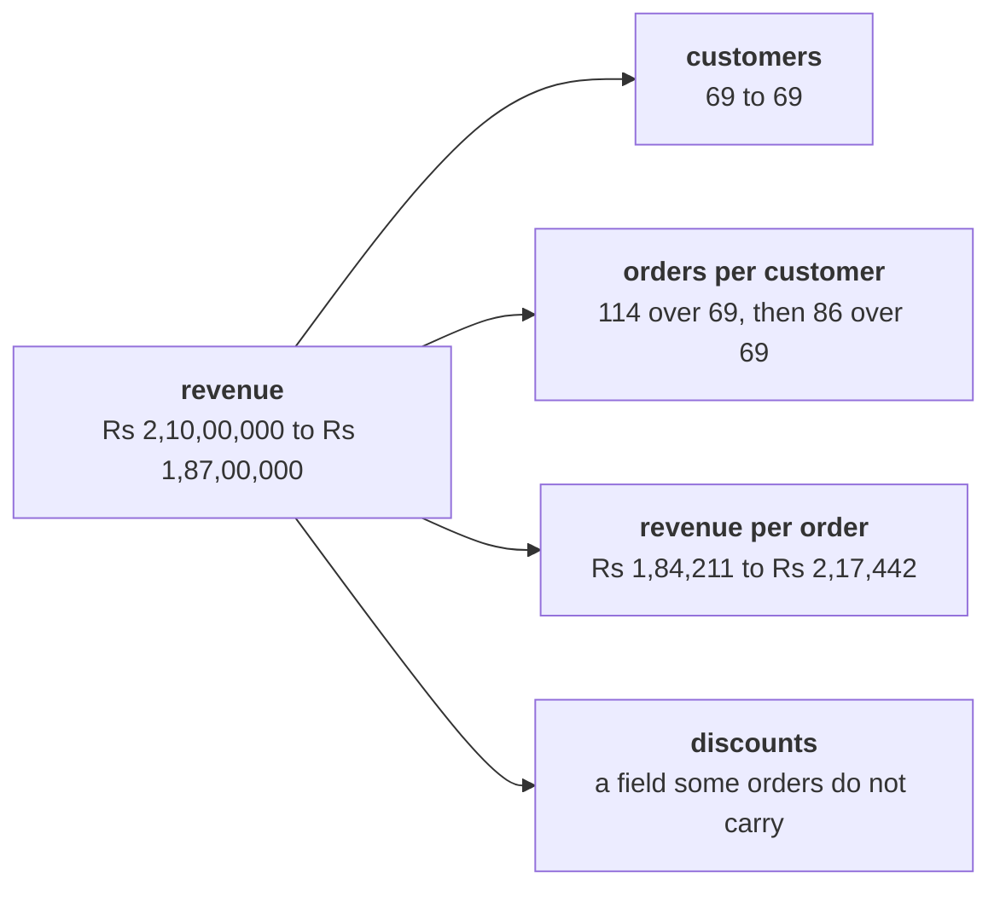

# Round 2 scenario set: which branch moved?

Ten minutes, alone, then compare with the person beside you before Kavya's review. Every item has
one right answer. Decide first, then record the letter.

Post one line, ten letters in item order, no spaces:

```
Post exactly this shape: xxxxxxxxxx
```

Meera's question, and the marketing lead's answer to it, are the ask behind every item:

> "Are we losing customers, or are the ones we have buying less?" (Meera Raghavan)
>
> "More customers is the answer. The acquisition budget fixes this." (the marketing lead)

The tree every item refers to, with the two closed quarters on booked orders:



---

### Q1. Meera asks whether the customers Kalpa has are buying less often. What is orders per customer in each quarter, and how far did it move?

a) 0.61 to 0.80, a rise of 32.6 percent in how often each customer buys
b) 1.65 to 1.25, a fall of 32.6 percent measured against the Q2 figure
c) 1.65 to 1.25, a fall of 24.6 percent measured against the Q1 figure
d) 1.00 to 1.00, since each of the 69 customers is counted once a quarter

### Q2. Revenue per order rose from Rs 1,84,211 to Rs 2,17,442 while revenue fell. The marketing lead says "order value is up 18 percent, so the only problem is getting more customers." Which reading holds?

a) Order value rose 18.0 percent, so pricing works and more customers is the one lever still left to pull
b) Customers held at 69 and frequency fell 24.6 percent, so the fall sits in how often people buy
c) Customers held and order value rose, so the 11.0 percent fall must be an error somewhere in the export
d) Frequency and order value moved in opposite directions, so the tree cannot say which branch fell

### Q3. The three branches multiply: 1.000 times 0.754 times 1.180. What does the product tell Meera?

a) 0.934, which is the three changes added together, so a part of the fall must sit outside the tree
b) 0.890, which is the fall in orders per customer alone, so the other two branches cancel each other out
c) 1.180, which is the largest of the three branches, so order value decides where the quarter lands
d) 0.890, equal to Rs 1.87 crore over Rs 2.10 crore, so the tree accounts for the whole fall

### Q4. The revenue bridge prices the frequency branch at Q1's order value: 69 times (1.2464 less 1.6522) times Rs 1,84,211. What does that branch cost?

a) Less Rs 51,57,895, the 28 lost orders at Q1's order value
b) Less Rs 23,00,000, the whole fall between the two quarters
c) Less Rs 60,88,376, the 28 lost orders at Q2's order value
d) Less Rs 28,57,895, the part that order value gives back

### Q5. The tree's last branch is discounts. A hurried fix reads a missing field with `order.get("discount", 0)` and reports "50.0 percent of Q2's orders, 43 of 86, had a discount, so extend the monsoon discount to the other half." What is wrong with the report?

a) A missing field is unknown, and over the 60 orders that record it the share is 71.7 percent
b) The share is right, and extending the discount to the other half is a call for Marketing alone
c) The share should count delivered orders only, since a returned order never kept its discount
d) The fix should have dropped every order without the field, and taken its revenue out as well

### Q6. Three invented orders carry discounts of Rs 120, Rs 60 and Rs 0, and a fourth invented order has no discount field. What is the average discount, honestly reported?

a) Rs 45, reading the missing field as a zero across all four of the orders
b) Rs 60, over the three that record it, with one reported as not recorded
c) Rs 90, over the two orders that gave a discount, leaving out the zero as well
d) No average can be given, since one of the four orders carries no value at all

### Q7. The largest discount any order records is Rs 150, and Q2 has 86 orders. What is the most the discount branch could explain, and what follows?

a) At most Rs 3,900, the 26 Q2 orders with no field at Rs 150 each, which settles the branch for good
b) At most 7.9 points, the rise in the hurried share of orders with a discount between the quarters
c) At most Rs 12,900 against a Rs 23,00,000 fall, so the discount branch did not move revenue
d) It cannot be bounded until every missing discount is recovered from the source billing system

### Q8. Anand Iyer counts only delivered orders: revenue Rs 1,45,04,970 to Rs 1,28,64,680, customers 54 to 50, orders 81 to 57. Which branch still carries the fall on his definition?

a) Customers, down from 54 to 50, a fall of 7.4 percent that his definition brings out
b) Revenue per order, which moves from Rs 1,79,074 to Rs 2,25,696 on delivered orders
c) None of them, since on delivered orders the fall is too small to decompose at all
d) Orders per customer, from 1.50 to 1.14, a fall of 24.0 percent on delivered orders

### Q9. Moved first, at Q1's order value, frequency costs Rs 51,57,895; moved second, at Q2's order value, it costs Rs 60,88,372. Anand asks which one is right. What is the answer?

a) The first, since a bridge always moves the branches in the order the tree lists them
b) The second, since Q2's order value is the more recent and so the more accurate price
c) Neither, since two different answers mean the arithmetic in one of them has slipped
d) Both; the overlap goes to whichever moves second, so name the order you used

### Q10. Three ways past a missing discount key: `if "discount" in order:`, `try` with `except KeyError`, and `order.get("discount", 0)`. What do the three have in common?

a) Each one decides what an absent discount means, a decision that needs its reason
b) Each one counts how many orders lack the field and prints that count before carrying on
c) Each one reads an absent discount as zero rupees, so all three give the same total
d) Each one stops the loop at the first order without the field, as the KeyError did
