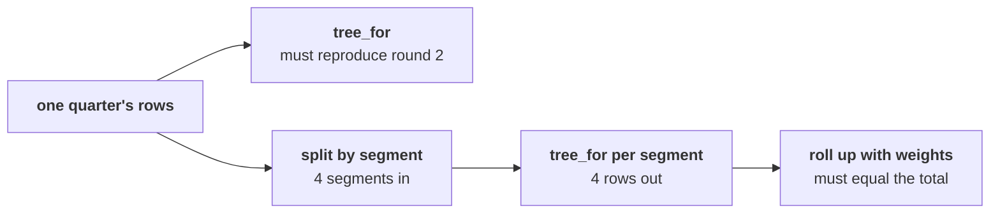

# Round 3 scenario set: is it every segment, or one?

Ten minutes, alone, then compare with the person beside you before Kavya's review. Every item has
one right answer. Decide first, then record the letter. Figures marked invented are made up to show
a mechanism; every other figure comes from the class file.

Post one line, eight letters in item order, no spaces:

```
Post exactly this shape: xxxxxxxx
```

The asks behind every item:

> "Is it across all our customers, or one kind of customer?" (Meera Raghavan)
>
> "A member says the app's reorder button has been broken for six weeks. Is my tier the one
> slipping?" (the head of Retail-Plus)

The two functions every item refers to:

```python
def tree_for(rows):
    """Revenue, orders, customers, orders per customer and revenue per order for any rows."""
    ...
    return {"revenue": revenue, "orders": orders, "customers": customers,
            "orders_per_customer": orders / customers, "revenue_per_order": revenue / orders}

def describe(amounts):
    """Median, min, max and range of a list of amounts."""
    ...
    return {"median": median, "min": low, "max": high, "range": high - low}
```



---

### Q1. A colleague's `revenue_for(rows)` prints the right total on screen for each segment. The notebook then fills Anand's table in a loop with `table[seg] = revenue_for(rows_by_seg[seg])`. What does Anand's table hold?

a) The four totals the screen showed, one per segment, ready for the note
b) None against every segment, because the function hands back nothing
c) Only the last segment's total, because the loop overwrote the others
d) Nothing at all, because the loop stops with an error on the first segment

### Q2. Before `tree_for` runs on any segment, which check proves that it counts the way round 2 counted?

a) Run it on one segment and compare the result with the segment's revenue in the dashboard tile
b) Run it on the whole file at once and confirm the total is 200 orders across both quarters
c) Run it on each whole quarter and reproduce round 2: 114 and 86 orders, 1.65 and 1.25
d) Read the function line by line with a colleague and agree that every line looks right

### Q3. For Business in Q2, `describe` returns median Rs 9,52,000, min Rs 2,17,000, max Rs 29,45,460 and range Rs 27,28,460. In Q1 the median was about 3 percent higher and the range was Rs 15,80,940. What do you tell Anand?

a) The typical order barely moved; one large order nearly doubled the spread, so name it apart
b) Business orders grew much larger in Q2, since the range nearly doubled between the two quarters
c) The typical Business order fell about 3 percent, which is the whole story of Business this quarter
d) The describe function is wrong, because a median cannot hold still while the range nearly doubles

### Q4. Meera asks whether Retail-Core, the segment with the most customers, carries the company's fall in frequency. Retail-Core ran 1.12 orders per customer in Q1 and 1.06 in Q2. What is the answer?

a) Yes: its 34 customers are nearly half of the 69, so its trend decides the company figure
b) Yes: 1.12 to 1.06 is a fall of 10.5 percent, close to the company's fall in frequency
c) No: its typical order fell from Rs 2,325 to Rs 2,080, so its fall is in basket and never in frequency
d) No: 1.12 to 1.06 is a fall of 5.3 percent, far short of the company's fall of 24.6 percent

### Q5. In an invented example, 30 customers order 1.1 times a quarter and 2 customers order 3.5 times. What is orders per customer for all 32?

a) 2.30, the average of the two groups' figures
b) 4.60, the two groups' figures added together
c) 1.25, the total orders over the total customers
d) 1.10, the figure for the group with most people

### Q6. A colleague averages the four segments' orders per customer: 1.94 in Q1 and 1.82 in Q2, "a fall of only 6.0 percent, so frequency is not the branch and Marketing may be right." Which check catches the error?

a) The roll-up must reproduce the company's 1.65 and 1.25, and a plain average of four does not
b) The two averages must be recomputed with the median, since a mean is pulled by large segments
c) The four segment figures must be rounded to one decimal before they are averaged together
d) The average must leave out the segment with the fewest customers, since it is too small to count

### Q7. The head of Retail-Plus asks whether his tier is slipping. Which method answers him with numbers he can check?

a) His tier's revenue in each quarter, since revenue is the figure the tier is judged on
b) His tier's average order value, since a slipping tier shows up first as smaller baskets
c) A count of complaints about the reorder button, set against the number of his members
d) `tree_for` on his tier's rows in each closed quarter, set beside the company's figures

### Q8. Four moves make the segment split safe: p) run `tree_for` on each whole quarter and check it matches round 2, q) run it on each segment in each quarter, r) count the segments in and the rows out, s) roll the segments up with customer weights and check the result equals the total. Which order is right?

a) q, r, s, p
b) p, q, r, s
c) q, p, s, r
d) p, s, q, r
