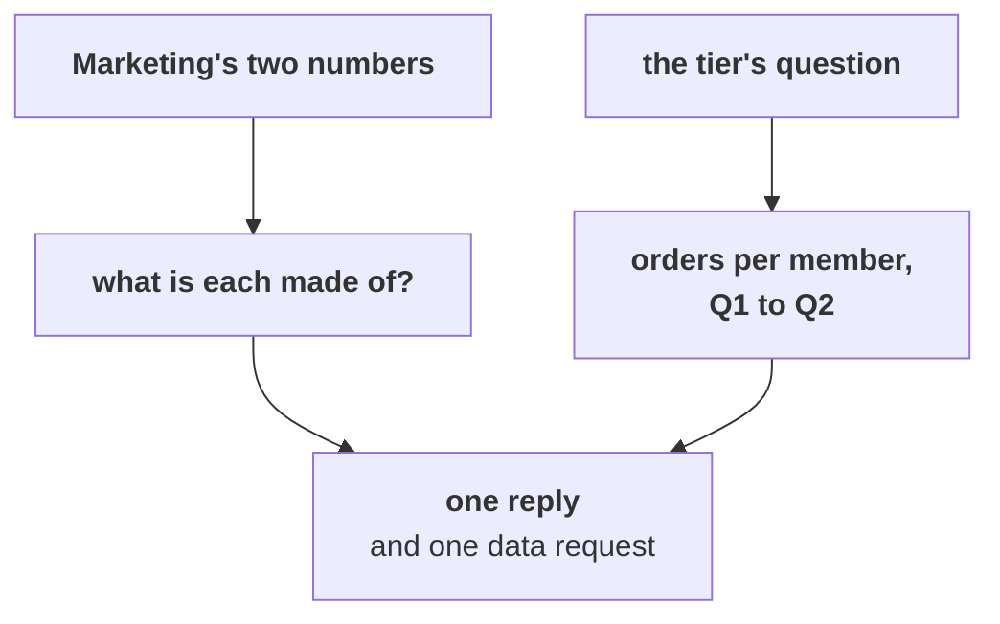

# The second case: the tier's question and Marketing's pushback

Forty minutes, in pairs. One of you answers the marketing lead, the other answers the head of
Retail-Plus, from the same file, and together you write one reply.

> "Retail-Plus members spend 7 percent more every time they order, so the tier is healthy and the
> answer is still acquisition. And Retail-Plus web orders fell hardest, 24 to 9, so this is the
> website team's problem, not the tier's and not the app's." (the marketing lead)
>
> "Fine. Which of my members do I call first?" (the head of Retail-Plus)

Work in `notebooks/C2_W01_D02_ex2_second_case_STUDENT.ipynb`. It has a lettered `TODO` for each part
and a check that says whether your pick holds.

Each part ends in one item. Post one line per pair at the end, four letters in order, no spaces:

```
Post exactly this shape: xxxx
```



---

## Part 1. "Members spend 7 percent more per order, so the tier is healthy"

### Q1. (design) Put the tier's leaves back together. What does its own tree say to Marketing?

a) The tier is healthy, since 7 percent more per order outweighs the fall in orders
b) Tier revenue fell about 42 percent, orders down 49 and value up 7, so it is minor
c) New, richer members joined, so acquisition is already working inside the tier
d) The same 22 members ordered half as often, so tier revenue fell about 45 percent

---

## Part 2. "Web fell hardest, so it is the website"

### Q2. (design) Which number tests a site-wide website fault?

a) Retail-Plus app orders, 13 to 8, since the app shares the website's servers
b) Retail-Core web orders on the same website, which held at 13 and 12
c) Retail-Plus web orders by month, to see when the members' fall began
d) The total of all web orders, 44 to 30, since it covers every segment

---

## Part 3. "Which of my members do I call first?"

### Q3. Which list goes first?

a) Members with no order in Q2, since they have stopped altogether
b) Members who ordered once in Q1, since they are the least attached
c) The 7 who fell from three orders to one, since they slowed most
d) The 11 who fell by one order, since they are the largest group that slowed

---

## Part 4. The reply, and one request

### Q4. (design) The tier lost 25 orders between the quarters, and chapter 6 capped the button at about 4 of them. Which request goes first?

a) The tier's July change log, renewals and support tickets
b) The app's reorder logs by week since the 25 August release
c) Marketing's new-member sign-ups by month from July
d) This export again, cut by city, channel and week from July
