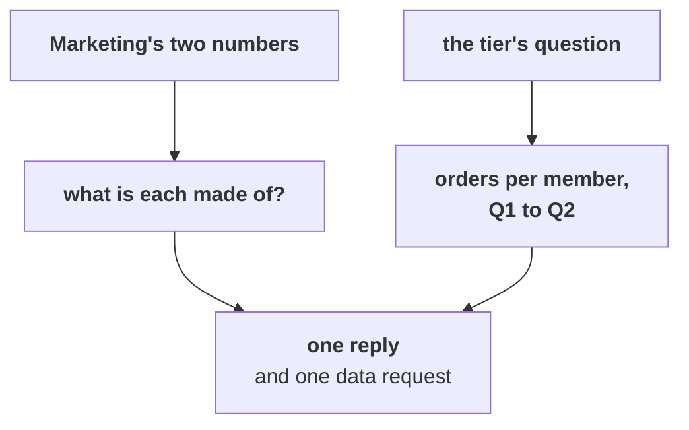

# The second case: the tier's question and Marketing's pushback

Forty minutes, in pairs. One of you answers the marketing lead, the other answers the head of
Retail-Plus, from the same file, and together you write one reply.

> "Student orders per customer rose 40 percent after our campus push, so acquisition works. And
> Retail-Plus web orders fell hardest, 24 to 9, so this is the website team's problem, not the
> tier's and not the app's." (the marketing lead)
>
> "Fine. Which of my members do I call first?" (the head of Retail-Plus)

Work in `notebooks/C2_W01_D02_ex2_second_case_STUDENT.ipynb`. It has a lettered `TODO` for each part
and a check that says whether your pick holds.

Each part ends in one item. Post one line per pair at the end, four letters in order, no spaces:

```
Post exactly this shape: xxxx
```



---

## Part 1. "Student rose 40 percent, so acquisition works"

### Q1. What is the 40 percent made of?

a) Two new student customers who each placed several orders in Q2
b) A campus campaign that lifted student orders across every channel
c) A rounding effect on the student segment's revenue per order
d) The same two customers placing seven orders against five

---

## Part 2. "Web fell hardest, so it is the website"

### Q2. (design) Which number tests a site-wide website fault?

a) Retail-Plus app orders, 13 to 8, since the app shares the website's servers
b) Retail-Core web orders on the same website, which held at 13 and 12
c) Student web orders, which rose from one to three in the quarter
d) The total of all web orders, 44 to 30, since it covers every segment

---

## Part 3. "Which of my members do I call first?"

### Q3. Which list goes first?

a) Members with no order in Q2, since they have stopped altogether
b) Members who ordered once in Q1, since they are the least attached
c) The 7 who fell from three orders to one, since they slowed most
d) Every one of the 22 members at once, since all of them slowed

---

## Part 4. The reply, and one request

### Q4. (design) The fall began in July and the button broke on 25 August. Which request tests the cause behind the larger part of the fall?

a) The tier's July change log, renewals and support tickets
b) The app's reorder logs by week and the release that broke them
c) Marketing's campaign reach by month for the student push
d) This export again, cut by city, channel and week together
