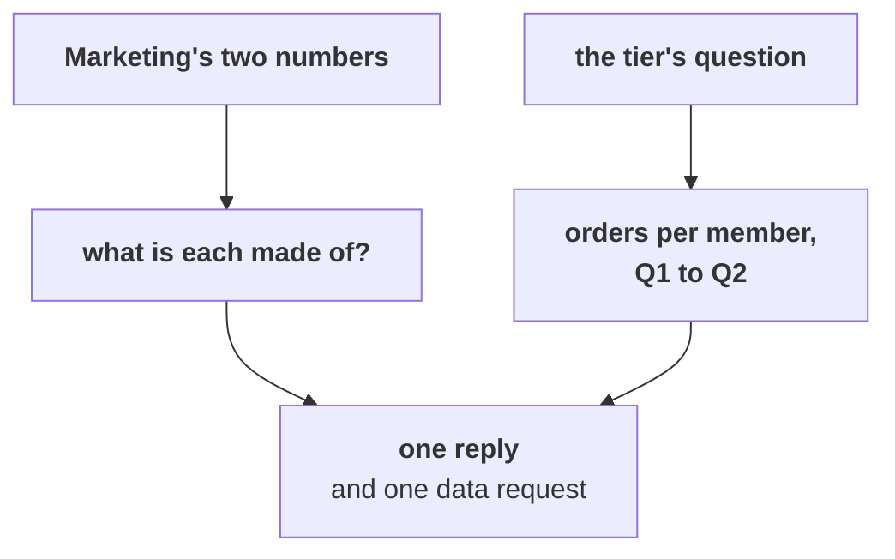

# Marketing's new deck says members spend 7 percent more per order and the web fell hardest: does either claim hold, and whom does the tier call first?

> "Retail-Plus members spend 7 percent more every time they order, so the tier is healthy and the
> answer is still acquisition. And Retail-Plus web orders fell hardest, 24 to 9, so this is the
> website team's problem, not the tier's and not the app's."
>
> The marketing lead, Kalpa Retail

> "Fine. Which of my members do I call first?"
>
> The head of Retail-Plus, Kalpa Retail

Retail-Plus is Kalpa Retail's paid membership tier, and its members order through three channels:
the app, the website and the stores. Acquisition is winning new customers, the work Marketing wants
Rs 12 crore for. Revenue here is booked revenue, every order placed at the price charged before any
cancellation or return, and Monday's revenue tree splits it into three leaves that multiply: revenue
= customers x orders per customer x revenue per order, where for the tier the customers are its
members. Kalpa's other consumer segments are Retail-Core, shoppers who place many small orders, and
Student, small discounted baskets.

The morning found that the same 22 members of the tier placed 26 orders in Q2 against 51 in Q1, and
chapter 5 found that 18 of the 23 customers who ordered less in Q2 were members. Chapter 6 found that
the tier's fall began in July, before the app's reorder button broke on 25 August, and capped what
the button can explain at about 4 of the tier's 25 lost orders.

**Who needs the answer.** The head of Retail-Plus decides which members his team calls first, and
Meera Raghavan, Kalpa Retail's CEO, decides whether Marketing's new deck changes anything about the
Rs 12 crore acquisition budget. A claim agreed with before anyone finds what it is made of sends the
budget to acquisition, and a call list built on the wrong number spends the tier's calls on the wrong
members.

**The questions on the way.**

- Does 7 percent more per order make the tier healthy?
- Is the web's fall the website's fault?
- Which members does the tier call first?
- Which one request goes first?

You work in pairs for forty minutes. One of you answers the marketing lead, the other answers the
head of Retail-Plus, from the same file, and together you write one reply. Work in
`notebooks/C2_W01_D02_ex2_second_case_STUDENT.ipynb`, which has a lettered `TODO` for each part and a
check that says whether your pick holds. Each part ends in one item below.

**What you post.** Each pair posts one line at the end, four letters in item order with no spaces,
in this shape:

```
Post exactly this shape: xxxx
```



---

## Part 1. Does 7 percent more per order make the tier healthy?

At work this comes up whenever a stakeholder brings one number as proof that a group is healthy.

### Q1. What does the tier's own tree say to Marketing's 7 percent? (Design)

Put the tier's leaves back together: members, times orders per member, times revenue per order. What
does its own tree say to Marketing?

a) The tier is healthy, since 7 percent more per order outweighs the fall in orders
b) Tier revenue fell about 42 percent, orders down 49 and value up 7, so it is minor
c) New, richer members joined, so acquisition is already working inside the tier
d) The same 22 members ordered half as often, so tier revenue fell about 45 percent

---

## Part 2. Is the web's fall the website's fault?

At work this comes up whenever a team is blamed for a fall that shows up in its own channel.

### Q2. Which number tests a fault across the whole website? (Design)

Marketing blames the website for the tier's web orders falling from 24 to 9. Which number tests a
site-wide website fault?

a) Retail-Plus app orders, 13 to 8, since the app shares the website's servers
b) Retail-Core web orders on the same website, which held at 13 and 12
c) Retail-Plus web orders by month, to see when the members' fall began
d) The total of all web orders, 44 to 30, since it covers every segment

---

## Part 3. Which members does the tier call first?

At work this comes up whenever a team has fewer calls to make than customers who slowed.

### Q3. Which of four member lists does the head of Retail-Plus call first?

The head of Retail-Plus asks which of his members to call first. Which list goes first?

a) Members with no order in Q2, since they have stopped altogether
b) Members who ordered once in Q1, since they are the least attached
c) The 7 who fell from three orders to one, since they slowed most
d) The 11 who fell by one order, since they are the largest group that slowed

---

## Part 4. Which one request goes first?

At work this comes up whenever two data requests compete and only one can go out first.

### Q4. Which request goes first, with the button capped at about 4 of 25 lost orders? (Design)

The tier lost 25 orders between the quarters, and chapter 6 capped the button at about 4 of them.
Which request goes first?

a) The tier's July change log, renewals and support tickets
b) The app's reorder logs by week since the 25 August release
c) Marketing's new-member sign-ups by month from July
d) This export again, cut by city, channel and week from July
