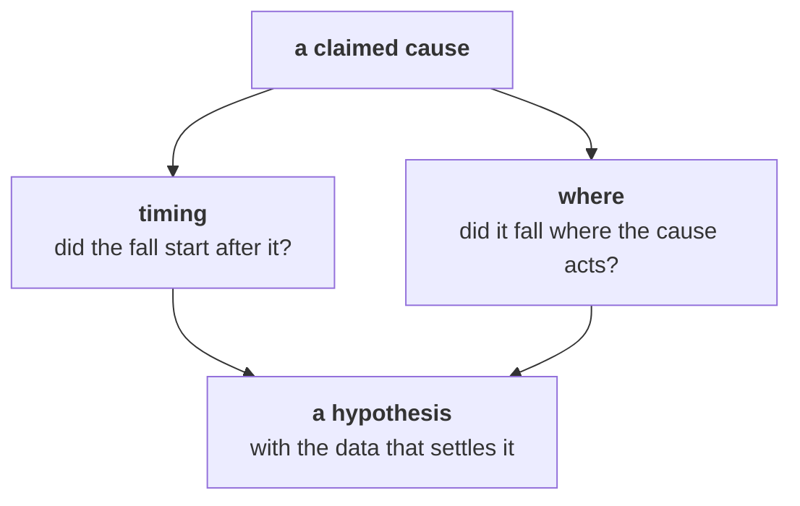

# The second case: the hypothesis Marketing attacks

Forty-five minutes, in pairs. One of you speaks for the numbers; the other plays the two voices below
and pushes back as hard as they would. Swap after Part 3.

> "A flat customer count can hide churn replaced by new customers, which is exactly why we need the
> acquisition budget. And Retail-Plus is Rs 65,250 out of a Rs 23 lakh fall. It does not matter."
> (the marketing lead)
>
> "It is the broken reorder button. My members have been complaining for six weeks. Fix the app and
> the tier comes back." (the head of Retail-Plus)

Work in `notebooks/C2_W01_D02_05_second_case_STUDENT.ipynb`. It opens on the class file and has a
cell for each test below. Your job is to name a cause as a hypothesis, with the evidence that would
settle it, and to hold that line against both voices.

Each part ends in one item, and the stretch adds a sixth. Post one line per pair at the end, six letters in order, no spaces:

```
Post exactly this shape: xxxxxx
```



---

## Part 1. Churn hidden behind a flat count?

Compare the sets of customer ids that bought in Q1 and in Q2.

### Q1. The marketing lead says a flat count of 69 can hide churn replaced by new customers. Which check settles it, and what does it show?

a) Customers per week in each quarter; the rate held level, so no churn could have taken place
b) New sign-ups in the CRM for Q2; there were some, so churn was replaced and acquisition works
c) The overlap of customer ids; all 69 who bought in Q2 bought in Q1, so none lost and none new
d) The count again on delivered orders; it fell from 54 to 50, so churn is real and hidden here

---

## Part 2. Does Retail-Plus matter?

### Q2. "Retail-Plus is Rs 65,250 out of a Rs 23 lakh fall. It does not matter." What is the answer in the room?

a) It is 93 percent of the consumer fall and 25 of 28 lost orders; the same 22 members buy half as often
b) It does not matter in rupees, so the note to Meera should lead with Business and leave Retail-Plus out of it
c) It matters because its revenue per order rose 7.0 percent, which shows its members are paying more
d) It matters only if the tier's revenue falls again next quarter, so the answer is to wait and watch

---

## Part 3. Did the fall start after the break?

Retail-Plus orders by month: April 14, May 24, June 13, July 9, August 9, September 8. The complaint
says the reorder feature has been broken for six weeks, counted back from this week.

### Q3. The head of Retail-Plus says the broken reorder button is the cause. What does the timing say?

a) The break explains the fall, since September has the fewest orders of any month in the file
b) The break came first, since six weeks back from this week reaches into the early part of July
c) Timing cannot be read from monthly counts, so the question has to wait for the app's own logs
d) The fall began in July, before a break dated late August, so it cannot be the whole story

---

## Part 4. Did it fall where the cause acts?

Retail-Plus orders by channel, Q1 then Q2: web 24 to 9, store 14 to 9, app 13 to 8.

### Q4. A broken app feature acts in the app. What does the channel split say about it?

a) The app fell least of the three channels, so the break has had no effect on the tier's orders at all
b) Every channel fell; an app-only cause would show the app falling first and alone, which it did not
c) The app fell by 5 orders, which is the break's full effect, and the other channels are noise
d) Web fell most, so the cause is the website, and the app complaint can be closed as unrelated

---

## Part 5. Two hypotheses, and the data that settles each

H1: the broken reorder feature. H2: something that changed for members in July.

### Q5. Which request for data would settle the two hypotheses?

a) This file's orders for Q3 as they arrive, since more orders of the same kind will settle both of them
b) A survey of all 22 members asking why they order less, since members know their own reasons
c) For H1, reorder events and failures by week and the release date; for H2, the tier's change log
d) The marketing lead's campaign calendar for both quarters, since campaigns explain when orders arrive

## Stretch. A rival to both hypotheses

### Q6. A pair points out that July opens the monsoon quarter, so a seasonal dip would also start in July. Which evidence settles the season?

a) Retail-Plus orders for August and September again, to see whether they keep falling
b) The reorder feature's failure log, since a season would show up as failed reorders
c) Nothing, since weather is outside Kalpa's control and cannot be tested from data
d) Last year's Q2 for Retail-Plus against Retail-Core, beside this year's two quarters
