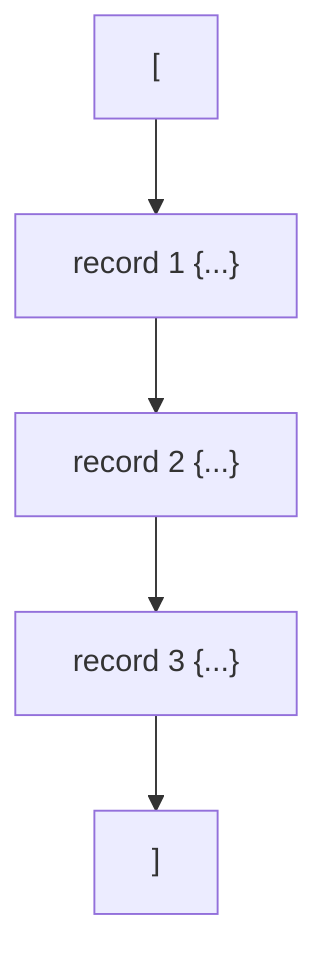

# Day 2, E3. Mid-session: the truncated feed

Drop point: the close of the second half, after JSON. About 15 minutes, working alone. Open the file before you answer anything.

The vendor feed is `../data/C2_W01_D02_vendor_truncated_STUDENT.json`. It fails to parse. Fifteen items on reading that failure and saying what it costs.

Post one line at the end, in this shape, using your own letters:

```
1d 2c 3b 4a 5d 6c 7b 8a 9d 10c 11b 12a 13d 14c 15b
```

---

## Item 1

```
with open(TRUNCATED_JSON) as f:
    data = json.load(f)
```

What appears?

a) `JSONDecodeError`, naming a line
b) The 46 complete records, with the last one dropped
c) `FileNotFoundError`, since the file is incomplete
d) An empty list

## Item 2

The message reads `Expecting ',' delimiter: line 48 column 1 (char 1027)`. The file has 47 lines. What does that mean?

a) The message is wrong, since line 48 does not exist
b) The parser needed more file and ran out
c) The file has a blank line 48 that confuses it
d) The column number is the useful part

## Item 3

How many records can you use from that file?

a) 46
b) 3
c) None
d) It depends on the parser

## Item 4

Why is that different from a CSV that stops halfway?

a) CSV files are smaller, so they truncate far less often
b) CSV parsers repair the last row automatically
c) There is no difference; both fail wholly
d) A CSV row ends at a newline, so earlier rows parse

## Item 5

Your first move on this message is:

a) Open the file at the named line
b) Ask the vendor to resend the feed
c) Switch to a more tolerant parser
d) Rewrite the last record by hand

## Item 6

You open the end of the file. The last line reads `      "signup_date": "2026-08-10"`. What does that tell you?

a) The file ends with a valid record and a missing bracket
b) The file ends inside a record
c) The date format is wrong
d) The file was written by a different system

## Item 7

Put these in the order you would do them. Answer as four letters.

a) Send the vendor the parser's exact message
b) Open the file at the named line
c) Run `json.load` and read what it says
d) Count how many records the fragment opened

Which ordering is right?

a) b, c, a, d
b) a, c, b, d
c) c, b, d, a
d) c, a, b, d

## Item 8

The fragment opens three records before it stops. How did you count that without parsing it?

a) By dividing the line count by the lines per record
b) By asking the parser for a partial result
c) By opening it in a spreadsheet
d) By counting the `"order_id"` keys in the raw text

## Item 9

Here is the shape of a healthy feed, drawn.



Which single change turns that into what you actually have?

a) Record 3 is cut short and the bracket is gone
b) Remove the opening bracket from the top of the file
c) Remove record 2
d) Replace the braces with brackets

## Item 10

What do you write in the rejects log for this file?

a) Nothing, since no record was read
b) One line: the file, the message, nothing usable
c) One line for every record the file was meant to hold
d) A copy of the file's last line

## Item 11

Which sentence goes back to the vendor?

a) Your JSON is broken, so please fix it and resend
b) We could not open the file that you sent us
c) The feed stops at line 48, so nothing is usable
d) Please send the same feed as CSV instead

## Item 12

True or false. Adding `try` and `except json.JSONDecodeError` around the load lets you keep the records that did parse.

a) True, since the parser keeps what it read
b) True, but only for the very first record
c) False, and the load raises a second time
d) False, since nothing survives the failure

## Item 13

The healthy feed for the same day is 483 lines and holds 30 records. About how many lines does one record take?

a) About 16
b) About 6
c) About 30
d) About 48

## Item 14

Your run reads both the healthy feed and the truncated one. What does the reconciliation line say?

a) 30 in = 30 clean + 0 rejected, both files fine
b) 30 in = 28 clean + 2 rejected, feed adds none
c) 33 in = 30 clean + 3 rejected from the feed
d) 47 in = 30 clean + 17 rejected lines

## Item 15

Which of these would have caught the truncation before your code ran?

a) Opening the file in an editor and scrolling
b) A larger timeout on the download
c) A byte count agreed in advance
d) Reading the file twice and comparing

---

Post your fifteen letters on one line in the shape shown at the top. The solution is released at the close of the session.

## Hands-on

The running half is `notebooks/C2_W01_D02_ex2_hands_on_STUDENT.ipynb`, which loads the same feed, reads the message, opens the named line and drafts the sentence back to the vendor. Post its four letters on the same line as these fifteen.
