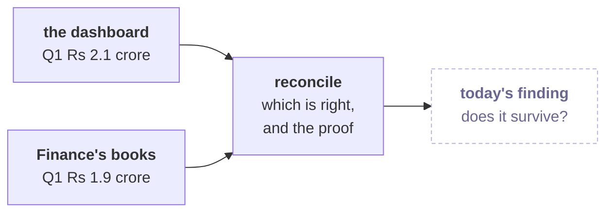

# Before tomorrow: can we trust the numbers?

Tonight: fifteen minutes of reading and two checks to run. Tomorrow opens on a reply from Finance to
today's finding, and a room that has read this can start on the problem in the first minute.

---

## What will Finance ask tomorrow, and why?

Today's finding reaches the leadership group, and Anand Iyer, Kalpa's finance controller, replies
to all:

> "Your dashboard says Q1 was Rs 2.1 crore. Our books say 1.9. Until your numbers match ours,
> Finance will not act on a drop measured from an ERP export. Send me a reconciliation."

The ERP is the company's system of record for orders and payments. Every figure the team produced
today started from the dashboard's export. Finance keeps its own books, and until the two agree,
Finance will not act on a drop measured from an export. Tomorrow you own the reconciliation: which Q1 figure is right, how you know, and whether today's finding still
stands once the numbers match.

---

## Which words will you hear tomorrow, and what do they mean to you?

Fill these in from memory tonight. Tomorrow's first minutes assume you can.

| Word | What you think it means, in your own words |
|---|---|
| Export | |
| Reconcile | |
| Profile | |
| CSV file | |
| JSON file | |
| Decisions log | |

If you cannot fill one in, that is the one to listen for.

---

## What would you need to see before you chose between two totals?

Two people looked at the same quarter and got two different totals.
Before anyone argues about which number is right, each of them has to be able to say exactly which
records went into the total and which were left out.

Write one sentence tonight on what you would need to see, record by record, before you could say
which of Anand's two figures is right. Bring the sentence; you will be asked for it.

---

## What should you check tonight before you arrive?

There is nothing to install, and both checks take under five minutes.

1. Open your Codespace and run Restart and Run All on each of today's notebooks. Each one ends on a
   green PASS line with 0 failed. If one does not, post its last error in the cohort channel tonight,
   so the session does not open on it.
2. Open the Explorer panel in VS Code and find the `data` folder of today's pack. Tomorrow the
   orders arrive as files rather than as a list inside a Python file, so knowing where a data file
   sits in your Codespace saves the first ten minutes.

---

## Which line is worth carrying in?

> A number that goes to Finance has to be the same data Finance holds, and the proof is a
> reconciliation: every record that came in is either counted or set aside with a written reason.
