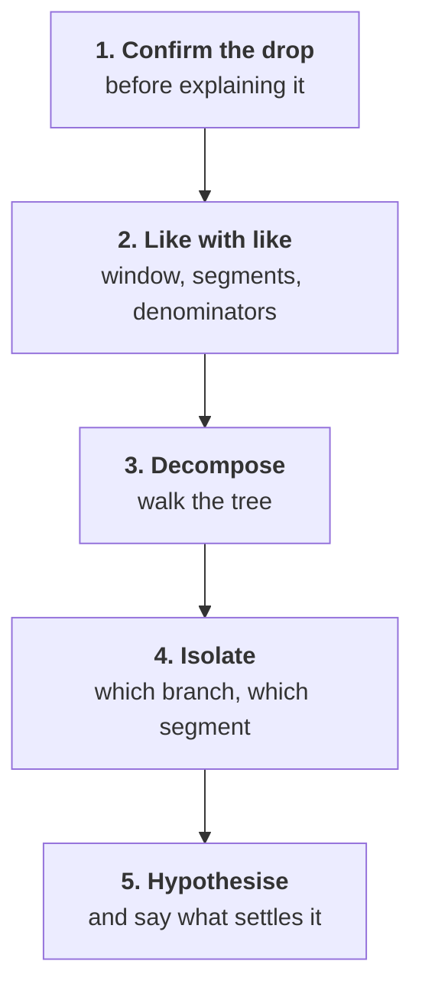
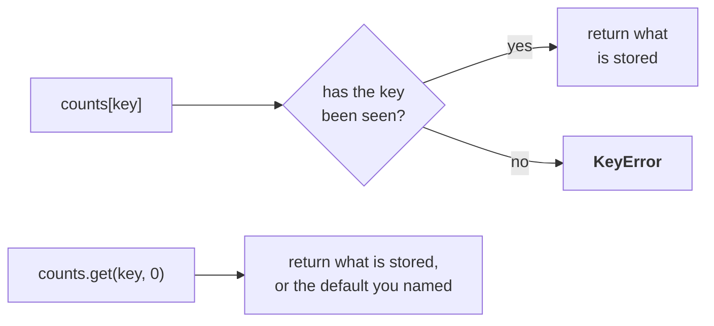
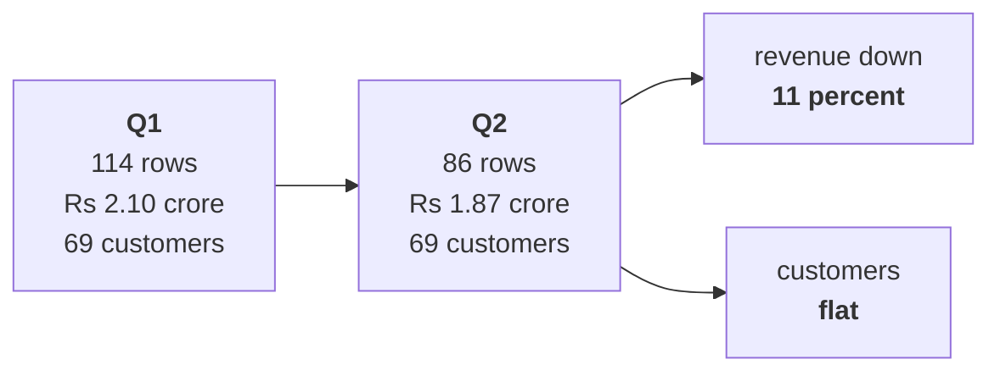
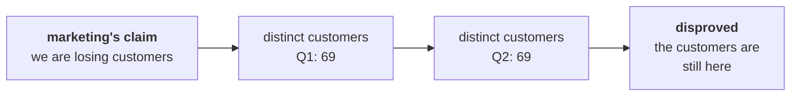

# Half one: is the drop real, and is it comparable?

Week 1, Day 2. Slide source. One idea per slide.

Position bar, repeated at every section boundary:
`[the complaint] > [the ladder] > [grouping by key] > [the first split]`

---

## SECTION A. The complaint

---

## S1. Meera read the tree, and replied
> "So revenue is customers, times how often they buy, times basket, times price. Now: which of
> those moved? Q2 was Rs 1.9 crore, Q1 was 2.1. Are we losing customers, or are the ones we have
> buying less? Marketing says more customers. Prove it or disprove it."

Yesterday you named the branches. Today one of them moved.

---

## S2. And a second message arrived
The head of Retail-Plus, who owns the paid-membership tier, forwards a member's complaint:

> "The app's reorder button has not worked for six weeks."

He asks one question: is my tier the one slipping?

That message is a hypothesis handed to you by somebody with an interest in the answer.

---

## S3. What could make a drop look real when it is not
| Cause | The tell |
|---|---|
| The quarters were different lengths | 13 weeks against 11 |
| One quarter is still open | Orders that have not arrived yet |
| A definition changed in a release | The numerator or the denominator moved |
| A segment was reclassified | The same customers, a different bucket |
| The export double counted | Rows, not customers, went up |

Rung one exists because four of those five are invisible in a total.

---

## SECTION B. The ladder

---

## S4. The five rungs, in this order


You never climb past a rung you have not done.

---

## S5. What each rung needs
| Rung | Needs | Goes wrong when |
|---|---|---|
| Confirm | Both totals, one definition | Delivered is compared with booked |
| Like with like | Equal windows, same segments | A 13-week quarter meets an 11-week one |
| Decompose | Customers, orders, revenue by quarter | The total is called a finding |
| Isolate | The same split per segment | A blended number hides the segment |
| Hypothesise | Something outside the data | A cause is stated as a fact |

---

## D6. Marketing says we are losing customers. Which rung?
**Question.** On which rung is "we are losing customers" an answer, and what has to be true before you can even test it?

---

## D7. Answer: rung three, and only after rung two
"Fewer customers" is one of three factors in the decomposition, so it belongs on rung three.

It can only be tested once the two quarters are comparable, which is rung two. A customer count from a 13-week quarter against an 11-week one settles nothing, whichever way it points.

---

## S8. Like with like, in three questions
| Ask | Because |
|---|---|
| Same window length? | A longer quarter holds more of everything |
| Same segment definitions? | A reclassified customer is not a lost customer |
| Same denominator? | A rate is only comparable against the same base |

A rate with no denominator is a rumour. A rate with a different denominator on each side is worse, because it looks like a comparison.

---

## SECTION C. Grouping by key

---

## S9. Counting per group, not once
```python
counts = {}
for order in ORDERS:
    key = order["quarter"]
    counts[key] = counts.get(key, 0) + 1
```

One dictionary, one key per group. The accumulator you already know, kept per key rather than once.

---

## S10. `.get()` is doing the real work here


`counts[key]` raises on a key that is not there. `counts.get(key, 0)` returns the default you chose. Choosing a default is a decision, and the reason belongs in a comment.

---

## S11. The same shape, one line different, gives you revenue
```python
revenue = {}
for order in ORDERS:
    key = order["quarter"]
    revenue[key] = revenue.get(key, 0) + order["amount"]
```

Count adds one, revenue adds the amount, distinct customers adds to a set. Three variations of one shape.

---

## S12. Distinct customers per group needs a set per key
```python
customers = {}
for order in ORDERS:
    key = order["quarter"]
    customers.setdefault(key, set()).add(order["customer_id"])
```

`setdefault` creates the empty set the first time a quarter appears and returns the existing one afterwards, which is exactly the behaviour a per-group accumulator needs.

---

## SECTION D. The first split

---

## S13. Rung one and rung two, answered


Revenue fell 11 percent. The customer count did not move at all.

---

## S14. Marketing's claim, tested


The same people are still buying. They are buying less often, which is a different problem with a different bill attached.

---

## S15. What half two does with this
Rung three is not finished. Two factors moved, not one, and one of them moved **upward**.

Half two describes each segment honestly, writes the decomposition once as a function, and finds which segment carries the fall.
